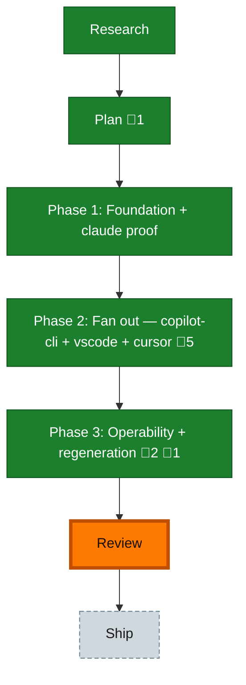

<!-- GENERATED by `harness flow render` — do not hand-edit; regenerate from the flow JSON. -->
# Flow · telemetry-fixture-corpus

**Kind**: flight-plan · **Now**: review · **Next**: review · **Intent**: Capture real logs from all four harness surfaces on this machine, scrub machine paths/identity/secrets while keeping verbatim prompts+tool usage (with a manual 'anything bad' review), commit them as durable fixtures, and add end-to-end tests that drive each real fixture through its adapter to the serialized segment to validate the data we produce. · **Nodes**: 7 · **Events**: 41

**Rail**: ◆─◆─[ ◆─◆─◆ ]─◇─◇  ◆ Research · ◆ Plan · [ ◆ Phase 1: Foundation + claude proof · ◆ Phase 2: Fan out — copilot-cli + vscode + cursor · ◆ Phase 3: Operability + regeneration ] · ◇ Review · ◇ Ship

**Legend** — colour = type/status: 🟩 done · 🟢 in-progress · 🟥 blocked · 🟦 known · ⬜ assumed · 🔶 decision · 🗣 user input · 🟪 harness chore (faded = not yet done) · 🤖 companion · 🛠 worker · 🟧 current (you are here). Badges: 💬 comments · 📄 artifacts · 📝 instructions · 🧰 chore (° optional / recommended / ‼ strongly-recommended; ✓ done · ✕ skipped).

## Node log

### plan · Plan
- `2026-06-25T06:24:55.240Z` · — · validation — validate-v2 VALIDATED WITH FIXES — two-guard privacy model sound; raw-fixture+golden byte-scan tightened; sqlite spike pulled into Phase 1.

### phase-2 · Phase 2: Fan out — copilot-cli + vscode + cursor
- `2026-06-25T06:41:32.658Z` · agent · decision — Scope correction (2026-06-25): cursor IS capturable here — agent transcripts persist at ~/.cursor/projects/&lt;cwd&gt;/agent-transcripts/&lt;conv&gt;/&lt;conv&gt;.jsonl (+ state.vscdb). AGENT_TRANSCRIPTS only gates the runtime adapter auto-detect, not capture. Cursor moved from documented-gap to a real Phase-2 surface (AC-05, task 2.5).
- `2026-06-25T08:06:43.303Z` · — · note — Prepared via /the-flow 5 tasks; observations INS-001/GFT-001/INS-002 logged to harness buffer. Next: validate-v2 the dossier, then implement.
- `2026-06-25T08:09:21.997Z` · — · validation — validate-v2 VALIDATED — no material issues (lead deterministic proof + 1 critic, no_material_findings). Cursor t_precision:'anchored' and copilot-cli token correlation both confirmed in adapter source. Sidecar: validations/phase-2-tasks-validation.md
- `2026-06-25T09:10:58.046Z` · — · note — copilot-cli surface DONE end-to-end (T001-T004): real fixture + e2e golden, token correlation 86611, byte-scan green. Commits 2ac6b5f + ec6daa2. Remaining: copilot-vscode + cursor (sqlite surfaces, need NodeDb-at-run() per the no-DbPort contract gap).
- `2026-06-25T09:28:29.564Z` · — · note — copilot-vscode store probed: real this-repo session 7fb3a97f, 8 turns (thin but real). Plan: NodeDb-at-run() capture + throwaway-sqlite int-test (AC-04). copilot-cli surface done+committed (2ac6b5f, ec6daa2); 1362/1362 green. Companion run …-12bf reviewing.

### phase-3 · Phase 3: Operability + regeneration
- 📄 artifacts: docs/plans/037-telemetry-fixture-corpus/tasks/phase-3-operability-regeneration/tasks.md
- `2026-06-25T10:47:00.181Z` · agent · validation — validate-v2 ✅ VALIDATED — task↔plan 1:1, AC-07/08/09/06 covered, all cited repo paths verified; critic's 6 speculative findings all disproven (misreads of create-vs-modify; Phase 2 cursor fixture already committed). Sidecar: validations/phase-3-tasks-validation.md
- `2026-06-25T11:11:43.520Z` · agent · validation — Companion run …-aa6f: 6 commits reviewed, F001 HIGH (runbook promote-vs-review gap) + F002/F003 MED, all fixed in fe2312b, re-verified APPROVE, 0 unresolved. Commits: f080de3 22634cf 110a4c4 592048d c74c337 fe2312b.
