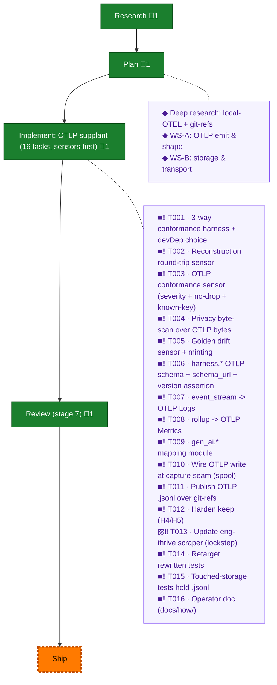

<!-- GENERATED by `harness flow render` — do not hand-edit; regenerate from the flow JSON. -->
# Flow · telemetry-otel-standard

**Kind**: flight-plan · **Now**: ship · **Intent**: Standardise harness telemetry to the OTEL/OTLP standard for upstream ingestion; keep storing locally. Segments may be reshaped OTEL-native — no back-compat required (not shipped yet). · **Nodes**: 24 · **Events**: 59

**Rail**: ◆─◆─[ ◆ ]─◆─◇  ◆ Research · ◆ Plan · [ ◆ Implement: OTLP supplant (16 tasks, sensors-first) ] · ◆ Review (stage 7) · ◇ Ship

**Legend** — colour = type/status: 🟩 done · 🟢 in-progress · 🟥 blocked · 🟦 known · ⬜ assumed · 🔶 decision · 🗣 user input · 🟪 harness chore (faded = not yet done) · 🤖 companion · 🛠 worker · 🟧 current (you are here). Badges: 💬 comments · 📄 artifacts · 📝 instructions · 🧰 chore (° optional / recommended / ‼ strongly-recommended; ✓ done · ✕ skipped).

## Node log

### plan · Plan
- `2026-06-27T00:47:55.430Z` · — · note — Two pre-plan workshops queued: WS-A OTLP emit & shape; WS-B telemetry storage & transport (git-refs review elevated this to a real decision).

### research · Research
- 📄 artifacts: docs/plans/038-telemetry-otel-standard/research-dossier.md

### otel-deep-research · Deep research: local-OTEL + git-refs
- 📄 artifacts: docs/plans/038-telemetry-otel-standard/research-storage-and-transport.md
- `2026-06-27T02:08:08.334Z` · — · decision — Pass 2 (transport): git-notes REJECTED as migration target — single notes-ref reintroduces NFF write-contention + orphan-commit object bloat (lateral-to-worse vs embarrassingly-parallel one-ref-per-session). No real tool uses git transport; end-state is store-and-forward (spool→uploader→OTEL Collector / object-storage). Live fork = keep-and-harden-now vs leave-git, with a graduation tripwire.

### ws-otlp-shape · WS-A: OTLP emit & shape
- 📄 artifacts: docs/plans/038-telemetry-otel-standard/workshops/001-otlp-emit-and-shape.md

### ws-storage-transport · WS-B: storage & transport
- 📄 artifacts: docs/plans/038-telemetry-otel-standard/workshops/002-storage-and-transport.md

### implement · Implement: OTLP supplant (16 tasks, sensors-first)
- 📄 artifacts: docs/plans/038-telemetry-otel-standard/execution.log.md

### review · Review (stage 7)
- `2026-06-27T08:09:20.087Z` · — · — — Review complete: minih companion per-commit + control:stop drain (runs 4ac5/ab81/c7ce/0d3a, all findings fixed) AND a GPT-5.5 cross-model pass via flow-pair. Cross-model caught F1 (HIGH watermark data-loss on interleaved date buckets) that minih missed; fixed via contiguous-prefix advance (c967f41). F1 re-review verdict: APPROVE — closed, no new issue in the prefix logic. Full suite 1477 green, tsc/biome/fixture-drift clean.

### T013 · T013 · Update eng-thrive scraper (lockstep)
- `2026-06-27T05:21:25.720Z` · — · — — Deferred: the eng-thrive scraper is a downstream consumer with no source in this repo. Its OTLP .jsonl ref-tree read contract is folded into T016 (operator doc). Scraper change lands in eng-thrive's own repo/plan.
