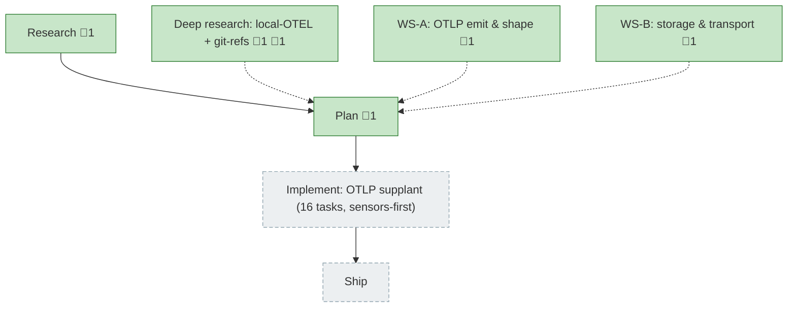

<!-- GENERATED by `harness flow render` — do not hand-edit; regenerate from the flow JSON. -->
# Flow · telemetry-otel-standard

**Kind**: flight-plan · **Now**: plan · **Next**: implement · **Intent**: Standardise harness telemetry to the OTEL/OTLP standard for upstream ingestion; keep storing locally. Segments may be reshaped OTEL-native — no back-compat required (not shipped yet). · **Nodes**: 7 · **Events**: 21

**Rail**: ◆─◆─[ ◇ ]─◇  ◆ Research · ◆ Plan · [ ◇ Implement: OTLP supplant (16 tasks, sensors-first) ] · ◇ Ship

**Legend**: 🟩 done · 🟧 in-progress · 🟥 blocked · 🟦 known (designed) · ⬜ assumed (speculative) · 🔶 decision · 🗣 user input · 🟪 harness loop · 🤖 companion · 🛠 worker · 🧰 chore (upkeep).

## Node log

### plan · Plan
- `2026-06-27T00:47:55.430Z` · — · note — Two pre-plan workshops queued: WS-A OTLP emit & shape; WS-B telemetry storage & transport (git-refs review elevated this to a real decision).

### research · Research
- 📄 artifacts: docs/plans/038-telemetry-otel-standard/research-dossier.md

### otel-deep-research · Deep research: local-OTEL + git-refs
- 📄 artifacts: docs/plans/038-telemetry-otel-standard/research-storage-and-transport.md
- `2026-06-27T02:08:08.334Z` · — · decision — Pass 2 (transport): git-notes REJECTED as migration target — single notes-ref reintroduces NFF write-contention + orphan-commit object bloat (lateral-to-worse vs embarrassingly-parallel one-ref-per-session). No real tool uses git transport; end-state is store-and-forward (spool→uploader→OTEL Collector / object-storage). Live fork = keep-and-harden-now vs leave-git, with a graduation tripwire.

### ws-otlp-shape · WS-A: OTLP emit & shape
- 📄 artifacts: docs/plans/038-telemetry-otel-standard/workshops/001-otlp-emit-and-shape.md

### ws-storage-transport · WS-B: storage & transport
- 📄 artifacts: docs/plans/038-telemetry-otel-standard/workshops/002-storage-and-transport.md
