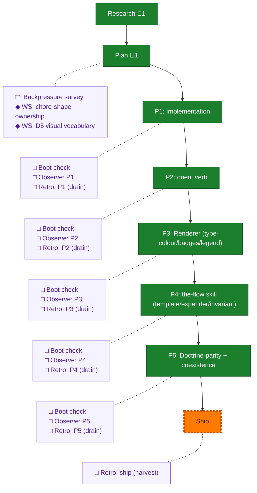

<!-- GENERATED by `harness flow render` — do not hand-edit; regenerate from the flow JSON. -->
# Flow · flow-template-orient-instructions

**Kind**: flight-plan · **Now**: ship · **Intent**: Refine the OOTB flight-plan starter (D1-D6): bake chores into the template + delete the skill-side gate/§3b; add 'harness flow orient'; per-node instructions[] field; colour-by-type with icon/visual modifiers; orient-every-turn invariant; orient shows chores with ticks. Folds into the 039 branch/PR. · **Nodes**: 27 · **Events**: 52

**Rail**: ◆─◆─[ ◆─◆─◆─◆─◆─◇ ]  ◆ Research · ◆ Plan · [ ◆ P1: Implementation · ◆ P2: orient verb · ◆ P3: Renderer (type-colour/badges/legend) · ◆ P4: the-flow skill (template/expander/invariant) · ◆ P5: Doctrine-parity + coexistence · ◇ Ship ]

**Legend** — colour = type/status: 🟩 done · 🟢 in-progress · 🟥 blocked · 🟦 known · ⬜ assumed · 🔶 decision · 🗣 user input · 🟪 harness chore (faded = not yet done) · 🤖 companion · 🛠 worker · 🟧 current (you are here). Badges: 💬 comments · 📄 artifacts · 📝 instructions · 🧰 chore (° optional / recommended / ‼ strongly-recommended; ✓ done · ✕ skipped).

## Node log

### research · Research
- 📄 artifacts: research-dossier.md

### plan · Plan
- 📄 artifacts: flow-template-orient-instructions-plan.md

### ws-coexistence · WS: chore-shape ownership
- 📄 artifacts: workshops/001-chore-shape-ownership-coexistence.md

### ws-visual · WS: D5 visual vocabulary
- 📄 artifacts: workshops/002-d5-visual-modifier-vocabulary.md
