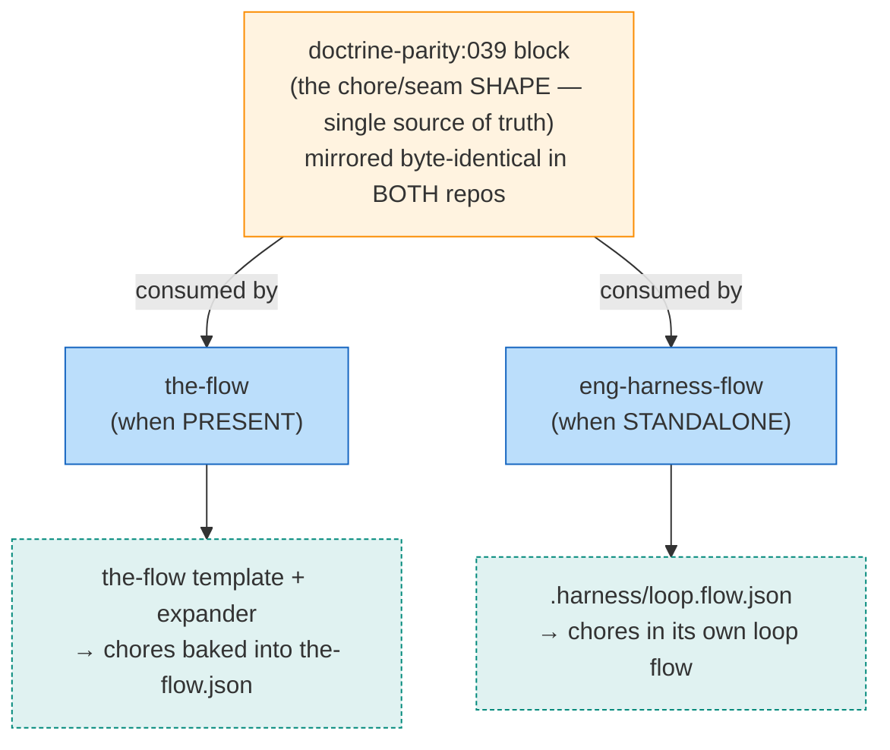

# Workshop: Chore-shape ownership & eng-harness-flow coexistence (under template-baked chores)

**Type**: Integration Pattern
**Plan**: 040-flow-template-orient-instructions
**Spec**: (pre-plan — driven by `../design-backlog.md` D1/C1 + `../research-dossier.md` H-03/H-04/F-07)
**Created**: 2026-06-29
**Status**: Approved

**Value Thesis**: Settling *who owns the chore/seam shape* before any of the ~8 cross-repo files are touched makes D1 implementable in one lockstep PR instead of being discovered mid-implementation as a double-injection or a failed parity check.
**Target Proof Level**: Contract Ready
**Current Proof Level**: Contract Ready

**Selected Value Axes**:
- **Cross-Domain Coordination**: the contract spans two independently-shippable skills in two repos.
- **Safety to Change**: a wrong ownership call double-injects chores or desyncs the byte-identical doctrine block.
- **Migration Safety**: D1 reverses 039's gated-apply model; back-compat (R-1 dedup) must keep resolving.
- **Agent Readiness**: an implementer can build D1 from this without re-deriving the seam contract.

**Related Documents**:
- `../design-backlog.md` (D1, C1), `../research-dossier.md` (H-03, H-04, F-07)
- the-flow `references/harness-seams.md` § Chore-flag ownership · eng-harness-flow `SKILL.md` (doctrine-parity:039 block)

---

## Purpose

Resolve, as a contract, **who owns the harness chore/seam shape** once chores are baked deterministically into the the-flow template (D1) — given that **eng-harness-flow must remain standalone** (C1). Drives the D1 implementation and the doctrine-parity rewrite.

## Fresh Entrant Outcome

A fresh agent can reach **Contract Ready** with no extra context — i.e. know which component authors chores in each scenario, why there is no double-injection, what the `command` token contract is, and exactly what the parity block must say.

## Key Questions Addressed

1. Who is the single source of truth for the chore/seam **shape**?
2. When the-flow is present vs absent, **who materializes** chores, and into what?
3. Can template-baked chores **double-inject** against eng-harness-flow? (the dossier's H-03 ambiguity)
4. Does D1 require an **eng-harness-flow code change**, or doctrine-only?
5. How does the **doctrine-parity:039** block get rewritten without failing its check?

---

## Value Frame

| Field | Selection | Why It Matters |
|-------|-----------|----------------|
| Target Proof Level | Contract Ready | D1 needs the ownership contract specified, not just a direction |
| Primary Value Axis | Cross-Domain Coordination | The whole risk is the two-repo seam |
| Supporting Value Axes | Safety to Change · Migration Safety · Agent Readiness | Double-inject / parity-desync / back-compat are the failure modes |
| Downstream Loop Improved | Implementation (D1) + Review | One lockstep PR; reviewer checks against this contract |

## The ownership model (decision)

**The shape doctrine owns it.** The `doctrine-parity:039` block (mirrored byte-identical in eng-harness-flow `SKILL.md` and the-flow `harness-seams.md`) is the **single source of truth** for the seam/chore *shape* — the per-phase trio (boot + observe + drain) + the two globals (backpressure off `plan`, harvest off `ship`), each chore's `kind`/`importance`/anchor/`--hook` command. **Neither** the the-flow template **nor** eng-harness-flow owns the shape; both are **consumers** that materialize the same spec.

**Refines dossier F-07**: the expander reads the **shape doctrine**, *not* "the template file" — coupling eng-harness-flow's standalone path to a the-flow artifact it may never have is the failure this workshop prevents (C1).

**Self-containment (the strong form of C1).** "Single source of truth" is a **design-time** contract, not a runtime artifact. Each skill **ships its own complete copy** of the shape (eng-harness-flow in `SKILL.md`, the-flow in `harness-seams.md`); the byte-identical `doctrine-parity:039` block is a **maintainer discipline + a parity check that runs only where BOTH repos are checked out** (dev/CI). On a machine with **0 concept of the-flow**, eng-harness-flow is fully standalone — it reads nothing from the-flow and authors its own `.harness/loop.flow.json`. D1 must therefore guarantee: (1) **no runtime read from any the-flow file into eng-harness-flow**; (2) the **parity check skips gracefully** when the-flow is absent (never assume the tools repo is on disk — the-flow is never vendored here, per [[no-vendor-the-flow]]).

## Decision Space

| Option | Description | Pros | Cons | Decision |
|--------|-------------|------|------|----------|
| A — Template is canonical | the-flow's `flight-plan.template.json` is the one true home of the chore shape; eng-harness-flow reads it | one file | **Violates C1** — couples standalone eng-harness-flow to a the-flow artifact | **Rejected** |
| B — Doctrine is canonical, two consumers | the parity block is the shape spec; the-flow template + eng-harness-flow standalone each instantiate it | C1 holds; both skills independent; matches Route A | shape lives in prose doctrine, not one machine file (acceptable — it's a contract, not runtime) | **Selected** |
| C — eng-harness-flow injects into the-flow.json | keep 032-style injection even when the-flow drives | — | Re-opens double-write vs Route A "the-flow sole writer"; double-injection | **Rejected** |

## No-double-injection contract (resolves H-03)

The dossier flagged an apparent contradiction (eng-harness-flow `flight-plan-ops.md` describes dedup-keyed chore *injection*, while the-flow `harness-seams.md` says eng-harness-flow is *stateless / the-flow sole writer*). **Resolution — they describe different scenarios:**

| Scenario | Writer of the chores | eng-harness-flow's role | Collision? |
|----------|---------------------|-------------------------|-----------|
| the-flow present (Route A) | the-flow (template + expander) → `the-flow.json` | **Stateless** wrt `the-flow.json` — writes nothing | **None** — only one writer |
| the-flow absent (standalone) | eng-harness-flow → `.harness/loop.flow.json` | Sole author of its own loop flow | **None** — different file |
| pre-039 bare the-flow (R-1 back-compat) | the-flow owns the node; eng-harness-flow may *flag* a matching seam node, **dedup on the `--hook` token** | flags, never twins | **None** — dedup keyed on `--hook` |

**Therefore D1 cannot double-inject**: baking flagged chores into the template is the Route-A "the-flow writes them" path; eng-harness-flow does not write to `the-flow.json` under Route A. The R-1 path stays safe **iff** the command-token contract below holds.

## Command-token contract (preserve verbatim)

Each baked chore's `command` is the dedup/seam key and **must** be exactly:

| Chore | `command` (verbatim) | `kind` | anchor |
|-------|----------------------|--------|--------|
| backpressure | `run /eng-harness-flow --hook pre-coding --json` | command | `plan` |
| boot-N | `run /eng-harness-flow --hook pre-flight --json` | command | `phase-N` |
| observe-N | `harness observe "<what>" --kind <kind>` | command | `phase-N` |
| retro-N (drain) | `run /eng-harness-flow --hook post-coding --json` | command | `phase-N` |
| retro-ship (harvest) | `run /eng-harness-flow --hook post-flight --json` | command | `ship` |

(Any R-1 back-compat dedup keys on the `--hook <x>` token — so these strings are a contract, not cosmetics.)

## Does D1 need an eng-harness-flow CODE change?

**No code change to eng-harness-flow's standalone path** — it already authors its own loop flow from the shared shape. D1 is:
1. **the-flow mechanics** (tools repo): template becomes the full seed; delete the create-time gate/§3b conditional apply; expander reads the shape doctrine.
2. **Shared doctrine** (BOTH repos, lockstep): rewrite the `doctrine-parity:039` block.

> ⚠️ **Open verification (carry into plan)**: confirm eng-harness-flow has **no live path that writes chores into an active `the-flow.json`** under Route A. If such a 032-era injection path still exists, it must be confirmed inert (Route A) — a code touch only if it isn't. Evidence target: eng-harness-flow `references/flight-plan-ops.md` injection trigger conditions.

## The doctrine-parity:039 rewrite (lockstep)

The byte-identical block must change in **both** files in one PR (the parity check fails otherwise — dossier H-04):

- **Was**: "Creation is three parts — (1) bare-spine template seed; (2) create-time CONDITIONAL chore apply gated on router-installed AND repo-provisioned; (3) plan-complete additive expander."
- **Becomes**: "The seam/chore **shape** is this doctrine. **the-flow** materializes it by baking the shape into its template at `create` (no create-time gate) + the plan-complete expander (reads this shape). **eng-harness-flow standalone** materializes the same shape into `.harness/loop.flow.json`. the-flow is the sole writer of `the-flow.json`; eng-harness-flow stays stateless wrt it. Chores are skippable, so a repo without the router simply never runs them (no gate needed)."

## Attention Reduction

| Future Loop | Before Workshop | After Workshop |
|-------------|-----------------|----------------|
| Implementation (D1) | "where does the chore shape live? will I double-inject?" | shape = doctrine; the-flow materializes; no injection under Route A |
| Review | reconstruct the two-repo seam from scratch | check the diff against this contract + the parity block |
| Migration | unclear if R-1 back-compat still resolves | command-token contract pins the dedup key |

## Validation / Acceptance

This workshop is Contract Ready — D1 may proceed when it preserves:

- [x] Shape doctrine is the single source of truth; template + standalone loop are consumers (Option B).
- [x] No-double-injection contract holds (the-flow sole writer under Route A; eng-harness-flow stateless wrt `the-flow.json`).
- [x] Command-token contract preserved verbatim (dedup/seam key).
- [x] eng-harness-flow standalone needs no code change; doctrine-parity block rewritten in **both** repos in one PR.
- [x] Self-containment: each skill ships its own copy of the shape; a machine with 0 the-flow runs eng-harness-flow fully standalone (no runtime read from the-flow).
- [ ] **Plan must verify**: no live eng-harness-flow path writes chores into an active `the-flow.json` under Route A (else handle it).
- [ ] **Plan must ensure**: the doctrine-parity check skips gracefully when the-flow isn't checked out (never assume the tools repo on disk).

## Open Questions

### Q1: Does eng-harness-flow still have a 032-era "inject chores into active the-flow.json" path?
**OPEN (verify in plan)** — Route A makes it inert by contract, but the code path's existence/trigger should be confirmed. If present + live, D1 either relies on its gate (the-flow-present ⇒ eng-harness-flow defers) or removes it.

### Q2: No-harness repo (the-flow present, router absent) — chore nodes point at an uninstalled `/eng-harness-flow`.
**RESOLVED** — accepted per D1 (chores are `optional`/`recommended`, skippable, rail-excluded). Symmetric to C1: the two skills are independent in both directions.
