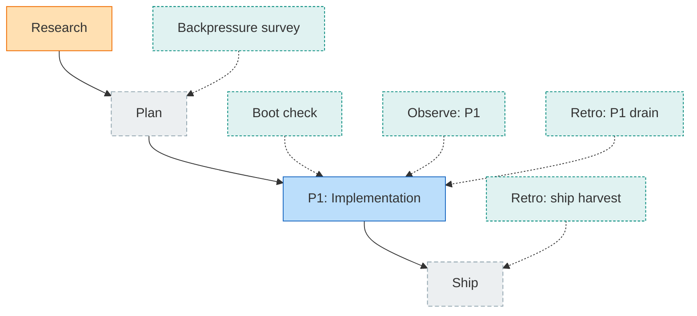
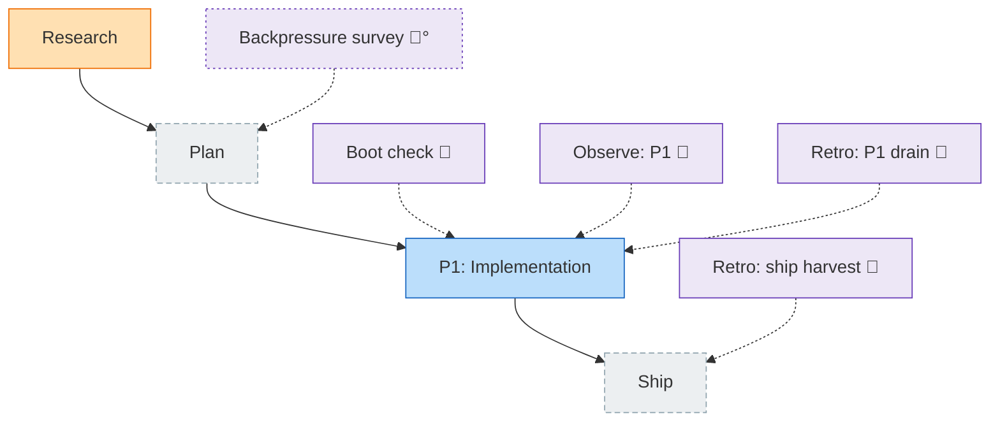
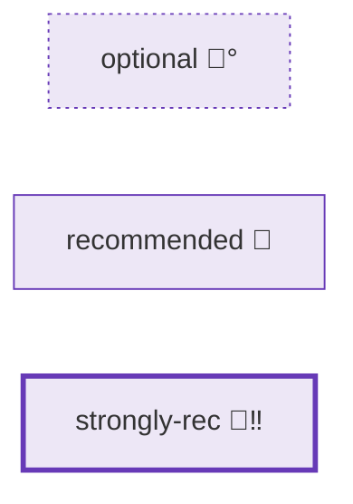
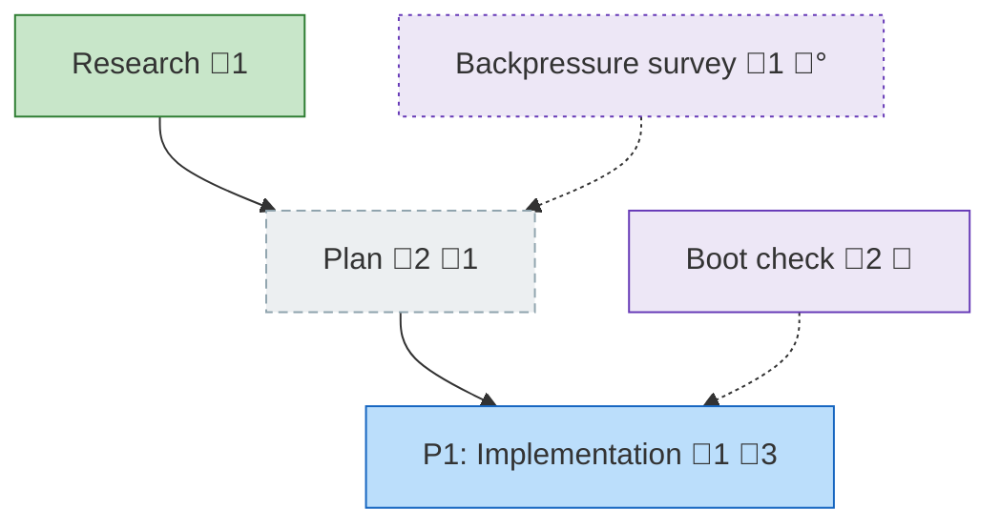

# Workshop: D5 visual-modifier vocabulary — encoding chore-ness & importance once colour is type-only

**Type**: Render / Visual Design
**Plan**: 040-flow-template-orient-instructions
**Spec**: (pre-plan — driven by `../design-backlog.md` D5 + `../research-dossier.md` F-01)
**Created**: 2026-06-29
**Status**: Approved

**Value Thesis**: Fixing *which visual lever carries which attribute* before the renderer changes means D5 lands once — the implementer wires a known mapping and regenerates fixtures against a known target, instead of inventing (and re-litigating) the look mid-PR.
**Target Proof Level**: Contract Ready
**Current Proof Level**: Contract Ready

**Selected Value Axes**:
- **Operator Usability**: a weak model / human must still read "this is upkeep, and how much it matters" at a glance.
- **Knowability**: D5 removes the colour signal; the replacement must make chore-ness/importance explicit, not implicit.
- **Proof Quality**: the contract is a concrete classDef + badge spec with a worked before/after.
- **Review Compression**: reviewers check the fixture diff against this mapping, not against taste.

**Related Documents**: `001-chore-shape-ownership-coexistence.md` · the-flow `flight-plan.example.md` (current render)

---

## Purpose

Once colour encodes **type** only (D5 reverses 039 AC-11), chore-ness and importance lose their channel (teal). This workshop assigns each attribute a **distinct, non-colour visual lever** so the diagram stays legible. Drives the `nodeClass`/`nodeLabel`/classDef changes in `flow-renderer.ts`.

## Fresh Entrant Outcome

A fresh agent reaches **Contract Ready**: knows exactly which mermaid lever encodes type, chore-ness, importance, and live status — and can implement + regenerate fixtures from the mapping table + worked example below.

## Key Questions Addressed

1. After D5, what channel says "this node is a **chore** (upkeep)"?
2. What channel says **how important** it is (optional / recommended / strongly-recommended)?
3. Where does **live status** (todo/done/skipped) show, now that fill-colour is taken by type?
4. Does the signal survive in the **text rail** (weak-model UX), not just rendered mermaid?

---

## Value Frame

| Field | Selection | Why It Matters |
|-------|-----------|----------------|
| Target Proof Level | Contract Ready | renderer + every golden fixture depend on the exact mapping |
| Primary Value Axis | Operator Usability | the whole point of D5's reversal is *legibility without colour overload* |
| Supporting Value Axes | Knowability · Proof Quality · Review Compression | explicit signal; worked example; reviewable diff |
| Downstream Loop Improved | Implementation (D5) + fixture regen + Review | one known target |

## Channel inventory (what mermaid gives us, what's already used)

| Lever | Currently used for | After D5 |
|-------|--------------------|----------|
| **fill + stroke colour** (`classDef`) | type (harness/decision/companion/worker/chore) AND status (done/wip/known/…) | **TYPE only** (D5) — chore class retired as a colour |
| **`stroke-dasharray` / `stroke-width`** (`classDef`) | a few class borders | **free** → importance border weight |
| **node shape** (`[]` `([])` `{{}}` `{}` `>]`) | `{}` decision rhombus · `>]` user_input bubble | reserved (coarse; leave spine/chore as boxes) |
| **label glyph badge** (`💬N` `📄N` `📝N`) | comments / artifacts / instructions | **+ `🧰` chore badge + importance marker** |
| **edge style** (`-->` vs `-.->`) | spine (solid) vs excursion/chore (dotted) | unchanged — already a partial chore signal |

## The mapping (the contract)

| Attribute | Primary channel | Encoding | Visible in |
|-----------|-----------------|----------|------------|
| **type** | fill + stroke colour | `classDef` per type — harness `:::harness` (violet), decision orange rhombus, spine nodes status-mapped, companion/worker as-is | mermaid |
| **is-a-chore** | `🧰` label badge + dotted `-.->` edge | binary, colour-independent | **rail + mermaid** |
| **importance** | label marker **+** classDef border | `°` optional · (plain) recommended · `‼` strongly-recommended — paired with border: `stroke-dasharray:2 3` / solid 1px / `stroke-width:3px` | **rail + mermaid** |
| **live status** (chore lifecycle) | the rail/orient **pip** (`□ ■ ▨ ▣`) per D6 | not re-encoded in the diagram (fill is type's now) | **rail + orient** |

**Why a label marker AND a classDef border for importance (not one):** the **label marker** (`°`/`‼`) shows in the **text rail** — the weak-model surface that has no CSS — while the **border weight** gives the rendered mermaid a calmer, graphical read. Glyph carries the rail; stroke polishes the diagram. (This directly serves the "works without inference on cheap models" thesis.)

## Decision Space

| Option | Importance encoding | Pros | Cons | Decision |
|--------|---------------------|------|------|----------|
| A | glyph marker only | shows in rail; trivial | mermaid looks flat | Rejected (loses graphical read) |
| B | classDef stroke only | pretty mermaid | **invisible in the text rail** → fails weak-model UX | Rejected |
| C | glyph marker **+** stroke | rail-legible *and* graphical; one drives the other | two code touches | **Selected** |

| Option | Chore-ness encoding | Decision |
|--------|---------------------|----------|
| `🧰` badge + dotted edge | explicit glyph (matches the existing legend `🧰 chore`) reinforced by the excursion edge | **Selected** |
| node-shape change (e.g. `([rounded])`) | shape is coarse, collides with decision rhombus / future use | Rejected |

## Worked before → after (the 5 starter chores)

All five starter chores are harness-typed, so under D5 they **colour `:::harness` (violet)** — the teal `:::chore` class is gone. They stay distinguishable by badge + importance marker + border. The two diagrams below are real and renderable — paste either into any mermaid viewer.

**BEFORE — 039 AC-11 (flag-driven colour): every chore teal, importance invisible**



**AFTER — D5 (colour = type; `🧰` badge = chore; marker + border = importance)**



**Importance tiers** (all same type-colour; only the marker + border change) — the starter set has only optional + recommended, so this shows all three including a `strongly-recommended` example:



**Rail parity** (the text surface — no CSS, so the `🧰` + marker carries it):
```
[the-flow] … [ ◇ P1 ] …   ⚑ due: Boot check 🧰 · Observe: P1 🧰
```

### Badge-bearing nodes (comments / artifacts / instructions)

The label glyphs are a **separate, colour-independent channel** that stacks on *any* node type — `💬N` comments, `📄N` artifacts, and the new D4 `📝N` instructions — in that order, with `🧰`+importance last. Real and renderable:



Reading it: `plan` has 2 comments + 1 artifact; `phase_1` has 1 comment + **3 instructions** (📝3); `boot_1` is a chore (`🧰`) carrying **2 instructions**; `backpressure` is an **optional** chore (`🧰°`, dashed border) with **1 instruction**. The instruction *text* never appears in the diagram (D4) — only the `📝N` count badge; the full text is what `orient` prints (D2).

**Label assembly order** (one rule): `<label>` → `💬N` → `📄N` → `📝N` → `🧰<importance-marker>`.

## classDef / badge spec (implementation-facing)

1. **`nodeClass`** (`flow-renderer.ts`): drop the `node.chore` branch → `decision > harness-type > status-mapped > unknown` (F-01). Chore-flagged harness nodes return `harness`.
2. **`nodeLabel`**: when `node.chore` present, append `🧰` + the importance marker (`°` optional · `` recommended · `‼` strongly-recommended). Order after `💬/📄/📝` badges.
3. **classDef**: keep colour classes type-only; add **additive** importance classes (`impOptional` dasharray, `impStrong` stroke-width) applied as a second `:::` token on chore nodes (mermaid supports `node:::a:::b`), or fold into per-node style — implementer's choice, behaviour is the contract.
4. **Legend** (always rendered at the bottom of every `.md` — `flow-renderer.ts:103`): rewrite it into two channels so it matches the new vocabulary. The mermaid diagrams above omit it for brevity, but a real render always ends with this line.

   - **Now** (implies `🧰` is a colour):
     ```
     **Legend**: 🟩 done · 🟧 in-progress · 🟥 blocked · 🟦 known (designed) · ⬜ assumed (speculative) · 🔶 decision · 🗣 user input · 🟪 harness loop · 🤖 companion · 🛠 worker · 🧰 chore (upkeep).
     ```
   - **After D5/D4** (colour = type/status; `🧰` is a badge; badges + importance are their own channel):
     ```
     **Legend** — colour = type/status: 🟩 done · 🟧 in-progress · 🟥 blocked · 🟦 known · ⬜ assumed · 🔶 decision · 🗣 user input · 🟪 harness · 🤖 companion · 🛠 worker. Badges: 💬 comments · 📄 artifacts · 📝 instructions · 🧰 chore (° optional / recommended / ‼ strongly-recommended).
     ```
   The split is the whole point: the **colour row** no longer lists `🧰 chore` (chore stopped being a colour), and a **badges row** is added carrying `📝 instructions` (D4) and the `🧰` importance markers (D5).

## Attention Reduction

| Future Loop | Before Workshop | After Workshop |
|-------------|-----------------|----------------|
| Implementation (D5) | "what replaces the teal signal?" | exact lever→attribute table + classDef spec |
| Fixture regen | unknown target → guess-and-check | regenerate against the worked example |
| Review | argue about the look | check diff vs this mapping |

## Validation / Acceptance

Contract Ready — D5 may proceed when:

- [x] colour = type only; `nodeClass` drops the chore branch (F-01).
- [x] chore-ness = `🧰` badge + dotted edge (rail + mermaid).
- [x] importance = glyph marker (`°`/plain/`‼`) **+** classDef border, glyph carrying the text rail.
- [x] live status stays in the rail/orient pip (D6), not re-encoded in fill.
- [x] the always-rendered **legend** is rewritten into two channels — colour row drops `🧰 chore`; a badges row adds `📝 instructions` + the importance markers.
- [ ] **Plan must regenerate** all golden render fixtures to this target (intentional, reviewed diff — dossier H-01).

## Open Questions

### Q1: exact importance glyphs (`°` / `‼`)?
**OPEN (low-stakes, decide in implementation)** — the *channel* is locked (a label marker + a border class); the precise glyph pair is a cosmetic choice to finalize when wiring `nodeLabel` (pick terminal-safe characters; avoid width-variant emoji).

### Q2: should non-chore spine nodes keep status→fill colour?
**RESOLVED — yes.** D5 only removes the *chore-flag* colour override. Spine nodes (research/plan/phase/ship) keep their status-mapped fill (done=green, wip=orange, …); harness/decision/companion/worker keep type colour. The change is strictly "chore flag no longer overrides type."
