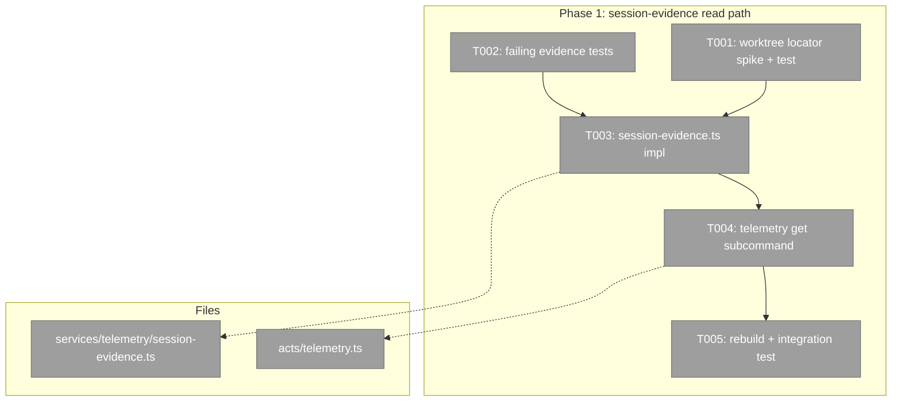
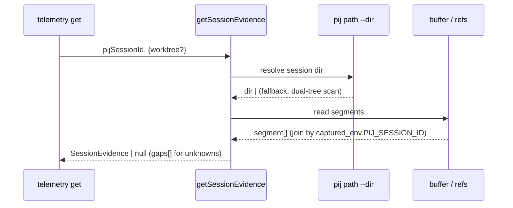

# Phase 1 — Telemetry session-evidence read path

**Plan**: [`flow-conformance-eval-plan.md`](../../flow-conformance-eval-plan.md) · **Phase**: 1 of 3 · **Domain**: telemetry · **CS**: 3

---

### Executive Briefing

- **Purpose**: Close the F-07 gap — there is no read-by-session telemetry verb today (only `sync`). Given a **pij session id**, deterministically locate that session's telemetry buffer, parse it, and return a normalized **evidence object**. This is the deterministic foundation the Phase 2 scorer's telemetry lane consumes.
- **What We're Building**: One pure read function `getSessionEvidence(pijSessionId, opts?)` in a new `session-evidence.ts` service + a thin `harness telemetry get <pij-session-id>` core subcommand that wraps it (mirrors `sync`'s Envelope+exit-code shape).
- **Goals**:
  - ✅ Worktree-safe session location (`pij path <id> --dir` primary; dual-tree buffer/refs scan fallback)
  - ✅ Aggregate across all of a session's segments, joined by `captured_env.PIJ_SESSION_ID`
  - ✅ Derive skills/tools/flow-seams/checks/compactions from the always-present `event_stream`; read `files.{written,edited}` from the **segment's `files` field** (there is no file event kind)
  - ✅ Gaps (null subagent tokens, empty `plans_touched`) surface as explicit `unknown`/absent — never throw, never fabricate
- **Non-Goals**:
  - ❌ No scenario loading, resolvers, scoring, or reports (Phase 2)
  - ❌ No pij driving, no scenario authoring (Phase 3)
  - ❌ No new telemetry **capture** — read-only over existing buffer/refs + plan-037 fixtures
  - ❌ No caching — reads fresh each call (so an fs resolver always sees latest state)

### Pre-Implementation Check

| File | Exists? | Domain | Notes |
|------|---------|--------|-------|
| `harness/cli/src/acts/telemetry.ts` | ✅ modify | telemetry | Core act; currently only registers `sync` (`registerTelemetryAct`, line 32). Add `get` subcommand. |
| `harness/cli/src/services/telemetry/session-evidence.ts` | ❌ create | telemetry | The new service — the Phase 1→2 contract surface |
| `harness/cli/src/services/telemetry/segment.ts` | ✅ read | telemetry | `event_stream` always present → derive skills/tools/seams/checks/compactions. `files.{written,edited}` is a **segment field** (`segment.ts:462-464`), NOT an event kind. The v1 views (`skills`/`files`/`captured_env`) are OMITTED when empty (budget) |
| `harness/cli/src/services/telemetry/events.ts` | ✅ read | telemetry | Event kinds: skill/flow/flow_log/harness/checks/compaction/tools/subagent — **no `file` kind** (files come from the segment field) |
| `harness/cli/test/services/telemetry/fixtures/real/` | ✅ read | telemetry | Pin **claude** (`raw.jsonl`) + **copilot-cli** (`raw.events.jsonl`+`raw.process.log`) — both carry `invariants.json` + `expected-segment.json`. Raw format varies by surface (copilot-vscode `raw.rows.json`, no `invariants.json` yet — skip; cursor `raw.rows.json`+`raw.jsonl`) |

`pij path <id> --dir` confirmed live (`usage: pij path <id> [--events|--state|--dir]`) — resolves a peer's on-disk telemetry dir cwd-independently (the worktree key).

### Architecture Map



### Tasks

| Status | ID | Task | Domain | Path(s) | Done When | Notes |
|--------|-----|------|--------|---------|-----------|-------|
| [ ] | T001 | Spike + test the session locator: `pij path <id> --dir` primary, dual-tree scan fallback (buffer `.harness/temp/telemetry/<sanitized>/`, then published `refs/harness-telemetry/**`). Encode in a `locateSession(id, opts?)` helper | telemetry | `harness/cli/src/services/telemetry/session-evidence.ts` | A test proves a worktree-run session's dir resolves cwd-independently; missing id → null (not throw) | AC-02; Finding 02b; locator is worktree-safe |
| [ ] | T002 | Write **failing** tests for `getSessionEvidence`: parse plan-037 fixtures → assert `skills` counts + `skill_order`, `files.{written,edited}`, `flow_seams`, `harness_verbs`, `checks[].status`, `compactions`, `tools`; assert gaps → `gaps[]` + `unknown` | telemetry | `harness/cli/test/services/telemetry/session-evidence.test.ts` | Tests compile and FAIL (no impl yet); pinned to plan-037 fixtures (raw format varies by surface: claude `raw.jsonl`, copilot-cli `raw.events.jsonl`) | TDD; Finding 06; pin claude + copilot-cli (both carry `invariants.json`) |
| [ ] | T003 | Implement `session-evidence.ts`: locate (T001) → read all segments → filter/join by `captured_env.PIJ_SESSION_ID` → fold across segments into `SessionEvidence`. Derive skills/tools/flow_seams/harness_verbs/checks/compactions from `event_stream`; read `files.{written,edited}` from each segment's `files` field; null tokens / empty plans → `gaps[]`. No cache | telemetry | `harness/cli/src/services/telemetry/session-evidence.ts` | T002 tests pass; returns `SessionEvidence \| null`; never throws on absent/partial data | AC-01, AC-03; Finding 02/03; contract = plan §Session-Evidence |
| [ ] | T004 | Register `get` subcommand in `registerTelemetryAct` mirroring `sync`: `harness telemetry get <pij-session-id> [--json] [--worktree <path>]` → Envelope + exit code; `--json` emits the evidence object; unknown id → honest `error`/empty envelope (non-zero) | telemetry | `harness/cli/src/acts/telemetry.ts` | `harness telemetry get <id> --json` returns evidence; unknown id exits non-zero with clear message | AC-01; Finding 01; dogfood — core verb not extension |
| [ ] | T005 | `npm run build`, then integration-test through the built binary | telemetry | (build artifact `harness/cli/dist/`) | `node harness/cli/dist/index.js telemetry get <id> --json` works end-to-end against a real/fixture session | dist/ is what runs live; `just build` relinks |

### Context Brief

**Key findings from plan**:
- **Finding 01** (Critical): no `telemetry get`-by-session verb exists; `telemetry` is a CORE family → add `get` as a core subcommand (the dogfood path), not an extension.
- **Finding 02/02b**: worktree buffer location is the spike — `pij path --dir` primary + dual-tree fallback.
- **Finding 03**: telemetry gaps (null subagent tokens, empty `plans_touched`) resolve to `unknown`, never fail.
- **Finding 06**: pin tests to the plan-037 real fixture corpus.

**The Session-Evidence contract** (Phase 1 → Phase 2 interface — exactly one exported function):

```typescript
export interface SessionEvidence {
  pij_session_id: string; harness: string; segments: number;
  skills: Record<string, number>; skill_order: string[];
  files: { written: string[]; edited: string[] };
  flow_seams: string[]; harness_verbs: Record<string, number>;
  checks: Array<{ status: 'ok' | 'degraded' | 'error' }>;
  compactions: number; tools: Record<string, number>; gaps: string[];
}
export async function getSessionEvidence(
  pijSessionId: string, opts?: { worktree?: string },
): Promise<SessionEvidence | null>;
```

**Domain constraints**:
- Read-only: never mutate buffer/refs; no new capture events.
- Derive skills/tools/flow_seams/harness_verbs/checks/compactions from `event_stream` (the always-present v2 source); read `files.{written,edited}` from the segment's `files` field (no file event kind); join by `captured_env.PIJ_SESSION_ID`. The v1 derived views (`skills`/`files`/`captured_env`) are omitted-when-empty — absence means zero, not error.
- No caching — fresh read each call.

**Reusable from prior work**:
- plan-037 fixture corpus (`fixtures/real/{claude,copilot-cli,copilot-vscode,cursor}/`) with `raw.jsonl` + `expected-segment.json` + `invariants.json`.
- `sync` subcommand in `acts/telemetry.ts` as the Envelope+exit-code template for `get`.
- `segment.ts` / `events.ts` parsing surface.

**Mermaid sequence** (the read path):


### Discoveries & Learnings

_Populated during implementation by the implement verb._

| Date | Task | Type | Discovery | Resolution | References |
|------|------|------|-----------|------------|------------|

---

```
docs/plans/041-flow-conformance-eval/
  ├── flow-conformance-eval-plan.md
  └── tasks/phase-1-telemetry-session-evidence-read-path/
      ├── tasks.md
      └── execution.log.md   # created by the implement verb
```
