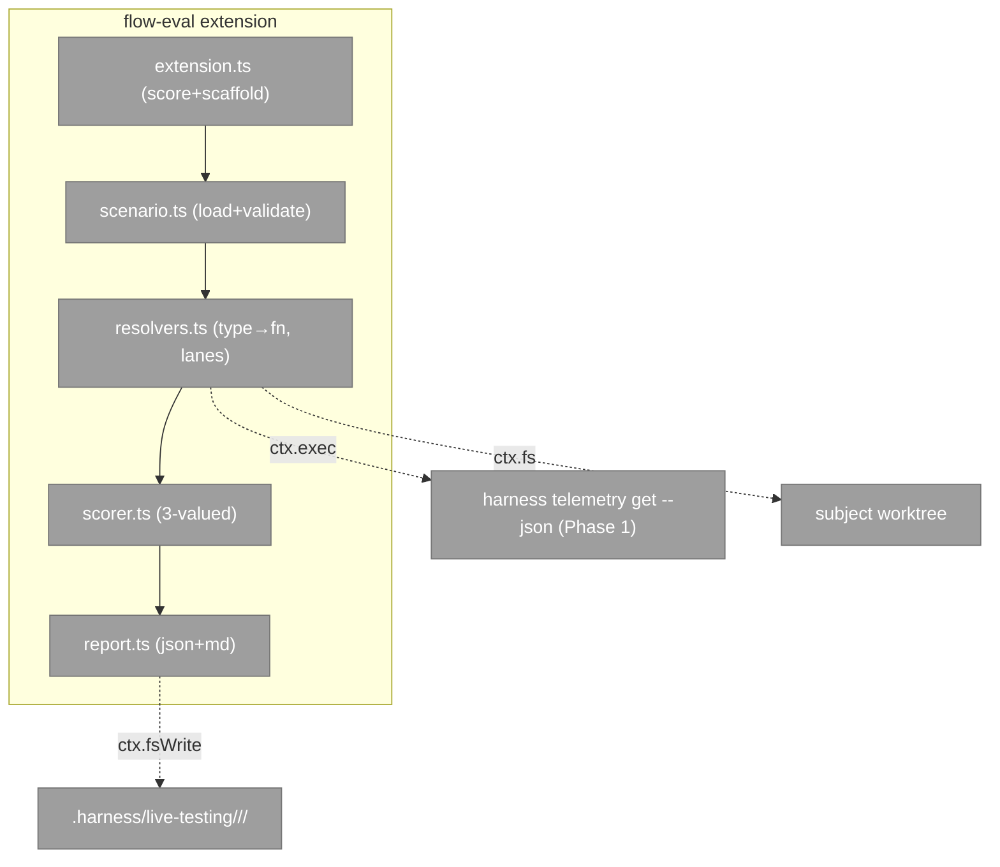
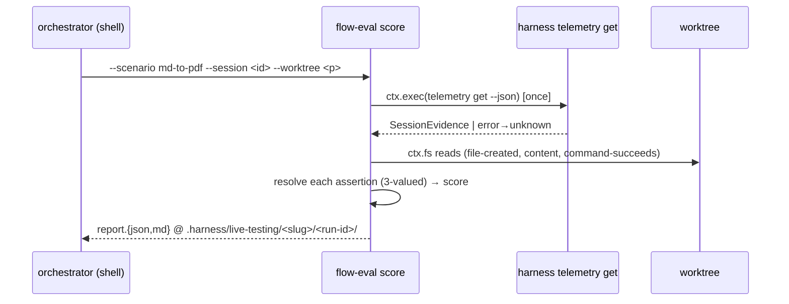

# Phase 2 — The `flow-eval` engine

**Plan**: [`flow-conformance-eval-plan.md`](../../flow-conformance-eval-plan.md) · **Phase**: 2 of 3 · **Domain**: flow-eval · **CS**: 4

---

### Executive Briefing

- **Purpose**: A generic, config-driven evaluator — load a scenario bundle, resolve each assertion by `type` to a three-valued verdict (pass/fail/unknown), score it, and write the report. The engine is generic; scenarios are data (Phase 3).
- **What We're Building**: A `flow-eval` **extension** (`.harness/extensions/flow-eval/`) with two verbs: `score` (the only action verb — collect evidence + resolve assertions + write report; **never drives pij**) and `scaffold` (write a scenario skeleton).
- **Goals**:
  - ✅ Scenario loader + schema validation (workshop §1–§2)
  - ✅ `type`-dispatched resolver registry, each resolver declaring its **lane** (telemetry / fs / fs+telemetry / judged)
  - ✅ Three-valued scorer: `score = Σpass/Σ(pass+fail)`, unknowns excluded; a failed **required** assertion caps the verdict; `judged` surfaced as fields
  - ✅ Report writer → `.harness/live-testing/<slug>/<run-id>/report.{json,md}`
- **Non-Goals**:
  - ❌ No scenario authoring (md→PDF scenario + prompts + assertions = Phase 3)
  - ❌ No pij driving — `score` consumes an already-finished session's evidence + a worktree; the orchestrator drives pij in the shell
  - ❌ No new telemetry capture or core-verb changes (Phase 1 is frozen)

### Prior Phase Context (Phase 1 — telemetry session-evidence read path)

- **A. Deliverables**: `harness telemetry get <pij-session-id> [--json] [--worktree <path>]` core verb (Envelope+exit); `services/telemetry/session-evidence.ts` exporting `getSessionEvidence(id, deps, opts)` (internal) + `getSessionEvidenceFromContext(id, ctx, opts)` (facade).
- **B. Dependencies Exported** — the `SessionEvidence` object: `{ pij_session_id, harness, segments, skills{name→count}, skill_order[], files{written[],edited[]}, flow_seams[], harness_verbs{verb→count}, checks[{status}], compactions, tools{name→count}, gaps[] }`.
- **C. Gotchas & Debt**: session located via the pij **state-file `folder` field** (`~/.pij/<id>.json`), NOT `pij path --dir`. `refs/harness-telemetry/**` fallback is **deferred** — only the gitignored buffer is read (it's the live source). `gaps[]` carries `unknown` markers; the service never throws.
- **D. Incomplete Items**: none blocking Phase 2.
- **E. Patterns to Follow**: TDD (failing-first); pin to plan-037 fixtures; dim-0 (mutation-proven tests); read-only services; node-free in services (`Pick<>` port surfaces).

### Pre-Implementation Check

| File | Exists? | Domain | Notes |
|------|---------|--------|-------|
| `.harness/extensions/flow-eval/extension.ts` | ❌ create | flow-eval | default-export `HarnessVerb`; verbs `score` + `scaffold` |
| `.harness/extensions/flow-eval/scenario.ts` | ❌ create | flow-eval | loader + schema validation |
| `.harness/extensions/flow-eval/resolvers.ts` | ❌ create | flow-eval | `type`→fn registry, lane-tagged |
| `.harness/extensions/flow-eval/scorer.ts` | ❌ create | flow-eval | three-valued scorer |
| `.harness/extensions/flow-eval/report.ts` | ❌ create | flow-eval | JSON+MD report writer |
| existing extension pattern | ✅ read | flow-eval | `.harness/extensions/checks/extension.ts`, `validate-harness-flow/` — import `type { HarnessVerb } from '@ai-substrate/engineering-harness/contract'` |
| `VerbContext` | ✅ read | flow-eval | `services/extensions/contract.ts:59` — `cwd`, `exec`, `fs.{exists,readText,readdir,realpath}`, `fsWrite?.writeText`, `env.get`, `git` |

### Architecture decision — the telemetry seam (THE key Phase-2 risk, resolved)

Extensions import only `@ai-substrate/engineering-harness/contract` (published types) — they **cannot** import the Phase-1 facade from CLI src. **Decision**: the telemetry-lane resolver calls the Phase-1 **CLI verb** via `ctx.exec`:

```
const r = await ctx.exec('harness', ['telemetry', 'get', session, '--json', ...(worktree ? ['--worktree', worktree] : [])]);
// parse r.stdout → envelope; envelope.data is the SessionEvidence object (or error → all telemetry assertions => unknown)
```

This is P8 ("wrap, don't rebuild") — and is precisely why Phase 1 shipped the verb. The in-process facade stays the API for any future in-CLI caller; the extension uses the verb. Evidence is fetched **once** per `score` run and shared across telemetry assertions.

### Architecture Map



### Tasks

| Status | ID | Task | Domain | Path(s) | Done When | Notes |
|--------|-----|------|--------|---------|-----------|-------|
| [ ] | T001 | `scenario.ts` — load a scenario bundle (`scenario.json` + `assertions.json`) + schema-validate per workshop §1–§2; malformed → clear error | flow-eval | `.harness/extensions/flow-eval/scenario.ts` | Loads a valid bundle into a typed object; malformed input → descriptive error (not a throw-crash) | AC-04; workshop §1–§2 |
| [ ] | T002 | **Failing** tests for each resolver lane over a fixture scenario + fixture telemetry (plan-037) + a temp worktree; include a **mutated-fixture case that must flip** (dim-0) | flow-eval | `.harness/extensions/flow-eval/*.test.ts` (or `harness/cli/test/extensions/flow-eval/`) | Tests compile + FAIL pre-impl; cover telemetry/fs/composite/judged lanes + the flip case | TDD; AC-05; dim-0 |
| [ ] | T003 | `resolvers.ts` — `type`→fn registry, each tagged with its lane. **telemetry** resolvers parse `harness telemetry get --json` (via `ctx.exec`, fetched once); **fs** resolvers read the worktree (incl. `command-succeeds` via `ctx.exec`); evidence-gap/absent → `unknown` | flow-eval | `.harness/extensions/flow-eval/resolvers.ts` | T002 passes; verdicts pass/fail/unknown per the workshop lanes; types: skill-called, skill-sequence, flow-seam-fired, harness-verb-ran, checks-ran, tool-used, compaction-occurred, file-created, file-content-matches, artifact-exists, command-succeeds, retro-drained, judged | AC-05; Finding 02; workshop type registry |
| [ ] | T004 | `scorer.ts` — walk assertions, three-valued; `score = Σpass/Σ(pass+fail)` (unknowns excluded); a failed **required** assertion caps the verdict; `judged` assertions surfaced as fields, not scored | flow-eval | `.harness/extensions/flow-eval/scorer.ts` | Score excludes unknowns; required-fail → capped verdict; judged separated | AC-06; workshop §verdict |
| [ ] | T005 | `report.ts` — write `.harness/live-testing/<slug>/<run-id>/report.{json,md}` via `ctx.fsWrite` (feature-detect `if (ctx.fsWrite)`); MD has the deterministic assertion table + judged section + verdict + subject/base_ref | flow-eval | `.harness/extensions/flow-eval/report.ts` | Both files written; deterministic table renders; absent `fsWrite` → honest error | AC-07; Finding 05 |
| [ ] | T006 | `extension.ts` wiring — `score --scenario <slug> --session <pij-id> [--worktree <path>]` (load → fetch evidence once → resolve → score → report; the ONLY action verb, **never drives pij**) + `scaffold --slug <s>` (write a scenario skeleton); rebuild + `harness flow-eval --help` registers both | flow-eval | `.harness/extensions/flow-eval/extension.ts` | `flow-eval score` produces a report from a session id + worktree; `--help` lists both verbs; no pij-driving | AC-04; Finding 05; critic-F1 |

### Context Brief

**Key findings from plan**:
- **Finding 02**: telemetry resolvers consume Phase-1 evidence — here via the CLI verb (the seam above).
- **Finding 05**: extension contract — default-export `HarnessVerb`; report via `ctx.fsWrite` (feature-detect); reserved core verbs can't be shadowed (`flow-eval` is safe).
- **critic-F1**: the extension **never drives pij** — `score` is the only action verb; pij-driving stays in the orchestrator shell.

**Domain constraints**:
- Import only `@ai-substrate/engineering-harness/contract` types; reach the harness via `ctx.exec`, the fs via `ctx.fs`/`ctx.fsWrite`.
- Three-valued throughout — a missing evidence field is `unknown`, never a failure; telemetry gaps (`gaps[]`) map to `unknown`.
- Generic engine — no scenario-specific logic; the md→PDF specifics are Phase 3 data.

**Reusable from Phase 1**:
- The `telemetry get --json` verb (the evidence seam); the `SessionEvidence` shape; plan-037 fixtures; the TDD + dim-0 discipline.

**Mermaid sequence** (a `score` run):


### Discoveries & Learnings

_Populated during implementation by the implement verb._

| Date | Task | Type | Discovery | Resolution | References |
|------|------|------|-----------|------------|------------|
