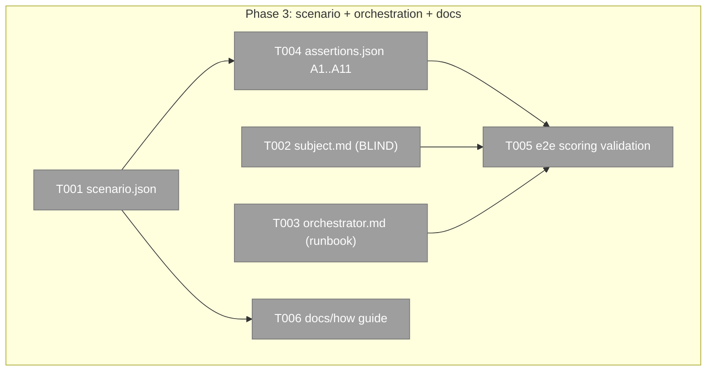

# Phase 3 — Scenario #1 (md→PDF) + orchestration + docs

**Plan**: [`flow-conformance-eval-plan.md`](../../flow-conformance-eval-plan.md) · **Phase**: 3 of 3 · **Domain**: flow-eval · **CS**: 3

---

### Executive Briefing

- **Purpose**: Make the engine runnable on a *real* scenario — author the pinned **md→PDF** scenario bundle (the blind subject packet, the orchestrator drive runbook, the assertions), validate the scoring half over a fixture session, and ship the how-to guide. This is what turns the generic Phase-2 engine into a usable eval.
- **What We're Building**: `live-testing/scenarios/md-to-pdf/` (scenario.json + prompts/{subject,orchestrator}.md + assertions.json); an end-to-end scoring validation over a captured/fixture session; `docs/how/flow-conformance-eval.md`.
- **Goals**:
  - ✅ A scenario that **validates against the Phase-2 loader** and scores against the engine
  - ✅ A genuinely **BLIND** subject packet — eval framing + report contract only, zero task how-to (reviewer-verified for leaks)
  - ✅ An **executable** orchestrator runbook over pij/flow-pair (spawn→explore→plan `--simple`→validate→compact→implement→review→fix→validate)
  - ✅ Assertions = the workshop's worked example A1..A11, each mapping to a registry `type`
  - ✅ A guide a fresh reader can use to author scenario #2
- **Non-Goals**:
  - ❌ **No live eval run here** — task 3.5 proves the *scoring* half over a fixture session + *verifies* the runbook step-list; actually driving a blind subject through the-flow live is a separate human-driven operation (the payoff, not a build task).
  - ❌ No engine changes (Phase 2 is frozen — if the scenario can't express something, that's a finding, not a silent engine edit).
  - ❌ Not building the md→PDF extension itself — the *subject* builds that during a live run; we only assert on its effects.

### Prior Phase Context

**Phase 1** (committed c73443c3): `harness telemetry get <id> --json` → `SessionEvidence`. Worktree-safe (pij state-file `folder`). `refs` fallback deferred; buffer is the live source.

**Phase 2** (committed d20dcf58): the `flow-eval` extension — `harness flow-eval score --scenario <slug> --session <id> [--worktree 
]` and `scaffold --slug <s>`.
- **Loader expects** `live-testing/scenarios/<slug>/` (scenario.json + assertions.json [+ prompts/]).
- **13 assertion types** lane-tagged: skill-called, skill-sequence, flow-seam-fired, harness-verb-ran, checks-ran, tool-used, compaction-occurred, file-created, file-content-matches, artifact-exists, command-succeeds, retro-drained, judged.
- **Three-valued**: unknown excluded from score; required-fail caps to FAIL; judged surfaced as null fields for the LLM.
- Report → `.harness/live-testing/<slug>/<run-id>/report.{json,md}`.
- **Reference bundle** exists at `.harness/extensions/flow-eval/fixtures/scenarios/md-to-pdf/` (a TEST fixture) — Phase 3 authors the **real, carefully-crafted** bundle at `live-testing/scenarios/md-to-pdf/`. Reuse the *shape*, not the (placeholder) content.
- `scaffold --slug md-to-pdf` writes a skeleton — use it as the starting point, then fill it in.

### Pre-Implementation Check

| File | Exists? | Domain | Notes |
|------|---------|--------|-------|
| `live-testing/scenarios/md-to-pdf/scenario.json` | ❌ create | flow-eval | via `scaffold` then fill |
| `live-testing/scenarios/md-to-pdf/prompts/subject.md` | ❌ create | flow-eval | the BLIND packet |
| `live-testing/scenarios/md-to-pdf/prompts/orchestrator.md` | ❌ create | flow-eval | the drive runbook |
| `live-testing/scenarios/md-to-pdf/assertions.json` | ❌ create | flow-eval | A1..A11 |
| `docs/how/flow-conformance-eval.md` | ❌ create | flow-eval | the guide (peers exist in `docs/how/`) |
| end-to-end scoring test | ❌ create | flow-eval | scores the bundle over a fixture session → report |
| `docs/plans/041-.../original-ask.md` | ✅ read | — | the SOURCE for the md→PDF task + Simple-flow + compact-at-end-of-planning choreography |
| workshop §worked-example A1..A11 | ✅ read | — | the assertions source |

### The scenario's task (from the original ask — the subject's *hidden* objective)
Create a git **worktree** of harness-engineering and add a **markdown→PDF** extension (mermaid rendering + validated output). Flow choreography: explore → plan **`--simple`** → validate → **compact (before implement)** → implement → review → fix → validate. The subject is told ONLY that it's being evaluated + how to report — never the how-to. Backpressure: the subject may offer a backpressure checker for the PDF (an orchestrator-judged field).

### Architecture Map

### Tasks

| Status | ID | Task | Domain | Path(s) | Done When | Notes |
|--------|-----|------|--------|---------|-----------|-------|
| [ ] | T001 | `scenario.json` — start from `harness flow-eval scaffold --slug md-to-pdf`, then fill: the task summary, pinned `base.ref` (a real commit/branch in this repo), subject defaults (harness=claude, model=opus), and the **Simple-flow choreography** (explore→plan --simple→validate→compact→implement→review→fix→validate) | flow-eval | `live-testing/scenarios/md-to-pdf/scenario.json` | `harness flow-eval score --scenario md-to-pdf …` gets past loading (validates against the Phase-2 loader) | AC-08; source = original-ask.md |
| [ ] | T002 | `prompts/subject.md` — the **BLIND** packet: eval framing + the report-to-orchestrator contract ONLY. NO task how-to, NO mention of PDF/mermaid/worktree mechanics beyond the bare task statement, NO flow hints. Append a **forbidden-content checklist** the reviewer uses to confirm zero leaks | flow-eval | `live-testing/scenarios/md-to-pdf/prompts/subject.md` | A reviewer pass confirms zero task-guidance/flow-hint leakage | AC-08; **blind-contamination risk** |
| [ ] | T003 | `prompts/orchestrator.md` — the drive runbook over pij/flow-pair, with the FULL choreography spelled out: spawn + **canary-verify model** → deliver the blind packet → **explore → plan `--simple` → validate → compact (before implement) → implement → review → fix → validate** → collect → `flow-eval score`. Reference real pij/flow-pair verbs so it's executable | flow-eval | `live-testing/scenarios/md-to-pdf/prompts/orchestrator.md` | A followable step-list against flow-pair where each step is a real command, AND the planning step explicitly uses `plan --simple` (per the original ask) | AC-08, AC-09; original-ask "select simple" |
| [ ] | T004 | `assertions.json` — the workshop's worked example **A1..A11**; each row a valid registry `type` with its `source` lane + `required` flag; include at least one `judged` (e.g. backpressure-checker offered?) | flow-eval | `live-testing/scenarios/md-to-pdf/assertions.json` | Loads; every row maps to one of the 13 types; lanes correct | AC-08; workshop §worked-example |
| [ ] | T005 | **End-to-end scoring validation**: a test that runs `flow-eval score` (the scoring half) over a **captured/fixture session** (reuse a plan-037 fixture or a synthetic evidence stub) + a temp worktree → asserts a `report.{json,md}` is produced with the expected three-valued rows; PLUS a checklist verifying the T003 runbook step-list is internally consistent (each step a real verb). NO live subject spawn | flow-eval | `harness/cli/test/extensions/flow-eval/e2e-md-to-pdf.test.ts` (or under the extension) | Scorer produces a report over the fixture; runbook steps verified as real commands | AC-09; key-risk: live drive is verify-only here |
| [ ] | T006 | `docs/how/flow-conformance-eval.md` — authoring a scenario (the bundle shape + `scaffold`), the 13-type registry + lanes, running (`flow-eval score`), reading a report (deterministic table + judged + verdict), and the orchestration loop. A fresh reader can author scenario #2 | flow-eval | `docs/how/flow-conformance-eval.md` | Guide present + complete; mermaid fences parse (markdown-lint) | AC-10 |

### Context Brief

**Key findings**:
- **Blind-contamination (the central risk)**: the subject packet must leak NOTHING about how to do the work or how the flow runs — only the task + the report contract. T002's forbidden-content checklist + the reviewer pass are the control.
- **Live-drive not fully automatable**: 3.5 proves the deterministic scoring half + verifies the runbook; the actual live multi-agent eval is operator-driven (out of this phase).
- **Engine is frozen**: if the scenario needs a capability the engine lacks, that's a finding to raise — not a silent Phase-2 edit.

**Domain constraints**:
- Scenario bundles are **data** consumed by the Phase-2 loader — no code logic in the scenario.
- Assertions are three-valued; a `judged` row carries a question for the orchestrator-LLM, surfaced as a null field.
- `base.ref` must be a real, stable ref so a subject worktree starts from a known checkpoint.

**Reusable**:
- `scaffold --slug md-to-pdf` (skeleton); the Phase-2 fixture bundle (shape reference); plan-037 fixtures (for the T005 scoring session); `docs/how/` peers (guide style).

### Discoveries & Learnings

_Populated during implementation by the implement verb._

| Date | Task | Type | Discovery | Resolution | References |
|------|------|------|-----------|------------|------------|
