<!-- GENERATED by `harness flow render` — do not hand-edit; regenerate from the flow JSON. -->
# Flow · flow-conformance-eval

**Kind**: flight-plan · **Now**: phase-3 · **Next**: ship · **Intent**: Build a flow-conformance eval harness: an orchestrator drives a blind agent through the-flow on a fixed task, graded deterministically via telemetry/OTel + filesystem, config-driven, reports to .harness/live-testing/&lt;slug&gt;/ · **Nodes**: 12 · **Events**: 26

**Rail**: ◆─◆─[ ◆─◆─◇─◇ ]  ◆ Research · ◆ Plan · [ ◆ P1: Implementation · ◆ P2: The flow-eval engine · ◇ P3: Scenario md→PDF + orchestration + docs · ◇ Ship ]

```mermaid
flowchart TD
    research["Research 📝3"]:::done
    plan["Plan 💬1 📝3"]:::done
    phase_1["P1: Implementation 💬2 📝3"]:::done
    ship["Ship 📝3"]:::assumed
    phase_2["P2: The flow-eval engine 💬1"]:::done
    phase_3["P3: Scenario md→PDF + orchestration + docs"]:::known

    research --> plan
    plan --> phase_1
    phase_1 --> phase_2
    phase_2 --> phase_3
    phase_3 --> ship

    backpressure["Backpressure survey 📝3 🧰° ✕"]:::harnessFaded
    boot_1["Boot check 📝3 🧰"]:::harnessFaded
    observe_1["Observe: P1 📝3 🧰"]:::harnessFaded
    retro_1["Retro: P1 (drain) 📝3 🧰"]:::harnessFaded
    retro_ship["Retro: ship (harvest) 📝3 🧰"]:::harnessFaded
    ws_scenario_schema["WS: scenario + assertion schema"]:::done
    backpressure -.-> plan
    boot_1 -.-> phase_1
    observe_1 -.-> phase_1
    retro_1 -.-> phase_1
    retro_ship -.-> ship
    ws_scenario_schema -.-> plan

    classDef done fill:#1B7F2E,stroke:#0F4F1B,color:#fff;
    classDef wip fill:#43C04A,stroke:#1B7F2E,color:#04210A;
    classDef blocked fill:#E53935,stroke:#8E1513,color:#fff;
    classDef known fill:#1E73E8,stroke:#0D3F86,color:#fff;
    classDef assumed fill:#CFD8DC,stroke:#607D8B,color:#1a1a1a,stroke-dasharray:5 3;
    classDef said fill:#FFD21F,stroke:#C79100,color:#241c00;
    classDef harness fill:#7E3FF2,stroke:#4A1FA8,color:#fff;
    classDef harnessFaded fill:#D6CBEC,stroke:#A892D4,color:#5B4E78;
    classDef decision fill:#FF8F00,stroke:#B25E00,color:#1a1100,stroke-dasharray:2 2;
    classDef companion fill:#AB2FCB,stroke:#6A1480,color:#fff;
    classDef worker fill:#00A38C,stroke:#005046,color:#fff;
    classDef unknown fill:#ECEFF1,stroke:#90A4AE,color:#1a1a1a,stroke-dasharray:1 4;
    classDef impOptional stroke-dasharray:2 3;
    classDef impStrong stroke-width:3px;
    classDef current fill:#FF7A00,stroke:#C24E00,color:#1a0e00,stroke-width:4px;
    class backpressure impOptional;
    class phase_3 current;
```

**Legend** — colour = type/status: 🟩 done · 🟢 in-progress · 🟥 blocked · 🟦 known · ⬜ assumed · 🔶 decision · 🗣 user input · 🟪 harness chore (faded = not yet done) · 🤖 companion · 🛠 worker · 🟧 current (you are here). Badges: 💬 comments · 📄 artifacts · 📝 instructions · 🧰 chore (° optional / recommended / ‼ strongly-recommended; ✓ done · ✕ skipped).

## Node log

### plan · Plan
- `2026-06-29T04:02:36.037Z` · — · decision — Binding principle (user steer): encode eval machinery as first-class harness extensions/verbs wherever possible — runner/scorer = a harness extension, telemetry-by-session = a read-only core/ext verb (closes F-07), report via ctx.fsWrite, resolvers a type-dispatched module. Loose scripts only where the extension contract can't reach (driving pij panes). Dogfood the harness — build it the harness way.

### phase-1 · P1: Implementation
- `2026-06-29T04:47:23.948Z` · — · note — Phase 1 tasks dossier written (T001-T005) + validated (4 critic fixes folded; files-from-segment correction). Ready to build via flow-pair.
- `2026-06-29T05:31:07.129Z` · — · note — Built via flow-pair (Opus 4.8 coder + codex GPT-5.5 cross-model reviewer). dlg-0001 FIX_REQUIRED → dlg-0002 APPROVE. Dim-0 non-vacuous (reviewer mutation-tested). harness checks: core gates green. 21 targeted / 424 telemetry suite pass.

### phase-2 · P2: The flow-eval engine
- `2026-06-29T06:42:48.188Z` · — · note — flow-eval extension built via flow-pair. Review: all 7 code risks cleared, dim-0 satisfied; 2 artifact gaps fixed (execution log by orchestrator, instructions.md by coder). doctor:ok E144 cleared. 42 flow-eval tests / 1641 suite pass.
