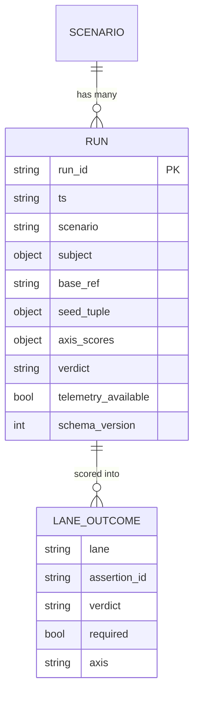

# Workshop: Run Storage & Comparison — the eval ledger

**Type**: Data Model + CLI Flow
**Plan**: 041-flow-conformance-eval
**Spec**: [flow-conformance-eval-plan.md](../flow-conformance-eval-plan.md) · Phase 4 (tasks 4.1–4.3, AC-11/AC-12)
**Created**: 2026-07-01
**Status**: Approved

**Value Thesis**: Specify the durable record of every eval run — its reproducibility tuple ("seed") and per-lane outcomes — and how runs are read back side-by-side, so **drift across model / harness / skill changes is visible instead of lost** between one-off runs. This is the instrument every longitudinal claim (`pass^k`, "did model X regress", "did the F11 fix hold") reads from.
**Target Proof Level**: **Contract Ready** (schema + storage format + CLI output specified; an implementer builds Phase 4 from this with no further design)
**Current Proof Level**: Contract Ready

**Selected Value Axes**:
- **Knowability** — makes hidden run-to-run behaviour explicit and inspectable.
- **Implementation Readiness** — TypeScript + JSON Schema + worked CLI output; build straight from it.
- **Learning Compounding** — every run is recorded, so the next loop reads history instead of re-running blind.
- **Migration Safety** — append-only + schema-versioned, so old records stay readable as the schema grows.

**Related Documents**:
- [003-eval-hardening-applied-decisions.md](./003-eval-hardening-applied-decisions.md) — D1 (two-axis scores) and D3/D5 (`pass^k`, CIs) are the consumers of this ledger.
- [002-eval-system-end-to-end.md](./002-eval-system-end-to-end.md) — `flow-eval score` (where the write hooks in).
- [001-scenario-and-assertion-schema.md](./001-scenario-and-assertion-schema.md) — the lane/assertion vocabulary recorded per run.

---

## Purpose

Define **what we store per run** and **how we compare runs**, so a lane flipping across reruns of the same model is a thing you can *see*, and `pass^k` / drift are computed from a real record. Implements Phase 4 (AC-11 store, AC-12 compare).

## Fresh Entrant Outcome

A fresh human or agent reaches **Contract Ready**: they can build the run-record writer and the `flow-eval ledger` reader from the schema + the worked output below, with no further design decisions.

## Key Questions Addressed

- What is a "run" and what exactly do we persist? (incl. the right notion of "seed")
- What storage format, where, and why append-only?
- How do we read N runs back to *see* drift and compute `pass^k`?
- How do we stay readable as the schema evolves and when telemetry is missing?

---

## Value Frame

| Field | Selection | Why It Matters |
|-------|-----------|----------------|
| Target Proof Level | Contract Ready | Phase 4 builds directly from this |
| Primary Value Axis | Knowability | Drift becomes visible, not lost |
| Supporting Axes | Implementation Readiness, Learning Compounding, Migration Safety | Buildable, compounding, future-proof |
| Downstream Loop Improved | Every future eval run + every model-vs-model comparison | Reads history instead of re-running blind |

## Decision Space (resolved)

| Option | Description | Decision |
|--------|-------------|----------|
| Storage format: **JSONL append-only** vs single JSON array vs SQLite | One record per line, append-only file | **JSONL append-only — SELECTED.** Append is atomic-ish, git-diffable, prior lines byte-stable (AC-11), no read-modify-write race across concurrent runs, trivially streamable. |
| "Seed" = single integer vs **reproducibility tuple** | What we call the run's identity | **Tuple — SELECTED.** An LLM "seed" is *not* a true RNG seed (temp-0 ≠ deterministic — FP non-associativity, batching). A single int is a false promise; the tuple is the honest reproduction key. |
| Location: in-repo vs `.harness/` | Where the ledger lives | **`.harness/live-testing/<slug>/ledger.jsonl` — SELECTED.** Co-located with reports (002), out of the source tree, per-scenario. |
| Compute `pass^k` at write vs **at read** | When aggregates are derived | **At read — SELECTED.** The ledger stores raw per-run facts; aggregates (`pass^k`, CIs, trend) are derived by the reader, so we can change the stats without rewriting history. |

## Conceptual Model



## Storage

```
.harness/
└── live-testing/
    └── md-to-pdf/
        ├── ledger.jsonl          # append-only: one RunRecord per line  (AC-11)
        ├── <run-id>/
        │   ├── report.json       # the full per-run report (002)
        │   └── report.md
        └── ...
```

**Why JSONL append-only**: each `flow-eval score` appends exactly one line; prior lines are never touched (byte-stable, AC-11); concurrent runs can't corrupt each other (no rewrite); `tail`/`grep`/`git diff` all just work; a partial last line on crash is one dropped record, not a corrupt file.

## Schema Definitions

### TypeScript

```typescript
/** The honest reproduction key — NOT a single RNG int (temp-0 ≠ deterministic). */
interface SeedTuple {
  model: string;          // e.g. "claude-sonnet-5"
  model_version?: string; // when the harness can resolve it
  harness: string;        // "claude" | "copilot" | "codex" | "pi"
  effort?: string;        // "low" | ... | "xhigh" | "max"
  base_ref: string;       // git ref/sha the worktree was cut from
  scenario_hash: string;  // hash of scenario.json + assertions.json (detects rubric drift)
  prompt_hash: string;    // hash of the blind subject packet (detects packet drift)
  orchestrator_id?: string; // pij id of the driver, for the orchestrator-confound question (003 Q1)
}

interface LaneOutcome {
  lane: string;          // "file-content-matches", "skill-sequence", ...
  assertion_id: string;  // "A5"
  verdict: 'pass' | 'fail' | 'unknown';
  required: boolean;
  axis: 'capability' | 'process' | 'safety'; // 003 D1
}

interface RunRecord {
  schema_version: 1;
  run_id: string;        // unique per run (subject pij id + ts is fine)
  ts: string;            // ISO-8601, UTC
  scenario: string;      // "md-to-pdf"
  subject: { model: string; harness: string; effort?: string };
  base_ref: string;
  seed_tuple: SeedTuple;
  lanes: LaneOutcome[];
  axis_scores: { capability: number | null; process: number | null }; // null if no scorable lanes
  verdict: 'PASS' | 'PARTIAL' | 'FAIL';
  telemetry_available: boolean;          // false ⇒ process lanes likely unknown (not subject failure)
  unknown_rate_by_axis?: { capability: number; process: number }; // harness-health (003 Q3)
}
```

### JSON Schema (validation core)

```typescript
export const RUN_RECORD_SCHEMA = {
  $schema: 'https://json-schema.org/draft/2020-12/schema',
  type: 'object',
  required: ['schema_version', 'run_id', 'ts', 'scenario', 'subject',
             'base_ref', 'seed_tuple', 'lanes', 'axis_scores', 'verdict', 'telemetry_available'],
  properties: {
    schema_version: { const: 1 },
    run_id: { type: 'string', minLength: 1 },
    ts: { type: 'string', format: 'date-time' },
    verdict: { enum: ['PASS', 'PARTIAL', 'FAIL'] },
    axis_scores: {
      type: 'object',
      properties: {
        capability: { type: ['number', 'null'], minimum: 0, maximum: 1 },
        process: { type: ['number', 'null'], minimum: 0, maximum: 1 },
      },
    },
    // lanes[], seed_tuple{}, subject{} per the TS interfaces above
  },
} as const;
```

### One real ledger line (md→PDF, run-003 shape)

```json
{"schema_version":1,"run_id":"pij-1bhvjvj","ts":"2026-07-01T00:14:00Z","scenario":"md-to-pdf","subject":{"model":"claude-sonnet-5","harness":"claude","effort":"xhigh"},"base_ref":"c3e6b778","seed_tuple":{"model":"claude-sonnet-5","harness":"claude","effort":"xhigh","base_ref":"c3e6b778","scenario_hash":"sha256:9f2a…","prompt_hash":"sha256:41bd…","orchestrator_id":"pij-4s10mb"},"lanes":[{"lane":"skill-sequence","assertion_id":"A5","verdict":"pass","required":true,"axis":"process"},{"lane":"file-content-matches","assertion_id":"A8","verdict":"pass","required":true,"axis":"capability"}],"axis_scores":{"capability":1.0,"process":0.92},"verdict":"PASS","telemetry_available":true,"unknown_rate_by_axis":{"capability":0.0,"process":0.08}}
```

## CLI Flow — `flow-eval ledger`

### Default: runs over time + per-lane drift

```
$ harness flow-eval ledger --scenario md-to-pdf

┌──────────────────────────────────────────────────────────────────────────┐
│ md-to-pdf · 3 runs · base c3e6b778                                         │
├──────────┬─────────────────────┬───────┬──────────┬────────┬──────────────┤
│ run      │ subject             │ effort│ capability│ process│ verdict      │
├──────────┼─────────────────────┼───────┼──────────┼────────┼──────────────┤
│ #1 6/30  │ copilot gpt-5.5     │ med   │ 0.83     │ 0.71 ░ │ PARTIAL      │
│ #2 6/30  │ claude sonnet-4-6   │ —     │ 1.00     │ 0.88   │ PASS         │
│ #3 7/01  │ claude sonnet-5     │ xhigh │ 1.00     │ 0.92   │ PASS         │
└──────────┴─────────────────────┴───────┴──────────┴────────┴──────────────┘

Per-lane verdict history  (✓ pass · ✗ fail · ? unknown · ⚑ flipped):
  lane                       #1  #2  #3
  A5 compact→implement (req)  ?   ✓   ✓
  A4 flow-seam-fired          ?   ✓   ✓
  A8 file-content-matches ✓   ✓   ✓        (capability, required)
  A2 skill-sequence       ⚑  ✗   ✓   ✓     ← flipped #1→#2

pass^3 (all-3 succeed): capability 1.00 · A8 1.00 · A2 0.00 (one fail kills it)
⚠ 2 lanes were `unknown` on #1 (copilot: no skill-name telemetry — F8), excluded from its score.
```

### JSON (for stats / model-vs-model)

```
$ harness flow-eval ledger --scenario md-to-pdf --json

{
  "scenario": "md-to-pdf",
  "runs": [ /* RunRecord[] in ts order */ ],
  "derived": {
    "pass_hat_k": { "k": 3, "capability": 1.0, "by_lane": { "A8": 1.0, "A2": 0.0 } },
    "flipped_lanes": ["A2"],
    "unknown_rate_by_lane": { "A4": 0.33, "A5": 0.33 }
  }
}
```

**Why these outputs**: the table answers "is it getting better/worse over time"; the per-lane history answers "which specific behaviour changed" (the ⚑ flip is the drift signal); `pass^k` answers "is conformance *reliable* or lucky" (003 D3); the `unknown` callout keeps a dropped-sensor from masquerading as a clean score (003 Q3).

### Cross-model comparison — `--compare` (first-class)

Runs of **different models live in the same ledger** (distinguished by `seed_tuple.model` / `harness` / `effort`) — that's the whole point of recording the tuple instead of an int. Grouping by model turns the ledger into a model-vs-model board. This is a first-class view, not a derived afterthought: e.g. **gpt-5.5 vs sonnet-5** on the same scenario.

```
$ harness flow-eval ledger --scenario md-to-pdf --compare claude-sonnet-5 --compare gpt-5.5

md-to-pdf · base c3e6b778 · scenario_hash 9f2a… · K=20 each · shared seed set

  lane (assertion)            sonnet-5 xhigh    gpt-5.5 med      Δ / test
  ─────────────────────────   ───────────────   ───────────────  ────────────────
  capability  (axis)          0.99 [.97–1.0]    0.88 [.82–.93]   +0.11  ✱
  process     (axis)          0.94 [.90–.97]    0.74 [.67–.80]   +0.20  ✱
  A2 skill-sequence    (req)  pass^20 1.00      pass^20 0.55     McNemar p<.01 ✱
  A5 compact→implement (req)  pass^20 1.00      pass^20 0.40     McNemar p<.01 ✱
  A8 file-content-matches     pass^20 1.00      pass^20 0.95     n.s.

  ✱ = Wilson CI lower bounds don't overlap / McNemar significant (paired, shared seeds).
  Verdict: sonnet-5 dominates on process-conformance; the capability gap is smaller.
```

**Why model is in the key, not just a column**: `seed_tuple.model`/`harness`/`effort` make every model's runs independently groupable and statistically comparable. `--compare` groups by model, holds the rest of the tuple fixed (same `base_ref`, same `scenario_hash`, **shared seed set** = common random numbers, 003 D5), then per binary lane runs **McNemar** on the paired runs and compares **`pass^k` + Wilson CIs** per axis. A comparison is **only valid when `scenario_hash` + `base_ref` match across the groups** — otherwise you're comparing across a rubric/base change, not across models, and the view flags it rather than computing a misleading delta.

## Comparison semantics (how drift is computed)

1. **Align** runs by `assertion_id` (stable across runs; lane labels may evolve).
2. **Flip** = a lane whose `verdict` changes between consecutive runs **of the same `seed_tuple`** (same model+effort+base) — a flip there is *real variance/drift*; a flip across *different* subjects is just a model difference, marked separately.
3. **`pass^k`** = fraction of the k runs in which the lane passed, raised per the reliability definition (all-k for the strict reliability number); computed at read time over runs sharing a `seed_tuple`.
4. **`unknown` excluded** from scores but **counted** into `unknown_rate` so a systematically-dropped sensor is visible.
5. **Cross-model is grouping, not mixing** — runs of different `seed_tuple.model` coexist in one ledger; `--compare` **groups by model** and computes paired stats only when `scenario_hash` + `base_ref` match across groups (else the comparison is flagged as rubric/base drift, not computed). This is what lets the same ledger answer both "did sonnet-5 drift run-to-run" (within-model) and "is sonnet-5 better than gpt-5.5" (between-model).

## Validation Rules

1. **Append-only** — `score` only ever appends; a run that re-scores writes a *new* line (never edits a prior one). AC-11.
2. **schema_version gates the reader** — an unknown future version is surfaced, not silently mis-parsed (Migration Safety).
3. **`telemetry_available: false` ⇒** process lanes are expected `unknown`; the reader must NOT read that as subject failure (the F8 / copilot case).
4. **`seed_tuple` is the comparison key** — drift is only meaningful within one tuple; cross-tuple deltas are model comparisons, shown separately.

## Open Questions

### Q1: Per-run seed control vs record-only. **RESOLVED (record-only for now).**
We **record** the reproduction tuple; we do **not** yet try to *force* determinism (we can't — temp-0 ≠ deterministic). Forcing reproducibility (batch-invariant kernels etc.) is out of scope; recording honestly is the deliverable.

### Q2: Where does `pass^k`'s K come from? **OPEN → pilot (003 Q2).**
The ledger is the instrument that answers it: run a handful, read `unknown_rate` + flip variance, then pick K. The reader computes `pass^k` for whatever K the data contains.

## Attention Reduction

| Future Loop | Before | After |
|-------------|--------|-------|
| "Did the F11 fix hold across models?" | Re-run + eyeball two reports | `ledger` shows the lane's history in one row |
| Model-vs-model | "Model A *looked* better" | Aligned table + `pass^k` + (with 003 D5) McNemar |
| Debugging a flaky lane | "Is telemetry broken?" | `unknown_rate` per lane separates dropped-sensor from real fail |

## Validation / Acceptance

Contract Ready when:
- The `RunRecord` schema is complete enough to write from `flow-eval score` — ✅ (TS + JSON Schema + real line).
- The storage format + location + append rule are specified — ✅ (JSONL, `.harness/live-testing/<slug>/`).
- The `ledger` read output is shown concretely enough to build — ✅ (worked table + JSON).
- Comparison semantics (align/flip/`pass^k`/unknown) are unambiguous — ✅ (§Comparison semantics).

## Evidence Ledger

| Evidence | Location | Supports | Status |
|----------|----------|----------|--------|
| `RunRecord` TS + JSON Schema | §Schema Definitions | AC-11 (4.1) | Ready (Contract) |
| Real ledger line | §One real ledger line | the writer (4.2) | Ready |
| `flow-eval ledger` worked output | §CLI Flow | AC-12 (4.3) | Ready (Contract) |
| Comparison semantics | §Comparison semantics | drift + `pass^k` derivation | Ready |
