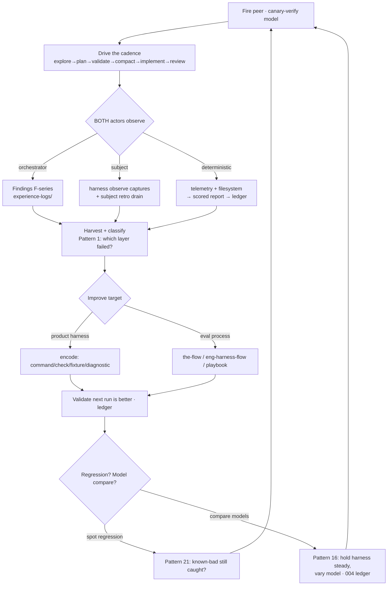

# Workshop: The Eval→Improve Loop — dogfooding the harness on itself

**Type**: Integration Pattern / Process
**Plan**: 041-flow-conformance-eval
**Spec**: [flow-conformance-eval-plan.md](../flow-conformance-eval-plan.md)
**Grounds in**: [`harness-foundations/first-principles.md`](../../../../harness-foundations/first-principles.md) · [`harness-foundations/patterns-that-work.md`](../../../../harness-foundations/patterns-that-work.md)
**Created**: 2026-07-01
**Status**: Approved

**Value Thesis**: Make explicit that **running the eval is itself a harness-engineering loop** — fire a peer, run the work, *both actors observe*, harvest the observations, improve **the harness and the eval process**, then continue. Defining the loop turns one-off dogfood runs into a **compounding** capability that spots regressions and compares models, instead of a pile of disconnected experience logs.
**Target Proof Level**: Contract Ready (the loop is a named, repeatable process with defined steps, artifacts, roles, and exit rules)
**Current Proof Level**: Preferred Direction → Contract Ready

**Selected Value Axes**:
- **Learning Compounding** (FP#16, #49, Pattern 10) — the whole point: each run makes the next run + the harness better.
- **Operational Reliability** — regression-spotting (Pattern 21) so the harness doesn't "go blind."
- **Knowability** — both actors' observations become durable, inspectable evidence (FP#40, #41).
- **Strategic Value** — this is harness engineering's core thesis (FP#58) applied reflexively: the eval is the harness's own proof loop.

**Related Documents**:
- [002-eval-system-end-to-end.md](./002-eval-system-end-to-end.md) — one *turn* of this loop (a single scored run).
- [003-eval-hardening-applied-decisions.md](./003-eval-hardening-applied-decisions.md) — improvements this loop has already produced.
- [004-run-storage-and-comparison.md](./004-run-storage-and-comparison.md) — the ledger that makes regression/model-comparison readable across turns.
- [`eval-orchestrator-process-notes.md`](../eval-orchestrator-process-notes.md) — the orchestrator's procedure (the loop's RUN step).
- [`experience-logs/`](../experience-logs/) — the observation record (findings F1–F18) this loop produces and consumes.

---

## Purpose

Define the **continuous eval→improve loop** so it's a repeatable process, not tribal practice: how a run is fired, how **both** the orchestrator *and* the subject make observations, how those observations are harvested and classified, and how they feed back to improve the harness **and** the process of evaluating the harness — turning the eval into a regression-and-comparison engine.

## Fresh Entrant Outcome

A fresh human or agent can reach **Contract Ready**: run one turn of the loop end-to-end, know what each actor observes and where it lands, harvest the observations into encoded improvements, and know how to use the loop to spot a regression or compare two models — without reconstructing the practice from chat.

## Key Questions Addressed

- Why is the eval *itself* a harness loop, and what are the two nested loops?
- Who observes what — and how does the **subject** contribute observations (not just the orchestrator)?
- How do observations become improvements to **both** the harness and the eval process?
- How does this loop spot regressions and compare new models without fooling itself?

---

## Value Frame

| Field | Selection | Why It Matters |
|-------|-----------|----------------|
| Target Proof Level | Contract Ready | The loop becomes runnable by a fresh operator |
| Primary Value Axis | Learning Compounding (FP#16) | Each run improves the next run + the harness |
| Supporting Axes | Operational Reliability (Pattern 21), Knowability (FP#41) | Catch regressions; make both actors' evidence durable |
| Downstream Loop Improved | The harness itself + the eval process + every future model run | The dogfood compounds (FP#58) |

## The big idea — two nested loops

Harness-foundations FP#10 names the operating loop: **Boot → Backpressure → Do-Work-and-Observe → Retro & Magic-Wand → Improve**. In a flow-conformance eval that loop runs **twice, nested**:

- **Inner loop (the subject's):** the blind subject runs *its* harness loop inside the task — boots, surveys backpressure, does the work, **observes** (`harness observe`), drains a retro. This is the thing under test.
- **Outer loop (ours):** *we* run the eval as a harness loop **over the inner one** — fire the peer, drive the cadence, **observe** (findings), harvest, **improve the harness + the eval process**, continue. The eval is the harness's own **proof loop** (FP#3, FP#25 dogfood).

> The reflexive point (FP#58): evaluating the harness is **itself** harness engineering. So the outer loop's "improve" target is **two things at once** — the product harness, *and* the eval process (the-flow / eng-harness-flow / the orchestrator playbook). Improving how we evaluate the harness is harness engineering applied to the harness's own evaluator.

## Both actors observe (FP#14 · Pattern 8) — this is load-bearing

Observation is not just the orchestrator writing findings. **The subject observes too**, and its observations are first-class evidence. Three streams feed every harvest:

| Stream | Who | Mechanism | Lands in | Example (run 003) |
|--------|-----|-----------|----------|-------------------|
| **Orchestrator findings** | orchestrator (outer loop) | watch the drive; write a finding when the harness/process "did not yet make X clear or executable" (Pattern 1 phrasing) | `experience-logs/00N-*.md` (F1–F18) | F18 (control-plane peer doesn't auto-push replies) |
| **Subject observations** | **the subject (inner loop)** | the subject runs **`harness observe "<what>"`** during its work and **drains its own retro** — process observability *from the inside* (FP#14, Pattern 8) | the subject's `.harness/records/retro/...` + its observe buffer (telemetry) | run-003 subject drained a retro + **self-corrected its own backpressure survey** unprompted |
| **Deterministic evidence** | the scorer (read-only) | telemetry + filesystem → scored report → ledger | `report.{json,md}` → `ledger.jsonl` (004) | all 6 ACs, `pass^k` over runs |

> **Why the subject's observations matter as much as ours**: the subject is a *real user* of the harness (FP#45) who *doesn't inherit our tribal knowledge*, so its friction and its in-flight `observe` captures expose UX gaps the orchestrator can't see from outside. A run where the subject self-corrects its own backpressure survey (run 003) is the harness's process-observability working as designed — capture it, don't discard it. **Mandate: the loop harvests the subject's retro/observe stream alongside the orchestrator's findings, every turn.**

## The harvest → improve lifecycle (Pattern 10)

Friction compounds only when it enters a lifecycle. Ours maps Pattern 10 (capture → bubble → harvest → prioritise → encode → validate) onto real artifacts:

| Stage | Pattern 10 | Our realization |
|-------|-----------|-----------------|
| Capture | while fresh | findings written live to `experience-logs/` (orchestrator) + subject `harness observe` (subject) |
| Bubble | at a natural pause | stage-boundary check-ins; the subject's retro drain at `post-coding` |
| Harvest | periodically | collate findings + subject retro + ledger after a run / batch of runs |
| Prioritise | recurrence · severity · age (FP#52) | rank findings; a finding seen across runs (e.g. F5/F8 copilot wedge) outranks a one-off |
| **Encode** | the move that compounds (FP#18) | turn the finding into a **command / check / fixture / diagnostic / template / prompt-contract** — *not* a wiki note. (e.g. F18 → bake the report-contract line into the send template; F12 → a pre-spawn clean step) |
| Validate | prove the next run is better (FP#49) | the ledger (004) shows the friction gone / the lane no longer flips |

**The measure is encoded improvement, not activity** (FP#49, Pattern 15): count how many recurring frictions became encoded fixes or stronger sensors — not how many findings we wrote.

## Two improvement targets (and how to tell them apart, Pattern 1)

Every harvested observation is first **classified by which layer failed** (Pattern 1) before we touch anything — *don't blame the model first*. Then it routes to one of two targets:

| Target | When the finding is about… | Encoded as | Run-003 examples |
|--------|---------------------------|------------|------------------|
| **The product harness** | a missing/weak sensor, command, fixture, diagnostic in the harness CLI | a new check / verb / doctor line / fixture | F13 (no duration in `telemetry get`) → add a span field |
| **The eval process** | how we *drive/measure* the eval — the-flow, eng-harness-flow, the orchestrator playbook | a playbook step / packet-template line / scenario rule | F12 (pre-spawn clean), F16 (orchestrator framing), F18 (report-contract every message) |

## Using the loop to spot regressions (Pattern 21)

Pattern 21: *"A harness is good when it catches known risks… No failures might mean the code is good. It might also mean the harness has gone blind."* The flow-conformance eval **is** the harness's behavioural regression suite:

- The pinned scenario + assertions are the **known-good behavioural target**; a fixed set of findings (the F-series) are **known-bad cases** the harness/process should now handle.
- Re-run after any change to skills, the-flow, eng-harness-flow, or the CLI. The **ledger (004)** shows whether a lane that used to pass now fails (a ⚑ flip within the same `seed_tuple`) — that's a regression, surfaced not guessed.
- **Quiet sensors are suspect**: if nothing fails after a big harness change, ask whether the eval went blind, not whether we're perfect.

## Using the loop to compare models (Pattern 16) — change one variable

Pattern 16: *change one harness variable at a time when learning.* This is the discipline that keeps "compare new models" honest, and it's enforced by 004's comparison key:

- **To test a harness/process change** → hold the **model steady**, vary the harness surface; read the ledger for the intended effect.
- **To compare models** (gpt-5.5 vs sonnet-5) → hold the **harness steady** (`scenario_hash` + `base_ref` fixed — 004's hard guardrail), vary only the model; compare `pass^k` + Wilson CIs + McNemar (003 D5).
- If the model, the prompt, the scenario, and a CLI change all move at once, **you can't attribute anything** — the ledger's `seed_tuple` exists precisely to stop this.

## The governing rule — stop → fix → start-over

When a run goes off-track (contamination, wrong model, leaked method, a real conformance gap), **stop, fix the root cause, restart — and log the finding** (the dogfood finding IS a deliverable). This is the outer loop's fast feedback on the-flow + eng-harness-flow themselves. It's why run 003 has three attempts: each abort (F12, F16, F17) produced an encoded fix.

## Grounding ledger — harness-foundations → our loop

| Principle / Pattern | How this loop realizes it |
|---|---|
| FP#10 operating loop · FP#16 improve compounds | The outer loop IS Boot→…→Improve, run over the eval |
| FP#14 observation · Pattern 8 observe-the-process | Both actors observe; process evidence (subject retro) + runtime evidence (telemetry) |
| FP#25 dogfood · FP#3 product proof | The eval dogfoods the harness to prove its real behaviour |
| FP#41 run history as evidence · FP#40 state survives the chat | findings + ledger are durable provenance |
| FP#44 friction is feedback · FP#45 agents are real users | the subject's friction is harness signal, not noise |
| FP#46 magic-wand · Pattern 10 lifecycle | harvest asks "what one change would help"; encode it |
| FP#49 measure encoded improvement | the win metric is fixes encoded, not findings written |
| Pattern 1 classify-the-layer | every finding is layer-classified before acting (don't model-blame) |
| Pattern 16 one-variable | the `seed_tuple` discipline for model-vs-harness attribution |
| Pattern 21 regression-test-the-harness | the eval is the harness's behavioural regression suite |
| Pattern 22 garbage-collect | stale findings/assumptions retired as the harness matures |

## Open Questions

### Q1: When does a finding *graduate* from experience-log to encoded fix? **OPEN.**
Today findings accrue in `experience-logs/`; encoding is manual. A lightweight rule (recurrence ≥ 2 → must encode or explicitly defer) would stop the log from becoming a diary (Pattern 10 watch-for). Candidate: a harvest step that tags each finding `encoded | deferred | wont-fix`.

### Q2: How automated should the harvest be? **OPEN.**
The subject already emits `harness observe` + retro; the orchestrator writes findings by hand. A future `harness` verb could collate both streams + the ledger into a harvest view. Out of scope here; noted.

## Validation / Acceptance

Contract Ready when:
- The two nested loops are explicit, with a diagram a fresh operator can follow — ✅.
- Both observation streams (orchestrator findings + **subject observe/retro**) are named with where they land — ✅.
- The harvest→encode lifecycle maps to real artifacts, and the two improvement targets are distinguished — ✅.
- Regression-spotting and model-comparison are specified with the one-variable discipline + the ledger guardrail — ✅.

## Evidence Ledger

| Evidence | Location | Supports | Status |
|----------|----------|----------|--------|
| Two-nested-loop model + diagram | §The big idea | the core concept | Ready |
| Three observation streams table | §Both actors observe | subject-observes mandate | Ready |
| Harvest→encode lifecycle | §The harvest → improve lifecycle | Pattern 10 realization | Ready |
| Regression + model-compare discipline | §regressions / §models | Pattern 21 + 16 | Ready |
| harness-foundations grounding ledger | §Grounding ledger | FP/Pattern provenance | Ready |
