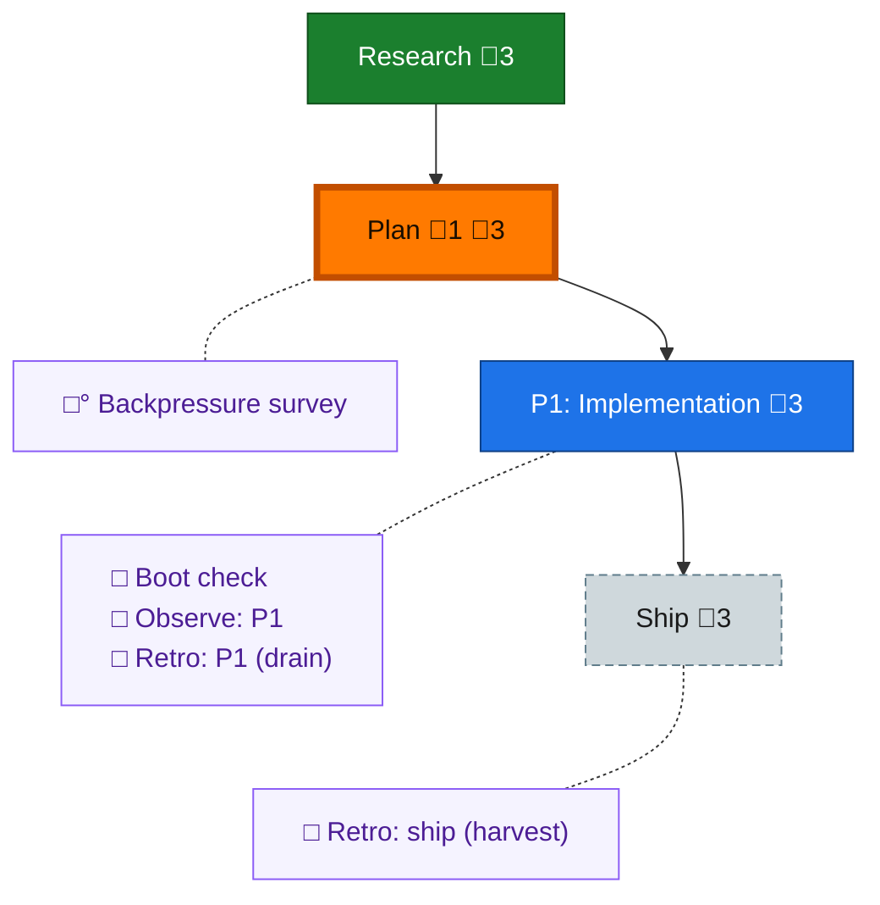

<!-- GENERATED by `harness flow render` — do not hand-edit; regenerate from the flow JSON. -->
# Flow · flow-review-spine-node

**Kind**: flight-plan · **Now**: plan · **Next**: phase-1 · **Intent**: Add a per-phase code-review node to the-flow's flight-plan template + plan-complete expander (+ worked example) so the flow surfaces code review per phase; fixes the gap where the spine (research→plan→phase→ship) and the expander omit review entirely. Topology: per-phase spine node (Option A). Code lands in ~/github/tools (main); plan/docs here. · **Nodes**: 9 · **Events**: 9

**Rail**: ◆─◆─[ ◇─◇ ]  ◆ Research · ◆ Plan · [ ◇ P1: Implementation · ◇ Ship ]

**Legend** — colour = type/status: 🟩 done · 🟢 in-progress · 🟥 blocked · 🟦 known · ⬜ assumed · 🔶 decision · 🗣 user input · 🟪 harness chore (faded = not yet done) · 🤖 companion · 🛠 worker · 🟧 current (you are here). Badges: 💬 comments · 📄 artifacts · 📝 instructions · 🧰 chore (° optional / recommended / ‼ strongly-recommended; ✓ done · ✕ skipped).

## Node log

### plan · Plan
- `2026-06-29T11:43:10.139Z` · — · validation — VALIDATED WITH FIXES: AC-07 added (per-phase review --zone flight to interleave on the rail). Sidecar: validations/flow-review-spine-node-plan-validation.md
