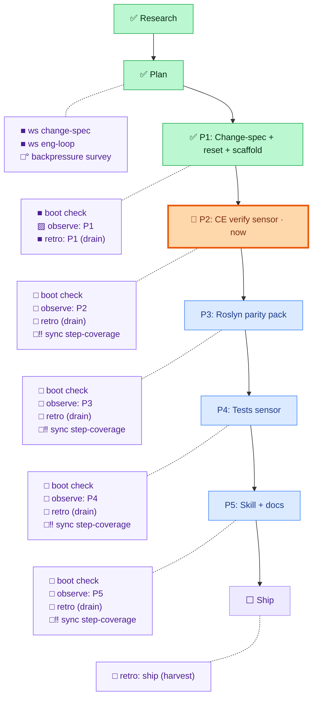

# Layout D — TD two columns (spine left, chores right, row-aligned)

Spine is a straight vertical column on the left; chore boxes form a **parallel right
column**, chained together with invisible links (`~~~`) to hold the column and dotted to
their phase to sit on the same row. Goal: a dead-straight spine with chores in a tidy
gutter beside it — the cleanest if dagre cooperates (alignment is a *bias*, not guaranteed).

