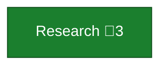
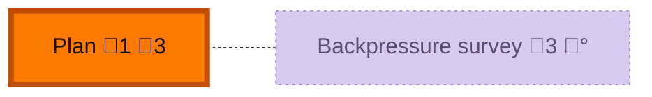
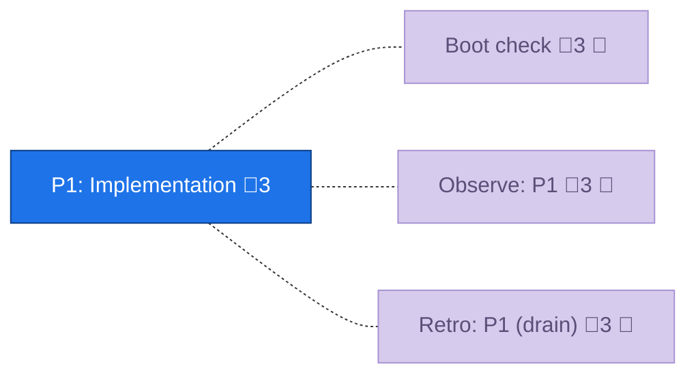
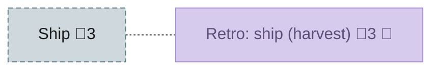

<!-- GENERATED by `harness flow render` — do not hand-edit; regenerate from the flow JSON. -->
# Flow · flow-render-td-columns

**Kind**: flight-plan · **Now**: plan · **Next**: phase-1 · **Intent**: Replace the sections layout in flow-renderer.ts with the TD two-column format (straight spine + combined-chore gutter, text extras as badges), matching reference-td-columns-format.md. · **Nodes**: 9 · **Events**: 9

**Rail**: ◆─◆─[ ◇─◇ ]  ◆ Research · ◆ Plan · [ ◇ P1: Implementation · ◇ Ship ]

### ◆ Research · _done_

↓

### ◆ Plan · _done_

↓

### ◇ P1: Implementation · _known_

↓

### ◇ Ship · _assumed_

**Legend** — colour = type/status: 🟩 done · 🟢 in-progress · 🟥 blocked · 🟦 known · ⬜ assumed · 🔶 decision · 🗣 user input · 🟪 harness chore (faded = not yet done) · 🤖 companion · 🛠 worker · 🟧 current (you are here). Badges: 💬 comments · 📄 artifacts · 📝 instructions · 🧰 chore (° optional / recommended / ‼ strongly-recommended; ✓ done · ✕ skipped).

## Node log

### plan · Plan
- `2026-06-29T21:30:04.659Z` · — · validation — VALIDATED. Note: 'skew beaten' is visual/inferential — T005 must RENDER+VIEW kitchen-sink, not just diff. Sidecar: validations/flow-render-td-columns-plan-validation.md
