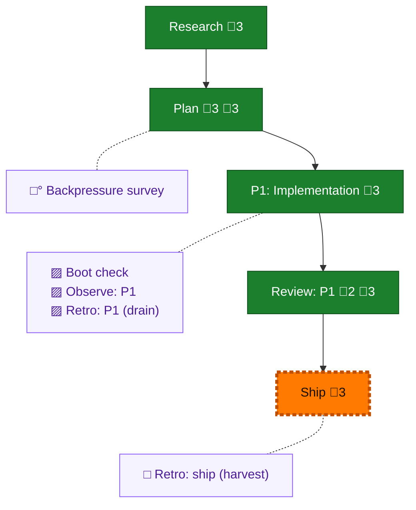

<!-- GENERATED by `harness flow render` — do not hand-edit; regenerate from the flow JSON. -->
# Flow · eng-harness-flow-mission-first

**Kind**: flight-plan · **Now**: ship · **Next**: ship · **Intent**: Make eng-harness-flow mission-first, lean, and user-legible per the 13-patch handoff brief (scratch/paste/20260630T013710.md): dual-mandate thesis, lean SKILL.md hot path, sharpen advisory, two-decision plain-language retro closeout, concrete observe triggers, non-skippable post-flight encode offer, the-flow harness-seams thesis echo. Preserve the frozen contracts (5 hooks, --event, --json, --hooks, boot-LAST gate, coding=silent-observe, progressive disclosure, harness-blind modules, never-gate). · **Nodes**: 10 · **Events**: 21

**Rail**: ◆─◆─[ ◆─◆─◇ ]  ◆ Research · ◆ Plan · [ ◆ P1: Implementation · ◆ Review: P1 · ◇ Ship ]

**Legend** — colour = type/status: 🟩 done · 🟢 in-progress · 🟥 blocked · 🟦 known · ⬜ assumed · 🔶 decision · 🗣 user input · 🟪 harness chore (faded = not yet done) · 🤖 companion · 🛠 worker · 🟧 current (you are here). Badges: 💬 comments · 📄 artifacts · 📝 instructions · 🧰 chore (° optional / recommended / ‼ strongly-recommended; ✓ done · ✕ skipped).

## Node log

### plan · Plan
- `2026-06-30T02:57:56.281Z` · — · decision — Planning decisions locked (post-thesis): (1) Patch 9 the-flow echo INCLUDED as a separate additive commit in ~/github/tools harness-seams.md, placed OUTSIDE the doctrine-parity:039 block (L13-28); (2) posture = reframe+resurface+de-jargon, diff-against-current patch-by-patch, no rewrite of working doctrine; (3) behavioural evals = documented follow-up only (flow-eval engine exists, cheap later); (4) Mode = Simple/1-phase. Spans 2 repos: skills/eng-harness-flow/ (here) + the-flow echo (tools).
- `2026-06-30T02:58:10.303Z` · — · note — Ship note: the-flow Patch 9 edit (~/github/tools harness-seams.md) is committed directly on main in the tools repo (no feature branch). The eng-harness-flow work here follows normal branch/PR.
- `2026-06-30T04:11:14.686Z` · — · validation — VALIDATED — no material issues; one inherent limitation: legibility ACs (AC-01/02/05) are human-judgement, graded by a manual read (correct grade), not a deterministic sensor. Deferred flow-eval cases could later harden them.

### review-1 · Review: P1
- `2026-06-30T05:56:24.147Z` · — · note — Cross-model review dispatched to a fresh copilot gpt-5.5 peer (pij-14zth7o); prior reviewer pij-ylp60n died (043 run). Packet: .flow-pair/runs/044-review/prompts/review-001.md. Scrutiny: frozen-contract preservation, doctrine-parity byte-mirror, over-build, retro-UX consistency, first-screen legibility, cross-repo echo.
- `2026-06-30T05:59:52.565Z` · — · validation — Cross-model review (copilot gpt-5.5, pij-14zth7o): APPROVE_WITH_NOTES. 1 MEDIUM — stale 'extension' route-link at retro.md:408 → fixed to 'command', re-verified (grep clean + parity green). All other axes PASSED (preservation, parity, over-build, retro-UX, legibility, forbidden-paths). Orchestrator sanity pass: re-read the hunk, finding real, fix exact. Record: reviews/review.phase-1.md.
