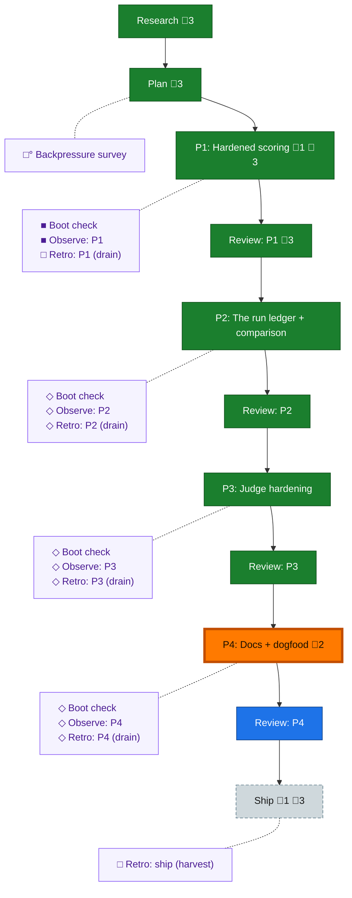

<!-- GENERATED by `harness flow render` — do not hand-edit; regenerate from the flow JSON. -->
# Flow · flow-eval-loop

**Kind**: flight-plan · **Now**: phase-4 · **Nodes**: 25 · **Events**: 93

**Rail**: ◆─◆─[ ◆─◆─◆─◆─◆─◆─◇─◇─◇ ]  ◆ Research · ◆ Plan · [ ◆ P1: Hardened scoring · ◆ Review: P1 · ◆ P2: The run ledger + comparison · ◆ Review: P2 · ◆ P3: Judge hardening · ◆ Review: P3 · ◇ P4: Docs + dogfood · ◇ Review: P4 · ◇ Ship ]

**Legend** — colour = type/status: 🟩 done · 🟢 in-progress · 🟥 blocked · 🟦 known · ⬜ assumed · 🔶 decision · 🗣 user input · 🟪 harness chore (faded = not yet done) · 🤖 companion · 🛠 worker · 🟧 current (you are here). Badges: 💬 comments · 📄 artifacts · 📝 instructions · 🧰 chore (° optional / recommended / ‼ strongly-recommended; ✓ done · ✕ skipped).

## Node log

### phase-1 · P1: Hardened scoring
- `2026-07-01T22:27:06.429Z` · — · decision — Task 1.0 added: eval-runner skill — thin pointer routing to /flow-pair (peer orchestration) + .harness/extensions/flow-eval/instructions.md; map-not-manual, iterated per real run. Enabler for every phase's loop-layer proof + 4.3.

### ship · Ship
- `2026-07-02T02:51:02.119Z` · — · warning — SHIP GATE (from P4a docs review): docs/how/evaluating-the-harness.md links N untracked targets. (1) .claude/skills/flow-eval-run/SKILL.md — ours, MUST be in the 046 commit. (2) 041 workshops 002-005 + research/ + experience-logs/003 — concurrent 041-session work; before/at ship confirm with the principal they're committed (same branch) or re-point those links. Verify every link target is tracked before PR.

### phase-4 · P4: Docs + dogfood
- `2026-07-02T04:26:03.698Z` · — · — — Task 4.5 added: fix round from dogfood run-1 (seed-tuple fidelity, null-axis render, judged re-render). Dispatching to flow-pair coder.
- `2026-07-02T05:21:15.258Z` · — · — — Task 4.6 added (drain follow-ups SUGG-003/SUGG-004/INS-001) and dispatched to coder pij-1t8xjkx. 4.4 capture half done (retro record 002); encode half rides 4.6. Cross-model comparison (4.3's board, AC-12) queued behind 4.6. Codex telemetry adapter deferred out of 046.
