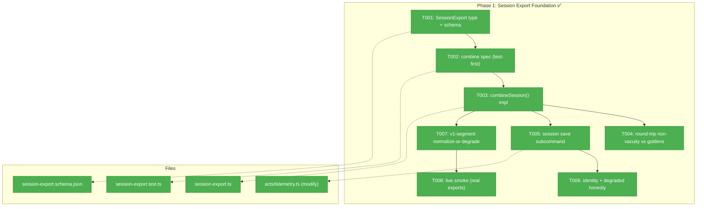
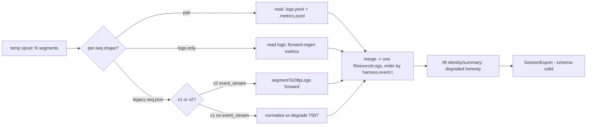
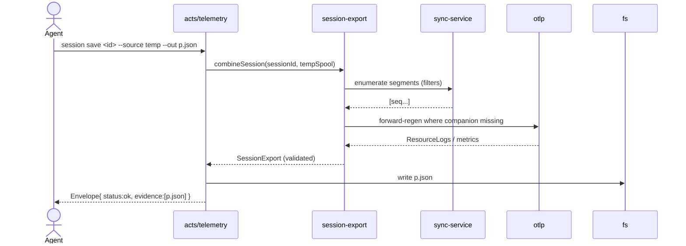

# Phase 1 — Session Export Foundation · Tasks & Context Brief

**Plan**: [`session-telemetry-dashboard-plan.md`](../../session-telemetry-dashboard-plan.md) · **Mode**: Full · **Phase Domain**: telemetry · **CS**: 4
**Depends on**: None (first phase) · **Feeds**: Phase 2 (reports consume `SessionExport`), plan 046 (`RunRecord.session_export` references a saved export by path)

---

## Executive Briefing

- **Purpose**: Turn a coding session's many scattered telemetry segments into **one** schema-valid `SessionExport` — a thin, validatable envelope wrapping combined OTel — from the live temp buffer. This is the foundation the report/render layer (P2) and the git-ref source (P3) build on.
- **What We're Building**: `session-export.ts` (the `combineSession()` algorithm + `SessionExport` builder), `session-export.schema.json` (the pinned, additive envelope schema), and the `harness telemetry session save <id> --source temp [--out] [--no-html]` subcommand wired into `acts/telemetry.ts`. HTML co-production is stubbed/deferred to P2 (the `N=1` render lives there); P1's `--no-html` path is the default until then.
- **Goals**:
  - ✅ One command → one `SessionExport` combining all of a session's segments into a single merged `ResourceLogs`, ordered by `harness.event.t`.
  - ✅ Combine **regenerates OTLP forward** (`segmentToOtlpLogs`/`rollupToOtlpMetrics`) when a `.logs.jsonl`/`.metrics.jsonl` companion is absent — **never inverts metrics** (they have no inverse; Logs are the substrate).
  - ✅ Tolerate the **three on-disk shapes** (pair / logs-only-partial / legacy `<seq>.json`) **and** both v2 (`event_stream`) and v1 (no `event_stream`) segments **without crashing**.
  - ✅ Honest degraded cells: subagent tokens `"unknown"` (never `0`), empty `plans_touched` tolerated.
  - ✅ Test-first for the load-bearing combine, with a **mutation / round-trip non-vacuity** case (flip pass→fail).
  - ✅ **Prove it live**: run the real command against ≥2 real sessions from the temp spool and inspect the actual artifact by eye (T008) — the phase is not done on green fixtures alone.
- **Non-Goals**:
  - ❌ No rollups / `TelemetryReport` / five-dimension aggregation — that's Phase 2.
  - ❌ No HTML renderer — the `N=1` render template is Phase 2 (task 2.6); P1 defaults to `--no-html`.
  - ❌ No git-ref read source — Phase 3 (`--source git-ref`).
  - ❌ No new telemetry capture, no widening the counts-only payload — read-only over the existing spool.

---

## Pre-Implementation Check

| File | Exists? | Domain | Create/Modify | Notes |
|------|---------|--------|---------------|-------|
| `harness/cli/src/services/telemetry/session-export.ts` | ❌ | telemetry | **create** | Combine + builder — net-new |
| `harness/cli/src/services/telemetry/session-export.schema.json` | ❌ | telemetry | **create** | Pinned envelope schema — net-new |
| `harness/cli/src/acts/telemetry.ts` | ✅ | telemetry | **modify** | Add `session save` subcommand; copy the existing `get` arg+flag+async pattern (`:33`, `:109-166`) |
| `harness/cli/src/services/telemetry/sync-service.ts` | ✅ | telemetry | read-only ref | Spool enumeration + filters (`:189`, `:204-209`) — reuse, don't duplicate |
| `harness/cli/src/services/telemetry/otlp/logs.ts` | ✅ | telemetry | read-only ref | `segmentToOtlpLogs` (`:292` fwd), `otlpLogsToEvents` (`:311` inverse) |
| `harness/cli/src/services/telemetry/otlp/metrics.ts` | ✅ | telemetry | read-only ref | `rollupToOtlpMetrics` (`:52`) — **forward-only, no inverse** |
| `harness/cli/src/services/telemetry/rollup.ts` | ✅ | telemetry | read-only ref | `computeRollup` (`:135`), `IDLE_CAP_S=300` — round-trip oracle (1.4) |
| `harness/cli/src/services/telemetry/segment.ts` | ✅ | telemetry | read-only ref | Segment shape; `event_stream` required at `:196-197` (the v1 crash seam) |
| `harness/cli/src/services/telemetry/session-evidence.ts` | ✅ | telemetry | read-only ref | PIJ/session-id join (`:91`) for identity lift (1.6) |
| `harness/cli/test/services/telemetry/session-export.test.ts` | ❌ | telemetry | **create** | Hybrid tests vs the real corpus + 038 goldens |
| `harness/cli/test/services/telemetry/fixtures/real/{claude,copilot-cli,copilot-vscode,cursor}/` | ✅ | telemetry | test oracle | Real, scrubbed corpus — the fixture source of truth (H-08) |

**Contract-change flags**: `session-export.schema.json` is a **new contract** (additive: `additionalProperties:true` + pinned `schema_version: harness.session-export/v1`). No existing contract is mutated. `acts/telemetry.ts` gains a subcommand but the Envelope shape is unchanged (P4).

---

## Architecture Map



---

## Tasks

| Status | ID | Task | Domain | Path(s) | Done When | Notes |
|--------|----|------|--------|---------|-----------|-------|
| [x] | T001 | Define `SessionExport` TS type + `session-export.schema.json` (additive: `additionalProperties:true` + pinned `schema_version: harness.session-export/v1`; `identity`/`source`/`summary`/`signals{logs,metrics}` per workshop 001) | telemetry | `src/services/telemetry/session-export.ts`, `src/services/telemetry/session-export.schema.json` | Schema validates a hand-built example; `npm run` typecheck passes | Plan 1.1 · Workshop 001 |
| [x] | T002 | **Test-first**: combine spec — enumerate the temp spool (reuse `sync-service.ts:189/204-209` filters), assert merged **one** `ResourceLogs` with `logRecords` ordered by `harness.event.t`, identity/summary lifted correctly | telemetry | `test/services/telemetry/session-export.test.ts` | A **failing** test exists over a real fixture session **before** T003 | Plan 1.2 · TDD · KF-05 |
| [x] | T003 | Implement `combineSession()`: prefer OTLP companions, else **regenerate forward** (`segmentToOtlpLogs`/`rollupToOtlpMetrics`); tolerate pair / logs-only-partial / legacy `<seq>.json`; never invert metrics | telemetry | `src/services/telemetry/session-export.ts` | T002 passes; a **mutation** (drop a `.logs.jsonl` companion) still combines via forward regen | Plan 1.3 · KF-02/KF-05 |
| [x] | T004 | Round-trip **non-vacuity** test vs 038 goldens: reconstructed logs `toEqual` stored, and `computeRollup(reconstruction)` equals the stored rollup | telemetry | `test/services/telemetry/session-export.test.ts` | Test flips to **FAIL** under a deliberate field mutation (proves it's non-vacuous) | Plan 1.4 · H-08, F-05 |
| [x] | T005 | Add `session save` subcommand to `acts/telemetry.ts` (copy the `get` arg+flag+async pattern `:33`,`:109-166`); `--source temp`; write `.session.json`; emit stable Envelope + `evidence[]` path; `--no-html` default in P1 | telemetry | `src/acts/telemetry.ts` | `harness telemetry session save <id> --source temp --out p.json` writes a schema-valid file; JSON-mode Envelope ok | Plan 1.5 · F-01, AC-01 |
| [x] | T006 | Identity + degraded honesty: lift `harness_session_id`/`harness`/`models`/`captured_env.PIJ_SESSION_ID`; subagent tokens serialise `"unknown"` not `0`; empty `plans_touched` tolerated; out-of-repo paths as basenames | telemetry | `src/services/telemetry/session-export.ts`, test | A fixture with null subagent tokens serialises `"unknown"`; empty `plans_touched` doesn't throw | Plan 1.6 · KF-08, F-08, AC-10 |
| [x] | T007 | **v1-segment handling**: a v1 `<seq>.json` has **no `event_stream`** → `segmentToOtlpLogs` would throw (`segment.ts:196-197`). Normalize a minimal `event_stream`/`rollup` from the flat `skills`/`tools`/tokens view, **or** skip-with-degraded; record the version in `summary.segment_schema_versions` | telemetry | `src/services/telemetry/session-export.ts`, test | A v1 (1.0/1.1) fixture combines **without throwing**; `segment_schema_versions` lists it; a v2-only-assumption test flips to **FAIL** on the v1 input | Plan 1.7 · F-02 critic finding · Workshop 001 L63 |
| [x] | T008 | **Live smoke export (real data, eyeballed — not a fixture test)**: after build, run the real `harness telemetry session save <id> --source temp --out <p>` against ≥2 **live** sessions from `.harness/temp/telemetry/` (a large one — this session `15eaa924…`, 191 segments — and a small/edge one). **Inspect the actual artifact by eye**: schema-validate it, then sanity-check counts are plausible, identity/session-id present, `segment_schema_versions` reflects reality, degraded cells show `"unknown"`/empty (not `0`/crash), no `/Users/…` or person-name leak. Record findings + any real-data gaps in the execution log. | telemetry | `.harness/temp/telemetry/*` (read), scratch out-path | The command produces a schema-valid file over ≥2 real sessions; a human-readable inspection note in `execution.log.md` confirms counts sane + identity present + degraded honest; any surprise vs the fixtures is logged | **Runtime proof, not inference** (harness ethos) — closes the "green tests ≠ real export works" gap |

**Status legend**: `[ ]` pending · `[~]` in progress · `[x]` complete · `[!]` blocked

**Suggested order**: T001 → T002 → T003 (unblocks the rest) → then T004 / T005→T006 / T007 in parallel-safe order. TDD tasks (T002, T004, T007's failing assertion) precede their impl. **T008 runs last** — it is the live-fire acceptance beat over real spool data once the command exists, and it is a **hard done-when for the phase** (a phase is not "done" on green fixtures alone; the real export must be produced and inspected).

> **Test strategy note (why T008 exists)**: the plan's Testing Strategy is Hybrid — TDD for the combine/rollup transforms (T002/T004/T007) **plus** lightweight real-output validation for the command. T008 makes the second half concrete and non-optional: Phase 1 proves the export by *running it against live sessions and reading the result*, not by inferring correctness from fixtures. Fixtures catch regressions; the live smoke catches the things fixtures were built too clean to contain (real degraded cells, real v1 segments, real identity shapes).

---

## Context Brief

### Key findings from plan (Phase-1 relevant)

- **KF-02 (High)** — `rollupToOtlpMetrics` has **no inverse**; Logs are the lossless substrate. → Combine regenerates **both** signals **forward** from `<seq>.json`; **never** inverts metrics. Load-bearing for T003.
- **KF-05 (High)** — Three on-disk shapes per seq (pair / logs-only-partial / legacy `<seq>.json`); tolerate all three. → T003 branches on shape.
- **KF-08 (High)** — Real-data degraded cells are permanent (not bugs): subagent tokens null, `plans_touched` empty, out-of-repo basenames. → T006 renders them honestly (`"unknown"`, empty, basename).
- **F-01** — `session save` copies the existing `get` subcommand's arg+flag+async pattern in `acts/telemetry.ts` (`:33`, `:109-166`); mounted in `app.ts:270`. → T005.
- **F-02 (critic)** — v1 segments lack `event_stream`; `segmentToOtlpLogs` maps it unguarded (`logs.ts:302`) → throws. → T007 normalizes-or-degrades first.

### Domain dependencies (consumed, read-only — never modified in P1)

- `telemetry/otlp/logs.ts`: `segmentToOtlpLogs()` (forward, `:292`) + `otlpLogsToEvents()` (inverse, `:311`) — combine's forward-regen + the round-trip oracle.
- `telemetry/otlp/metrics.ts`: `rollupToOtlpMetrics()` (`:52`) — **forward-only**; combine calls it, never seeks an inverse.
- `telemetry/rollup.ts`: `computeRollup()` (`:135`, `IDLE_CAP_S=300`) — the round-trip equality oracle in T004 (recompute over reconstruction == stored rollup).
- `telemetry/sync-service.ts`: spool enumeration + filters (`:189`, `:204-209`) — the temp-source segment list; reuse, don't re-derive.
- `telemetry/segment.ts`: segment shape + `event_stream` requirement (`:196-197`) — the exact v1 crash seam T007 guards.
- `telemetry/session-evidence.ts`: session-id/PIJ join (`:91`) — identity lift in T006.

### Domain constraints

- **Ports & Adapters (P2)**: `session-export.ts` is a **service** — it may import the OTLP transforms and `computeRollup` (sibling telemetry pure functions) but **MUST NOT** import `node:fs`/`child_process`/git directly. Spool reads come through the existing fs seam that `sync-service` already uses; inject a `FakeFs` in tests.
- **P3 (fakes over mocks)**: `MUST NOT` use `vi.mock`/`vi.spyOn`. Test against the **real** corpus + 038 goldens; inject fakes for I/O.
- **P4 (stable Envelope)**: `session save` emits the standard Envelope with `evidence[]`; do not invent a new output shape.
- **Additive schema**: `session-export.schema.json` pins `schema_version` and sets `additionalProperties:true` so a future consumer (P2 report, plan 046 `RunRecord`) never breaks on new fields.

### Reusable from prior phases

- None (Phase 1 is first). Downstream: the `SessionExport` shape T001 locks is the contract Phase 2's `report.ts` and plan 046's `RunRecord.session_export` consume — keep it minimal and pinned.

### Mermaid flow diagram (combine pipeline)



### Mermaid sequence diagram (session save)



---

## Discoveries & Learnings

_Populated during implementation by the implement verb._

| Date | Task | Type | Discovery | Resolution | References |
|------|------|------|-----------|------------|------------|

**Types**: `gotcha` · `research-needed` · `unexpected-behavior` · `workaround` · `decision` · `debt` · `insight`

---

## Directory layout

```
docs/plans/047-session-telemetry-dashboard/
  ├── session-telemetry-dashboard-plan.md
  └── tasks/phase-1-session-export-foundation/
      ├── tasks.md            # this file
      └── execution.log.md    # created by the implement verb
```
