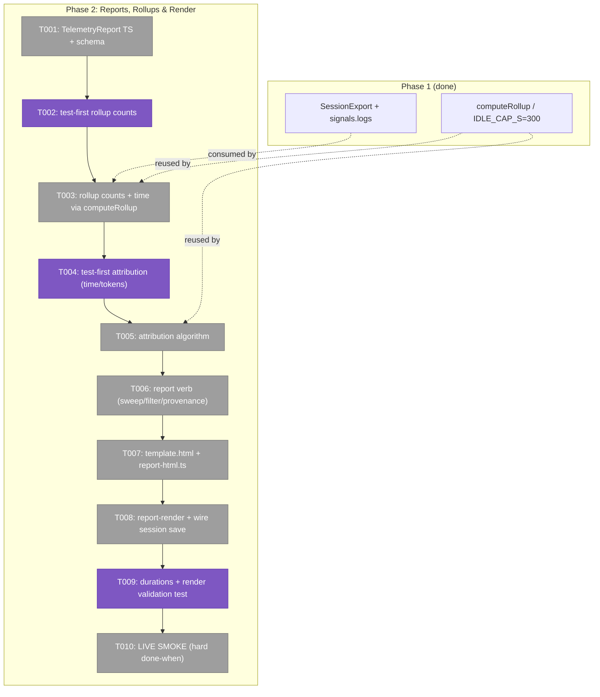
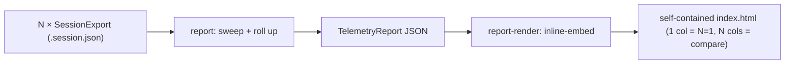
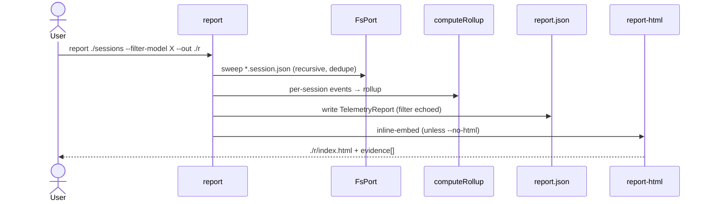

# Phase 2: Reports, Rollups & Render — Tasks

**Plan**: [session-telemetry-dashboard-plan.md](../../session-telemetry-dashboard-plan.md) · **Phase**: 2 of 3 · **Domain**: `telemetry` · **Depends on**: Phase 1 (done)
**Workshops**: [002 report model](../../workshops/002-report-model-rollups-and-html.md) · [003 report CLI](../../workshops/003-report-cli-surface.md)

---

## Executive Briefing

- **Purpose**: Roll up **1..N** saved `SessionExport` files into one validatable `TelemetryReport` and render it — and side-by-side comparisons — as **self-contained** HTML that opens under `file://` with zero number-crunching in the view. This is the "where did the time and tokens go?" layer on top of Phase 1's raw combined-OTel envelope.
- **What we're building**: `report.ts` (+ `report.schema.json`), the five rollup dimensions (incl. the ⭐ prominent `harness_command`), the per-dimension time/token **attribution** algorithm, the `harness telemetry report <paths…>` and `report-render <folder>` verbs, and the pre-authored inline-embed `template.html` + `report-html.ts` — wired so `session save` co-produces its N=1 HTML from the **same** renderer.
- **Goals**:
  - ✅ One stable `TelemetryReport` shape — same row shape (`{key,count,time_s,tokens}`) across every dimension; `scope.single` is the only N=1 vs N>1 difference.
  - ✅ Counts **exact**; time/tokens **estimated with a declared `attribution` method** — honest, never falsely precise.
  - ✅ Rollups reuse `computeRollup` (`IDLE_CAP_S=300`); cross-session **re-aggregates from OTLP Logs**, never sums per-session cumulative metrics.
  - ✅ HTML is **inline-embed at render** (no `fetch`, no server, no build); a folder with N `*.report.json` renders N labelled columns.
  - ✅ **Live smoke** (T010): the real verbs run against ≥2 live sessions and the HTML is eyeballed — runtime proof, not just green fixtures.
- **Non-Goals**:
  - ❌ Git-ref source / central storage layout / `docs/how` — **Phase 3** (`--source git-ref` stays the honest "Phase 3" stub from P1).
  - ❌ Quality scoring / eval `RunRecord` — that's plan 046; a report is telemetry insight, not a scored verdict (workshop 002 boundary).
  - ❌ Refined multi-tool token split (workshop 002 Q1) — v1 is even-split, declared in-band; refine later without a schema break.
  - ❌ DORA/engineering-metrics correlation — noted out-of-scope; keep dimension keys stable + attribution declared so that future consumer stays possible.

---

## Prior Phase Context (Phase 1 — Session Export Foundation, done)

**A. Deliverables Phase 2 builds on**
- `harness/cli/src/services/telemetry/session-export.ts` — `combineSession()` + `SessionExport` builder + `normalizeV1ToEvents()`.
- `session-export.schema.json` — pinned additive envelope; `harness telemetry session save <id> --source temp [--out] [--no-html]` in `acts/telemetry.ts` (mounted `app.ts:270`).

**B. Dependencies exported (consume these — do not re-derive)**
- `SESSION_EXPORT_SCHEMA_VERSION = 'harness.session-export/v1'`; `interface SessionExport { schema_version; identity; source; summary; signals }`.
- `SessionExportIdentity { harness_session_id; harness; harness_version|null; pij_session_id|null; branch|null; models[] }` — the **provenance/filter facets** the report groups by.
- `SessionExportSource { kind:'temp'|'git-ref'; root; segment_count }`; `SessionExportSummary { segment_schema_versions; first_timecode|null; last_timecode|null; tokens; degraded[] }`.
- `SessionExportTokens { in; out; cache_read; cache_create; total; subagent_tokens: number|'unknown'; grand_total: number|'unknown' }`.
- `SessionExportSignals { logs; metrics }` — **OTLP Logs are the lossless substrate the report re-aggregates from** (KF-02/KF-03).
- Reused transforms (all **read-only, forward-only, never modified**): `otlpLogsToEvents` (`otlp/logs.ts` — logs → `Event[]`), `computeRollup`/`parseIso`/`IDLE_CAP_S` (`rollup.ts:135`), `Event` type (`events.ts`), `Segment` (`segment.ts`).

**C. Gotchas & debt to honor**
- **Degraded honesty**: `subagent_tokens`/`grand_total` are `number | 'unknown'` — the report's token math and the HTML MUST treat `'unknown'` as a first-class value (render "unknown", exclude from sums honestly), never coerce to 0.
- **v1 segments have synthetic timelines**: `normalizeV1ToEvents` stamps events at the segment `timecode` → durations 0, wall≈0 for a v1-only session (`degraded:['v1_segments']`). Cross-session time attribution must tolerate zero-duration contributors without dividing by zero.
- **Never invert / never sum cumulative metrics** (KF-02/KF-03): re-aggregate cross-session **from Logs → Events → `computeRollup`**, per session then combine.
- **`bash_commands`/`harness_commands` flat arrays were dropped in v2** (KF-09): `harness_command` rows come from the segment **`command` field** (authoritative count, `segment.ts:432`) / `fold` `harness_verbs`; `bash_command` rows are parsed from `event_stream` Bash tool events, keyed by the **first argv token**, **excluding `harness …`** (never double-count).

**D. Incomplete (Phase 2 owns)**: no `TelemetryReport`/rollups/render exist yet; `--no-html` is accepted but **inert** in P1 — T008 makes it real.

**E. Patterns to follow**: fakes over mocks (`FakeFs`/`FakeEnv`/`FakeProcess`, **no `vi.mock`/`vi.spyOn`** on business logic); test against the **real scrubbed corpus** `test/services/telemetry/fixtures/real/{claude,copilot-cli,copilot-vscode,cursor}/` + 038 goldens; **non-vacuity** (every equality/round-trip test flips to FAIL under a deliberate mutation; test-before-impl); **port-import discipline (P2)** — `report.ts`/`report-html.ts` are services: import ports **type-only**, no `node:fs`/`child_process`/git; **stable Envelope + `evidence[]` (P4)**; **additive schema** (`additionalProperties:true` + pinned `const schema_version`).

---

## Pre-Implementation Check

| File | Exists? | Domain | Notes |
|------|---------|--------|-------|
| `harness/cli/src/services/telemetry/report.ts` | **create** | telemetry | Rollups + `TelemetryReport` builder; reuses `computeRollup` |
| `harness/cli/src/services/telemetry/report.schema.json` | **create** | telemetry | Additive report schema (workshop 002 §JSON Schema) |
| `harness/cli/src/services/telemetry/render/report-html.ts` | **create** (new `render/` dir) | telemetry | Inline-embed: report JSON(s) → self-contained HTML |
| `harness/cli/src/services/telemetry/render/template.html` | **create** | telemetry | Pre-authored static template (frontend-design skill) |
| `harness/cli/src/acts/telemetry.ts` | **modify** | telemetry | Add `report` + `report-render`; wire N=1 HTML into `session save` (currently `:170-` `session`/`save`) |
| `harness/cli/test/services/telemetry/report.test.ts` | **create** | telemetry | Rollup/attribution specs vs real fixtures (non-vacuity) |
| `harness/cli/test/services/telemetry/report-html.test.ts` | **create** | telemetry | Render validation: inline data + column count |
| `harness/cli/test/acts/telemetry.test.ts` | **modify** | telemetry | Act-level `report`/`report-render` Envelope + evidence + wiring |

**Duplication scan**: no `report*`/`render/` under `services/telemetry/` (confirmed — dir listing). `computeRollup` is the **only** rollup engine — do NOT re-implement `gen.py` (reference-only; divergent 1200s idle cap). Reference template to generalise: `scratch/old/session-view/{session-overview.html,gen.py:635 (inline `<script type="application/json">`),session.json}`.
**Contract-change flag** (higher risk): `acts/telemetry.ts` gains two verbs + `session save` starts co-producing HTML — keep the P1 Envelope/`evidence[]` shape stable; `--no-html` must now actually suppress.

---

## Architecture Map



---

## Tasks

| Status | ID | Task | Domain | Path(s) | Done When | Notes |
|--------|-----|------|--------|---------|-----------|-------|
| [ ] | T001 | Define `TelemetryReport` TS + `report.schema.json`: five rollups (`flow_stage`/`skill`/`tool`/`bash_command`/`harness_command`), `RollupEntry {key,count,time_s,tokens:{output,total}}`, `scope{session_count,single,session_ids}`, `filter`, `totals`, `attribution`, `provenance`. Pin `schema_version:'harness.telemetry-report/v1'` const; `additionalProperties:true` | telemetry | `services/telemetry/report.ts`, `services/telemetry/report.schema.json` | Schema validates a hand-built example report; typecheck passes; `schema_version` pinned; every dimension shares the `Rollup` sub-schema | Workshop 002 §data structure; additive contract (KF forward-compat) |
| [ ] | T002 | **Test-first**: rollup **counts** spec over a **real multi-segment fixture** — counts exact across all 5 dimensions; `harness_command` from segment `command`/`fold` `harness_verbs`; `bash_command` from `event_stream` Bash events keyed by first argv token, **excluding `harness …`**; assert no double-count | telemetry | `test/services/telemetry/report.test.ts` | A **failing** test exists over a real fixture (`fixtures/real/**`) **before** T003; asserts exact per-dimension counts | TDD, KF-09; fakes-over-mocks; test-before-impl |
| [ ] | T003 | Implement rollup **counts** + `flow_stage` **wall-time** + session `totals` from `computeRollup` (`IDLE_CAP_S=300`); **one shape** for single & many (`scope.single` flag only); **cross-session re-aggregates from `signals.logs` → `otlpLogsToEvents` → `computeRollup`** per session, then combines — never sums cumulative metrics | telemetry | `services/telemetry/report.ts` | T002 passes; an **N>1** fixture sums `rg` rows from every session into one entry; a **mutation** (drop a session / bump a count) flips a count assertion | KF-02/KF-03; AC-03/AC-04; workshop 002 §single-vs-many |
| [ ] | T004 | **Test-first**: per-dimension **time/token attribution** — turn-window **even-split** for tokens (a turn's tokens → the dimension(s) active in its window; multi-tool turn splits evenly, v1), **timeline-bracket** for time; populate `RollupEntry.time_s`/`tokens`. Emit `attribution:{tokens:'turn-window-even-split',time:'timeline-bracket',exact:['count']}` | telemetry | `test/services/telemetry/report.test.ts` | A **failing** test exists **before** T005; a **mutated-fixture** case flips a `time_s`/`tokens` value (not just a count) — proves the attribution math is non-vacuous | F-01 critic finding; AC-04; workshop 002 §attribution; `computeRollup` does **not** provide per-dimension attribution |
| [ ] | T005 | Implement the attribution algorithm feeding `RollupEntry.time_s`/`tokens` for skill/tool/bash/harness dimensions; **also populate `flow_stage.tokens`** — a turn's tokens attribute to the `flow_stage` window active in that turn (workshop 002 §attribution: "tokens for a turn … during the `implement` stage window → `flow_stage: implement`"), so every dimension carries tokens per the T001 shape; tolerate **zero-duration** (v1) and **`'unknown'` subagent tokens** without dividing by zero or coercing to 0 | telemetry | `services/telemetry/report.ts` | T004 passes; `flow_stage` entries carry non-null `tokens` on a token-bearing fixture; totals reconcile (Σ entry.tokens ≤ report.totals within the declared estimate); v1-only session yields honest ~0 time without crash | KF-08 degraded honesty; workshop 002 §attribution (stage-window token bracket; even-split is v1, Q1) |
| [ ] | T006 | `report` subcommand: recursive `<paths…>` sweep of `*.session.json` (union+dedupe by `harness_session_id`); `--filter-harness/-model/-branch/-repo`, `--from/--to`, `--sort tokens\|time\|count`, `--top <N>` (records `rollup.truncated`, never silent), `--out`, `--name`, `--no-html`; echo chosen facets into `report.filter`; provenance footer | telemetry | `acts/telemetry.ts` | `report ./sessions --filter-model X --out ./r --no-html` writes `<name>.report.json` containing only matching sessions; `truncated` surfaced when `--top` caps; stable Envelope + `evidence[]` | AC-05; workshop 003 verb table; mirror `session save` arg/flag/async pattern (`acts/telemetry.ts:174`) |
| [ ] | T007 | Author static `template.html` (**frontend-design** skill — generalise `scratch/old/session-view/session-overview.html`) + `report-html.ts`: **inline-embed** each report JSON as `<script type="application/json">` (gen.py:635 pattern, **no `fetch`**); N reports in a folder → N columns labelled by each `report.filter`/`--name`; `harness_command` ⭐ in its own prominent panel; provenance footer always | telemetry | `services/telemetry/render/template.html`, `services/telemetry/render/report-html.ts` | Generated `index.html` opens under `file://`, shows the columns + all five panels, embeds the data inline, issues **no** network request | KF-04; AC-06; workshop 002 §HTML render; P2 (report-html is a service — ports type-only) |
| [ ] | T008 | `report-render <folder>` (copies the shipped template into `<folder>` as `index.html`, embeds the folder's `*.report.json`, **no data regen**) **and** wire co-produced HTML into `session save` + `report` (default-on, `--no-html` suppresses). **`session save`'s view = the N=1 `report` render** (same `report-html.ts`, no second renderer); both file paths in `evidence[]` | telemetry | `acts/telemetry.ts`, `services/telemetry/render/report-html.ts` | `report-render ./compare` renders that folder's reports to columns; `session save <id>` writes a 1-column HTML beside the `.session.json`; `--no-html` suppresses on **both** paths; `evidence[]` lists json + html | AC-07; F-03; makes P1's inert `--no-html` real |
| [ ] | T009 | Human-friendly durations in the view (`1.3 days` / `4.2h` / `28m` from `time_s`) + a **lightweight render-validation test**: a 2-report folder renders **2 columns** with **inline embedded data** and the right dimension keys aligned | telemetry | `services/telemetry/render/report-html.ts`, `test/services/telemetry/report-html.test.ts` | Render of a 2-report folder has 2 columns + embedded `<script type="application/json">` blocks; durations render human-friendly | Hybrid-light; workshop 002 (durations from `time_s`) |
| [ ] | T010 | **LIVE SMOKE (verification-only — beyond plan rows 2.1–2.8; principal-directed via retro INS-001; hard done-when, runtime proof not fixtures)**: run the **real** `report` on ≥2 live sessions from `.harness/temp/telemetry/` (via `session save` → `report`) for both **N=1** and **N>1**, then `report-render`; **open the HTML** and eyeball totals, the `harness_command` ⭐ panel, per-dimension rows, provenance footer, `scope.single`, and degraded `'unknown'`/v1 cells; **byte-scan the emitted HTML/JSON for `/Users/`, home paths, and names (must be clean, P12)**. Record findings in the execution log | telemetry | (no source change — real artifacts to scratchpad, never the repo) | ≥2 live sessions produce a schema-valid report + a self-contained HTML that renders correctly under `file://`; N>1 aggregates; no path/name leak; findings logged | INS-001 / retro DL; the principal's "actual exports and check them, not just TDD" bar |

- `Status`: `[ ]` pending · `[~]` in progress · `[x]` complete · `[!]` blocked

---

## Context Brief

**Key findings from plan (applied here)**:
- **KF-02/KF-03** (T003/T005): reuse `computeRollup`; re-aggregate cross-session **from Logs**, never invert or sum cumulative metrics.
- **KF-04** (T007): HTML must **inline-embed** — `file://` CORS blocks `fetch`.
- **KF-08** (T005/T010): degraded cells (`subagent_tokens`/`grand_total` = `'unknown'`, empty `plans_touched`, v1 zero-time) render honestly.
- **KF-09** (T002/T003): `harness_command` from segment `command`/`fold`; `bash_command` from `event_stream`; the flat v2 arrays are gone.

**Domain dependencies (consumed from Phase 1 / frozen transforms)**:
- `telemetry`: `SessionExport` + `signals.logs` — the per-session input a report rolls up.
- `telemetry`: `otlpLogsToEvents` (`otlp/logs.ts`) — logs → `Event[]`, the re-aggregation substrate.
- `telemetry`: `computeRollup`/`IDLE_CAP_S`/`parseIso` (`rollup.ts:135`) — the **only** time/idle engine.
- `telemetry`: `Event` (`events.ts`), `Segment.command` (`segment.ts:432`) — dimension sources.

**Domain constraints**:
- `report.ts` / `report-html.ts` are **services** — import ports **type-only**; no `node:fs`/`child_process`/git; all I/O via injected `Pick<FsPort,…>` (mirror `CombineSessionDeps`).
- Additive schema only — `additionalProperties:true`, pinned `const schema_version`; a new dimension is a new key, never a breaking change.
- Read-only inputs; all work on `feat/041-flow-conformance-eval`; **never modify git**.

**Reusable from Phase 1**:
- `FakeFs`/`FakeEnv`/`FakeProcess`, `serializeSegment`, the real scrubbed corpus `test/services/telemetry/fixtures/real/**`, 038 goldens, the non-vacuity mutation pattern (`test/services/telemetry/session-export.test.ts`).
- The `acts/telemetry.ts` `session save` arg/flag/async + Envelope/`evidence[]` wiring — copy it for `report`/`report-render`.

**Report pipeline (workshop 002 §pipeline)**:


**Actor sequence (report + render)**:


---

## Discoveries & Learnings

_Populated during implementation by the implement verb._

| Date | Task | Type | Discovery | Resolution | References |
|------|------|------|-----------|------------|------------|

**Types**: `gotcha` · `research-needed` · `unexpected-behavior` · `workaround` · `decision` · `debt` · `insight`

---

## Directory layout

```
docs/plans/047-session-telemetry-dashboard/
  ├── session-telemetry-dashboard-plan.md
  └── tasks/phase-2-reports-rollups-render/
      ├── tasks.md
      └── execution.log.md   # created by the implement verb
```

**STOP** — no code changes yet. Dossier ready; awaiting human **GO** to implement.
