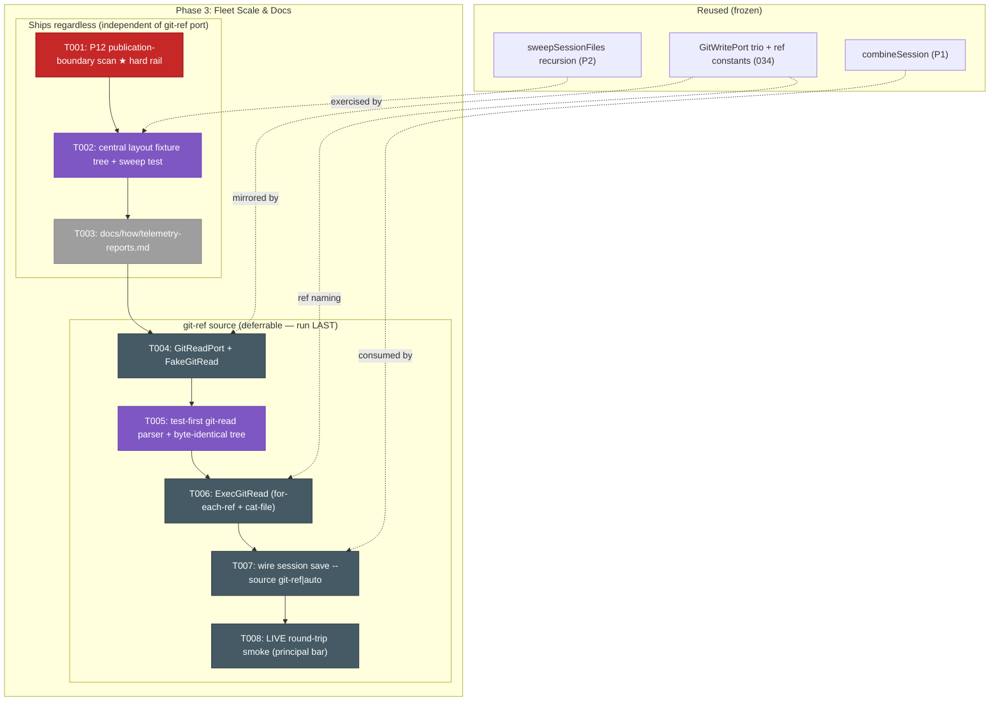
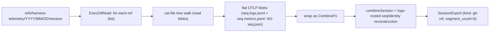
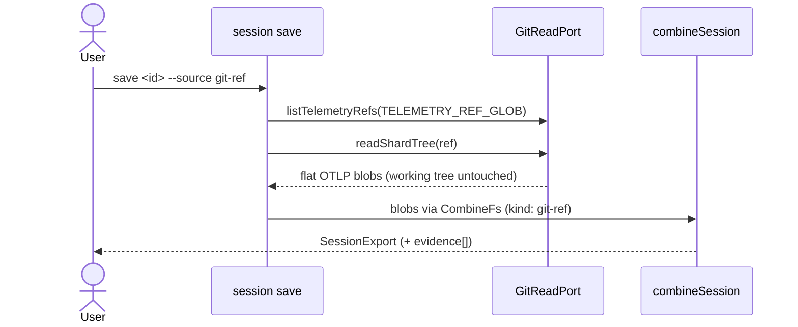

# Phase 3: Fleet Scale & Docs — Tasks

**Plan**: [session-telemetry-dashboard-plan.md](../../session-telemetry-dashboard-plan.md) · **Phase**: 3 of 3 · **Domain**: `telemetry` / `_adapters` · **Depends on**: Phase 1 (done) · Phase 2 (done)
**Workshops**: [004 central storage layout](../../workshops/004-central-session-storage-layout.md) · [001 session export](../../workshops/001-session-export-envelope.md)

---

## Executive Briefing

- **Purpose**: Close the pipeline at **fleet scale** — read committed telemetry shards **read-only** from git (`--source git-ref`), lay out the **central storage tree** so org/repo roll-ups are just a recursive sweep, and **document** the whole export→report→render pipeline in `docs/how`. This is the "many machines, many repos, one central store" layer on top of P1's per-session envelope and P2's cross-session report.
- **What we're building**: a read-only `GitReadPort` (`listTelemetryRefs` + `readShardTree`) + its `ExecGitRead` adapter (`for-each-ref` + `cat-file` tree walk) + a recording `FakeGitRead`; the `session save --source git-ref|auto` wiring that feeds committed shard bytes through the **same** `combineSession`; the `<root>/<repo>/<YYYY-MM-DD>/<format>/<leaf>` central-layout convention + a sweep-granularity test; and `docs/how/telemetry-reports.md`.
- **Goals**:
  - ✅ `session save --source git-ref <id>` yields the **same** `SessionExport` shape as `--source temp` — over committed shards, **never touching the working tree** (`git status --porcelain` byte-identical).
  - ✅ The read port is **read-only by construction** — `for-each-ref` + `cat-file` only; no write/fetch/checkout; mirrors the `GitWritePort` trio's shape.
  - ✅ The central layout is documented + **proven by a sweep test** at session / repo / org granularity (reuses the existing `sweepSessionFiles` recursion).
  - ✅ `docs/how/telemetry-reports.md` documents the three verbs, the JSON shapes, and the central layout — filename dodges the `*.log` gitignore trap; no real paths/ids/names.
  - ✅ **Privacy hard rail (AC-11, Constitution P12)**: a publication-boundary scan proves no `/Users/`, session-id, or person-name leak in any tracked 047 artifact, and no `user.email` is ever read — **this ships regardless of the git-ref deferral**.
  - ✅ **Live round-trip smoke** (principal's standing bar, retro INS-001): a *real* commit→read-back proves the read path at runtime, not just via fakes.
- **Non-Goals**:
  - ❌ Collection-job orchestration / transport — how shards ship to `<central-root>` is ops (workshop 004 Q1, plan Non-Goals). We define the **filesystem contract**, not the mover.
  - ❌ `report --from-git-ref` (sweeping refs directly) — deferred (003 Q2); `report` still sweeps saved `*.session.json`. The git read path lands only under `session save`.
  - ❌ New telemetry capture or any widening of the counts-only payload — read-only over existing spool/refs.
  - ❌ Repo-granular `filter.repo` **application** — P2 echoes it; wiring real narrowing needs a repo facet on `SessionExport` (out of scope; the central tree keys by repo path instead).

---

## Prior Phase Context

### Phase 1 — Session Export Foundation (done)

**A. Deliverables Phase 3 builds on**
- `harness/cli/src/services/telemetry/session-export.ts` — `combineSession()` + the `SessionExport` type family + `normalizeV1ToEvents()`. **The reuse seam for the git-ref source.**
- `session-export.schema.json` (pinned `harness.session-export/v1`, additive); `harness telemetry session save <id> --source temp` in `acts/telemetry.ts`.

**B. Dependencies exported (consume — do not re-derive)**
- `combineSession(sessionId, deps: CombineSessionDeps, opts?: CombineSessionOpts): SessionExport` (`session-export.ts:272`). It does **not** take a segment list — it enumerates the buffer itself through injected I/O.
- `CombineSessionDeps = { fs: CombineFs; proc: Pick<ProcessPort,'cwd'>; env?: Pick<EnvPort,'home'> }`; `CombineFs = Pick<FsPort,'readText'|'readdir'>` — **the injection seam a git-ref source reuses.** `CombineSessionOpts = { root?: string }` overrides the buffer root.
- `SessionExportSource { kind:'temp'|'git-ref'; root; segment_count }` — **the `'git-ref'` enum value already exists** (`session-export.ts:43`).

**C. Gotchas & debt to honor**
- `combineSession` **hardcodes `source.kind:'temp'`** (`session-export.ts:327`) and resolves paths via `telemetryDir` on a local root. The git-ref source must **parameterize `kind`** + feed shard bytes through the existing `CombineFs` shape.
- ⚠️ **Committed-shard shape ≠ temp-buffer shape — the load-bearing git-ref gap.** `combineSession`'s segment discovery is anchored to `/^(\d+)\.json$/` (`readSessionSeqs`, `session-export.ts:173-178`) and it reads `.logs.jsonl` **only as a companion keyed off a discovered `<seq>.json`** (`:189`); identity is lifted from the **Segment json** (`buildIdentity:203-207`). But the **canonical committed shard omits the json** — `sync-service.ts:258-267` publishes `<seq>.logs.jsonl` + `<seq>.metrics.jsonl` when both OTLP signals are present and only falls back to `<seq>.json` when the pair is incomplete (the json "stays LOCAL as the reconstruction oracle", `:247-250`). So a `CombineFs` wrapping a normal committed shard discovers **zero** seqs → `segment_count:0` → empty export, and carries **no identity**. **The git-ref source therefore needs combine to reconstruct a segment + identity from the OTLP logs blob directly** (`otlpLogsToEvents` for events; `harness.*` resource attributes for identity) when no `<seq>.json` is present — this is real net-new combine work, not a byte-passthrough. Metrics companions are never read back (forward-regen only; KF-02).
- Degraded `'unknown'` tokens + v1 fabricated-flat timelines already flow through; a git-ref session inherits the same honesty.

**D. Incomplete → Phase 3 owns**: `--source git-ref` (hard-rejected today), source-agnostic combine root/`kind`.

**E. Patterns**: fakes-over-mocks (no `vi.mock`/`vi.spyOn`); real corpus `test/services/telemetry/fixtures/real/{claude,copilot-cli,copilot-vscode,cursor}/`; non-vacuity mutation (assert `toEqual` **and** flip a field → `not.toEqual`); **port type-only imports** (no `node:*`/git in services); buffer never mutated, corrupt seq skipped not fatal.

### Phase 2 — Reports, Rollups & Render (done)

**A. Deliverables**: `report.ts` (`buildReport`, `TelemetryReport`, five rollups), `render/report-html.ts` (`renderReports`, inline-embed), `render/template.{html,ts}` (D3 drift-guarded twin), `report.schema.json`; `report` + `report-render` subcommands + `session save` co-produced HTML.

**B. Dependencies exported / patterns to mirror**
- Act arg/flag/async pattern (`acts/telemetry.ts`): Commander `.command().argument().option()`; the **action** does the fs sweep + path sanitation + clock injection, then calls the **pure** service. `session save`/`report` actions are **synchronous**; `get` is `async`.
- **Envelope + `evidence[]`**: `formatOk('telemetry', data, deps.clock, { evidence, next_action })` / `formatError(...)` → `exitWithEnvelope(envelope, port)` (`acts:456-487`); `evidence[]` = `{label,path}[]` accumulated as artifacts are written.
- Ports via `TelemetryActDeps` (`acts:24-31`): `{ fs, proc, clock, env, gitWrite }` — **Phase 3 adds `gitRead: GitReadPort`** here.

**C. Gotchas & debt**
- **P12 `sanitizeInputPath`** (`acts:112-120`): abs-under-cwd → `./rel`, else basename — applied to `sourcePaths` **and** each `filter.repo` value. Any new committed/publishable path in Phase 3 must pass through the same sanitizer.
- Attribution is **declared estimate** (`timeline-bracket` time, `turn-window-even-split` tokens); counts EXACT. Reports re-aggregate from Logs, never sum cumulative metrics.
- Central storage + git-ref explicitly deferred here (P2 execution log D1/D2; `filter.repo` echo-only comment cites "Phase 3 / workshop 004").

**D. Incomplete → Phase 3 owns**: `--source git-ref`, central storage layout, `docs/how` page.

**E. Patterns**: service port-discipline (`report.ts`/`report-html.ts` pure); inline-embed HTML (no fetch, `file://`-safe); additive schema (`additionalProperties:true` + pinned `const`); real-fixture + live-smoke tests.

---

## Pre-Implementation Check

| File | Exists? | Domain | Notes |
|------|---------|--------|-------|
| `harness/cli/src/adapters/git/git-read-port.ts` | **create** | _adapters | `GitReadPort` interface — mirror `git-write-port.ts:83-114` idiom (narrow JSDoc'd verbs) |
| `harness/cli/src/adapters/git/exec-git-read.ts` | **create** | _adapters | `ExecGitRead` — mirror `exec-git-write.ts:25-39` (`spawnSync('git',…)`, `status!==0` guard); `for-each-ref` + `cat-file` |
| `harness/cli/src/adapters/git/fake-git-read.ts` | **create** | _adapters | `FakeGitRead` recording fake — mirror `fake-git-write.ts:23-55` (`calls:string[]`, `seedRefs` in-memory tree) |
| `harness/cli/src/services/telemetry/session-export.ts` | **modify** | telemetry | Parameterize `source.kind` (`:327`) + root so combine is source-agnostic; feed shard bytes via `CombineFs` |
| `harness/cli/src/acts/telemetry.ts` | **modify** | telemetry | Replace `--source` stub (`:380-403`); add `gitRead` to `TelemetryActDeps` (`:24-31`); wire `git-ref|auto` branch |
| `harness/cli/src/app.ts` | **modify** | _platform | Build `new ExecGitRead()` + inject at `registerTelemetryAct` (`:270`, mirror `?? new ExecGitWrite()`) |
| `docs/how/telemetry-reports.md` | **create** | telemetry | House style per `docs/how/telemetry-otlp.md`; filename dodges `*.log`; scrubbed |
| `harness/cli/test/services/telemetry/git-read.test.ts` | **create** | telemetry | `ExecGitRead`/`FakeGitRead` parser + byte-identical working-tree test (non-vacuity) |
| `harness/cli/test/services/telemetry/central-layout.test.ts` | **create** | telemetry | Sweep-granularity test over a fixture tree (session/repo/org) |
| `harness/cli/test/services/telemetry/publication-boundary.test.ts` | **create** | telemetry | P12 scan: no `/Users/`/session-id/name leak in tracked 047 artifacts; `git check-ignore` no `*.log` trap |

**Reuse verbatim (do NOT re-derive)**: `TELEMETRY_REF_PREFIX`/`TELEMETRY_REF_GLOB`/`telemetryRefFor` (`git-write-port.ts:27,35,51` → `refs/harness-telemetry/<YYYY>/<MM>/<DD>/<session>`); `combineSession` (`session-export.ts:272`); the `sweepSessionFiles` recursion (`acts/telemetry.ts:44-59`); the composition-root injection idiom (`app.ts:270`).
**Contract-change flags** (higher risk): `combineSession` gains (a) a source-`kind` parameter **and (b) OTLP-logs-rooted segment/identity reconstruction** for the committed-shard shape that omits `<seq>.json` (Prior Phase Context ⚠️ — this is the net-new, deferrable git-ref risk, not a byte-passthrough); the temp path must stay byte-for-byte identical. `TelemetryActDeps` gains `gitRead` (additive). No new domain; `_adapters` gains a read port symmetric to the write port.
**No fixtures exist yet** for a committed shard/orphan ref — `FakeGitRead` seeds an in-memory tree; the real OTLP `.jsonl` blobs under `fixtures/real/.../expected-otlp-{logs,metrics}.jsonl` are the natural seed payloads.

---

## Architecture Map



---

## Tasks

| Status | ID | Task | Domain | Path(s) | Done When | Notes |
|--------|-----|------|--------|---------|-----------|-------|
| [ ] | T001 | **Publication-boundary privacy scan (AC-11 · Constitution P12 hard rail — ships regardless of any git-ref deferral)**: a scan test asserting **no** `/Users/`, home path, `harness_session_id`, `pij_session_id`, or person-name string leaks in any **tracked** 047 artifact (committed samples/goldens/docs/HTML), that `git check-ignore` shows none are caught by the `*.log` rule, and that the **047 read/export/render path** never reads `user.email`. ⚠️ **Scope the `user.email` assertion to 047 code** (`services/telemetry/**` + `adapters/git/exec-git-read.ts` issue only `for-each-ref`/`cat-file`, never `git config`) and **explicitly carve out** the pre-existing 034 write-path commit-attribution read (`exec-git-write.ts:87-88` reads `git config user.name`/`user.email` by design) — a repo-wide grep would false-fail on that legitimate read and silently weaken the rail. **Run FIRST** so the privacy gate can never be dropped by a later git-ref deferral | telemetry | `harness/cli/test/services/telemetry/publication-boundary.test.ts` | Scan test passes over tracked 047 artifacts; **planting a `/Users/alice` string into the scanned set flips it RED** (non-vacuous scanner); `git check-ignore` confirms no committed artifact is `*.log`-trapped; `exec-git-read.ts` invokes only `for-each-ref`/`cat-file` (asserted) and no 047 export/report/render code reads `user.email` (034 write-path read carved out) | AC-11; KF-07; H-06/H-07; plan line 221 "3.6 ships regardless"; 034 attribution read is out of scope |
| [ ] | T002 | **Central storage layout + sweep-granularity (AC-09)**: build a small **fixture tree** `<root>/<org__repo>/<YYYY-MM-DD>/<format>/<leaf>` (`<format> ∈ {sessions,reports}`, repo dir FS-safe `org__repo`, date UTC — workshop 004 §layout) holding ≥2 repos × ≥2 dates of `*.session.json`; **test-first** a sweep at **session / repo / org** levels that reuses the existing recursive `sweepSessionFiles` (`acts/telemetry.ts:44-59`) and asserts each level yields the expected aggregation granularity | telemetry | `harness/cli/test/services/telemetry/central-layout.test.ts`, `harness/cli/test/services/telemetry/fixtures/central/**` | Failing test exists before the layout is asserted; sweep at each level returns the right session set → report; a **mutation** (drop one repo dir / mis-date a leaf) flips a granularity assertion | AC-09; workshop 004 §sweep-level table; identity lives **in-file**, never in the path |
| [ ] | T003 | **`docs/how/telemetry-reports.md` (AC-12)**: document the three verbs (`session save`, `report`, `report-render`), the two JSON shapes (`SessionExport` + `TelemetryReport`, with the five rollup dimensions + `attribution` estimate-honesty), the **central layout** `<root>/<repo>/<YYYY-MM-DD>/<format>/<leaf>`, and the export→report→render pipeline. House style per `docs/how/telemetry-otlp.md` (em-dash H1, callout blockquote, tree diagrams, mapping tables) | telemetry | `docs/how/telemetry-reports.md` | Page exists and covers all three verbs + both shapes + the layout + the pipeline; **filename dodges `*.log`**; contains **no** real `/Users/` path, session-id, or person-name (scrubbed) | AC-12; KF-07; P12 |
| [ ] | T004 | **`GitReadPort` + `FakeGitRead` (git-ref block — deferrable)**: define the **read-only** port `GitReadPort { listTelemetryRefs(glob: string): string[]; readShardTree(ref: string): ShardBlob[] }` returning the flat OTLP blobs (`<seq>.json` / `<seq>.logs.jsonl` / `<seq>.metrics.jsonl` bytes + relative names) — mirror `git-write-port.ts:83-114`. Add a recording `FakeGitRead` (mirror `fake-git-write.ts:23-55`: `calls:string[]`, in-memory `seedRefs`/seeded shard trees) | _adapters | `harness/cli/src/adapters/git/git-read-port.ts`, `harness/cli/src/adapters/git/fake-git-read.ts` | Port interface + fake **compile + typecheck**; fake records every call and replays a seeded shard tree; port exposes **only** read verbs (no write/fetch/checkout) | G3; KF-06; mirror the WRITE port trio exactly |
| [ ] | T005 | **Test-first: git-read parser + logs-rooted reconstruction + read-only invariant**: a **failing** test (before T006) that drives `ExecGitRead` (or `FakeGitRead` for the parser shape) to read a seeded committed ref and reconstruct the shard tree, **and** asserts `git status --porcelain` is **byte-identical before/after** the read. **Crucially, seed the shard in the canonical committed shape — `<seq>.logs.jsonl` + `<seq>.metrics.jsonl`, NO `<seq>.json`** (per `sync-service.ts:258-267`) — and assert the resulting `SessionExport` has `segment_count>0` + non-empty identity (proving logs-rooted reconstruction, not a json-anchored read). Include a **non-vacuity mutation** (corrupt a seeded logs blob → the reconstructed events/identity assertion flips) | telemetry | `harness/cli/test/services/telemetry/git-read.test.ts` | Failing test exists before T006; a **logs+metrics-only** seeded shard yields a non-empty `SessionExport` with identity; the working tree is untouched (`--porcelain` identical); a deliberate logs-blob mutation flips the equality | Testing Strategy names the **git-read parser** as TDD-load-bearing; AC-08; KF-06; guards the committed-shard-shape gap (Prior Phase Context ⚠️) |
| [ ] | T006 | **Implement `ExecGitRead`**: `for-each-ref <TELEMETRY_REF_GLOB>` to list refs + a `cat-file` tree walk to read the shard blobs; match `telemetryRefFor` naming (`refs/harness-telemetry/<YYYY>/<MM>/<DD>/<session>`); mirror `exec-git-write.ts` (`spawnSync('git',…)`, `status!==0` guard, `.stdout` parse). **Never** write / fetch / checkout / mutate — read-only by construction | _adapters | `harness/cli/src/adapters/git/exec-git-read.ts` | T005 passes; `ExecGitRead` reads a committed fixture ref into the flat OTLP blobs; only `for-each-ref` + `cat-file` git verbs are invoked; working tree byte-identical | KF-01/KF-06; AC-08; reuse `TELEMETRY_REF_GLOB`/`telemetryRefFor` (`git-write-port.ts:35,51`) |
| [ ] | T007 | **Wire `session save --source git-ref\|auto`**: replace the honest stub (`acts/telemetry.ts:380-403`); add `gitRead: GitReadPort` to `TelemetryActDeps` (`:24-31`) + construct `new ExecGitRead()` at `app.ts:270` (`?? `-guarded). **Extend `combineSession` for the committed-shard shape** (Prior Phase Context ⚠️): parameterize `source.kind` (`session-export.ts:327`) + root, **and add OTLP-logs-rooted segment/identity reconstruction** so a shard of `<seq>.logs.jsonl`(+`.metrics.jsonl`) with **no `<seq>.json`** discovers seqs from the logs blobs and lifts identity from the `harness.*` resource attributes — reusing `otlpLogsToEvents`; a committed shard that *does* carry a `<seq>.json` still reads json-anchored (temp path unchanged). For `--source auto`, build a **union `CombineFs`** where git-ref blobs **shadow** temp for the same `<seq>` (dedup-by-name, git-ref precedence) and call `combineSession` **once** over it — do not merge two `SessionExport`s | telemetry | `harness/cli/src/acts/telemetry.ts`, `harness/cli/src/services/telemetry/session-export.ts`, `harness/cli/src/app.ts` | `session save <id> --source git-ref` over a **logs+metrics-only** committed shard yields a `SessionExport` with `source.kind:'git-ref'`, `segment_count>0`, populated identity, and the **same shape** as `--source temp`; `auto` reads a git-ref-shadows-temp union in one combine; **temp path stays byte-identical**; stable Envelope + `evidence[]` | AC-08; workshop 001; `'git-ref'` enum pre-exists (P1); combine gains logs-rooted reconstruction (net-new — the deferral risk) |
| [ ] | T008 | **LIVE round-trip smoke (verification-only — beyond plan rows 3.1–3.6; principal-directed via retro INS-001; runtime proof, not fakes)**: with a real repo, publish a session's shard to a committed telemetry ref (existing `telemetry sync`), then `session save --source git-ref <id>` and `--source temp <id>` over the same data; **diff the two `SessionExport`s** (same shape/counts), confirm `git status --porcelain` **byte-identical** across the read, and **byte-scan** every emitted artifact for `/Users/`, home paths, ids, and names (must be clean, P12). Record findings in the execution log | telemetry | (no source change — real artifacts to scratchpad, never the repo) | A real committed ref reads back to the **same** `SessionExport` as temp; working tree untouched; no path/id/name leak; findings logged | INS-001 / the principal's "actual exports and check them, not just TDD" bar; validates AC-08 + AC-11 at runtime |

- `Status`: `[ ]` pending · `[~]` in progress · `[x]` complete · `[!]` blocked

> **Ordering rule (plan line 221)**: T001–T003 (privacy, layout, docs) ship **regardless** and do **not** depend on the git-read port. T004–T008 (git-ref) are the **designated deferral** if the net-new port overruns — they run **last** so a deferral never drops the privacy gate (T001) or the docs/layout deliverables.

---

## Context Brief

**Key findings from plan (applied here)**:
- **KF-01** (T004/T006): no committed-shard **read** path exists — build a read-only `GitReadPort` (`for-each-ref` glob + `cat-file` tree walk) + adapter + fake.
- **KF-06** (T005/T006/T008): git read-only invariant — working tree **byte-identical** (`git status --porcelain`), orphan refs only, no per-person identity.
- **KF-07** (T001/T003): counts-only privacy floor on **tracked** artifacts; dodge the `*.log` gitignore trap; scrub committed HTML/report/golden/docs.
- **KF-02/KF-03** (T007): the git-ref source feeds the **same** `combineSession` — forward-regen, never invert metrics; a git-ref report re-aggregates from Logs exactly like temp.

**Domain dependencies (consumed from prior phases / frozen)**:
- `telemetry`: `combineSession` + `SessionExport` (`session-export.ts:272`) — the reuse seam; `CombineFs = Pick<FsPort,'readText'|'readdir'>` is the injection point.
- `_adapters`: `GitWritePort` trio + `TELEMETRY_REF_GLOB`/`telemetryRefFor` (`git-write-port.ts`) — the exact shape to mirror + the ref naming to match.
- `telemetry`: `sweepSessionFiles` recursion (`acts/telemetry.ts:44-59`) — the sweep the central-layout test exercises.
- `_platform`: `app.ts:270` composition root — where `ExecGitRead` is built + injected.

**Domain constraints**:
- `GitReadPort` is **read-only by construction** — `for-each-ref` + `cat-file` only; no write / fetch / checkout / mutate.
- Services import ports **type-only**; the git subprocess lives in the **adapter** (`exec-git-read.ts`), never in a service.
- Additive only: `SessionExportSource.kind:'git-ref'` pre-exists; `TelemetryActDeps.gitRead` is additive; the temp path must stay byte-identical.
- Read-only inputs; all work on `feat/041-flow-conformance-eval`; **never modify git working tree or refs**.

**Reusable from prior phases**:
- `FakeFs`/`FakeEnv`/`FakeProcess`, the real scrubbed corpus `test/services/telemetry/fixtures/real/**` (its `expected-otlp-{logs,metrics}.jsonl` are the natural `FakeGitRead` seed blobs), 038 goldens, the non-vacuity mutation pattern.
- The `acts/telemetry.ts` `session save` arg/flag/async + Envelope/`evidence[]` wiring; the `fake-git-write.ts` recording-fake idiom (`calls[]` + `seedRefs`).

**Read path (mirror of the write path)**:


**Actor sequence (session save --source git-ref)**:


---

## Discoveries & Learnings

_Populated during implementation by the implement verb._

| Date | Task | Type | Discovery | Resolution | References |
|------|------|------|-----------|------------|------------|

**Types**: `gotcha` · `research-needed` · `unexpected-behavior` · `workaround` · `decision` · `debt` · `insight`

---

## Directory layout

```
docs/plans/047-session-telemetry-dashboard/
  ├── session-telemetry-dashboard-plan.md
  └── tasks/phase-3-fleet-scale-and-docs/
      ├── tasks.md
      └── execution.log.md   # created by the implement verb
```

**STOP** — no code changes yet. Dossier ready; awaiting human **GO** to implement.
