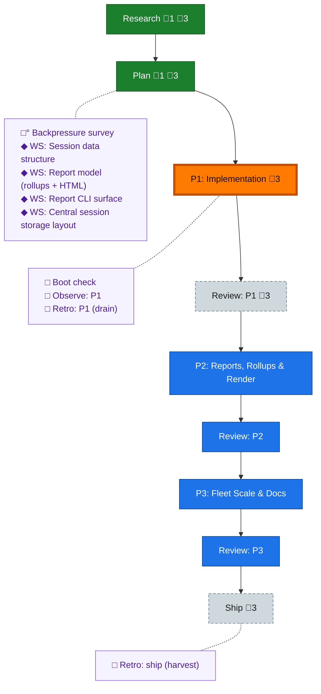

<!-- GENERATED by `harness flow render` — do not hand-edit; regenerate from the flow JSON. -->
# Flow · session-telemetry-dashboard

**Kind**: flight-plan · **Now**: phase-1 · **Next**: review-1 · **Nodes**: 18 · **Events**: 23

**Rail**: ◆─◆─[ ◇─◇─◇─◇─◇─◇─◇ ]  ◆ Research · ◆ Plan · [ ◇ P1: Implementation · ◇ Review: P1 · ◇ P2: Reports, Rollups & Render · ◇ Review: P2 · ◇ P3: Fleet Scale & Docs · ◇ Review: P3 · ◇ Ship ]

**Legend** — colour = type/status: 🟩 done · 🟢 in-progress · 🟥 blocked · 🟦 known · ⬜ assumed · 🔶 decision · 🗣 user input · 🟪 harness chore (faded = not yet done) · 🤖 companion · 🛠 worker · 🟧 current (you are here). Badges: 💬 comments · 📄 artifacts · 📝 instructions · 🧰 chore (° optional / recommended / ‼ strongly-recommended; ✓ done · ✕ skipped).

## Node log

### research · Research
- `2026-06-30T23:37:24.526Z` · — · validation — Hard rails confirmed: git read-only (working tree byte-identical, orphan refs only), counts-only privacy floor extends to committed HTML/report/goldens (byte-scan+scrub), dodge *.log gitignore, render subagent-tokens 'unknown'/empty plans_touched honestly. Test against fixtures/real/&lt;surface&gt;/&lt;instance&gt;/.

### plan · Plan
- `2026-06-30T23:56:43.650Z` · — · validation — Independent critic + deterministic seam-proof. 2 HIGH (computeRollup overclaim → net-new attribution task 2.8; v1-segment crash → task 1.7) + 3 MEDIUM (session HTML=N=1 render; deferral isolation; G2 P10 deviation recorded) — all fixed in-target. READY stands.

### ws-session-data-structure · WS: Session data structure
- `2026-06-30T23:41:05.762Z` · — · decision — Corrected combine wording (F-05): segmentToOtlpLogs/rollupToOtlpMetrics are forward regenerators; only logs are losslessly invertible (otlpLogsToEvents); tolerate 3 on-disk shapes (sync-service.ts:258-267).

### ws-report-model · WS: Report model (rollups + HTML)
- `2026-06-30T23:41:05.133Z` · — · decision — Folded dossier corrections (F-05/F-09/F-06): metrics have no inverse (regenerate forward); HTML render = inline-embed not fetch; reuse computeRollup (IDLE_CAP_S=300), re-aggregate cross-session from Logs; command rollups derive from event_stream/fold (v2 dropped flat arrays).
