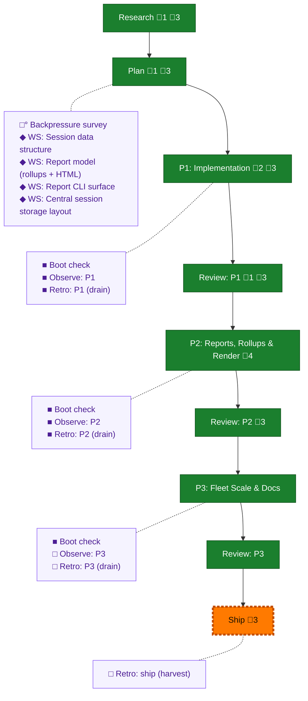

<!-- GENERATED by `harness flow render` — do not hand-edit; regenerate from the flow JSON. -->
# Flow · session-telemetry-dashboard

**Kind**: flight-plan · **Now**: ship · **Next**: review-3 · **Nodes**: 24 · **Events**: 61

**Rail**: ◆─◆─[ ◆─◆─◆─◆─◆─◆─◇ ]  ◆ Research · ◆ Plan · [ ◆ P1: Implementation · ◆ Review: P1 · ◆ P2: Reports, Rollups & Render · ◆ Review: P2 · ◆ P3: Fleet Scale & Docs · ◆ Review: P3 · ◇ Ship ]

**Legend** — colour = type/status: 🟩 done · 🟢 in-progress · 🟥 blocked · 🟦 known · ⬜ assumed · 🔶 decision · 🗣 user input · 🟪 harness chore (faded = not yet done) · 🤖 companion · 🛠 worker · 🟧 current (you are here). Badges: 💬 comments · 📄 artifacts · 📝 instructions · 🧰 chore (° optional / recommended / ‼ strongly-recommended; ✓ done · ✕ skipped).

## Node log

### research · Research
- `2026-06-30T23:37:24.526Z` · — · validation — Hard rails confirmed: git read-only (working tree byte-identical, orphan refs only), counts-only privacy floor extends to committed HTML/report/goldens (byte-scan+scrub), dodge *.log gitignore, render subagent-tokens 'unknown'/empty plans_touched honestly. Test against fixtures/real/&lt;surface&gt;/&lt;instance&gt;/.

### plan · Plan
- `2026-06-30T23:56:43.650Z` · — · validation — Independent critic + deterministic seam-proof. 2 HIGH (computeRollup overclaim → net-new attribution task 2.8; v1-segment crash → task 1.7) + 3 MEDIUM (session HTML=N=1 render; deferral isolation; G2 P10 deviation recorded) — all fixed in-target. READY stands.

### phase-1 · P1: Implementation
- `2026-07-01T00:41:21.865Z` · — · — — Phase 1 tasks dossier prepared (T001-T007, 1:1 with plan 1.1-1.7) + validated (VALIDATED, 0 findings; all file:line pins resolved on disk). Ready to implement.
- `2026-07-01T01:35:24.281Z` · — · — — Phase 1 shipped: SessionExport combine + 'telemetry session save' verb. 8/8 tasks, 7 new tests (T002/T004 non-vacuity, T007 v1 crash-guard), full telemetry suite 423/423, checks hard-gates green. Live smoke over 3 real sessions (v1-only, companion-pair, 24.4M-token) — structure-valid, no leak.

### review-1 · Review: P1
- `2026-07-01T01:47:43.639Z` · — · — — flow-pair cross-model review (Copilot GPT-5.5): APPROVE_WITH_NOTES. Dim-0 non-vacuity proven by reviewer mutation (RED 3 fails @ :125/:138/:169 → GREEN 7/7), orchestrator sanity-pass confirmed. 0 material findings; 2 non-blocking notes (act-level test + schema-validation coverage). See reviews/phase-1-review.md.

### ws-session-data-structure · WS: Session data structure
- `2026-06-30T23:41:05.762Z` · — · decision — Corrected combine wording (F-05): segmentToOtlpLogs/rollupToOtlpMetrics are forward regenerators; only logs are losslessly invertible (otlpLogsToEvents); tolerate 3 on-disk shapes (sync-service.ts:258-267).

### ws-report-model · WS: Report model (rollups + HTML)
- `2026-06-30T23:41:05.133Z` · — · decision — Folded dossier corrections (F-05/F-09/F-06): metrics have no inverse (regenerate forward); HTML render = inline-embed not fetch; reuse computeRollup (IDLE_CAP_S=300), re-aggregate cross-session from Logs; command rollups derive from event_stream/fold (v2 dropped flat arrays).

### phase-2 · P2: Reports, Rollups & Render
- `2026-07-01T02:04:25.681Z` · — · note — tasks stage complete: tasks/phase-2-reports-rollups-render/tasks.md — 10 tasks expanded from plan 2.1–2.8 + a live-smoke task; grounded in workshops 002/003 + Phase 1 exports.
- `2026-07-01T02:08:33.696Z` · — · validation — Phase 2 tasks dossier VALIDATED WITH FIXES (0C/0H/2M, both repaired): flow_stage.tokens attribution clause added (workshop 002); T010 annotated verification-only. Sidecar: validations/phase-2-tasks-validation.md
- `2026-07-01T02:15:29.055Z` · — · note — flow-pair: Phase 2 delegated to coder pij-1ih6gj9 (copilot claude-opus-4.8, max) as dlg-0001; reviewer (copilot gpt-5.5 xhigh) spawns lazily at first REVIEW. Boot-2 HEALTHY.
- `2026-07-01T02:49:21.303Z` · — · note — Extracted FX001 (capture bash-command signature) during Phase 2: commandSignatures() already extracts rg/git privacy-safely but adapters discard non-harness sigs; fix keeps them so bash_command keys by argv. Parallel-safe (adapter/capture files, not coder's report scope). Dossier: fixes/FX001-*.md; registered in plan ## Fixes. observe MW-001.

### review-2 · Review: P2
- `2026-07-01T02:57:52.479Z` · — · note — flow-pair cross-model review dispatched: coder pij-1ih6gj9 (opus-4.8) COMPLETE 1721/1721 gates clean; reviewer pij-1nh968q (gpt-5.5 xhigh) reviewing dlg-0001 with mandatory Dim-0 mutation gate.
- `2026-07-01T03:01:52.294Z` · — · warning — Review FIX_REQUIRED (verified): F1 HIGH P12 leak (--filter-repo echoed raw into report.filter.repo/provenance.repos → embedded in committed HTML; sanitizeInputPath not applied); F2 MEDIUM schema attribution.required missing bash_command_key+notes. Dim-0 PASSED (3 mutations RED-&gt;GREEN). Fix dispatched to coder.
- `2026-07-01T03:09:54.224Z` · — · validation — APPROVE: cross-model review (gpt-5.5) Dim-0 PASSED (3 mutations); F1 HIGH P12 --filter-repo leak + F2 MEDIUM schema both FIXED with non-vacuous regressions; orchestrator ran own mutation on the P12 fix (RED-&gt;restore-&gt;GREEN). 1724/1724, gates green. reviews/phase-2-review.md

### boot-2 · Boot check
- `2026-07-01T02:13:57.377Z` · — · validation — Boot HEALTHY (3s): harness doctor ok — 10 extensions/0 failed, quality-gate+telemetry-hook present; help envelope ok; observe paths present. Env proven before delegating Phase 2 build.

### retro-2 · Retro: P2 (drain)
- `2026-07-01T03:11:29.254Z` · — · note — Post-coding drain: MW-001 (bash-signature magic-wand) saved to .harness/records/retro/2026-07-01/002-047-*.md, resolved_by FX001 (status suggested). Buffer cleared.
