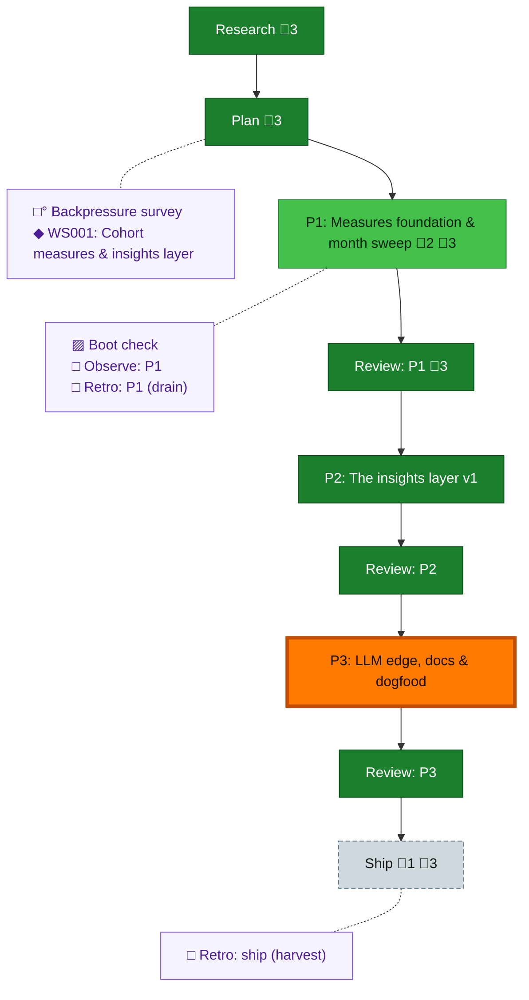

<!-- GENERATED by `harness flow render` — do not hand-edit; regenerate from the flow JSON. -->
# Flow · cohort-telemetry-insights

**Kind**: flight-plan · **Now**: phase-3 · **Nodes**: 15 · **Events**: 29

**Rail**: ◆─◆─[ ◐─◆─◆─◆─◆─◆─◇ ]  ◆ Research · ◆ Plan · [ ◐ P1: Measures foundation & month sweep · ◆ Review: P1 · ◆ P2: The insights layer v1 · ◆ Review: P2 · ◆ P3: LLM edge, docs & dogfood · ◆ Review: P3 · ◇ Ship ]

**Legend** — colour = type/status: 🟩 done · 🟢 in-progress · 🟥 blocked · 🟦 known · ⬜ assumed · 🔶 decision · 🗣 user input · 🟪 harness chore (faded = not yet done) · 🤖 companion · 🛠 worker · 🟧 current (you are here). Badges: 💬 comments · 📄 artifacts · 📝 instructions · 🧰 chore (° optional / recommended / ‼ strongly-recommended; ✓ done · ✕ skipped).

## Node log

### phase-1 · P1: Measures foundation & month sweep
- `2026-07-02T10:31:11.327Z` · — · — — P1 APPROVED (review recorded: reviews/p1-measures-foundation-review.md; 1940 tests green; CRITICAL cross-month leak fixed). AC-12 live-confirmed (segment 19407). Open: AC-13 digit confirm awaits one user-typed /the-flow &lt;digit&gt;.
- `2026-07-02T10:44:17.236Z` · — · — — P1 committed+pushed: f3fea425 (18 files). P2 dispatched to coder pij-1kwcc01.

### ship · Ship
- `2026-07-02T12:38:08.210Z` · — · — — All phases + reviews done and pushed (P1 f3fea425, P2 7c5a7938, P3 4023f9de). Pre-ship residue: AC-13 digit confirm (one user-typed /the-flow &lt;digit&gt;, else demote-with-note); open follow-ups in retro records 002/003 (time_quality, observe id-collision, codex adapter). Ships with 046/047 on this branch's consolidated PR.

### boot-1 · Boot check
- `2026-07-02T08:13:33.961Z` · — · — — Declined router call for context economy; real boot evidence: harness doctor ran ok 2026-07-02 (orchestrator session)
