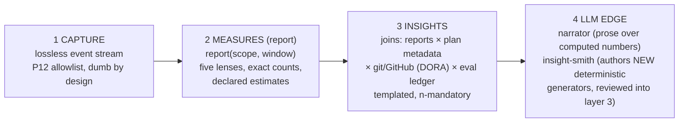

# Workshop: Cohort Measures & the Insights Layer

**Type**: Integration Pattern / Reporting Architecture
**Plan**: 048-cohort-telemetry-insights (moved from 047 workshops/005, 2026-07-02)
**Spec**: (plan pending — this workshop is a design input to the 048 spec)
**Created**: 2026-07-02
**Status**: Draft

**Value Thesis**: Locks the layering, vocabulary, and v1 measure set for cohort-scale telemetry analysis ("all users in a repo for a month") BEFORE any collector or insight generator is built — so the grain, join keys, and epistemic rules are decided once, and the expensive failure (build the sweep, discover the grain is wrong) never happens.
**Target Proof Level**: Preferred Direction
**Current Proof Level**: Preferred Direction (decisions below are conversation-locked with the principal, 2026-07-02; contracts/schemas are the next loop)

**Selected Value Axes**:
- **Strategic Value**: turns the sensor layer into an org-level practice-analytics product (time/tokens by flow stage, tool cost, ritual adherence) — the payoff the whole telemetry investment was for.
- **Safety to Change**: every layer re-derives from the layer below (lossless events → measures → insights), so any lens can be corrected retroactively without touching historical data.
- **Proof Quality**: the epistemic contract (exact counts / declared estimates / mandatory n) is inherited from the report layer and the eval-ledger stats vocabulary, not invented per insight.
- **Cost / Attention Reduction**: the v1 report answers "where does the time and money actually go" in one HTML page; the LLM insight-smith compounds the library over time.

**Related Documents**:
- [047 WS002 report model, rollups & HTML](../../047-session-telemetry-dashboard/workshops/002-report-model-rollups-and-html.md) — the measures substrate (five lenses, RollupEntry, KF-02/KF-03)
- [047 WS004 central session storage](../../047-session-telemetry-dashboard/workshops/004-central-session-storage-layout.md) — the org-scope collection substrate
- [041 WS004 run storage & comparison](../../041-flow-conformance-eval/workshops/004-run-storage-and-comparison.md) — the stats vocabulary (Wilson, paired tests, honest unknowns) this layer reuses
- Retro `.harness/records/retro/2026-07-02/002-046-dogfood-run1-drain.md` — DL-001/DL-002 capture gaps referenced below

---

## Purpose

Decide the architecture and v1 content of cohort-scale telemetry analysis: what the **report** (measures) layer emits at repo/week → org/month scopes, what the separate **insights** layer computes on top, where LLM inference is allowed, and which capture-domain gaps must be named rather than absorbed. Drives the next plan's spec; makes the first collector loop implementation-ready-adjacent.

## Fresh Entrant Outcome

A fresh human or agent should be able to use this workshop to reach **Preferred Direction** with no additional context. They should be able to:

- Name the four layers and state which layer owns any given computation.
- Say exactly what the v1 insight report contains (seven sections) and what it deliberately excludes.
- State the token vocabulary (sent/received) and the stage-labeling mechanism (FlowEvent primary, digit fallback).
- List the named capture/sync gaps that are NOT reporting-domain work.

## Key Questions Addressed

- Is cohort analysis "just reporting-domain" work? (Mostly — three named exceptions.)
- What token numbers do we show? (Sent/received, fresh-only.)
- How do stages get labeled at report time? (Nav-derived FlowEvent, semantic mapping.)
- Where may LLM inference participate? (Narration + generator-authoring; never computing numbers.)
- What does v1 ship? (Seven sections, two exclusions.)

---

## The four layers (D1 — locked)

| Layer | Owns | Never does |
|---|---|---|
| 1 Capture | events + timestamps + signatures; sync to `refs/harness-telemetry/YYYY/MM/DD/<session>` | stage-awareness, analysis, aggregation ("no smart capture") |
| 2 Measures | scoped rollups (repo/week, N-repos/week, org/month); the seven v1 sections; semantic stage mapping | external data joins, causal language |
| 3 Insights | cross-report joins, DORA, correlation tables, templates with mandatory epistemics | per-person analytics, un-caveated claims |
| 4 LLM edge | narrative prose; proposing new layer-3 generators as reviewable code | computing any number that appears in a report |

**Every layer re-derives from the layer below** (report already re-derives from raw logs per KF-02/KF-03 — extend the same rule upward). `report(scope, window)` is a *function*, run many times: reports are comparable artifacts (stable schema + declared `ReportScope`/`ReportFilter`), which is what makes layer 3 trustworthy.

## Decision Space

| # | Decision | Options considered | Decision |
|---|----------|--------------------|----------|
| D1 | Layering | 2-layer (report does insights) vs 4-layer | **4-layer** — insights joins external data (DORA/git/plans) the report must never depend on; LLM at the edge only. Selected |
| D2 | Token vocabulary | 4-way (in/out/cache-read/cache-create) vs 2-way | **Sent/received, fresh-only** — sent = initial send-up (non-cache input, FX002 semantics as-implemented), received = generated output. Cache disappears as a rendered concept; the initial cost IS the tunable amount (tooling → smaller dumps, skills → less waste). Re-send amplification deliberately NOT factored. Selected |
| D3 | Stage labeling | skill-digit arg vs nav-derived FlowEvent | **FlowEvent primary** (stage = `nav.now`, richer node ids, works in guided mode), **digit fallback** for direct jumps; report's flow_stage lens must be promoted off the digit-only mechanism (known drift: report.ts:13-14 header already promises this, lens at :468 doesn't do it). Plus a **versioned semantic mapping** node-id → {research, plan, implement, review, ship} owned by the report layer. Selected |
| D4 | Skill table scope | exclude the-flow (avoid overlap with stage lens) vs include | **Include the-flow** — broader picture; the stage lens is a second view of the same truth; one render footnote says the tables are not additive. Selected |
| D5 | Unit of analysis for correlations | session vs plan/work-unit | **Work unit** (plan). Interim key: **branch** (one-plan-per-branch convention) until plan identity lands on events (capture gap, below). Selected |
| D6 | People analytics | allow individual cuts vs work-unit-only | **Anti-goal: insights aggregate over work units, never rank contributors.** Small-n leakage handled by mandatory-n threshold (below it: aggregate up or don't render). Selected |
| D7 | LLM participation | none vs narrator vs narrator+smith | **Narrator + insight-smith** — narrator writes prose over computed numbers (same n/caveat rules apply to its sentences); smith proposes new deterministic generators as code, reviewed into the library; its output is tooling, never conclusions. Selected |

## The v1 insight report (seven sections — locked)

All tables render **count · active time (where honest) · sent · received**.

| # | Section | Notes |
|---|---------|-------|
| 1 | **Stage economics** | per semantic stage: time/sent/received + per-work-unit averages + **explore→ship elapsed in BOTH clocks** (wall AND gap-classified active). Flow-to-flow windowing. |
| 2 | **Skill breakdown** | any-skill → next-skill windows; the-flow included (D4). |
| 3 | **Bash commands** | FX001 signature keys; two orderings: by count, by sent. |
| 4 | **Subagents** | counts real; tokens rendered as honestly UNMEASURED (named phase-3 gap) — visible, not zero. |
| 5 | **Active-vs-wall ratio** | `working_ratio` per session/cohort — contextualizes every time number. |
| 6 | **Outlier sessions** | top 3 by sent + by active time, with command/stage mix (averages hide the session that burned 40% of the week). |
| 7 | **Per-work-unit table** | branch-keyed rows with stage-share columns — the raw material layer 3's correlations consume; ships FIRST to validate the grain. |

**Ritual-marker insights** (harness-command lens, relational not tabular — **v1 COMMITTED, principal-endorsed 2026-07-02**; the loop measuring its own adoption, and the cheapest section since harness verbs are already first-class events):
- observe→drain conversion (captured vs harvested)
- backpressure-before-implement rate per work unit
- checks-before-push discipline
- retro cadence (gap between drains)

**Deliberate v1 exclusions**: correlations ("plan more → fewer review rounds" — needs plan-identity grain; section 7 is its food), trends/week-over-week deltas (needs ≥2 reports; the comparable-artifact property makes this drop in later), DORA (layer 3, needs the GitHub source contract).

## Epistemic contract (inherited, non-negotiable)

- Counts **EXACT**; time/tokens **ESTIMATES with a named attribution method** — never a ledger.
- Every insight sentence (human- or LLM-written) carries: the measures used, **n**, an interval where applicable, and a confound note (CS score being the standing confound for planning-vs-cost claims). *An insight the HTML can't caveat doesn't render.*
- Stats vocabulary reused from the eval ledger (Wilson CIs, paired tests, honest unknowns) — no second, looser stats culture in the pretty layer.
- Correlational language only; this is observational data.

## Named capture/sync gaps (NOT reporting-domain — do not silently absorb)

| Gap | Domain | Status |
|---|---|---|
| Plan identity on events (`FlowEvent` carries agent+stage, not plan slug; `plans_touched` empty) | capture | OPEN — branch proxy interim (D5) |
| Session token totals into synced shards (currently local `.session.json` only; per-tool `result_tokens` IS synced) | sync payload (P12-reviewed change) | OPEN |
| DL-002: live skill-digit capture unconfirmed | capture | OPEN (one flushed live `/the-flow <digit>` confirms) |
| Subagent token attribution null | capture | OPEN (v1 renders the gap honestly) |
| Codex harness correlation | capture | DEFERRED (own plan; DL-001) |

## Attention Reduction

| Future Loop | Before Workshop | After Workshop |
|-------------|-----------------|----------------|
| Next plan's spec | re-litigate layering, token vocabulary, grain per conversation | D1–D7 citable; spec starts at contracts |
| Implementation | guess which layer owns a computation | layer table is the routing rule |
| Review | reconstruct why cache is absent / why the-flow is in two tables | decisions carry rationale in place |
| LLM insight generation | unbounded "analyze this data" prompts | narrator/smith roles + the no-computed-numbers rule |

## Open Questions

### Q1: The principal's scenario list?
**OPEN** — a set of concrete questions is coming; each maps to (measures needed → join keys → gaps triggered). This workshop's D-decisions are the frame it slots into; the list may add measures but should not reopen D1–D7.

### Q2: DORA source contract?
**OPEN** — deploys/PR lead time/incidents come from GitHub/CI, not telemetry. Layer-3 join; needs its own small contract when DORA is pulled in.

### Q3: Insight template schema?
**OPEN** — the mandatory fields are decided (claim, measures, n, interval, caveat); the concrete JSON/HTML shape is contract-work for the next plan.

### Q4: Where do org-scope reports run and land?
**OPEN** — WS004's central storage is the anticipated substrate; the sweep mechanics (fetch N repos' refs, cache, incremental) are the next plan's explore territory.

## Validation / Acceptance

This workshop reaches its target proof level when:

- A fresh agent can state the four layers and route any computation to one of them without asking.
- The next plan's spec cites D1–D7 instead of re-deciding them.
- The v1 seven-section report can be built without any new capture work except the gaps table's named items.
