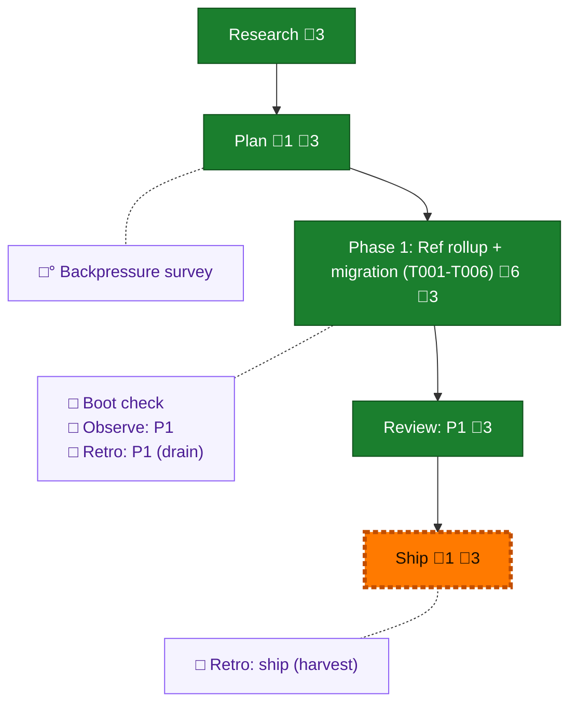

<!-- GENERATED by `harness flow render` — do not hand-edit; regenerate from the flow JSON. -->
# Flow · telemetry-ref-rollup

**Kind**: flight-plan · **Now**: ship · **Nodes**: 10 · **Events**: 18

**Rail**: ◆─◆─[ ◆─◆─◇ ]  ◆ Research · ◆ Plan · [ ◆ Phase 1: Ref rollup + migration (T001-T006) · ◆ Review: P1 · ◇ Ship ]

**Legend** — colour = type/status: 🟩 done · 🟢 in-progress · 🟥 blocked · 🟦 known · ⬜ assumed · 🔶 decision · 🗣 user input · 🟪 harness chore (faded = not yet done) · 🤖 companion · 🛠 worker · 🟧 current (you are here). Badges: 💬 comments · 📄 artifacts · 📝 instructions · 🧰 chore (° optional / recommended / ‼ strongly-recommended; ✓ done · ✕ skipped).

## Node log

### plan · Plan
- `2026-07-02T21:21:05.090Z` · — · — — Plan READY, Simple mode, CS-3. Validated with fixes: 2 HIGH + 3 MEDIUM critic findings applied (migration trigger predicate + sentinel; union folds in existing rolled ref; verify-at-delete TOCTOU guard; forced re-push). Record: validations/telemetry-ref-rollup-plan-validation.md

### phase-1 · Phase 1: Ref rollup + migration (T001-T006)
- `2026-07-02T21:25:12.151Z` · — · — — flow-pair fleet: coder pij-e7dlvq (copilot opus-4.8, canary OK), reviewer lazy-spawn at first REVIEW (gpt-5.5 xhigh). Packet p049-1-ref-rollup.md dispatched (T001-T005; T006 dogfood orchestrator-run).
- `2026-07-02T21:32:33.306Z` · — · — — Scope add (user): T007 post-flush buffer prune + AC-10 rolled into Phase 1 (plan v1.1.0). .harness/temp/telemetry measured at 100MB/104 entries — sync never deletes flushed buffers. Prune gated on push+watermark+startdate-sidecar; additive FsPort delete capability. Will dispatch to coder as add-on with the fix round (or standalone if review is clean).
- `2026-07-02T22:25:33.993Z` · — · — — Review round 1: FIX_REQUIRED (gpt-5.5). Dim-0 all 5 mutations RED-verified. F1 HIGH: AC-09 byte-equivalence test was laundering-vacuous (reviewer's parse+restringify mutation passed). F2 pushed-contract mismatch, F3 stale comments. Fix packet + T007 dispatched to coder. T006 before-state captured: 36 refs / 28 sessions / 19 multi-commit refs / 390 buried files (the recovery target).
- `2026-07-02T22:44:35.399Z` · — · — — T007 surfaced a real design contradiction: prune vs the writer's buffer-only tree rebuild (would reintroduce F-03 after prune). Orchestrator decision: Option A — complete the plan's own design item 02 (writer unions LOCAL rolled ref tree [flushed] + buffer [unflushed]); new local-only tree-read on the write port; AC-03 extended (no remote verbs, local read allowed); lost-watermark+pruned-buffer idempotency becomes an explicit test. F1-F3 + FsPort capability landable independently.
- `2026-07-02T23:06:07.343Z` · — · — — Review round 2 (gpt-5.5): F1-F3 verified fixed (laundering mutation re-run RED); T007 union/prune Dim-0 all 5 mutations RED-verified. Fresh HIGH: ExecGitWrite.run lacks maxBuffer (ENOBUFS ~1MiB) + readRefTree skips failed blob reads -&gt; possible force-push of truncated roll. Narrow fix dispatched (fail-closed + shared 64MiB constant + &gt;1MiB int test).
- `2026-07-02T23:41:15.437Z` · — · — — Phase 1 COMPLETE incl. T006 dogfood: migration rewrote 26 sessions (17943 segments unioned), June totals +8% (recovery proof), buffer 100MB-&gt;3.9MB, steady-state fetch-free. Review: 3 rounds (2 FIX_REQUIRED -&gt; APPROVE), record at reviews/p1-ref-rollup-review.md. Retro drained: .harness/records/retro/2026-07-02/004-049-p1-ref-rollup-drain.md. OPEN pre-ship: DL-001 no-op sync perf (~2min/96s CPU).

### ship · Ship
- `2026-07-02T23:45:55.293Z` · — · — — Pre-ship: DL-001 perf fix in flight (manifest-only no-op read via readRefBlob). P1 code+closeout pushed (0f016671, 619317e3).
