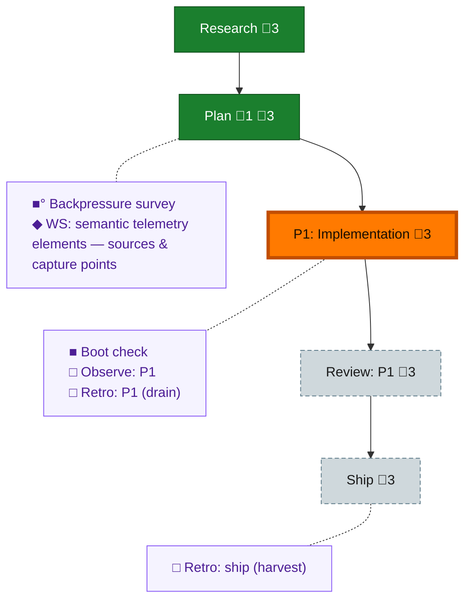

<!-- GENERATED by `harness flow render` — do not hand-edit; regenerate from the flow JSON. -->
# Flow · semantic-artifact-telemetry

**Kind**: flight-plan · **Now**: phase-1 · **Next**: review-1 · **Intent**: Semantic telemetry from flow artifacts: count fixes from reviews, phases from plans, workshop/research lengths etc, extracted at save/import time so files carry updated telem over time · **Nodes**: 11 · **Events**: 18

**Rail**: ◆─◆─[ ◐─◇─◇ ]  ◆ Research · ◆ Plan · [ ◐ P1: Implementation · ◇ Review: P1 · ◇ Ship ]

**Legend** — colour = type/status: 🟩 done · 🟢 in-progress · 🟥 blocked · 🟦 known · ⬜ assumed · 🔶 decision · 🗣 user input · 🟪 harness chore (faded = not yet done) · 🤖 companion · 🛠 worker · 🟧 current (you are here). Badges: 💬 comments · 📄 artifacts · 📝 instructions · 🧰 chore (° optional / recommended / ‼ strongly-recommended; ✓ done · ✕ skipped).

## Node log

### plan · Plan
- `2026-07-04T00:04:11.502Z` · — · validation — copilot-opus peer pij-1xu25j8: NEEDS ATTENTION (4 findings, 1 CRITICAL serializer/OTLP round-trip) -&gt; all folded in -&gt; narrow re-check PASS (READY); verdict file at validations/semantic-artifact-telemetry-plan-validation.md
