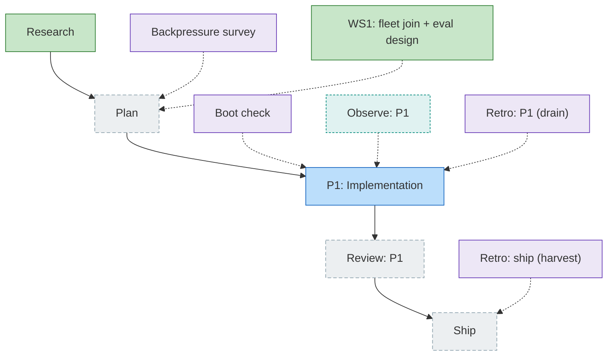

<!-- GENERATED by `harness flow render` — do not hand-edit; regenerate from the flow JSON. -->
# Flow · pij-fleet-session-eval

**Kind**: flight-plan · **Now**: plan · **Next**: plan · **Intent**: Eval pij fleets as one joined session: orchestrator builds flow artifacts, spawns pij coders/reviewer, joins child sessions via captured parent-link env vars, scores time/quality/cost per named scenario (each scenario carries its reason/vibe) · **Nodes**: 11 · **Events**: 7

**Rail**: ◆─◇─[ ◇─◇─◇ ]  ◆ Research · ◇ Plan · [ ◇ P1: Implementation · ◇ Review: P1 · ◇ Ship ]

**Legend**: 🟩 done · 🟧 in-progress · 🟥 blocked · 🟦 known (designed) · ⬜ assumed (speculative) · 🔶 decision · 🗣 user input · 🟪 harness loop · 🤖 companion · 🛠 worker · 🧰 chore (upkeep).
