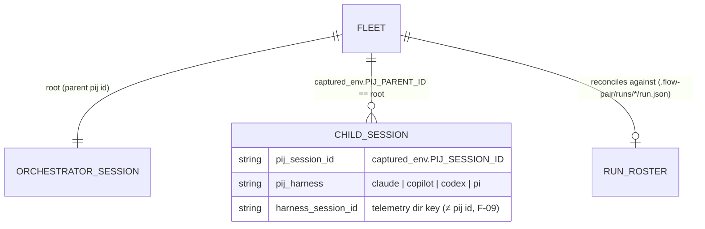

# Workshop: Fleet session-join & the three-dimension eval

**Type**: Data Model + Integration Pattern (with an embedded Spike/POC result)
**Plan**: 051-pij-fleet-session-eval
**Spec**: (pre-plan workshop — consumes `research-dossier.md`)
**Created**: 2026-07-04T03:40:00Z
**Status**: Draft

**Value Thesis**: Turns "a flow-pair run" from an anecdote into a measurable unit — one joined fleet with defined time/quality/cost semantics — so orchestrated-fleet runs can be scored and compared against solo baselines without re-deriving join logic each time.
**Target Proof Level**: Contract Ready
**Current Proof Level**: Contract Ready (join spike validated on real 050 data)

**Selected Value Axes**:
- **Proof Quality**: every metric is defined against fields proven present in real segments (dossier F-03..F-08), not hoped-for data.
- **Agent Readiness**: an orchestrator or eval agent can run the join + scoring from this doc with no tribal knowledge (incl. where telemetry actually lives).
- **Cost / Attention Reduction**: fleet totals become one CLI call instead of a hand-written python join per eval.
- **Knowability**: the scenario register makes *why we measure each scenario* explicit — the user's steer: every scenario carries its reason and its vibe.

**Related Documents**:
- `../research-dossier.md` (F-01..F-11, H-01..H-03 cited below)
- `docs/plans/046-flow-eval-loop/` (the existing single-subject eval), `docs/plans/050-semantic-artifact-telemetry/` (artifact events = quality inputs)

---

## Purpose

Decide how parent+child pij sessions are joined into one **fleet**, what time/quality/cost mean for a fleet, where each scenario's reason/vibe lives, and what gets built first (POC-led). Downstream loop made cheaper: fleet eval runs and their scoring.

## Fresh Entrant Outcome

A fresh agent can: (1) enumerate a fleet's sessions from telemetry alone, (2) compute its three dimensions with the exact semantics below, (3) know which lanes are honestly unmeasurable today and how they're marked, (4) scaffold a new scenario carrying its intent.

## Key Questions Addressed

- How do we identify a fleet, given `PIJ_PARENT_ID` is best-effort and a parent id spans many runs?
- What exactly are fleet time, quality, cost — and what do we do about copilot's null tokens?
- Where does a scenario's reason/vibe live?
- What is POC vs product?

---

## The join model



### D1 — Fleet identity: env-tree superset, roster-scoped runs · **Selected**

| Option | Description | Decision |
|---|---|---|
| A. Env tree only (`PIJ_PARENT_ID == root`) | One query, no external deps | Rejected alone — a parent pij id is **stable across the orchestrator's whole life**, so it conflates every run that session ever drove; and orphans (F-01) vanish silently |
| B. flow-pair run ledger roster only | Exact per-run membership (`role → pijId`) | Rejected alone — only exists for flow-pair runs; misses ad-hoc spawns |
| **C. Both: env tree = superset, roster/time-window = run scope, diff = findings** | Join by env tree; scope a *run* by the ledger roster (or an explicit session-id list / time window); report tree∖roster (unrostered children) and roster∖tree (orphans — spawned but no parent link captured) as first-class output | **Selected** — the discrepancy list is itself an eval signal (D4 conduct lane) |

### D2 — The FleetEvidence contract

Merge N `SessionEvidence` objects (session-evidence.ts:41-84 shape); nothing new is captured — this is read-side only.

```typescript
interface FleetEvidence {
  root_pij_id: string;                    // the orchestrator
  scope: 'env-tree' | 'roster' | 'explicit';
  sessions: FleetLane[];                  // orchestrator first, then children
  orphans: string[];                      // rostered ids with no env-tree match (D1 diff)
  unrostered: string[];                   // env-tree children not in the roster
  totals: {
    cost: { grand_total: number; output: number; measured_lanes: number; unmeasured_lanes: number };
    time: { wall_clock_s: number | null;  // union of lane spans (D3)
            active_s: number | null };    // sum of lane spans — parallelism = active/wall
    segments: number;
  };
}
interface FleetLane {                     // one session, one row
  pij_id: string; role: string | null;   // role from roster when scoped (coder/reviewer/…)
  harness: string; model: string | null;
  cost_measured: boolean;                 // false ⇒ copilot-null lane (F-07) — NEVER zero-filled into totals
  evidence: SessionEvidence;              // the existing per-session object, unchanged
}
```

**Privacy**: ids, counts, enums only — the existing counts-only posture carries through untouched (H-01).

### D3 — Dimension semantics

| Dimension | Definition | Source (proven) | Honest gap today |
|---|---|---|---|
| **Cost** | Σ `tokens.grand_total` over lanes with `cost_measured` — plus a loud `unmeasured_lanes` count | segment `tokens` (F-06) | Copilot lanes are `tokens: null` (F-07/H-03) — reported as *unmeasured*, never 0; fleet cost is a **lower bound** until copilot capture lands |
| **Time** | `wall_clock` = span union across lanes; `active` = Σ lane spans; parallelism ratio = active/wall | OTLP `session.metrics.jsonl` timestamps / segment timecodes — **not** `window` (event-index only, F-08) | Needs a small extractor from OTLP metrics; segment-only fallback is command-granularity |
| **Quality** | The existing flow-eval judged lanes on the subject worktree, **plus fleet-conduct lanes**: roster⇄tree reconciliation clean, review verdict present, fix-loop count, artifact-semantics counts (fixes/verdicts) at fleet level | flow-eval scenario assertions + artifact events (plan 050) | DL-007 (H-02): `flow-eval score`'s own telemetry lookup diverges from `telemetry get` — route fleet evidence through the `get` path until fixed |

### D4 — The scenario register (reason + vibe) · the user's steer

Each measured scenario carries **why it exists and what it should feel like**, machine-adjacent but human-worded:

```jsonc
// scenario.json — new OPTIONAL field (non-breaking; scaffold emits it)
"intent": {
  "reason": "Prove a fleet (fable orchestrator + opus coder + gpt-5.5 reviewer) beats a solo agent on cost-per-quality for a bounded extension task",
  "vibe": "delegation should feel like a real team: the orchestrator plans and verifies, workers build — not one model narrating three hats"
}
```

Plus a **Scenario Register** table in the plan (one row per scenario: slug · reason · vibe · dimensions it stresses), so the *portfolio* rationale lives in one place. First register entries:

| Scenario | Reason | Vibe | Stresses |
|---|---|---|---|
| `md-to-pdf-*` family (existing) | Solo baselines already laddered in the ledger — free comparators | Single agent, full harness conduct | quality |
| **fleet-md-to-pdf** (new) | Same task, fleet-orchestrated — the direct fleet-vs-solo comparison | Orchestrator builds flow artifacts *first*, then delegates via flow-pair | all three |
| **fleet-050-retrospective** (new, zero-cost) | The plan-050 run is already captured (13 children, 99 segments) — score a fleet *from history* to validate the join before spending a live run | Archaeology: the eval works on data we already have | cost, time |

### D5 — POC-first build order · **Selected**

Walking skeleton before product: ① scratch join script (**done — spike below**) → ② time extractor from OTLP metrics + roster reconcile on the 050 fleet → ③ promote to `harness telemetry get-fleet <root-pij-id> [--roster <run.json>] --json` once the shape survives the external corpora (SecondCrack 28 dirs, osk-split-billing 42 — **note: their telemetry is local-only in `.harness/temp/telemetry`, zero synced refs**; snapshot before it evaporates. **Schema-gate the sweep**: osk runs an old harness — only 22/189 segments are v2.2/joinable; SecondCrack is 453/536 v2.x. Run `harness update` in osk before trusting new corpus from it) → ④ flow-eval fleet scenario wiring.

## Spike/POC result (already run)

**Question**: can a fleet be joined + costed from captured env alone? **PROVEN.**

```
$ python3 <join over .harness/temp/telemetry, group by PIJ_PARENT_ID=='pij-4s10mb'>
fleet of pij-4s10mb: 13 children, 99 segments
  pij-i13g2o  [claude]  segs=26 grand_total=35,232,032 output=395,206
  pij-1s7r0mw [claude]  segs=16 grand_total=24,408,986 output=316,651
  ...
  pij-13e5ud0 [copilot] segs=16 grand_total=0 output=0        ← unmeasured, not zero
FLEET TOTALS: grand_total=78,814,658 output=852,398
```

| Claim tested | Observed | Evidence |
|---|---|---|
| Parent link captured & joinable | 13 children resolve under one root | output above |
| Cost computable | 78.8M/852k tokens summed | output above |
| Copilot lanes measurable | **DISPROVEN** — all 9 copilot lanes null | `tokens: null` in 45 segments |
| Wall-clock from `window` | **DISPROVEN** — event-index, not time | `{"since":"last-command","from":1169,"to":1349}` |

## Evidence Ledger

| Evidence | Location | Supports | Status |
|---|---|---|---|
| Join spike output | § Spike above | D1, D2, cost semantics | Validated |
| Synced-ref parent-key check | dossier F-04 | join works post-sync | Validated |
| FleetEvidence type | § D2 | implementation | Ready |
| Time extractor from OTLP metrics | — | D3 time | Missing (POC step ②) |
| Roster reconcile on 050 run | `.flow-pair/runs/` | D1 diff lanes | Missing (POC step ②) |
| `intent` field + register | § D4 | scenario steer | Draft |

## Attention Reduction

| Future Loop | Before | After |
|---|---|---|
| Fleet eval run | hand-written join per eval; tribal telemetry paths | one `get-fleet` call; paths documented here |
| Review of eval claims | "the fleet cost X" unverifiable | lower-bound semantics + unmeasured-lane marks explicit |
| Scenario curation | reasons live in chat history | register row + `intent` field per scenario |

## Validation / Acceptance

- FleetEvidence for the 050 fleet round-trips: env-tree join == roster ± explicitly-listed diffs.
- Fleet totals mark copilot lanes unmeasured (never zero-filled) and time comes from OTLP timestamps.
- A scaffolded scenario emits `intent.reason`/`intent.vibe` and the plan carries the register.

## Open Questions

### Q1: Should fleet joins recurse (grandchildren)? **OPEN** — no grandchild spawns observed in any corpus yet; contract reserves it (env tree walk is naturally recursive) but POC ships depth-1.
### Q2: Sync or snapshot the external repos' local-only telemetry? **OPEN** — user call; data-loss risk noted in dossier risks.
