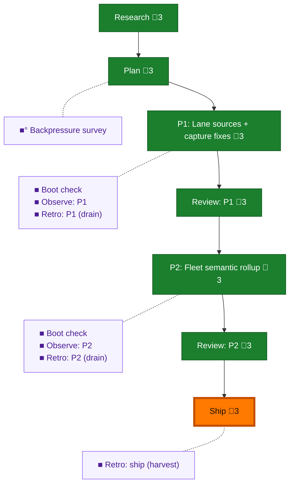

<!-- GENERATED by `harness flow render` — do not hand-edit; regenerate from the flow JSON. -->
# Flow · fleet-telemetry-lane-sources

**Kind**: flight-plan · **Now**: ship · **Intent**: Ship 052: push to open PR 49, telemetry flush, fleet teardown + live get-fleet dogfood, terminal harvest · **Nodes**: 15 · **Events**: 39

**Rail**: ◆─◆─[ ◆─◆─◆─◆ ]─◆  ◆ Research · ◆ Plan · [ ◆ P1: Lane sources + capture fixes · ◆ Review: P1 · ◆ P2: Fleet semantic rollup · ◆ Ship ] · ◆ Review: P2

**Legend** — colour = type/status: 🟩 done · 🟢 in-progress · 🟥 blocked · 🟦 known · ⬜ assumed · 🔶 decision · 🗣 user input · 🟪 harness chore (faded = not yet done) · 🤖 companion · 🛠 worker · 🟧 current (you are here). Badges: 💬 comments · 📄 artifacts · 📝 instructions · 🧰 chore (° optional / recommended / ‼ strongly-recommended; ✓ done · ✕ skipped).
