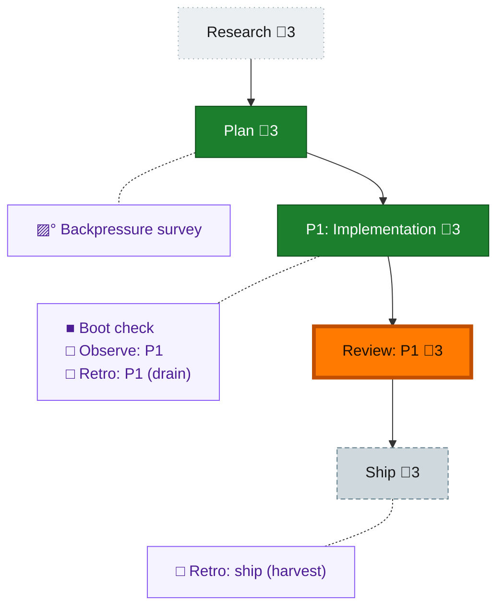

<!-- GENERATED by `harness flow render` — do not hand-edit; regenerate from the flow JSON. -->
# Flow · telemetry-flush-desync

**Kind**: flight-plan · **Now**: review-1 · **Next**: ship · **Intent**: Fix #53: seed nextSeq from max(durable .flushed watermark, maxExistingFile)+1 so a wiped telemetry buffer resumes above the flushed high-water and sync stops silently no-opping · **Nodes**: 10 · **Events**: 16

**Rail**: ◇─◆─[ ◆─◆─◇ ]  ◇ Research · ◆ Plan · [ ◆ P1: Implementation · ◆ Review: P1 · ◇ Ship ]

**Legend** — colour = type/status: 🟩 done · 🟢 in-progress · 🟥 blocked · 🟦 known · ⬜ assumed · 🔶 decision · 🗣 user input · 🟪 harness chore (faded = not yet done) · 🤖 companion · 🛠 worker · 🟧 current (you are here). Badges: 💬 comments · 📄 artifacts · 📝 instructions · 🧰 chore (° optional / recommended / ‼ strongly-recommended; ✓ done · ✕ skipped).
