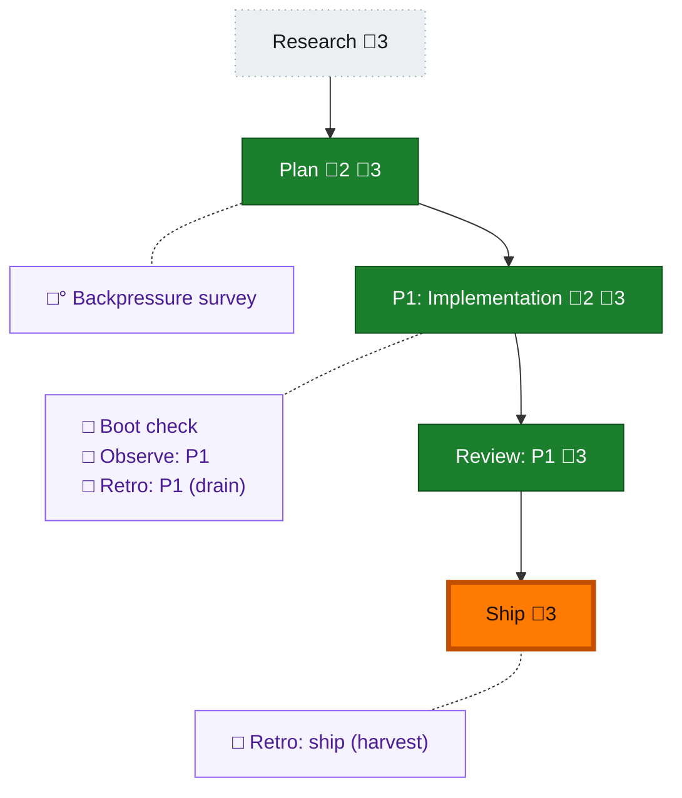

<!-- GENERATED by `harness flow render` — do not hand-edit; regenerate from the flow JSON. -->
# Flow · vendor-builder-baked-skills

**Kind**: flight-plan · **Now**: ship · **Intent**: Vendor SDD the-flow into this repo as the 'builder' skill (+ its deps validate-v2, constitution, extract-domain), add a thin the-flow redirect, bake skills into the npm build for GitHub-free local-path install, and make harness update re-apply skills by the last-recorded method (targets/scope) via a skills lock. Coexist with eng-harness-flow (future merge). · **Nodes**: 10 · **Events**: 22

**Rail**: ◇─◆─[ ◆─◆─◆ ]  ◇ Research · ◆ Plan · [ ◆ P1: Implementation · ◆ Review: P1 · ◆ Ship ]

**Legend** — colour = type/status: 🟩 done · 🟢 in-progress · 🟥 blocked · 🟦 known · ⬜ assumed · 🔶 decision · 🗣 user input · 🟪 harness chore (faded = not yet done) · 🤖 companion · 🛠 worker · 🟧 current (you are here). Badges: 💬 comments · 📄 artifacts · 📝 instructions · 🧰 chore (° optional / recommended / ‼ strongly-recommended; ✓ done · ✕ skipped).

## Node log

### plan · Plan
- `2026-07-06T20:16:45.513Z` · — · validation — Cross-model validation: codex/gpt-5.5 peer (pij-noqq57) running /validate-v2 on the plan; report pending, pushed back to the-flow pane.
- `2026-07-06T20:21:43.589Z` · — · validation — Peer /validate-v2 (codex/gpt-5.5): NEEDS ATTENTION, 2 HIGH. (1) update in-process staleness after binary upgrade -&gt; re-exec fresh 'harness skills update' (KF-08/AC-09). (2) G2/G3 falsely N/A -&gt; constitution+architecture DO exist; re-ran to PASS + deviation ledger for files shipping skills/. Both folded into plan; now READY.

### phase-1 · P1: Implementation
- `2026-07-06T20:24:53.489Z` · — · note — Phase 1 delegated to a flow-pair fleet: coder github-copilot/gpt-5.5:xhigh, reviewer claude/claude-opus-4-8:high. Orchestrator (the-flow session) owns the deliverable + sanity pass.
- `2026-07-06T20:31:58.537Z` · — · decision — Scope add (user): CI/packaging. Release is auto (release-please+publish build tarball from package.json#files -&gt; no workflow change to SHIP skills). Added T019 CI guard: extend ci.yml npm-pack jq assertions to require baked skills stay in tarball (AC-10, regression sensor); T020 confirm CI skills+markdown lanes. Both orchestrator-owned (.github outside coder scope), done after coder's phase lands.
