<!-- GENERATED by `harness flow render` — do not hand-edit; regenerate from the flow JSON. -->
# Flow · dont-apologise-fix

**Kind**: flight-plan · **Now**: ship · **Next**: plan · **Intent**: Encode the environment-first posture (don't apologise — fix; dual goals; every difficulty paid forward) across builder + eng-harness-flow: 4-layer directives, discrimination test, narrowed harness-blind rule, recommendation-led retro drain with dispositions (CLI schema + fingerprint now), letter-code leak purge, excursion-node mid-flow fixes, flow-eval planted-friction scenario, telemetry sufficiency task · **Nodes**: 12 · **Events**: 34

**Rail**: ◆─◆─[ ◆─◆─◆ ]  ◆ Research · ◆ Plan · [ ◆ P1: Implementation · ◆ Review: P1 · ◆ Ship ]

```mermaid
flowchart TD
    research["Research 📄1 📝3"]:::done
    plan["Plan 💬1 📄1 📝3"]:::done
    phase_1["P1: Implementation 💬2 📝3"]:::done
    review_1["Review: P1 💬2 📝3"]:::done
    ship["Ship 📝3"]:::done

    research --> plan --> phase_1 --> review_1 --> ship

    planC["■° Backpressure survey<br/>◆ WS: telemetry for flow improvement"]:::chore
    phase_1C["■ Boot check<br/>■ Observe: P1<br/>■ Retro: P1 (drain)"]:::chore
    shipC["□ Retro: ship (harvest)<br/>◇ T+3wk tripwire review (real telemetry)"]:::chore

    %% invisible chain holds the gutter boxes in their own column
    planC ~~~ phase_1C ~~~ shipC

    %% dotted links pull each gutter box beside its node
    plan -.- planC
    phase_1 -.- phase_1C
    ship -.- shipC

    classDef done fill:#1B7F2E,stroke:#0F4F1B,color:#fff;
    classDef chore fill:#f5f3ff,stroke:#8b5cf6,color:#4c1d95,text-align:left;
    classDef current fill:#FF7A00,stroke:#C24E00,color:#1a0e00,stroke-width:4px;
    class ship current;
```

**Legend** — colour = type/status: 🟩 done · 🟢 in-progress · 🟥 blocked · 🟦 known · ⬜ assumed · 🔶 decision · 🗣 user input · 🟪 harness chore (faded = not yet done) · 🤖 companion · 🛠 worker · 🟧 current (you are here). Badges: 💬 comments · 📄 artifacts · 📝 instructions · 🧰 chore (° optional / recommended / ‼ strongly-recommended; ✓ done · ✕ skipped).

## Node log

### research · Research
- 📄 artifacts: docs/plans/056-dont-apologise-fix/research-dossier.md

### plan · Plan
- 📄 artifacts: docs/plans/056-dont-apologise-fix/dont-apologise-fix-plan.md
- `2026-07-09T01:01:47.002Z` · — · decision — User requirement (mid-flow): plan must include a T+3wk re-entry affordance — a committed tripwire-review runbook + a post-ship excursion node so real-telemetry effectiveness checking is a pickup-able thread

### phase-1 · P1: Implementation
- `2026-07-09T01:54:00.212Z` · — · note — Coder progress: CLI cluster T001-T005 complete + committed (schema 1.2, fingerprint, telemetry wire path incl. observe_kind/retro/disp_/kind_, extractor, 2 insight generators). All TDD, ~1050 tests green in touched suites. 1 proof-gap self-resolved (T005 report-totals widening). Now on skill-prose T006-T013.
- `2026-07-09T02:26:36.261Z` · — · validation — Orchestrator pre-sanity (independent of coder claims): V-01 observe_kind in serializer segment.ts:386 ✅ · V-03 pinning test 1.2 + entry-level fp/disposition ✅ · V-04 flow-eval scenario.ts:79 asserts declined+deferred present ✅ · D5 zero fp/fingerprint in telemetry events/schema (privacy held) ✅ · disposition enum = 8 workshop values ✅. Awaiting GPT-5.5 cross-model verdict + Dim-0 gate.

### review-1 · Review: P1
- `2026-07-09T02:29:38.163Z` · — · decision — Cross-model review (GPT-5.5) verdict: FIX_REQUIRED. Dim-0 gate PASSED (non-vacuous tests evidenced on schema pinning, fingerprint, observe_kind wire, extractor, generators). 2 findings, both confirmed by orchestrator sanity pass against source: HIGH — retro.md 'pick' route said 'dropped with the clear', contradicting its own Step 2/3 + the headline declined-trace promise; MEDIUM — observe_kind not gated on verb==observe at serializer/OTLP boundary (contract-vs-code gap, weak negative test). Fix dispatched to coder.
- `2026-07-09T02:32:06.227Z` · — · decision — APPROVE (orchestrator, after fix loop). Both findings fixed in commit 1297967b + verified: FIX-1 pick route hunk writes every presented entry (unselected→declined) before clear, consistent with Step 2/3; FIX-2 both wire boundaries gate on verb==='observe' + 2 new negative tests. Green claim independently re-run: 2259/2259 pass (176 files). Dim-0 gate passed in review. Buck-stops-here sanity pass complete.

### backpressure · Backpressure survey
- 📄 artifacts: docs/plans/056-dont-apologise-fix/backpressure-coverage.md

### workshop-001 · WS: telemetry for flow improvement
- 📄 artifacts: docs/plans/056-dont-apologise-fix/workshops/001-telemetry-for-flow-improvement.md
