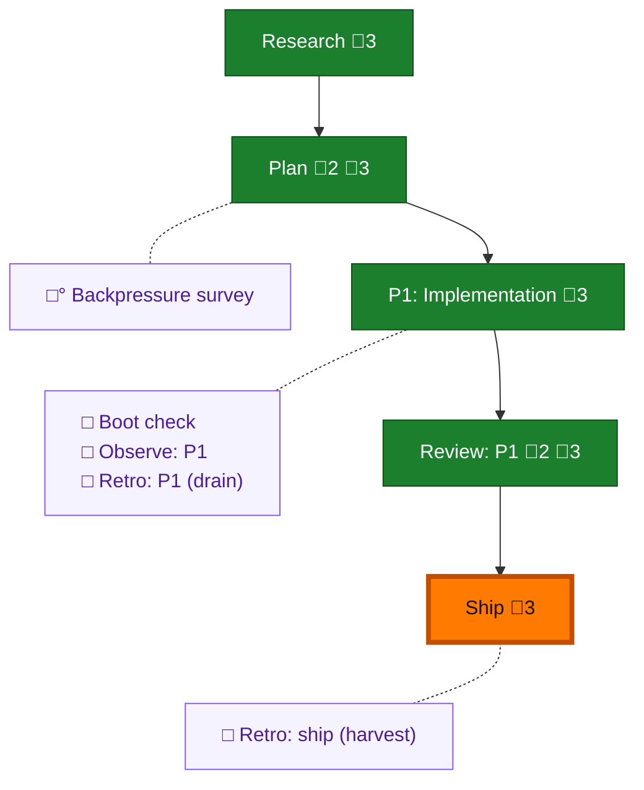

<!-- GENERATED by `harness flow render` — do not hand-edit; regenerate from the flow JSON. -->
# Flow · file-write-telemetry

**Kind**: flight-plan · **Now**: ship · **Next**: ship · **Intent**: Telemetry: when an agent writes a file, store the file path and its KB size, so we can see which files agents wrote. · **Nodes**: 10 · **Events**: 19

**Rail**: ◆─◆─[ ◆─◆─◆ ]  ◆ Research · ◆ Plan · [ ◆ P1: Implementation · ◆ Review: P1 · ◆ Ship ]

**Legend** — colour = type/status: 🟩 done · 🟢 in-progress · 🟥 blocked · 🟦 known · ⬜ assumed · 🔶 decision · 🗣 user input · 🟪 harness chore (faded = not yet done) · 🤖 companion · 🛠 worker · 🟧 current (you are here). Badges: 💬 comments · 📄 artifacts · 📝 instructions · 🧰 chore (° optional / recommended / ‼ strongly-recommended; ✓ done · ✕ skipped).

## Node log

### plan · Plan
- `2026-07-07T05:49:52.837Z` · — · decision — Locked pre-plan (D1-D5): full repo paths; out-of-repo→&lt;external&gt;; NO capture-time classification (downstream rubric); DELTAS not total size; deltas from tool payload (Edit old/new, Write content, apply_patch +/-) — no file read.
- `2026-07-07T06:08:18.980Z` · — · validation — Opus 4.8 /validate-v2 (source-level): NEEDS ATTENTION. Fixed: file t=capture-time + rollup.ts:190 exclusion; &lt;external&gt; is net-new confinement (relativizePath leaks basename); copilot create/edit read arguments body for counts; logs.ts encode+decode; AC-06 = activity-unchanged assertion. metrics.ts intentionally untouched.

### review-1 · Review: P1
- `2026-07-07T06:57:39.246Z` · — · validation — Cross-model review (gpt-5.5, Dim-0 mutation-evidenced): FIX_REQUIRED. HIGH regression — coder modified legacy relativizePath() to return &lt;external&gt;, breaking segment.test.ts:139/:160 (basename privacy negative-controls). Orchestrator independently confirmed 2 real test failures (coder's 840/840 claim was inaccurate). AC-01/02/04/05/06/07/08 verified PASS w/ mutation evidence. Fix dispatched: revert relativizePath, keep &lt;external&gt; only in confineFilePath. Finding 2 (missing execution.log.md) owned by orchestrator.
- `2026-07-07T07:01:07.155Z` · — · validation — APPROVE. Fix verified: relativizePath restored to basename; 840/840 telemetry suite + check:telemetry-fixtures green (orchestrator re-run, not coder-claimed). Reviewer's 7-AC PASS was Dim-0 mutation-evidenced. Sanity pass done.
