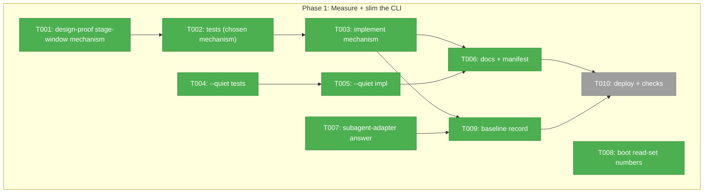
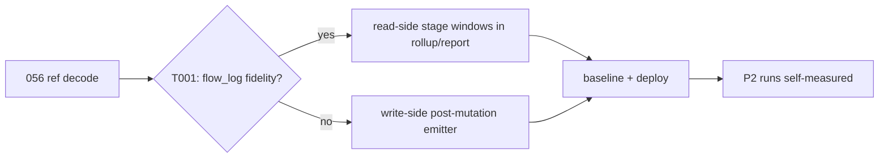

# Phase 1: Measure + slim the CLI — Tasks & Context Brief

**Plan**: `docs/plans/057-flow-token-efficiency/flow-token-efficiency-plan.md` (v1.1.0, READY)
**Phase**: 1 of 2 · **Generated**: 2026-07-10

### Executive Briefing

- **Purpose**: Make per-stage token attribution real on actual runs (today it's schema-true but capture-false — dossier F-10/V-01), and cut the flow's per-call CLI cost with a flow-local `--quiet`. Everything deploys before Phase 2 so the prose phase runs self-measured.
- **What We're Building**: a stage-window mechanism (read-side `flow_log` derivation primary, write-side post-mutation emitter fallback — T001 decides with evidence), the `--quiet` flag, guarded docs, the recorded baseline, and two evidence answers (subagent attribution; boot read-set numbers).
- **Goals**: ✅ >1 stage bucket in a real session report · ✅ byte-identical default envelopes, slimmer with `--quiet` · ✅ baseline/ record incl. the starvation proof · ✅ deployed CLI.
- **Non-Goals**: ❌ reference-tree restructure (D3) · ❌ new telemetry vocabulary/subagent capture (D5) · ❌ CLI-wide renderer changes (D1) · ❌ any gating/scoring.

### Pre-Implementation Check

| File | Exists? | Domain Check | Notes |
|------|---------|-------------|-------|
| `harness/cli/src/acts/flow.ts` | yes | harness-cli | `summary()` :100–111, `runMutation()` :1253–1277 |
| `harness/cli/src/app.ts` | yes | harness-cli | capture preamble :383–417 (pre-parse — V-01) |
| `harness/cli/src/output/output-port.ts` | yes | harness-cli | `CliIo` :19–29, no verbosity field today |
| `harness/cli/src/services/telemetry/capture-service.ts` | yes | harness-cli | `withFlowEvent` anchor; `withFlowLogEvents` projection |
| `harness/cli/src/services/telemetry/rollup.ts` + `report.ts` | yes | harness-cli | stage math excludes `flow_log` (:184 / events.ts:268–276) — policy, not data |
| `harness/cli/src/services/docs/docs-manifest.json` | yes | harness-cli | guide NOT listed today (V-02) |
| `docs/how/harness-flow.md` | yes | harness-cli | to update + manifest-list |
| `docs/plans/057-flow-token-efficiency/baseline/` | create | plan artifacts | T009 |
| this dir's `execution.log.md` | create (implement verb) | plan artifacts | evidence home for T001/T007/T008 |

### Architecture Map



### Tasks

| Status | ID | Task | Domain | Path(s) | Done When | Notes |
|--------|-----|------|--------|---------|-----------|-------|
| [x] | T001 | Design-proof the stage-window mechanism: decode the real 056 ref (`refs/harness-telemetry/2026/07/09/22583d3b…`), verify `cursor-moved` `flow_log` markers carry usable absolute `fired_at` + from/to; establish session-window clipping + monotonic guard viability; choose read-side (primary) vs write-side post-mutation emitter (fallback, full V-01 contract) | harness-cli | ref decode only (read-only) | decision + cited evidence recorded in execution.log.md; mechanism named for AC-01 | V-01; `events.ts:268-276` exclusion is clock-distortion policy |
| [x] | T002 | Tests first for the chosen mechanism. Read-side: rollup/report derive stage windows from clipped `flow_log`, additive `flow_stage_mechanism` value, a 056-derived fixture proves retroactive attribution; write-side: post-write emission w/ `from`/stage/status, `--next` excluded, envelope/exit unaffected on telemetry failure | harness-cli | `/Users/jordanknight/substrate/harness-engineering/harness/cli/test/**` (new) | red first, then green after T003; AC-01 | TDD; real fixtures (no mocks) |
| [x] | T003 | Implement the chosen mechanism | harness-cli | `/Users/jordanknight/substrate/harness-engineering/harness/cli/src/services/telemetry/{rollup,report}.ts` (read-side) or `acts/flow.ts`+`capture-service.ts` (write-side) | T002 green; `harness doctor` ok; existing suite green | Key Finding 01 |
| [x] | T004 | Tests first for `--quiet`: mutation `data` block suppressed with flag; default output **byte-identical** without it; a non-flow verb's envelope untouched | harness-cli | `/Users/jordanknight/substrate/harness-engineering/harness/cli/test/**` (new) | red first; AC-02, AC-03 | TDD |
| [x] | T005 | Implement flow-local `--quiet`: tri-state argv parse (`app.ts`, mirror `jsonFlag()` :66–74), `CliIo` verbosity field (additive), gate in `summary()`/`runMutation` | harness-cli | `/Users/jordanknight/substrate/harness-engineering/harness/cli/src/{app.ts,output/output-port.ts,acts/flow.ts}` | T004 green | D1 — never CLI-wide |
| [x] | T006 | Update `docs/how/harness-flow.md` (both changes) AND add it to `docs-manifest.json` (P12-reviewed); `npm run gen:docs` + `npm run check:docs` green | harness-cli | `/Users/jordanknight/substrate/harness-engineering/docs/how/harness-flow.md`, `.../src/services/docs/docs-manifest.json` | AC-04; check:docs genuinely guards the guide | V-02 |
| [x] | T007 | Answer AC-11: does the claude-code telemetry adapter fold subagent turns into the parent stream, or drop them? Read the adapter; corroborate against a subagent-heavy session ref if available | harness-cli | `/Users/jordanknight/substrate/harness-engineering/harness/cli/src/services/telemetry/adapters/**` (read-only) | answer + evidence in execution.log.md | feeds AC-09's delegation-confidence label |
| [x] | T008 | D3 evidence: quantify the guided-entry read set (bytes per forced file, both skills) and estimate what a compiled quick-card would save; record as follow-on candidate | builder skill | read-only measurement | numbers in execution.log.md; NO restructure | Non-Goal boundary |
| [x] | T009 | Write `baseline/` record: 056 session totals (59,049 in / 182,379 out), current-run `flow_stage` mechanism counts (starvation proof), and — if T003 landed read-side — the retroactive per-stage view of 056 | plan artifacts | `/Users/jordanknight/substrate/harness-engineering/docs/plans/057-flow-token-efficiency/baseline/` | AC-05; produced via `harness telemetry report`/`insights`, not hand-computed | consume F-11 tooling |
| [ ] | T010 | Deploy: `just build` (global relink); `harness checks` green; confirm the deployed binary carries the new mechanism (`harness flow --help` / a probe run) | harness-cli | repo root | P2 sessions capture under the new mechanism | deploy order: CLI first, then skill (P2) |

### Context Brief

**Environment-first posture** (builder SKILL.md invariant #14): environment friction is work, not an apology — fix small/reversible things, otherwise `harness observe` it, and pay every hard wall or proof-gap forward.

**Key findings from plan**:
- KF-01 (Critical): no post-mutation capture seam exists — capture is pre-parse (`app.ts:392`); T001's design-proof is the gate for T002/T003.
- KF-02: envelope duplication is a single-point fix (`summary()`/`runMutation`); no verbosity mechanism exists anywhere — `--quiet` is new surface.
- KF-06: cache tokens are never attributed per stage — the per-stage metric is fresh in+out only.
- KF-08 (eval): stacked mandates compete for budget — everything here stays suggestion-shaped; AC-10.

**Domain constraints**:
- Hexagonal: no `node:fs` in services; single `process.exit` site; `--quiet` threads through the `CliIo` port, never a global.
- Telemetry is counts-only, closed-vocab (constitution P12); stage values are bounded node slugs; telemetry must NEVER change a host command's output or exit (existing AC-09 of plan 034 — preserved by test in T002 write-side case).
- `the-flow.json` is CLI-written only.

**Reusable**:
- Telemetry fixture corpus (plan 037) for T002 fixtures; the decoded 056 ref (worker B's procedure: `git cat-file` the ref commit → `session.logs.jsonl`).
- `jsonFlag()` tri-state pattern (`app.ts:66–74`) as the `--quiet` parse template.

**Flow diagram**:


### Discoveries & Learnings

_Populated during implementation by the implement verb._

| Date | Task | Type | Discovery | Resolution | References |
|------|------|------|-----------|------------|------------|

```
docs/plans/057-flow-token-efficiency/
  ├── flow-token-efficiency-plan.md
  └── tasks/phase-1-measure-slim-cli/
      ├── tasks.md
      └── execution.log.md   # created by the implement verb
```
