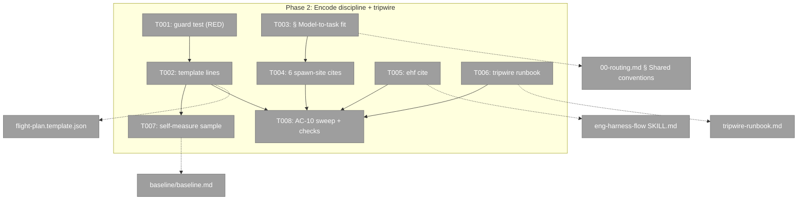
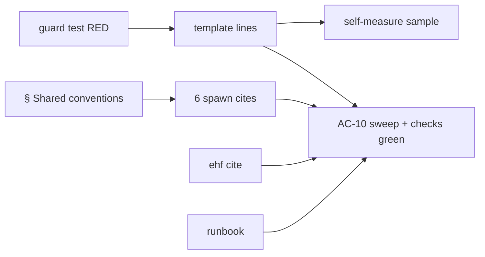
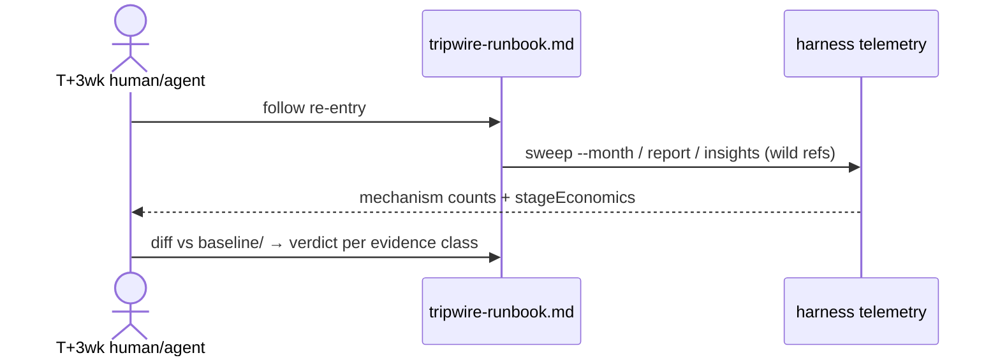

# Phase 2: Encode the discipline (both skills) + tripwire — tasks

**Plan**: `docs/plans/057-flow-token-efficiency/flow-token-efficiency-plan.md` (v1.1.0, READY)
**Phase**: 2 of 2 · CS-3 · Depends on Phase 1 (deployed — this session already runs under its capture)
**ACs owned**: AC-06, AC-07, AC-08, AC-09, AC-10 + the observed halves of AC-01/AC-05 (task 2.7)

## Executive Briefing

- **Purpose**: Phase 1 made per-stage token attribution real and the CLI lean; Phase 2 lands the *wording* — token discipline and model-to-task delegation — in the channels agents mechanically re-encounter (template `instructions[]`, § Shared conventions, spawn-site cites, one ehf mirror line), and installs the T+3wk wild-telemetry tripwire runbook so we find out whether any of it worked.
- **What we're building**: two ≤150B instruction lines pinned by a new guard test; one ~15-line delegation subsection cited from six spawn sites; a ≤3-line eng-harness-flow cite; `tripwire-runbook.md`; the self-measured "first after" baseline sample.
- **Goals**: ✅ guidance in re-read channels, not boot prose (Key Finding 03) · ✅ suggestion posture everywhere (AC-10) · ✅ the runbook separates capture-health proof from directional outcome (V-04) · ✅ this run itself becomes the first measured sample (D4).
- **Non-Goals**: ❌ boot read-set restructure (D3) · ❌ subagent attribution build (D5 — investigate only, done in T007-P1) · ❌ new parity-guarded block in ehf (D2) · ❌ any gating/scoring/blocking language.

## Prior Phase Context (Phase 1: Measure + slim the CLI — all 10 tasks ✅, reviewed APPROVE_WITH_NOTES, notes fixed)

**A. Deliverables**: read-side `flow_log` stage lens + `flow_log` mechanism bucket (`harness/cli/src/services/telemetry/report.ts`, schema); flow-local `--quiet` (`app.ts` `quietFlag`, `CliIo.quiet`, `acts/flow.ts` `runMutation`); `docs/how/harness-flow.md` + docs-manifest entry; `baseline/baseline.md` + `baseline/sweep-2026-07/`; new suites `flow-log-stage-lens.test.ts` + `flow-quiet.test.ts` (mutation-proven non-vacuous in review).
**B. Dependencies exported**: `FlowStageMechanism.flow_log`; `SessionView.cursorMarks`; `quietFlag(argv)`; the frozen default-envelope byte string (`flow-quiet.test.ts:135-137`) — do not disturb; deployed CLI (relinked), so *this* session's nav moves emit `cursor-moved` markers.
**C. Gotchas & debt**: canonical gate is `just test` — root `npx vitest run` sweeps `scratch/evals/**` and fails on Chromium (DL-002); `check:docs` prints diff-ish output while green pre-commit (CONF-001); capture runs pre-parse (`app.ts:383-417`) — there is no write-side post-mutation seam, which is *why* the lens is read-side; `flow_log` stays excluded from gap/wall math (`rollup.ts:177-191`) — policy, don't "fix".
**D. Incomplete carried forward**: retro-1 drain awaits the user's disposition answer (buffer holds 4 obs + new DL-003); 056 retro-ship harvest still due on the 056 flow.
**E. Patterns to follow**: TDD with named mutations documented in test headers; frozen-bytes pinning for envelope claims; real fixtures/refs, no mocks; test files reading real repo files via `readFileSync` have precedent (`retro-template.test.ts`).

## Pre-Implementation Check

| File | Exists? | Domain check | Notes |
|------|---------|-------------|-------|
| `harness/cli/test/services/flow/flight-plan-template.test.ts` | create | harness-cli test tree | **Discovery: the "template/lockstep test" the plan says to extend does not exist** — nothing pins the skill template's content (`gen:flows` bundles only CLI-owned `harness-loop`/`harness-adopt` templates; `flow-instructions.test.ts` proves round-trip mechanics, not content). T001 creates the guard. |
| `skills/builder/references/flight-plan.template.json` | ✅ | builder skill (contract) | grep-verified: zero token/tier/delegation lines today; nodes `phase-1`/`boot-1`/`observe-1` each carry 3–4 `instructions[]` lines |
| `skills/builder/references/00-routing.md` | ✅ | builder skill (contract) | § Shared conventions at line 259; subsections end at `### Harness router posture` (line 290) — new subsection lands there |
| `skills/builder/references/stages/{10-explore,20-plan,35-adr,50-phase-tasks,70-review,80-merge}.md` | ✅ ×6 | builder skill | the six spawn sites (F-07); cite + packet tier field each |
| `skills/eng-harness-flow/SKILL.md` | ✅ | eng-harness-flow skill (contract) | cite goes *outside* the `doctrine-parity:039` block; guard = `check:doctrine-parity` (warn-tier in `harness checks`) |
| `docs/plans/057-flow-token-efficiency/tripwire-runbook.md` | create | plan artifacts | the `tripwire-review` node already exists off `ship` with instructions (expander batch) — T006 writes the runbook only |
| `docs/plans/057-flow-token-efficiency/baseline/baseline.md` | ✅ | plan artifacts | T007 appends the "first after" self-measured sample |

Expander note (bounds T001/T002): per `flight-plan-ops.md:56` the plan-complete expander sources phase-N trios from **the template itself** — editing the template *is* the expander fix; the guard test proves clone-preservation via the real `applyBatch` path.

## Architecture Map



## Tasks

| Status | ID | Task | Domain | Path(s) | Done When | Notes |
|--------|-----|------|--------|---------|-----------|-------|
| [x] | T001 | Guard test first (**create**, plan said "extend" — see Pre-Impl discovery): read the real template via `readFileSync`; assert (a) one token-discipline line + one delegation/tier line present on `phase-1`, `boot-1`, `observe-1`; (b) each new line ≤150 bytes; (c) real `applyBatch` upsert cloning `phase-1`'s `instructions[]` to a `phase-2` node preserves them byte-identically (the expander path); (d) suggestion-posture: the new lines contain no gate/score/block wording. Named mutations in the header. RED before T002. | harness-cli | /Users/jordanknight/substrate/harness-engineering/harness/cli/test/services/flow/flight-plan-template.test.ts | test exists, fails RED on today's template for (a) | AC-06; Hybrid-TDD; precedent `retro-template.test.ts` |
| [x] | T002 | Add the two lines to `instructions[]` on `phase-1`, `boot-1`, `observe-1` (≤150B each, suggestion posture, context-override implied): token-discipline (spend where it changes the outcome; `--quiet` on flow mutations) + delegation/tier (chores→cheap subagent, analysis→Opus-class, judgement→lead; cite § Shared conventions). | builder skill | /Users/jordanknight/substrate/harness-engineering/skills/builder/references/flight-plan.template.json | T001 green; `just test` green | AC-06; Key Finding 03 |
| [x] | T003 | Write `### Model-to-task fit & delegation` in § Shared conventions (~15 lines): tier table (chores→cheap/Sonnet · analysis/review→Opus-class · judgement/hard-reviews→lead) · delegate-when/keep-when test · escalation rule · subagent output contract · explicit context-override clause; cite `harness-foundations/rules-of-why.md` R5–R6. Mine wording from AGENTS.md § Model-to-task fit (keep the two in agreement, don't duplicate rationale). | builder skill | /Users/jordanknight/substrate/harness-engineering/skills/builder/references/00-routing.md | subsection present once; grep `Model-to-task` hits § Shared conventions | AC-07 first half; quarry: spine § Source material |
| [x] | T004 | One-line cite at each of the six spawn sites + a `tier:` field in each worker-packet template where the module defines one. | builder skill | /Users/jordanknight/substrate/harness-engineering/skills/builder/references/stages/{10-explore,20-plan,35-adr,50-phase-tasks,70-review,80-merge}.md | `grep -l "Model-to-task" stages/*` returns exactly the six | AC-07 grep-provable |
| [x] | T005 | eng-harness-flow SKILL.md ≤3-line cite (token discipline + delegation posture, pointing at builder § or rules-of-why), placed OUTSIDE the parity block; run the parity guard. | eng-harness-flow skill | /Users/jordanknight/substrate/harness-engineering/skills/eng-harness-flow/SKILL.md | cite ≤3 lines; `npm run check:doctrine-parity` unchanged/green | AC-08; D2 |
| [x] | T006 | Write `tripwire-runbook.md`: exact re-entry procedure (pull post-deploy wild refs → `harness telemetry sweep/report/insights` → diff `stageEconomics` + `flow_stage` mechanism counts vs `baseline/`); **two separated evidence classes** (V-04): (a) capture-health = deterministic (mechanism counts, marker density, token_coverage), (b) directional outcome = stageEconomics deltas, labeled non-normalized; verdict table verdicts each class separately; delegation impact marked unmeasured/low-confidence per T007-P1's MIXED/SEPARATE finding (Agent-tool → `subagent_tokens`/`grand_total` side-channel; pij peers → own sessions, `telemetry get-fleet`). Node `tripwire-review` already placed — verify, don't re-add. | plan artifacts | /Users/jordanknight/substrate/harness-engineering/docs/plans/057-flow-token-efficiency/tripwire-runbook.md | runbook covers both classes + decision table; AC-09 wording satisfied | AC-09 + AC-11 reflection; user directive |
| [x] | T007 | Self-measure: `harness telemetry sweep --month 2026-07`, pull this P2 session's report; confirm >1 stage bucket and non-zero `flow_log`/`flow` mechanism counts (AC-01 observed half); append as "first after" sample to `baseline/baseline.md`. | plan artifacts | /Users/jordanknight/substrate/harness-engineering/docs/plans/057-flow-token-efficiency/baseline/baseline.md | baseline carries a dated "after" section with per-stage rows | AC-01 observed · AC-05 extended · D4 |
| [x] | T008 | Sweep: grep the phase diff for gating/scoring/blocking language (`must`, `gate`, `block`, `score`, `required` in new guidance lines — judgement, not regex-only); `harness checks` green (degraded = pre-existing warn-tier only). | both skills | (diff-wide) | AC-10 asserted in execution log with the grep evidence; checks green | reviewer re-asserts |

## Context Brief

**Environment-first posture** (builder SKILL.md invariant #14): friction is work — fix small things, otherwise `harness observe` it; the buffer already carries DL-003 (doctor --json ~12KB) from this session's boot.

**Key findings applied**: KF-03 (instructions[] is the ~1000×-cheaper channel — all new wording lands there or § Shared conventions, never SKILL.md invariants); KF-04 (state once, cite per site); KF-05 (ehf gets a cite, not a parity block); KF-08 (suggestion posture — evals showed stacked mandates compete for budget).

**Domain dependencies**:
- `harness-cli`: `applyBatch` (`flow-mutations.ts`) — the real expander mutation path T001 exercises; `harness telemetry sweep/report` — T007's evidence tooling.
- `builder skill`: § Shared conventions is the single home for deduped blocks — stage modules cite, never restate (progressive-disclosure exception 1).
- `eng-harness-flow skill`: `doctrine-parity:039` block is byte-mirrored with builder's `harness-seams.md` — T005 must not touch it.

**Domain constraints**: template edits must keep `harness flow create --template` round-trip green (T001 asserts via real mutation code, `just test` catches schema drift); skills prose changes carry no test tier — the guard test (T001) is deliberately the *only* mechanical pin, everything else is grep-provable in review.

**Reusable from prior phases**: frozen-bytes pinning pattern; named-mutation test headers; `baseline/baseline.md` structure (before-section headings to mirror for the after-sample); T007-P1's adapter evidence (execution log § T007) feeds T006 verbatim.

**Flow diagram**:


**Sequence (tripwire re-entry, what T006 encodes)**:


## Discoveries & Learnings

_Populated during implementation by the implement verb._

| Date | Task | Type | Discovery | Resolution | References |
|------|------|------|-----------|------------|------------|
| 2026-07-10 | (tasks) | insight | The plan's "extend the template/lockstep test" has no referent — no test pins the skill template's content today | T001 creates the guard test instead (plan-reality delta, recorded here for the validator) | Pre-Impl table row 1 |

## Directory layout

```
docs/plans/057-flow-token-efficiency/
  ├── flow-token-efficiency-plan.md
  ├── baseline/baseline.md            # T007 appends "after"
  ├── tripwire-runbook.md             # T006 creates
  └── tasks/phase-2-encode-discipline-tripwire/
      ├── tasks.md                    # this file
      └── execution.log.md            # created by the implement verb
```
