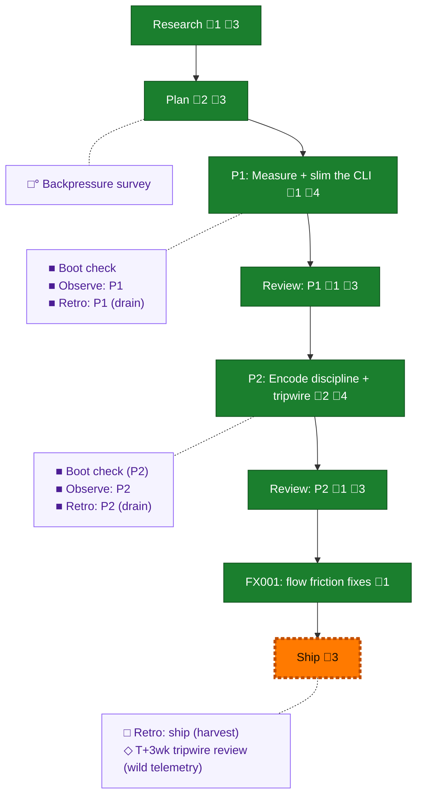

<!-- GENERATED by `harness flow render` — do not hand-edit; regenerate from the flow JSON. -->
# Flow · flow-token-efficiency

**Kind**: flight-plan · **Now**: ship · **Next**: ship · **Intent**: Ship 057: PR with P1 (measure+quiet) + P2 (discipline+tripwire) + FX001 (friction batch) · **Nodes**: 17 · **Events**: 52

**Rail**: ◆─◆─[ ◆─◆─◆─◆─◆─◇ ]  ◆ Research · ◆ Plan · [ ◆ P1: Measure + slim the CLI · ◆ Review: P1 · ◆ P2: Encode discipline + tripwire · ◆ Review: P2 · ◆ FX001: flow friction fixes · ◇ Ship ]

**Legend** — colour = type/status: 🟩 done · 🟢 in-progress · 🟥 blocked · 🟦 known · ⬜ assumed · 🔶 decision · 🗣 user input · 🟪 harness chore (faded = not yet done) · 🤖 companion · 🛠 worker · 🟧 current (you are here). Badges: 💬 comments · 📄 artifacts · 📝 instructions · 🧰 chore (° optional / recommended / ‼ strongly-recommended; ✓ done · ✕ skipped).

## Node log

### research · Research
- `2026-07-10T01:49:03.803Z` · — · warning — F-10: 056 baseline is FlowEvent-starved (2 events); per-stage verification blocked until stage-transition emission exists — capture-density task likely phase-1 material

### plan · Plan
- `2026-07-10T02:03:09.979Z` · — · note — Cross-model validation delegated to pij peer pij-oa9v2o (copilot gpt-5.6-sol, --once) running /validate-v2 — replaces the in-window auto-run per user directive + delegation doctrine
- `2026-07-10T02:10:06.134Z` · — · validation — Cross-model verdict NEEDS ATTENTION → 4 findings folded → v1.1.0. Sidecar: validations/flow-token-efficiency-plan-validation.md

### phase-1 · P1: Measure + slim the CLI
- `2026-07-10T02:22:03.951Z` · — · validation — P1 tasks dossier tabled (T001-T010) + validated clean by Opus subagent (1:1 traceability, all source anchors verified; 2 LOW notes in sidecar validations/phase-1-measure-slim-cli-tasks-validation.md)

### review-1 · Review: P1
- `2026-07-10T02:49:46.808Z` · — · validation — Cross-model review (pij gpt-5.6-sol): APPROVE_WITH_NOTES — Dim-0 mutation-proven both suites; 2 MEDIUM notes verified + fixed inline (frozen-bytes envelope test; guide claim narrowed). reviews/review.phase-1.md

### phase-2 · P2: Encode discipline + tripwire
- `2026-07-10T03:09:32.229Z` · — · — — Tasks dossier written (T001–T008) + validated by Opus subagent: VALIDATED, no material issues (validations/phase-2-encode-discipline-tripwire-tasks-validation.md). Key delta: lockstep test doesn't exist — T001 creates it.
- `2026-07-10T03:29:43.006Z` · — · — — Implemented via flow-pair fleet: coder pij-2fzznb (copilot gpt-5.6-sol), whole-phase packet dlg-0001; T007 orchestrator-local (flow_stage 3 buckets, flow_log 1→2). Commit b7b4b838.

### review-2 · Review: P2
- `2026-07-10T03:29:43.750Z` · — · — — Cross-model review (pij gpt-5.6-sol, flow-pair rev-0001): APPROVE, 0 findings, Dim-0 mutation-proven with sha256 restore proof (reviews/review.phase-2.md). Orchestrator sanity pass: template lines + parity block + tier § verified by eye.

### retro-2 · Retro: P2 (drain)
- `2026-07-10T03:34:52.498Z` · — · — — Combined P1+P2 drain: 9 observations saved to .harness/records/retro/2026-07-10/001-057-flow-token-efficiency.md. DL-001 encoded (fixed by this plan); 6 routed to FX001 fix dossier per user; CONF-002/3 routed upstream (learn-0001).

### fix-1 · FX001: flow friction fixes
- `2026-07-10T03:54:11.046Z` · — · — — FX001 complete: coder dlg-0003, reviewer FIX_REQUIRED→APPROVE (one HIGH = orchestrator packet-fence miss, fixed locally + reviewer re-checked). Dim-0 proven. Commit ac6724e3. Ledger rev-0002 artifact-gate false-flag recorded as learn-0002.
