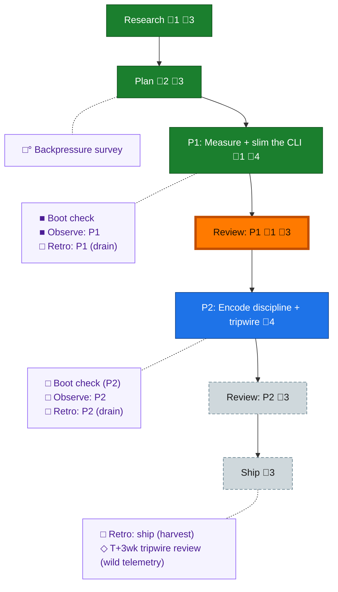

<!-- GENERATED by `harness flow render` — do not hand-edit; regenerate from the flow JSON. -->
# Flow · flow-token-efficiency

**Kind**: flight-plan · **Now**: review-1 · **Next**: phase-2 · **Intent**: Make builder + eng-harness-flow treat every token as gold: lean writing, lean build consumption, right-model/subagent delegation, and token-efficiency as a first-class harness-improvement target — measured against real telemetry (056 run as baseline) · **Nodes**: 16 · **Events**: 34

**Rail**: ◆─◆─[ ◆─◆─◇─◇─◇ ]  ◆ Research · ◆ Plan · [ ◆ P1: Measure + slim the CLI · ◆ Review: P1 · ◇ P2: Encode discipline + tripwire · ◇ Review: P2 · ◇ Ship ]

**Legend** — colour = type/status: 🟩 done · 🟢 in-progress · 🟥 blocked · 🟦 known · ⬜ assumed · 🔶 decision · 🗣 user input · 🟪 harness chore (faded = not yet done) · 🤖 companion · 🛠 worker · 🟧 current (you are here). Badges: 💬 comments · 📄 artifacts · 📝 instructions · 🧰 chore (° optional / recommended / ‼ strongly-recommended; ✓ done · ✕ skipped).

## Node log

### research · Research
- `2026-07-10T01:49:03.803Z` · — · warning — F-10: 056 baseline is FlowEvent-starved (2 events); per-stage verification blocked until stage-transition emission exists — capture-density task likely phase-1 material

### plan · Plan
- `2026-07-10T02:03:09.979Z` · — · note — Cross-model validation delegated to pij peer pij-oa9v2o (copilot gpt-5.6-sol, --once) running /validate-v2 — replaces the in-window auto-run per user directive + delegation doctrine
- `2026-07-10T02:10:06.134Z` · — · validation — Cross-model verdict NEEDS ATTENTION → 4 findings folded → v1.1.0. Sidecar: validations/flow-token-efficiency-plan-validation.md

### phase-1 · P1: Measure + slim the CLI
- `2026-07-10T02:22:03.951Z` · — · validation — P1 tasks dossier tabled (T001-T010) + validated clean by Opus subagent (1:1 traceability, all source anchors verified; 2 LOW notes in sidecar validations/phase-1-measure-slim-cli-tasks-validation.md)

### review-1 · Review: P1
- `2026-07-10T02:49:46.808Z` · — · validation — Cross-model review (pij gpt-5.6-sol): APPROVE_WITH_NOTES — Dim-0 mutation-proven both suites; 2 MEDIUM notes verified + fixed inline (frozen-bytes envelope test; guide claim narrowed). reviews/review.phase-1.md
