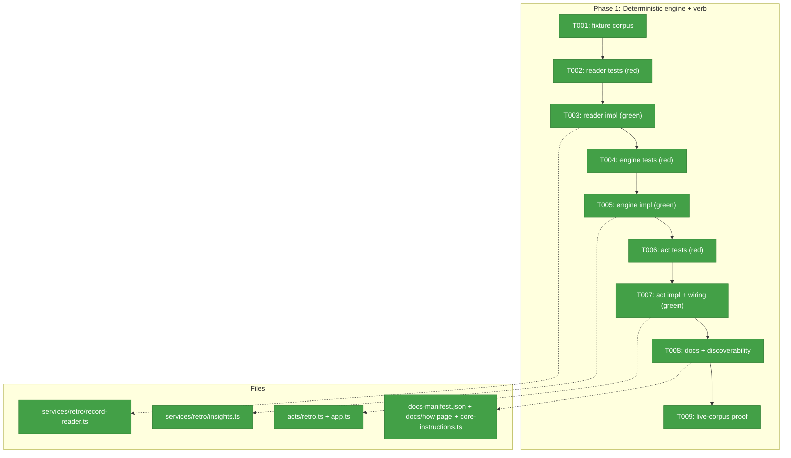
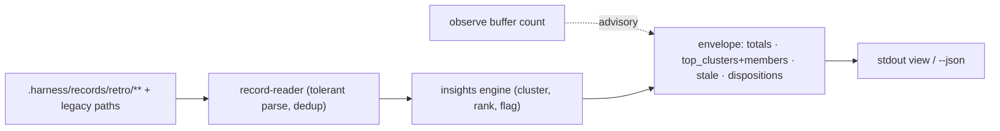
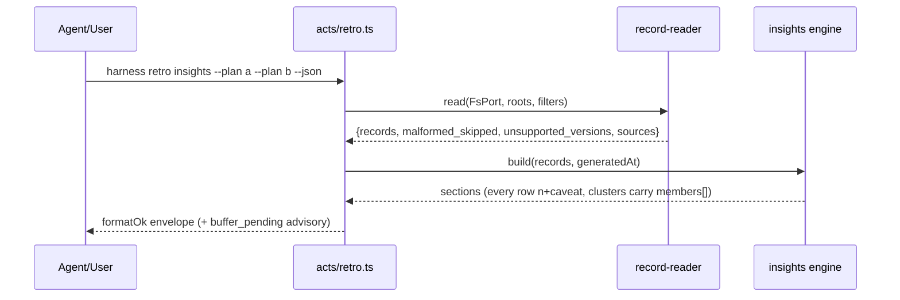

# Phase 1 Tasks — Deterministic engine + `harness retro insights`

**Plan**: [harness-retro-insights-plan.md](../../harness-retro-insights-plan.md) (v1.1.0, READY)
**Phase**: Phase 1: Deterministic engine + `harness retro insights`
**Created**: 2026-07-12

### Executive Briefing

- **Purpose**: Ship the deterministic engine of the cross-plan retro leverage report — a `harness retro insights` core verb that scans committed retro records across 1..N plans, clusters and ranks them per the frozen harvest doctrine, and emits an honest stdout/`--json` report where every number is computed and every row carries `n` + caveat. This moves the harvest's scan/cluster/prioritize inference out of tokens into substrate (Rule 6), and is the anticipated offline recurrence analysis the plan-056 disposition design feeds.
- **What We're Building**: a tolerant record reader (hand-rolled frontmatter parser — no YAML lib, constitution P10), a pure insights engine (048 row/section vocabulary: `makeRow`, `N_THRESHOLD`, suppress-low-n), and a new `retro` act with an `insights` subcommand — all TDD against an authored fixture corpus, then proven on the real corpus (~35 records / ~182 entries as of 2026-07-12: 133 open / 26 suggested / 23 encoded — live numbers, re-derived at T009, never asserted as fixed).
- **Goals**:
  - ✅ AC-01…AC-08 pass at engine/act level (envelope, `members[]` provenance, scope filters, determinism, tolerance, ranking, deferred streaks, read-only, buffer advisory)
  - ✅ AC-12 discoverability (docs-manifest + gen:docs, `CORE_INSTRUCTIONS`, `--help`)
  - ✅ Zero new runtime dependencies; architecture tests + arch-check stay green
- **Non-Goals**:
  - ❌ No skill/router edits (Phase 2)
  - ❌ No HTML renderer (plan non-goal, v1)
  - ❌ No mutation of `system.compound.status` (read-only verb; lifecycle ops stay with the harvest agent)
  - ❌ No new record kinds/statuses/schema fields (015 freeze)

### Prior Phase Context

_None — this is Phase 1._

### Pre-Implementation Check

| File | Exists? | Domain Check | Notes |
|------|---------|-------------|-------|
| `harness/cli/src/acts/retro.ts` | create | harness-cli-core ✓ | act = composition root only (P2); register in `app.ts` beside `registerObserveAct` (app.ts:283) |
| `harness/cli/src/services/retro/record-reader.ts` | create | harness-cli-core ✓ | pure service; FsPort injected; no `node:*` imports (architecture test enforces) |
| `harness/cli/src/services/retro/insights.ts` | create | harness-cli-core ✓ | pure; `generatedAt` injected (no clock reads) |
| `harness/cli/test/services/retro/fixtures.ts` | create | harness-cli-core ✓ | corpus as FakeFs `files`+`dirs` seed maps (FakeFs ctor: `fake-fs.ts:39`) |
| `harness/cli/test/services/retro/record-reader.test.ts` | create | harness-cli-core ✓ | mirror `test/services/telemetry/insights.test.ts` conventions |
| `harness/cli/test/services/retro/insights.test.ts` | create | harness-cli-core ✓ | hand-built typed inputs (048 convention) |
| `harness/cli/test/acts/retro.test.ts` | create | harness-cli-core ✓ | act-level: FakeFs walk + envelope + flags |
| `harness/cli/src/app.ts` | modify | harness-cli-core ✓ | one `registerRetroAct(program, io, deps)` line |
| `harness/cli/src/services/instructions/core-instructions.ts` | modify | harness-cli-core ✓ | core verbs have NO per-verb instructions.md slot (reuse-scan F10) |
| `harness/cli/src/services/docs/docs-manifest.json` | modify | harness-cli-core ✓ | allow-list entry for the new docs/how page → `gen:docs` bakes `docs-content.ts` |
| `docs/how/harness-retro-insights.md` | create | harness-cli-core ✓ | user-facing verb doc |

**Duplication check**: no existing service parses record bodies (`record-service.ts:183` writes only; "CLI never parses it" `contract.ts:30`); no `retro` verb registered anywhere (doctor lists 10 extensions, none claim it) — clean to create.

### Architecture Map



### Tasks

| Status | ID | Task | Domain | Path(s) | Done When | Notes |
|--------|-----|------|--------|---------|-----------|-------|
| [x] | T001 | Author the fixture corpus as FakeFs seed maps: ≥6 records across ≥3 plans mixing schema 1.0/1.1/1.2; one malformed frontmatter file; one unknown-major (`2.0`) file; legacy-path files (`docs/harness/agents/**.retro.md`, `docs/retros/*.md`) incl. one `retro_id` duplicated against canonical (dedup case); a ≥2× `declined`/`deferred` streak on one `(kind,target)`; proof-gap targets (`project-sensor`, `schema`); a deviant `kind` value (`worker-harvest`); entries with/without `severity`, `disposition`, `fp`, `system.compound.status` | harness-cli-core | /Users/jordanknight/substrate/harness-engineering/harness/cli/test/services/retro/fixtures.ts | Module exports `files` + `dirs` maps consumed by all three suites; every AC-04/AC-06 deviation represented | Plan 1.1; deviations mirror the real corpus (plan Key Finding 07) |
| [x] | T002 | Write the failing reader suite: frontmatter split (`---` fences), record fields (`retro_id`, `agent`, `plan_id`, `started_at`), `entries[]` block parse (id/kind/description/target/severity/disposition/fp/`system.compound.status`), tolerance (malformed file → skipped+counted, never throw), unknown-major counted in `unsupported_versions[]`, minor skew silent, `retro_id` dedup precedence canonical → `docs/harness/agents/**` → `docs/retros/*`, legacy walk incl. `*.legacy.md` skip, deviant `kind` passes through raw | harness-cli-core | /Users/jordanknight/substrate/harness-engineering/harness/cli/test/services/retro/record-reader.test.ts | Suite exists and fails against an empty stub (red) | Plan 1.2; precedence per retro.md:411; TDD gate G6 |
| [x] | T003 | Implement `record-reader.ts` to green: pure service, `FsPort` injected; recursive walk copied from `sweepBySuffix`/`walk` (acts/telemetry.ts:335 — `readdir`-recursion, never throws, sorted); hand-rolled line/regex parser extending the `buffer-codec.ts` pattern (`FIELD_PATTERN`/`unquote` style — NO yaml lib, P10); returns typed `{records, malformed_skipped, unsupported_versions, sources}` | harness-cli-core | /Users/jordanknight/substrate/harness-engineering/harness/cli/src/services/retro/record-reader.ts | T002 suite green; no `node:*` imports (architecture test green) | Plan 1.3; Key Findings 01, 06 |
| [x] | T004 | Write the failing engine suite: cluster key `(kind, target)`; ranking recurrence → severity (`blocking`>`degrading`>`annoying`>none) → leverage → age (oldest `first_seen_at`); two-signal leverage (`proof_gap_signal: "target"` for the 5-target set + magic-wand-naming-check, `"keyword"` for the recognizer heuristic — `infra`/`tooling` boost only via keyword); `repeatedly_deferred` at ≥2 declined/deferred; stale flags (`open`>4wk, `suggested`>2wk w/o `resolved_by`, relative to injected `generatedAt`); **cluster `members[]` = `[{record_path, retro_id, entry_id, status}]`**; sections totals/top_clusters/stale/disposition_mix_records; `makeRow` refusal (missing `n`/`caveat` → throw); low-n fold into visible `other (n<5)`; determinism (two runs byte-identical minus `generated_at`) | harness-cli-core | /Users/jordanknight/substrate/harness-engineering/harness/cli/test/services/retro/insights.test.ts | Suite exists and fails against an empty stub (red) | Plan 1.4 + V-01; doctrine at retro.md:416-419, :178; 048 vocabulary |
| [x] | T005 | Implement `insights.ts` to green: pure, `generatedAt` parameter (never reads a clock); copy the 048 shapes (`InsightRow`/`InsightSection`/`makeRow`/`N_THRESHOLD=5`/suppress-low-n — copied, NOT imported; the telemetry generators are report-bound, Key Finding 03); `schema_version: "harness.retro-insights/v1"`; top-10 cluster cap matching harvest's view | harness-cli-core | /Users/jordanknight/substrate/harness-engineering/harness/cli/src/services/retro/insights.ts | T004 suite green | Plan 1.5 + V-01; Key Findings 02, 03 |
| [x] | T006 | Write the failing act suite: `harness retro insights` flag surface (`--plan` repeatable, `--since <ISO>`, `--kind`, `--agent`, `--json`); default scope = all sources with per-source counts; filters compose; `buffer_pending` advisory from `listObservations` (observe-service.ts:224) never merged into cluster numbers; read-only (FakeFs write log empty; `system.compound.status` untouched); envelope via `formatOk` with `evidence[]`; human stdout view renders headline + top clusters | harness-cli-core | /Users/jordanknight/substrate/harness-engineering/harness/cli/test/acts/retro.test.ts | Suite exists and fails (red) | Plan 1.6; AC-02/07/08; mirror `insights-act.test.ts` conventions |
| [x] | T007 | Implement `acts/retro.ts` to green and wire it: commander `retro` command + `insights` subcommand; compose reader+engine+`listObservations`; inject `deps.fs`/`deps.clock`; register `registerRetroAct(program, io, deps)` in `app.ts` beside observe (app.ts:283); rich `--help` descriptions | harness-cli-core | /Users/jordanknight/substrate/harness-engineering/harness/cli/src/acts/retro.ts, /Users/jordanknight/substrate/harness-engineering/harness/cli/src/app.ts | T006 suite green; `just test` fully green | Scope expansion granted for the two exact command-list test assertions; full suite passed 2307/2307. |
| [x] | T008 | Docs + discoverability: write `docs/how/harness-retro-insights.md` (what it computes, scope flags, JSON contract incl. `members[]`, epistemics); add it to `docs-manifest.json`; run `npm run gen:docs`; add the verb to `CORE_INSTRUCTIONS` (core acts have no per-verb instructions.md slot — reuse-scan F10) | harness-cli-core | /Users/jordanknight/substrate/harness-engineering/docs/how/harness-retro-insights.md, /Users/jordanknight/substrate/harness-engineering/harness/cli/src/services/docs/docs-manifest.json, /Users/jordanknight/substrate/harness-engineering/harness/cli/src/services/instructions/core-instructions.ts | `npm run check:docs` green; `harness docs` lists the page; `harness instructions` names the verb | `check:docs` clean; help lists every scoped flag; docs and core instructions expose the verb. |
| [x] | T009 | Live-corpus proof: `npm run build`, then run `harness retro insights` (human) and `--json` over this repo's real corpus (~35 records / ~182 entries as of 2026-07-12 — it grows); verify zero crashes, skip counters + parsed records account for every scanned file, and **internal consistency: status counts sum to total entries** (`open+suggested+encoded+wontfix+…+other == entries`) — never a frozen ratio; cross-check one hand-counted record; record output + counters in the execution log | harness-cli-core | (run evidence → execution.log.md) | Built human and JSON runs completed without error; 48 scanned files were fully accounted for and 182 lifecycle statuses summed exactly to 182 entries. | Live counters recorded below; no frozen ratio asserted. |

### Context Brief

**Environment-first posture** (builder SKILL.md invariant #14): environment friction is work, not an apology — fix small/reversible things, otherwise `harness observe` it, and pay every hard wall or proof-gap forward for the next agent.

**Key findings from plan** (full table: plan § Key Findings):
- Finding 01 (Critical): NO yaml lib — hand-roll on the `buffer-codec.ts` pattern; constitution P10.
- Finding 02 (Critical): 048 epistemics — every row `{n, caveat}`, LLM never computes a number; copy `makeRow`/`N_THRESHOLD` vocabulary.
- Finding 03: telemetry generators are report-bound — build record-derived parallels, don't import them.
- Finding 04: harvest doctrine is the scoring spec (retro.md:416-419) — encode verbatim, don't invent.
- Finding 05: no on-disk writes (KISS D4) — stdout/`--json` only.
- V-01 (validation, CRITICAL): every cluster carries `members[]` provenance so Phase 2's lifecycle ops can act without re-scanning.

**Domain dependencies** (contracts this phase consumes):
- `output kernel`: `formatOk`/`formatError`/`formatUnconfigured` (envelope.ts:72/129/114), `exitWithEnvelope` (exit.ts:38) — the envelope + exit contract
- `adapters/fs`: `FsPort` (`readdir`/`readText`→null-never-throws/`exists`, fs-port.ts:11-15) + `FakeFs(files, dirs)` (fake-fs.ts:39)
- `services/observe`: `listObservations` (observe-service.ts:224) — the `buffer_pending` advisory
- `acts/telemetry.ts:335`: `sweepBySuffix`/`walk` — the ~15-line FsPort recursion to copy
- `services/telemetry/insights.ts`: `InsightRow`/`InsightSection`/`makeRow`:174/`N_THRESHOLD`:46 — vocabulary to copy

**Domain constraints**:
- Entrypoint → Act → Service → Port; services import ports only, never `node:*` (architecture tests + arch-check enforce)
- Single `process.exit` site (output kernel); acts emit envelopes, never raw strings
- No new runtime dependencies (commander + jiti only)
- Retro schema is FROZEN (skills/eng-harness-flow/references/retro.schema.json, v1.2) — the reader re-encodes its enums in TS (mirroring `OBSERVATION_KINDS`), requests no schema change

**Reusable from prior phases**: none (Phase 1) — reuse surfaces are cross-repo, listed above.

**Mermaid flow diagram** (data path):


**Mermaid sequence diagram**:


### Discoveries & Learnings

_Populated during implementation by the implement verb._

| Date | Task | Type | Discovery | Resolution | References |
|------|------|------|-----------|------------|------------|
| 2026-07-12 | T007 | Noteworthy | Registering the required core verb changes the exact command list pinned by three assertions in `test/app.test.ts` and `test/index.test.ts`, but those files were omitted from the delegation's original allowed scope. | Orchestrator granted a narrow scope expansion; only the three expected-name arrays were updated, and 60 targeted wiring/docs tests passed. | Full `just test` run; AC-12 wiring |
| 2026-07-12 | T003 | Noteworthy | Independent validation found that an unterminated quoted scalar could absorb later YAML structure while the record still counted as parsed. | Added a RED regression for top-level and entry scalars; the reader now rejects the whole record and increments `malformed_skipped`. | `record-reader.test.ts`; AC-04 |

```
docs/plans/058-harness-retro-insights/
  ├── harness-retro-insights-plan.md
  └── tasks/phase-1-deterministic-engine/
      ├── tasks.md
      └── execution.log.md   # created by the implement verb
```
