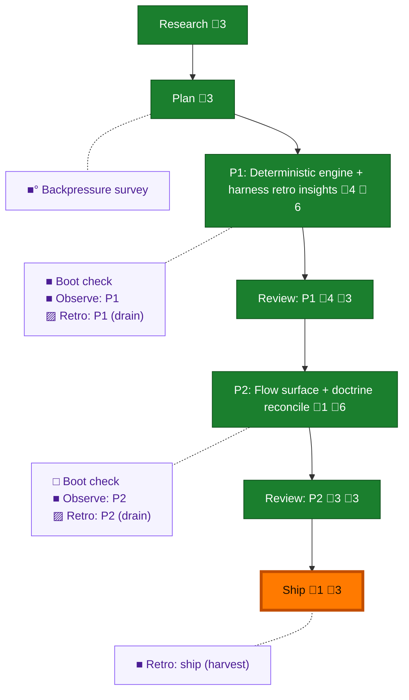

<!-- GENERATED by `harness flow render` — do not hand-edit; regenerate from the flow JSON. -->
# Flow · harness-retro-insights

**Kind**: flight-plan · **Now**: ship · **Next**: ship · **Intent**: a new eng-harness-flow command that reviews harness observations and retros across a plan or n-plans and reports the most valuable things to work on next to make engineering in the given repo better · **Nodes**: 15 · **Events**: 49

**Rail**: ◆─◆─[ ◆─◆─◆─◆─◆ ]  ◆ Research · ◆ Plan · [ ◆ P1: Deterministic engine + harness retro insights · ◆ Review: P1 · ◆ P2: Flow surface + doctrine reconcile · ◆ Review: P2 · ◆ Ship ]

**Legend** — colour = type/status: 🟩 done · 🟢 in-progress · 🟥 blocked · 🟦 known · ⬜ assumed · 🔶 decision · 🗣 user input · 🟪 harness chore (faded = not yet done) · 🤖 companion · 🛠 worker · 🟧 current (you are here). Badges: 💬 comments · 📄 artifacts · 📝 instructions · 🧰 chore (° optional / recommended / ‼ strongly-recommended; ✓ done · ✕ skipped).

## Node log

### phase-1 · P1: Deterministic engine + harness retro insights
- `2026-07-12T03:49:37.764Z` · — · validation — tasks.md validated by Opus validate-v2 subagent: NEEDS ATTENTION (1 MEDIUM, TV-01 stale corpus-ratio anchor in T009) -&gt; resolved: T009 now asserts internal consistency (status counts sum to entries), never a frozen ratio; stale numbers corrected at source (dossier F-07, plan Research Context). All ~18 line citations verified current; full plan-task coverage; TDD ordering intact. Sidecar: validations/tasks-phase-1-deterministic-engine-validation.md
- `2026-07-12T07:37:05.608Z` · — · note — mockup-end-result.md added to the plan folder: three faces of the end result (human terminal view, --json AC-01 contract with members[] provenance, flow-surface narration) + the end-to-end user story; illustrative, corpus-grounded
- `2026-07-12T08:11:29.960Z` · — · note — flow-pair run 2026-07-12T08-09-15Z started: whole-phase packet dlg-0002 dispatched to coder pij-zygomorphic-bird (copilot gpt-5.6-sol xhigh, canary passed); reviewer lazy-spawns at first REVIEW; roster sidecar persisted
- `2026-07-12T08:22:11.921Z` · — · decision — Scope expansion granted to coder (dlg-0002): app.test.ts + index.test.ts command-list assertions only, to register 'retro' — verified before granting (both enumerate expected core command names). Coder at T007, T001-T006 complete (TDD order held).

### review-1 · Review: P1
- `2026-07-12T08:42:29.882Z` · — · note — Coder dlg-0002 COMPLETE (2308/2308, hard gates clean, live-proof internally consistent). Coder compacted. Reviewer pij-evil-meerkat (gpt-5.6-sol xhigh, canary passed) dispatched with Dim-0 mutation gate + AC-01/03/07/V-01 + P10/arch checks. Orchestrator sanity pass pending on verdict return.
- `2026-07-12T08:48:46.011Z` · — · validation — Reviewer verdict FIX_REQUIRED (2 HIGH, 1 MED). Orchestrator sanity pass: all 3 findings VERIFIED in source myself — F1 record-reader.ts:297 status read from flat field bag (any namespace shadows system.compound.status → corrupts headline totals); F2 insights.ts:358 proof_gap collapsed to boolean, violates AC-05 two-signal target&gt;keyword&gt;none; F3 inline-comment-after-quoted-scalar tolerance gap. Dim-0 mutation proven (RED-&gt;GREEN, SHA identical). Genuine review, not rubber-stamp. Dispatching fix.
- `2026-07-12T08:49:52.930Z` · — · note — Fix packet dlg-0002-fix dispatched to coder (compacted, warm): F1 status-from-compound-only + multi-namespace negative test; F2 proof_gap_signal target&gt;keyword&gt;none rank before age + asymmetric ordering test; F3 inline-comment strip + quoted/unquoted regression. Gate: just fix + harness checks + retro suites green.
- `2026-07-12T08:55:30.151Z` · — · validation — APPROVE (orchestrator-verified). Fix cycle complete: F1 verified in source (path-stack nesting, compound-only lifecycle w/ legacy fallback — producer.status can't shadow); F2 verified (proofGapRank target&gt;keyword&gt;none before age = AC-05); F3 fixed. Independent Dim-0: I mutated the F2 rank to 0 myself → the new 'ranks target proof gaps ahead of older keyword' test went RED; restored, 25/25 retro + full suite green. Coder RED-proof corroborated. Buck stops here — verdict survives my eye.

### ship · Ship
- `2026-07-12T22:59:41.116Z` · agent · note — Shipped: PR #66 https://github.com/AI-Substrate/harness-engineering/pull/66 (branch 058-harness-retro-insights). Telemetry flushed. Blind cross-model conformance PASS. 6 observe-buffer entries left pending for a future drain. · refs: 6b2b38dc

### phase-2 · P2: Flow surface + doctrine reconcile
- `2026-07-12T08:56:49.805Z` · — · note — Phase 2 packet dlg-0003 dispatched to warm coder: T101 harvest consumes verb (Steps 1-3 → verb call, view/menu/ops preserved, doctrine-parity honored); T102 compound-value refs closed; T103 additive at=insights (route not redirect); T104 optional SKILL touch; T105 redeploy-then-validate. CLI code forbidden (P1 approved).

### review-2 · Review: P2
- `2026-07-12T09:03:19.022Z` · — · note — Phase 2 done (dlg-0003). Orchestrator pre-verified: compound-value=0 hits; at=insights present w/ route-not-redirect (00-routing:282); narration-restates line (retro.md:414); action menu intact (15 refs); 00-routing purely additive (0 deletions, git-confirmed); cross-artifact field names match real verb (headline/sections/sources). Dispatched focused doc-only review to pij-evil-meerkat (Dim-0 N/A).
- `2026-07-12T09:05:41.828Z` · — · validation — Phase 2 reviewer FIX_REQUIRED (1 HIGH, 1 MED) — both VERIFIED by me against the live envelope. HIGH: retro.md:425-433 retained template shows non-emitted values (representative 'grep/search slowness', 'across 5 sessions', 're-paid every session', 'Recently encoded last 7d: 6 entries — scratch/encode-*.diff'); real cluster rows emit claim/n/first_seen_at/values/proof_gap only, NO recently_encoded section → violates AC-09 restate-only. MED: tasks.md:14 says data.{totals,top_clusters} top-level but they're nested under data.sections.*. Reviewer caught what my spot-check missed. Dispatching fix.
- `2026-07-12T09:09:24.109Z` · — · validation — APPROVE (orchestrator-verified field-by-field this pass — the discipline I under-applied on the first Phase-2 glance). Fix cycle resolved both findings: every value in the rewritten Step-4 template maps to an emitted key (headline.agents/records/date_range/entries/status_counts; top_clusters n/first_seen_at/proof_gap/repeatedly_deferred; stale claim/n/entry_id; totals), verified against live envelope; stale phrases grep=0; tasks.md envelope shape corrected; redeployed; harness checks exit 0. AC-09/10/11 all satisfied.
