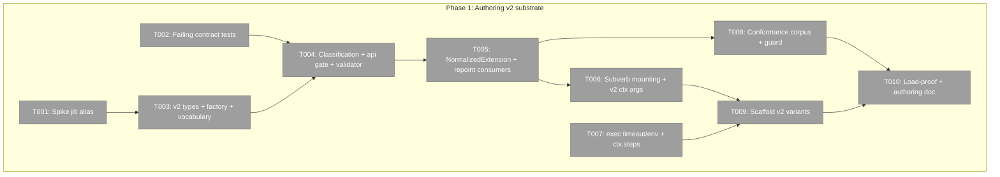
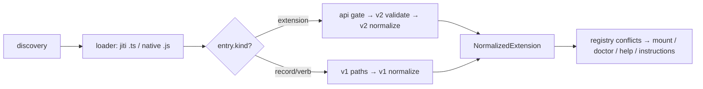
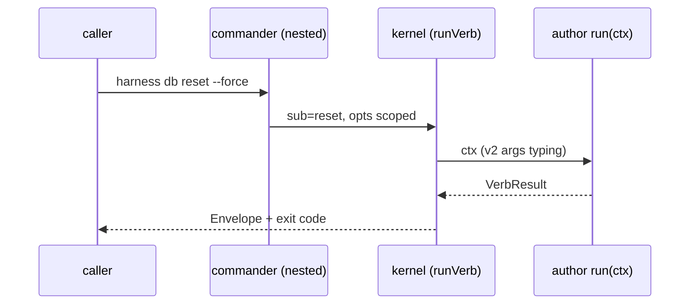

# Phase 1: Authoring v2 substrate — Tasks & Context Brief

**Plan**: `../../typed-extensions-sensors-plan.md` (READY, validated) · **Phase**: 1 of 3 · **Created**: 2026-07-14
**Authoritative upstream**: `../../workshops/001-extension-authoring-v2.md` (contract), `../../spine.md` §A, `../../research-dossier.md`

## Executive Briefing

- **Purpose**: Land the new-way extension authoring contract end-to-end — author → load → classify → api-gate → normalize → mount → doctor — with the backwards-compat promise mechanically enforced, while changing zero v1 behaviour.
- **What We're Building**: `defineExtension()` + v2 types + `API_VOCABULARY` in the published contract; shape-based classification with honest failure codes (`E147`/`E148`); a `NormalizedExtension` internal shape every kernel consumer reads; real nested subverbs with scoped params; `ctx.exec` timeout/env + `ctx.steps()`; v2-only scaffolding; and the frozen api-2 conformance corpus with an append-only guard.
- **Goals**:
  - ✅ v1 extensions load forever, byte-identical behaviour (this repo's 10 + the private consumer's 9)
  - ✅ v2 loads, classifies, gates, and normalizes per workshop E1–E5 — no silent capability loss
  - ✅ Subverb dispatch, step-runner, and bounded-exec boilerplate become kernel-owned
  - ✅ The compat promise is enforced by tests that cannot be quietly edited
- **Non-Goals**:
  - ❌ Sensor registration/runtime (Phase 2 — `sensors:` is vocabulary-reserved with an explicit "handler not yet active" doctor line, never silent)
  - ❌ TUI, packaging changes beyond the runtime `./contract` export (Phase 3)
  - ❌ Any framework machinery (lifecycle hooks, middleware) — workshop A7

## Prior Phase Context

_None — this is Phase 1._

## Pre-Implementation Check

| File | Exists? | Domain Check | Notes |
|------|---------|-------------|-------|
| `harness/cli/src/services/extensions/contract.ts` | yes — modify | harness-cli/contract | types-only today; gains the first runtime export (`defineExtension`) — `./contract` exports map already serves runtime `.js` (verified `package.json:16-20`) |
| `harness/cli/src/services/extensions/v2/` | no — create | harness-cli/internal | classification, api-gate, validator, normalizer |
| `harness/cli/src/services/extensions/registry.ts` | yes — modify | harness-cli/internal | third `kind` arm + normalize step; `coerceExports` untouched |
| `harness/cli/src/services/config/load-config.ts` | yes — modify | harness-cli/internal | v2 validator beside `verbShapeIssues`; v1 variadic rejection (lines 31-33) untouched |
| `harness/cli/src/acts/verb.ts` | yes — keep + sibling | harness-cli/internal | v1 act byte-untouched; new `registerV2VerbAct` sibling mounts nested `command.command()` |
| `harness/cli/src/services/extensions/verb-context.ts` | yes — modify | harness-cli/contract | `ctx.steps()` injected by presence (fsWrite/background precedent, lines 51-52) |
| `harness/cli/src/adapters/exec/exec-port.ts` (+ node + fake) | yes — modify | harness-cli/contract | `run()` opts today carry only `cwd` (verified) — `timeoutMs`/`env` additive |
| `harness/cli/src/adapters/loader/` | yes — modify | harness-cli/internal | jiti `alias` (or `resolve`-hook fallback per T001) for the contract specifier; native-import `.js` path untouched |
| `harness/cli/src/services/scaffold/{scaffold-service,templates}.ts` | yes — modify | harness-cli/internal | `ScaffoldVariant` union grows v2 variants; NAME/WRAP safety patterns reused |
| `harness/cli/src/output/error-codes.ts` | yes — modify | harness-cli/internal | add `E147`, `E148` |
| `harness/cli/test/conformance/extensions/api-2/` | no — create | harness-cli/contract | frozen fixtures + append-only guard |
| `docs/how/authoring-extensions-v2.md` | no — create | harness-cli/docs | authoring guide (v1 guide kept, marked still-supported) |

No duplication found: no existing `defineExtension`, normalizer, or v2 concept anywhere in the source (session-verified searches).

## Architecture Map



## Tasks

| Status | ID | Task | Domain | Path(s) | Done When | Notes |
|--------|-----|------|--------|---------|-----------|-------|
| [x] | T001 | Spike (throwaway, gitignored `scratch/`): prove jiti 2.7 `alias` (else its `resolve` hook) maps `@ai-substrate/engineering-harness/contract` → the core's contract module for a `.ts` extension in a repo with NO node_modules entry for the package | harness-cli | `scratch/poc/jiti-alias/` (throwaway — never imported) | go/no-go verdict + chosen mechanism + observed output recorded in execution log; spike code discarded | Plan 1.1 / Finding 04; learnings promote, code never |
| [x] | T002 | Write failing tests first: classification table (v1 verb / v1 record / v2 def / mixed array route independently), api gate (`api:3` on api-2 core → E147 w/ `harness update` next_action; unknown top-level section → E148; unknown *field* in a known structure → tolerated + doctor info), reserved-but-inert `sensors:`/`custom:` → explicit "declared, handler not yet active" info line, normalizer output shape (v1→current, v2→current) | harness-cli | `harness/cli/test/extensions/v2-classification.test.ts`, `v2-api-gate.test.ts`, `v2-normalize.test.ts` | tests exist, run, and fail for the right reason (features absent), using FakeModuleLoader/FakeClock only | Plan 1.2; TDD lane; validation F1 baked in |
| [x] | T003 | v2 contract: `ExtensionDefinition`/`VerbDecl`/`SubverbDecl`/`CustomItem` types, `API_VOCABULARY` (level 2 = verbs/sensors/records/custom), `defineExtension()` identity+brand runtime export (does NOT stamp `api`; absent ⇒ 2), wired through existing `./contract` export; jiti alias per T001 in the loader | harness-cli | `harness/cli/src/services/extensions/contract.ts`, `harness/cli/src/adapters/loader/jiti-loader.ts` | tsc clean; a `.ts` fixture importing the factory loads through the aliased specifier; bare-literal shape documented in the types' JSDoc | Plan 1.3; workshop D1/D5; Finding 01/03 |
| [x] | T004 | Classification (`kind:'extension'` arm in `buildExtensionRegistry`), api gate, v2 shape validator (sub+run rules, one-level sub, per-sub options/args, v2 variadics legal), `E147`/`E148` registered; reserved-inert section info line | harness-cli | `harness/cli/src/services/extensions/v2/{classify,api-gate,validate}.ts`, `registry.ts`, `output/error-codes.ts` | T002 tests green except normalizer suite; failed records carry code + next_action; v1 paths byte-untouched (existing suite green) | Plan 1.4; workshop E1–E5 + E2/E4 |
| [x] | T005 | `NormalizedExtension` internal shape + v1→current and v2→current normalizers; repoint every registry consumer (help list, doctor incl. `format: v1 / v2 (api N)` column, verb dispatch, instructions act) to read only the normalized shape | harness-cli | `harness/cli/src/services/extensions/v2/normalize.ts`, `registry.ts`, `services/help/`, `services/doctor/`, `acts/instructions.ts` | full existing suite green; T002 normalizer tests green; doctor renders format column for both repos' extensions | Plan 1.5; Finding 02; the one compat seam |
| [x] | T006 | v2 verb mounting: sibling register act using nested `command.command()` — per-sub scoped options/args + `--help`, shared parent options in `ctx.options`, kernel "pick a subverb" `unconfigured` + unknown-sub error envelopes, declared variadics arrive as `string[]` via a **v2-only context args type** (published v1 `VerbContext.args` never widened) | harness-cli | `harness/cli/src/acts/verb-v2.ts` (new), `services/extensions/v2/types.ts` | AC-03 behaviours proven with fakes; `acts/verb.ts` diff-empty | Plan 1.6; validation F2 decision |
| [x] | T007 | `ExecPort.run` opts gain `timeoutMs` (SIGKILL at deadline, code 124) + `env` overlay; NodeExec + FakeExec updated; `ctx.steps()` step-runner injected by presence: `steps.run(name, fn)` timing + ✅/❌ rollup + `steps.finish()` envelope, `fail()` aggregation matching private-consumer `db`'s shape | harness-cli | `harness/cli/src/adapters/exec/{exec-port,node-exec,fake-exec}.ts`, `services/extensions/verb-context.ts` | AC-07 tests green (hung child killed via fake; env overlay observed; steps rollup matches shape) | Plan 1.7; H-02/H-04 deletions enabled |
| [x] | T008 | Frozen conformance corpus: fixtures for factory-TS, bare-literal-JS, subverbs+params+variadic, mixed v1+v2 array, E147 case, E148 case, unknown-field-tolerated case, **sensor-bearing + custom-bearing** (load with info line, registration inert) + append-only guard test (hash manifest of fixture files; any edit to an existing fixture fails) | harness-cli | `harness/cli/test/conformance/extensions/api-2/**`, `harness/cli/test/conformance/extensions/corpus-guard.test.ts` | AC-05: all fixtures load with expected outcomes; guard red on any fixture edit, green on append | Plan 1.8; validation F1; the compat promise, encoded |
| [x] | T009 | Scaffold v2: `ScaffoldVariant` grows `v2-ts`, `v2-sub-ts` (`--sub a,b`), `v2-wrap-ts`, `v2-js` (bare literal + JSDoc); templates use `ctx.steps()`/timeout where apt; `harness new` flags updated; v1 variants retired from `new` (loader keeps v1 forever) | harness-cli | `harness/cli/src/services/scaffold/{templates,scaffold-service}.ts`, `harness/cli/src/acts/new.ts` | AC-06 (minus `--sensor`): each variant scaffolds, then loads clean in a temp fixture repo (test-driven via fakes + one integration fixture) | Plan 1.9 |
| [x] | T010 | Load-proof + docs: run the new core against this repo's `.harness/extensions` (expect 10 loaded / format v1) and the private consumer's (9 loaded), record evidence in execution log; write `docs/how/authoring-extensions-v2.md`; mark `authoring-verbs.md` as the v1 (still-supported) contract | harness-cli | `docs/how/authoring-extensions-v2.md`, `harness/cli/docs/authoring-verbs.md` | AC-01 evidence recorded; docs exist and match built behaviour | Plan 1.10; lightweight lane |

## Context Brief

**Environment-first posture** (builder invariant #14): environment friction is work, not an apology — fix small/reversible things, otherwise `harness observe "<what>" --kind <kind>` it (execution-log Discoveries row as fallback), and pay every hard wall or proof-gap forward.

**Key findings from plan (drive these into the code)**:
- Finding 01: both seams pre-exist — route-by-`kind` switch + runtime `./contract` export; v2 is additive at both.
- Finding 02: the corpus IS the compat promise — corpus lands (T008) before the load-proof pass (T010); existing-fixture immutability is non-negotiable.
- Finding 03: `.js` = native `import()`, no alias — the bare-literal form is load-bearing; never require the factory.
- Finding 04: jiti alias is the phase's only feasibility unknown — T001 first.
- Validation F1/F2: reserved-but-inert sections are loud, never silent; variadics ride a v2-only context type.

**Domain constraints (constitution — enforced at review)**:
- P2 hexagonal: services touch ports only; the watcher-free Phase 1 needs no new adapters beyond exec changes; single `process.exit` site preserved.
- P3 fakes over mocks: no `vi.mock` anywhere; FakeModuleLoader/FakeClock/FakeExec extended as needed.
- P5 honesty: every failure path (E147/E148, timeout kill) carries `next_action`.
- P10 small core: `defineExtension` is the only runtime addition to the contract module; no new dependencies in Phase 1.

**Reusable from the existing codebase**:
- `FakeModuleLoader` (scripts exports per path — perfect for classification tests), `FakeClock`, `FakeExec`.
- `verbShapeIssues` pattern for the v2 validator; `RESERVED_NAMES`/conflict machinery reused untouched by T004.
- `test/contract/`, `test/extensions/`, `test/conformance/` suites as placement patterns.

**Load pipeline (target state)**:


**Sequence (subverb dispatch, target state)**:


## Discoveries & Learnings

_Populated during implementation by the implement verb._

| Date | Task | Type | Discovery | Resolution | References |
|------|------|------|-----------|------------|------------|
| 2026-07-14 | T001 | Feasibility | jiti 2.7 `alias` maps the public contract specifier to an absolute TypeScript module even when native resolution reports `MODULE_NOT_FOUND`. | Use `alias` in `JitiLoader`; no resolve-hook fallback is needed. | `scratch/poc/jiti-alias/run.mjs`; execution log T001 |
| 2026-07-14 | T004 | Compatibility seam | Preserving mixed-array declaration order is simplest when each classified export normalizes independently, while provenance remains one record per file. | Store normalized entries separately, then flatten accepted verbs/records after the shared conflict pass. | `services/extensions/registry.ts`; `v2-registry.test.ts` |
| 2026-07-14 | T006 | Commander behavior | A parent optional positional catches unknown child tokens, while declared child names still dispatch to real nested commands first. | Use the parent catch to emit E108 envelopes; mount every known subverb with `command.command()`. | `acts/verb-v2.ts`; `verb-v2.test.ts` |

## Directory layout

```
docs/plans/059-typed-extensions-sensors/
  ├── typed-extensions-sensors-plan.md
  ├── workshops/001-extension-authoring-v2.md
  ├── research-dossier.md
  └── tasks/phase-1-authoring-v2-substrate/
      ├── tasks.md
      └── execution.log.md   # created by the implement verb
```
