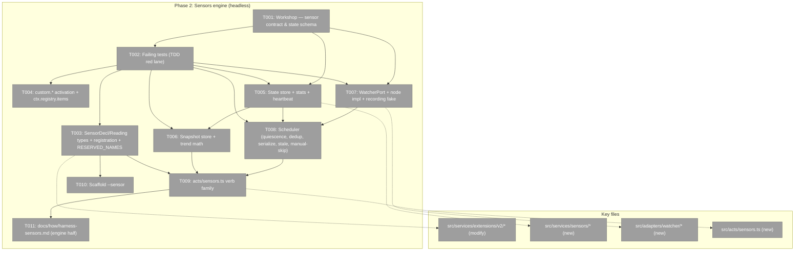
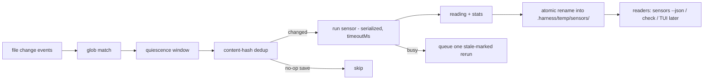
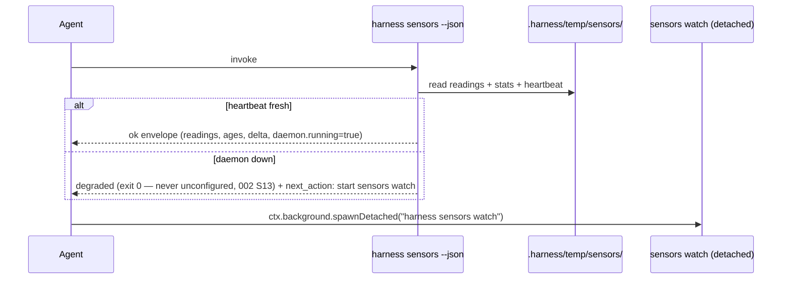

# Phase 2: Sensors engine (headless) — Tasks & Context Brief

**Plan**: [typed-extensions-sensors-plan.md](../../typed-extensions-sensors-plan.md) · **Phase**: 2 of 3 · **Domain**: harness-cli · **CS**: 4
**Generated**: 2026-07-14 · **Worktree**: `<worktree>`

---

## Executive Briefing

**Purpose**: Build the deterministic sensors engine on the v2 substrate Phase 1 landed — the sensor item kind goes live (registration, not the Phase 1 "reserved, handler not yet active" info line), backed by an atomic state store, a fake-provable watch scheduler, and the full agent-facing `harness sensors` verb family. No TUI (Phase 3).

**What We're Building**: `SensorDecl`/`SensorReading` as real contract types; a sensor registry (`sensors` becomes a reserved name); `custom.*` item activation via `ctx.registry.items(type)`; per-sensor state/stats/heartbeat files under `.harness/temp/sensors/` written by atomic rename; snapshot/trend baseline; a `WatcherPort` + scheduler (quiescence window, content-hash dedup, per-sensor serialization, single stale-marked rerun, hard `timeoutMs`, `trigger:'manual'` skip); `acts/sensors.ts` with `run <name>`, `--json`, `watch`, `snapshot`, `check`; the `--sensor` scaffold variant; the engine half of the sensors how-to doc.

**Goals**:
- ✅ Task 2.1 workshop settles the sensor/state contract **before** any engine code (state-file schema churn is the named phase risk)
- ✅ AC-08 (registration + run + atomic state), AC-09 (agent `--json` surface, honest daemon-down), AC-10 (watch loop semantics, all fake-proven), AC-11 (snapshot/trend), AC-13 (advisory posture — only `sensors check` exits non-zero), AC-06 sensor arm (scaffold)
- ✅ Run-status vs reading-state stay separate (spine B3): a crashed sensor is distinguishable from a failing one
- ✅ Everything scheduler/state provable with fakes (watcher + clock) — no sleeps, no real fs.watch in tests

**Non-Goals**:
- ❌ No TUI, no Ink, no TTY branch (Phase 3; bare `harness sensors` TTY behaviour lands there)
- ❌ No LLM/network sensors — deterministic only (spine B1)
- ❌ No gating: the scheduler/watch path never blocks or exits non-zero on failing readings (spine C7; CI gets `sensors check`)
- ❌ No edits to the 9 frozen api-2 corpus fixtures (append-only guard) and no v1 behaviour change

---

## Prior Phase Context

_Phase 1 (Authoring v2 substrate) — all 10 tasks complete; final gate green (2,412 tests, build/typecheck/biome clean); review APPROVE after one fix cycle (record `ca4ee05f203b`); load-proofs 10/0/0 (worktree) + 9/0/0 (private-consumer), all v1 byte-identical._

**A. Deliverables** (all under `harness/cli/`): v2 module `src/services/extensions/v2/{classify,api-gate,validate,normalize,types}.ts`; `src/acts/verb-v2.ts` (nested subverb mounting; `acts/verb.ts` diff-empty); contract runtime `defineExtension()` + `API_VOCABULARY`/`CORE_EXTENSION_API` in `src/services/extensions/contract.ts`; v2 arm in `registry.ts` (`buildExtensionRegistry` line ~159: classify → gate → validate → normalize); `buildV2VerbContext`/`runV2Verb`/`createStepRunner` in `verb-context.ts`; `ExecOptions.timeoutMs`+`env` (SIGKILL → exit 124); E147/E148; 4 scaffold variants; jiti contract alias; conformance corpus `test/conformance/extensions/api-2/` (9 fixtures) + SHA-256 append-only guard.

**B. Dependencies exported → consumed here**:
- `NormalizedExtension` (`v2/types.ts:37`) is the one internal shape every consumer reads; `NormalizedSensor` (`types.ts:21`) is currently `{ name; declaration: Record<string, unknown> }` — **this phase's first code job is typing that `declaration` as `SensorDecl`** (workshop-settled).
- `sensors:` is already **in-vocabulary at api 2** (`API_VOCABULARY`, `contract.ts:253`) — activation needs **no api-gate change**; only `validate.ts:150-153` (info line → field validation) and `normalize.ts:106-109` (lossless carry → typed parse) change, plus registry registration.
- `custom:` items validate `summary` only (`validate.ts:164-167`) and carry into `NormalizedExtension.customItems` — `ctx.registry.items(type)` reads that, no re-parse.
- `RESERVED_NAMES` at `registry.ts:56` — 10 names today, **no `sensors`**.
- `ctx.exec(cmd, args?, { cwd?, timeoutMs?, env? })`; `ctx.steps()`; `ctx.background.spawnDetached` (`adapters/exec/background-port.ts`) for starting the headless watcher.
- `FsPort.rename` is documented atomic-on-same-fs (`adapters/fs/fs-port.ts:22-27`, `node-fs.ts:48-50`); `ClockPort` + `FakeClock` exist (`adapters/clock/`).
- Scaffold seam: `ScaffoldVariant` union (`services/scaffold/templates.ts:3`) + `scaffoldExtension` (`scaffold-service.ts:49`) — `--sensor` plugs into that union.
- Acts register in `src/app.ts` (e.g. `registerObserveAct(program, io, deps)` line 285) — `registerSensorsAct` follows that shape.

**C. Gotchas & debt to respect**:
- HIGH-1 mechanism: `declaredApi = rawApi ?? 2` permanent, `ApiGateEnvironment { coreApi, vocabulary }` injectable for future-core counterfactuals — reuse this pattern for any sensor-side level gating; never conflate declared api with running core.
- HIGH-2 mechanism: normalize from **known fields only** (records rebuilt as `{kind,type,description,template}`, no `...spread`) — sensor declaration parsing must follow the same rule so author data can't overwrite kernel identity.
- Type-erasure seams exist (`normalize.ts:30,43` casts, `buildV2VerbContext` cast through `unknown`) — deliberate for verbs; sensor handlers must **not** lean on them (sensors get their own typed run signature).
- Two handed-down warn-gate degradations (arch-check ×2 `services-ports-type-only`, markdown-lint) — pre-existing, not this phase's to fix, don't add to them.
- Validation is *loud, never silent*: unknown top-level section → E148 hard; unknown field in a known structure → tolerate + doctor info. Keep this two-tier posture as sensor fields go strict.

**D. Incomplete items carried in (by design)**: sensor contract & state schema (→ T001 workshop); scaffold `--sensor` (→ T010); `sensors` into `RESERVED_NAMES` (→ T003); `.harness/temp/sensors/` layout (→ T001/T005).

**E. Patterns to follow**: ports + fakes, zero `vi.mock` (P3); single `process.exit` — verbs return `VerbResult`, kernel finalizes (P2); every non-ok envelope carries `next_action` (`finalizeVerbResult` enforces, P5); TDD red lane first (failing tests name the missing modules); additive at the seams (extend classify/normalize pipeline, don't edit v1 paths); corpus fixtures append-only; optional ctx capabilities feature-detected by presence.

---

## Pre-Implementation Check

All rows verified by direct read on 2026-07-14 (not asserted from memory — DL-001 discipline).

| File | Exists? | Domain Check | Notes |
|------|---------|--------------|-------|
| `harness/cli/src/acts/sensors.ts` | ❌ create | harness-cli acts | verb family; registers in `app.ts` like `registerObserveAct` (line 285) |
| `harness/cli/src/services/sensors/` | ❌ create | harness-cli services | `services/` listed: no `sensors/` today — state-store, stats, snapshot, scheduler land here |
| `harness/cli/src/adapters/watcher/` | ❌ create | harness-cli adapters | `adapters/` = clock/db/env/exec/fs/git/loader/process/version-lookup — no watcher; port + node impl + recording fake |
| `harness/cli/src/services/extensions/registry.ts` | ✅ modify | harness-cli | `RESERVED_NAMES` (line 56) has 10 names, **no `sensors`**; sensor registration joins the build pass — **contract change, higher risk** |
| `harness/cli/src/services/extensions/v2/types.ts` | ✅ modify | harness-cli | `NormalizedSensor.declaration: Record<string,unknown>` (line 21) tightens to `SensorDecl` |
| `harness/cli/src/services/extensions/v2/validate.ts` | ✅ modify | harness-cli | lines 150-153: info-line branch becomes field-level `SensorDecl` validation — **contract change** |
| `harness/cli/src/services/extensions/v2/normalize.ts` | ✅ modify | harness-cli | lines 106-109: lossless carry becomes known-fields-only parse (HIGH-2 rule) |
| `harness/cli/src/services/extensions/contract.ts` | ✅ modify | harness-cli | `SensorDecl`/`SensorReading` public types; `ctx.registry` capability (feature-detected) — **public contract, higher risk** |
| `harness/cli/src/output/error-codes.ts` | ✅ modify | harness-cli | **verified free by read**: `E149` open; nothing between `E205` and `E299` (update ends E204, flow starts E300). Sensors take a fresh `E210+` block |
| `harness/cli/src/services/scaffold/templates.ts` + `scaffold-service.ts` + `acts/new.ts` | ✅ modify | harness-cli | `ScaffoldVariant` union (templates.ts:3) gains `v2-sensor-ts` |
| `harness/cli/test/conformance/extensions/api-2/` | ✅ append-only | harness-cli tests | guard freezes fixture **bytes** (9 SHA-256 entries), not load expectations — activation changes what `sensor-bearing.ts` *does*, bytes untouched; new fixtures appended |
| `.gitignore` (worktree) | ✅ no change | repo | line 168 already ignores `.harness/temp/` — `.harness/temp/sensors/` needs no gitignore edit |
| `docs/how/harness-sensors.md` | ❌ create | docs | engine + agent-surface half only (TUI half is Phase 3 task 3.5) |
| `package.json` | ⚠️ decision | repo | runtime deps are **`commander` + `jiti` only** — watch-glob matching has no library today; matcher choice (minimal in-house vs `picomatch`) is a T001 workshop decision |

Duplication scan: no existing sensor/watcher/scheduler concept in `harness/cli/src/services/*` or docs/domains (the private consumer's `checks` extension is the userland evidence this replaces, not a core concept).

---

## Architecture Map



---

## Tasks

Worktree-absolute path prefix `WT` = `<worktree>`.

| Status | ID | Task | Domain | Path(s) | Done When | Notes |
|--------|-----|------|--------|---------|-----------|-------|
| [x] | T001 | **Workshop: sensor contract & state schema** — settle `SensorDecl` fields (`watch` globs, `timeoutMs`, `trigger: 'watch'\|'manual'`, description/guidance), `SensorReading` fields (`state: pass/warn/fail/skip` — 002 S2/Q1, `score`+`direction`, `threshold?`, `guidance`, details), state-file/stats/heartbeat JSON schemas + filenames under `.harness/temp/sensors/`, snapshot location vs git (spine E5), glob-matcher choice (in-house vs picomatch given 2-dep posture), sensor error-code assignments in the E210+ block | harness-cli | `WT/docs/plans/059-typed-extensions-sensors/workshops/002-sensor-contract-state-schema.md` | Workshop doc reaches Approved; every downstream task's open shape question is answered by a numbered decision it can cite | Plan 2.1; spine §B2-B4, §C2-C4, E1/E3/E5; **gates all other tasks**; run via `/builder 2c workshop` |
| [x] | T002 | Write failing tests: sensor registration lands in the sensor registry (never verb namespace); run-status vs reading-state separation (crashed ≠ failing); state-store atomic write + staleness/`age`; stats accumulation (last run, wallclock, rolling avg, run count, failure streak); snapshot delta math; **scheduler semantics** (quiescence, content-hash dedup, per-sensor serialize, stale-queue-of-one, manual-trigger skip — driven through the FakeWatcher/FakeClock shapes T001 settles); `ctx.registry.items(type)` custom-item read; **`skip` state semantics** (002 S2/Q1: skip never moves `failStreak`, excluded from trend, never fails `check`) | harness-cli | `WT/harness/cli/test/extensions/{sensors-registration,custom-items}.test.ts`, `WT/harness/cli/test/sensors/{state-store,stats,snapshot,scheduler}.test.ts` (new) | Tests fail for the right reason (missing modules / unimplemented behaviour), red lane recorded in execution log | Plan 2.2 + Testing Strategy (scheduler is a named test-first focus area); shapes cite T001 decisions |
| [x] | T003 | `SensorDecl`/`SensorReading` public types in contract; `validate.ts` sensor branch goes field-level (unknown-field tolerate+info posture kept); `normalize.ts` parses sensors known-fields-only (HIGH-2 rule); sensor registry in `buildExtensionRegistry`; `'sensors'` → `RESERVED_NAMES`; sensor error codes (E210 block); **append** new corpus fixtures (e.g. manual-trigger sensor, invalid-sensor-decl) + update sensor-bearing load expectation from "reserved" info line to registered | harness-cli | `WT/harness/cli/src/services/extensions/{contract,registry}.ts`, `v2/{types,validate,normalize}.ts`, `WT/harness/cli/src/output/error-codes.ts`, `WT/harness/cli/test/conformance/extensions/api-2/` | T002 registration tests green; 9 frozen fixture hashes untouched (guard green); v1 suites untouched; AC-08 registration half proven | Plan 2.3a; Finding 08; corpus append-only |
| [x] | T004 | `custom.*` activation: `ctx.registry.items(type)` (feature-detected capability on VerbContext) returning registered custom items; doctor lists them; worked D6-a pattern provable (a verb folds over `items('migration')`) | harness-cli | `WT/harness/cli/src/services/extensions/{contract,verb-context}.ts` | T002 custom-items test green: a v2 extension's verb reads its own + sibling extensions' `custom.<type>` items; workshop 001 D6-a behaviour demonstrated | Plan 2.3b; workshop 001 D6-a |
| [x] | T005 | State store: per-sensor reading + stats + heartbeat/pidfile at `.harness/temp/sensors/` (schema per T001), written temp-file + `FsPort.rename` (atomic); staleness = per-sensor `age` computed from ClockPort; readable daemon-down; last-writer-wins (no locks, spine C5) | harness-cli | `WT/harness/cli/src/services/sensors/{state-store,stats}.ts` (new) | T002 state/stats tests green with FakeClock + fake fs; a kill-mid-write scenario never yields a torn read | Plan 2.4a; Finding 07; spine C2/C3 |
| [x] | T006 | Snapshot store + trend math: baseline write, delta-vs-snapshot per reading (direction-aware better/worse/steady), surfaced in state so JSON (and Phase 3 TUI) read one truth | harness-cli | `WT/harness/cli/src/services/sensors/snapshot.ts` (new) | T002 snapshot tests green; AC-11 math proven (incl. lower-is-better direction) | Plan 2.4b; spine C4/D4 |
| [x] | T007 | `WatcherPort` (subscribe globs → change events) + node `fs.watch` recursive impl + recording/replayable fake; win32 semantics documented on the port; windows-check consulted | harness-cli | `WT/harness/cli/src/adapters/watcher/{watcher-port,node-watcher,fake-watcher}.ts` (new) | Fake drives deterministic event sequences in tests (T002's scheduler red tests compile against it); node impl smoke-covered; port docs state win32 caveats | Plan 2.5a; spine C1; phase risk (win32) |
| [x] | T008 | Scheduler: glob match (T001 matcher) → quiescence window (FakeClock) → content-hash dedup (no-op saves don't rerun) → per-sensor serialization → at most one queued stale-marked rerun; hard `timeoutMs` kill via ctx.exec deadline; **`trigger:'manual'` sensors never watch-fired**; never exits non-zero on failing readings | harness-cli | `WT/harness/cli/src/services/sensors/scheduler.ts` (new), `WT/package.json` (**declare `picomatch` in dependencies** — 002 S8) | T002 scheduler tests green — AC-10 proven entirely with fakes (watcher + clock), incl. dedup, stale-queue-of-one, manual skip, timeout kill | Plan 2.5b; spine §B4/C1/C7 |
| [x] | T009 | `acts/sensors.ts`: `run <name>` (one-off, writes same atomic state), `--json` (state-read only; per-sensor reading+stats+age+delta; `daemon:{running,pid,heartbeat}`; daemon down → **`degraded`** + `next_action`, never silently runs sensors — **never `unconfigured`**, which exits 2 (002 S13)), `watch` (headless loop), `snapshot`, `check` (one-shot run-all; **sole non-zero-exit path**); registered in `app.ts`; single-exit + next_action discipline | harness-cli | `WT/harness/cli/src/acts/sensors.ts` (new), `WT/harness/cli/src/app.ts` | AC-08 complete, AC-09 green (honest daemon-down test), AC-13 exit-code table proven per verb | Plan 2.6; spine C5/C6/D2; bare `sensors` TTY branch deferred to Phase 3 (AC-12) |
| [x] | T010 | Scaffold `--sensor`: `v2-sensor-ts` variant (wrap-a-command starter reading exit code into `SensorReading`, guidance field prompt), name/reserved checks reuse E150-E153 paths | harness-cli | `WT/harness/cli/src/services/scaffold/{templates,scaffold-service}.ts`, `WT/harness/cli/src/acts/new.ts` | AC-06 complete: scaffolded sensor loads, registers, and `sensors run <name>` executes it in a temp fixture repo | Plan 2.7 |
| [x] | T011 | `docs/how/harness-sensors.md` — engine + agent surface half: authoring a sensor, decl/reading contract, state layout, verb family incl. `--json` envelope, check-vs-watch posture; validated against real behaviour | harness-cli | `WT/docs/how/harness-sensors.md` (new) | Doc exists; every command/example in it executed against the built engine; AC-14 sensors half | Plan 2.8; lightweight lane; TUI half is Phase 3 |

---

## Context Brief

**Environment-first posture** (builder invariant #14): environment friction is work, not an apology — fix small/reversible things, otherwise `harness observe` it the moment it bites; pay every hard wall or proof-gap forward.

**Key findings from plan**:
- Finding 07: `.harness/temp/` is the gitignored scratch precedent — sensors state at `.harness/temp/sensors/`; **snapshot** location is deliberately a T001 decision (committable baseline vs ignored, spine E5).
- Finding 08: `RESERVED_NAMES` gates shadowing — `sensors` must join it **in T003, before T009 lands the act**, or an extension verb named `sensors` could shadow the built-in in between.
- Finding 02 (carried): the corpus is the compat promise — append, never edit.
- Phase risks (plan): watcher semantics on win32 (port + windows-check, T007); state-file schema churn (why T001 is first and gating).

**Domain dependencies** (what this phase consumes):
- `harness-cli/extensions-v2`: `NormalizedExtension` pipeline (classify → gate → validate → normalize) — sensors activate inside it, additively.
- `harness-cli/adapters`: `FsPort.rename` (atomic commit), `ClockPort`/`FakeClock` (quiescence + age + stats), `ExecPort.timeoutMs` (sensor kill), `BackgroundPort.spawnDetached` (agent/CI starts `sensors watch`).
- `harness-cli/output`: Envelope + `finalizeVerbResult` (next_action enforcement), error-codes registry.
- `harness-cli/scaffold`: `ScaffoldVariant` union + `scaffoldExtension`.

**Domain constraints**:
- Ports & adapters direction: `services/sensors/*` depends on ports only (arch-check `services-ports-type-only` is already warn-listed twice — add no new violations).
- Single process.exit site; acts return `VerbResult`/envelopes.
- Runner/renderer decoupling is a hard line (spine C2): readers read state files, never IPC — `--json` must work daemon-down.
- Advisory posture (spine C7): only `sensors check` maps readings to exit codes.

**Reusable from prior phases**:
- `FakeExec`, `FakeClock`, `FakeModuleLoader`, fake fs — extend, don't mock.
- Conformance corpus harness + guard pattern (`corpus-guard.test.ts`) for new fixtures.
- `ApiGateEnvironment` injection pattern for any future-level counterfactuals.
- Temp fixture-repo pattern from the Phase 1 scaffold load-proof (T010 reuses it).

**Mermaid flow diagram** (watch-path system states):


**Mermaid sequence diagram** (agent surface, daemon down vs up):


---

## Discoveries & Learnings

_Populated during implementation by the implement verb._

| Date | Task | Type | Discovery | Resolution | References |
|------|------|------|-----------|------------|------------|

---

## Directory layout

```
docs/plans/059-typed-extensions-sensors/
  ├── typed-extensions-sensors-plan.md
  ├── workshops/
  │   ├── 001-extension-authoring-v2.md
  │   └── 002-sensor-contract-state-schema.md   # created by T001
  └── tasks/phase-2-sensors-engine-headless/
      ├── tasks.md
      └── execution.log.md   # created by the implement verb
```
