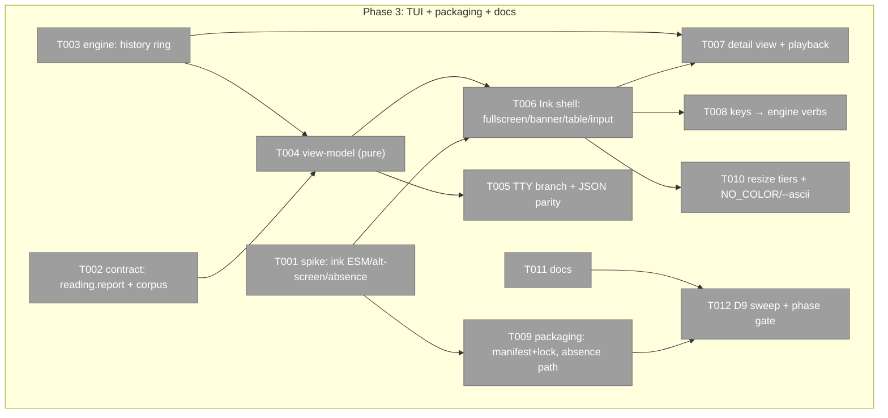
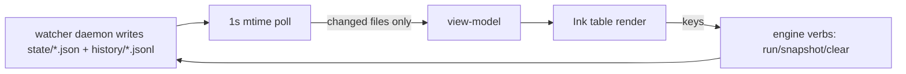
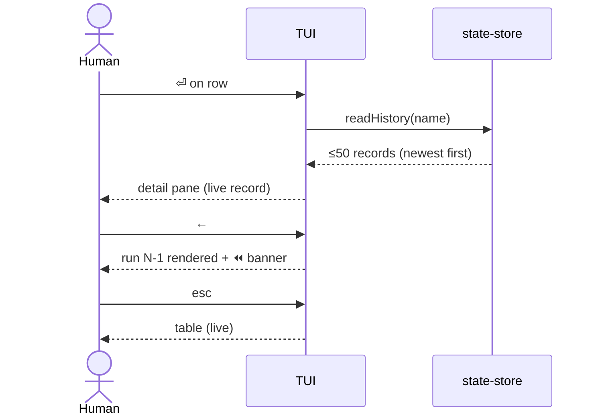

# Phase 3: TUI + packaging + docs — Tasks & Context Brief

**Plan**: `../../typed-extensions-sensors-plan.md` · **Phase**: 3 of 3 · **Mode**: Full · **CS**: 3 (S1 I1 D1 N1 F1 T1 — new UI surface, but thin-renderer over a proven engine)
**Authoritative design**: `../../workshops/003-sensors-tui-design.md` (**D1–D9**, Approved, Implementation Ready) — every visual/behavioural decision cites it; do not re-litigate here.

## Executive Briefing

- **Purpose**: Give the Phase 2 sensors engine its human surface (Ink TUI with banner, live table, drill-in detail + playback) and its public posture (optionalDependencies packaging, docs), completing plan 059.
- **What We're Building**: a lazy-loaded Ink TUI rendered from the same state files the `--json` envelope reads (one truth, two renderers — spine D4); two additive contract/engine extensions the TUI needs (`reading.report`, `history/<name>.jsonl`); packaging + docs.
- **Goals**: ✅ AC-11 (TUI trend ≡ `--json` delta) · ✅ AC-12 (TTY split, lazy import) · ✅ AC-13 unchanged (advisory posture) · ✅ AC-14 (docs) · ✅ workshop D1–D9 rendered as shipped behaviour.
- **Non-Goals**: ❌ engine behaviour changes beyond D3/D4 (scheduler/runner/stats are review-frozen) · ❌ committed team baseline (S7 non-goal) · ❌ pixel-perfect visual tests (lightweight lane per plan Testing Strategy) · ❌ theming/config systems.

## Prior Phase Context

**Phase 1 (authoring v2 substrate)** — delivered `defineExtension()` factory, classification, api gate, normalize/validate (`services/extensions/v2/{types,classify,normalize,validate,api-gate}.ts`), frozen conformance corpus (`harness/cli/test/conformance/extensions/api-2/` + `FROZEN_API_2` guard). Gotchas: corpus is **append-only with a directory-completeness guard** — any new shipped file in api-2/ must get a frozen hash entry or the guard goes red; `authoring-verbs.md` v1-marker (task 3.5's third clause) was **already done in P1 T010** — verify, don't redo.
**Phase 2 (sensors engine, headless)** — delivered the full engine: `services/sensors/{types,runner,scheduler,state-store,stats,snapshot}.ts`, `acts/sensors.ts` (run/`--json`/watch/snapshot/check), `adapters/{watcher,clock,hash}`, `WatcherPort`/`Clock`/`HashPort` fakes. Exports Phase 3 consumes: `SensorStateView` (record+stats+ageMs), `SensorDaemonView`, `computeTrend`, the status JSON assembled by the **private** `readerEnvelope` (acts/sensors.ts:94 — T005 extracts its data-assembly into an exported shared function), the state-store write path (T003 extends it). Gotchas: **no `harness/cli/package.json`** — root `npm test`/`package.json` is the only manifest (CONF-002); **lock deltas must be topology-minimal** (the P2 picomatch lock incident — never regenerate, hand-verify hunks); S13 floor — reader paths emit `degraded`, never `unconfigured`/exit 2; S12 — no raw child output into readings; global PATH `harness` is 0.12.0 without sensors — test via `node harness/cli/dist/index.js`. Patterns: ports-only in services (HashPort precedent — prime-enforced, `services/sensors/` must stay `node:crypto`-free and the TUI must not import `node:*` in services), single exit site, fakes-not-mocks.

## Pre-Implementation Check

| File | Exists? | Domain Check | Notes |
|------|---------|--------------|-------|
| `harness/cli/src/services/extensions/contract.ts` | yes → modify | harness-cli | `SensorReading` at ~L241 (`details`/`guidance` present); add `report?: string` |
| `harness/cli/src/services/extensions/v2/{validate,normalize}.ts` | yes → verify/modify | harness-cli | confirm reading fields pass through untouched (readings are runtime values; likely no change — prove it) |
| `harness/cli/src/services/sensors/state-store.ts` | yes → modify | harness-cli | history ring write beside existing atomic state write |
| `harness/cli/src/services/sensors/types.ts` | yes → modify | harness-cli | history types |
| `harness/cli/src/services/sensors/tui/` | NO → create | harness-cli | view-model + Ink components; **type-only/lazy boundaries — no eager ink/React import reachable from index** |
| `harness/cli/src/acts/sensors.ts` | yes → modify | harness-cli | TTY branch on bare `sensors`; extract `readerEnvelope`'s data-assembly into an exported shared function (T005) |
| `harness/cli/tsconfig.json` | yes → modify | harness-cli | add `"jsx": "react-jsx"` (no jsx option today — T006 cannot compile without it) |
| `harness/cli/src/adapters/fs/fs-port.ts` (+ node adapter, FakeFs) | yes → modify | harness-cli | add `mtimeMs(path): number \| null` — FsPort has no stat today; the poll needs it (T003) |
| `harness/cli/src/adapters/process/process-port.ts` (+ fake) | yes → modify | harness-cli | add `kill(pid, signal)` — `q` stops the watcher via daemon.json pid (T008) |
| `package.json` (root — there is no harness/cli manifest) | yes → modify | repo root | `optionalDependencies: { ink, react }`; `files` map already covers dist |
| `package-lock.json` | yes → modify | repo root | **paired, topology-minimal hunks only** |
| `harness/cli/test/conformance/extensions/api-2/` + guard | yes → append | harness-cli | new report-bearing fixture + its frozen hash; existing bytes untouched |
| `docs/how/harness-sensors.md` | yes → modify | docs | TUI half |
| `README.md` | yes → modify | docs | new-way section |
| `harness/cli/docs/authoring-verbs.md` | yes → verify only | docs | v1-marker landed in P1 |

## Architecture Map



## Tasks

| Status | ID | Task | Domain | Path(s) | Done When | Notes |
|--------|-----|------|--------|---------|-----------|-------|
| [x] | T001 | **Spike (throwaway, scratch dir)**: prove `await import('ink')` from our compiled build (module-system check — ink 4/5 is ESM-only); alt-screen enter/leave + raw-mode restore across exit paths incl. SIGINT/throw; absent-ink import failure shape; import-graph proof that no core command loads React | harness-cli | scratch only; findings → execution log | go/no-go recorded with real captured output for: ESM import ok, terminal restored after kill, absence error identifiable, `node -e "require count"` graph clean | plan 3.1 · D9 #1,2,13 · Finding 05 |
| [x] | T002 | Add `SensorReading.report?: string` (multi-line detail); prove v2 validate/normalize pass-through; **append** one report-bearing sensor fixture to the api-2 corpus + its `FROZEN_API_2` hash (existing bytes byte-untouched); scaffold template (`new --sensor`) shows `details` + `report` idiom + S12 reminder | harness-cli | contract.ts, v2/validate.ts?, test/conformance/extensions/api-2/*, services/scaffold/templates.ts | corpus guard green incl. new entry; report survives run→state→`--json` round-trip in a test; S12 posture stated in template comment | workshop D3 · prime: D3 conformance |
| [x] | T003 | History ring: write `history/<name>.jsonl` (one `SensorRunRecord`/line, newest last, cap 50, atomic rewrite-on-append) from the same store call that writes state; `readHistory(name)` returning newest-first; unreadable/missing → empty + degrade note (never throw). Plus the two engine capabilities later tasks consume: `SensorStateStore.clearAll()` (deletes `state/` + `history/` via `FsPort.removeDir`; snapshot kept — Q2) and **`FsPort.mtimeMs(path): number \| null`** (never throws; null when missing) across port + node adapter + FakeFs | harness-cli | services/sensors/state-store.ts, types.ts, adapters/fs/*, test/sensors/state-store.test.ts | fake-fs tests: append order, cap-50 trim, corrupt-line tolerance, atomicity (temp-rename), written on ok/error/timeout runs alike; clearAll leaves snapshot.json; mtimeMs null-on-missing | workshop D4 · prime: D4 conformance · critic F2/F3 |
| [x] | T004 | Pure view-model (`tui/view-model.ts`, NO ink import): status+history → table rows (col contract D2), glyphs (D7 + NO_COLOR fallback set), humanized ages, `✗N`/`⚠` suffixes, width tiers (full ≥100 / reduced ≥84 / minimal), banner-collapse predicate, detail+playback model | harness-cli | services/sensors/tui/view-model.ts, test/sensors/tui/view-model.test.ts | unit tests pin: every D7 glyph pair (color/NO_COLOR), crash≠fail rendering, stale/streak suffixes, all three width tiers, trend glyph ↔ `--json` trend equality (AC-11) | D2/D7/D8-collapse/D9 #9,10,11 |
| [x] | T005 | TTY branch in `acts/sensors.ts`: bare `sensors` + interactive + ink resolvable → lazy TUI; **else exactly the `--json` code path** (same function, not a copy); `--json` flag always wins. **Signal carrier pinned**: the entrypoint resolves `isTTY && TERM!=='dumb'` ONCE into a new `CliIo.interactive: boolean` (same precedent as `useColor`, output-port.ts:24) — acts never touch `process.stdout`. Extract `readerEnvelope`'s data-assembly (acts/sensors.ts:94, currently private) into an exported function both renderers call. `--no-json` on a TTY without ink still takes the JSON-shaped path rendered per mode | harness-cli | acts/sensors.ts, output/output-port.ts, test/sensors/acts.test.ts | **JSON-parity test: non-TTY bare output byte-equal to `--json` output on same state**; TTY-true path proven via `CliIo.interactive` fake without loading real ink | AC-12 · D9 #12 · prime: non-TTY JSON parity · critic F4/F5 |
| [x] | T006 | Ink shell: `FullScreen` wrapper (alt-screen via useEffect + centralized `process.on('exit'/'SIGINT'/'uncaughtException')` cleanup incl. raw-mode restore), D8 banner constant, memoized table rows (`React.memo`+`useCallback`), single mode-routed `useInput`, braille spinner hook (120ms, only while in-flight rows exist), 1s coalesced poll (`FsPort.mtimeMs` cache → one state update). **Build config**: add `"jsx": "react-jsx"` to harness/cli/tsconfig.json — the resulting static `react/jsx-runtime` imports in tui modules are acceptable because tui is reachable only via the lazy branch (re-proved by T012's import-graph check) | harness-cli | harness/cli/tsconfig.json, services/sensors/tui/{app,fullscreen,banner,table,input,use-poll}.tsx | manual TTY check matches D1 mockup; unit tests on poll coalescing + input routing via fakes; kill -INT leaves terminal sane (spike-proven pattern, re-verified); build green with jsx enabled | D1/D6/D8 · D9 #1–8 · critic F1/F2 |
| [x] | T007 | Detail view + playback: overlay pane (D9 #14, full-width), fields per mockup (stats, globs, snapshot delta, guidance precedence `reading.guidance ?? decl.guidance`, `report` block), `←/→` history scrub with `⏪ viewing run N of M` banner, live-tail resume | harness-cli | services/sensors/tui/detail.tsx, test/sensors/tui/detail-model.test.ts | scrub over a 5-record fake history renders each record's state/details/report; missing history → `history unavailable`, view stays alive | D1-detail/D4 · D9 #14 |
| [x] | T008 | Keys → engine: `1-9`/`r` re-run (`trigger:'manual-run'`), `s` snapshot (a no-readings snapshot returns a **degraded envelope** — surface its `next_action` as a footer flash; there is no E-code on that path), `c` = `store.clearAll()` (T003; snapshot kept — Q2) then run-all, `w` detach leaving watcher, `q` two-press quit stopping the watcher via **`ProcessPort.kill(daemon.pid, 'SIGTERM')`** (new port method + fake; pid from `daemon.json`; pid gone → honest footer flash), `esc` back; context-sensitive footer per mode | harness-cli | services/sensors/tui/{input,footer}.tsx, adapters/process/*, acts wiring | each key dispatches the same service call the CLI verb uses (no duplicate logic); kill + clear proven on fakes; footer swaps hints in detail mode | D6 · Q2 resolved · critic F3 |
| [x] | T009 | Packaging: root `package.json` gains `optionalDependencies: { ink, react }` with **paired, hand-verified topology-minimal `package-lock.json` hunks** (no regeneration); absence path = helpful degraded envelope naming the install command, then `--json` fallback; `files` map confirmed covering tui dist output | repo root | package.json, package-lock.json | packed-install smoke (`npm pack` + fresh dir): ink-less `sensors --json` ok, ink-present TUI launches; lock diff reviewed hunk-by-hunk in execution log | plan 3.4 · prime: manifest+lock pairing · P2 lock lesson |
| [x] | T010 | Resize + degradation: debounced (~150ms) `stdout.on('resize')` → width/height state → tiers (reduced drops Run+Trend; minimal = single-sensor summary); `--ascii` flag + auto NO_COLOR/`TERM=dumb` handling wired end-to-end (glyph fallback set from T004) | harness-cli | services/sensors/tui/app.tsx, acts/sensors.ts | view-model tier tests already green (T004); manual resize check recorded; NO_COLOR run shows shape-distinct glyphs | D8 collapse · D9 #9,11 |
| [x] | T011 | Docs: `docs/how/harness-sensors.md` TUI half (launch, keys, glyph legend incl. NO_COLOR set, playback, degraded modes, --ascii); README new-way section + sensors pitch; **verify** `authoring-verbs.md` v1-marker (P1 T010) — touch only if missing | docs | docs/how/harness-sensors.md, README.md | markdownlint + remark link check clean on touched files; AC-14 met | plan 3.5 |
| [x] | T012 | **D9 sweep + phase gate**: table of all 14 D9 rules → each row names its proving test or the recorded manual proof (no unproven rule); full `harness checks` + root suite green; corpus guard green; worktree + private-consumer read-only doctor loads still ok/v1; execution log finalized for review-3 (final full-plan review) | harness-cli | tasks/phase-3-tui-packaging-docs/execution.log.md | sweep table complete with zero "untested" rows; all hard gates ok (2 accepted warn gates only); evidence timestamps recorded | prime: every D9 checkline + final full-plan review feed |

## Context Brief

**Environment-first posture**: environment friction is work, not an apology — fix small/reversible things, otherwise `harness observe "<what>" --kind difficulty|confusion` the moment it bites; the phase drain picks it up.

**Key findings from plan**:
- Finding 05 (deps are exactly commander+jiti+picomatch): ink/react enter **only** as `optionalDependencies`, loaded **only** via dynamic import behind the TTY branch — T001 proves, T009 lands, T012 re-proves the import graph.
- P2 lock incident (execution log § prime-verification closure): lock changes are hand-verified topology hunks; regeneration is forbidden.
- CONF-002: `cd harness/cli && npm test` ENOENTs — root `npm test` only.

**Domain dependencies** (all harness-cli internal):
- `services/sensors/*` + acts: `SensorStateView`, `SensorDaemonView`, `computeTrend`, and the shared status-assembly function T005 extracts from `readerEnvelope` — the TUI's single data source.
- `services/extensions/contract.ts`: `SensorReading` — T002's additive field.
- `adapters/clock`/`fs` fakes — every TUI logic test runs on them (no real timers/fs in tests; D9 #4–6 provable deterministically).

**Domain constraints**: services stay ports-only (no `node:*` in `services/sensors/tui/` — terminal io reaches components via ink's own runtime + an io boundary at the act layer); single exit site preserved; E-codes: reuse E210–E217 only, no new codes without a ruling.

**Reusable from prior phases**: FakeClock (deadline + plain-sleep semantics documented in clock-port), FakeFs, FakeExec, FakeWatcher, FakeHash; corpus guard pattern for append-only fixtures; the P2 throwaway compiled-CLI fixture pattern (T011 P2) for T009's packed-install smoke.

**Update loop** (system states):



**Key interaction** (detail + playback):



## Discoveries & Learnings

_Populated during implementation by the implement verb._

| Date | Task | Type | Discovery | Resolution | References |
|------|------|------|-----------|------------|------------|

```
docs/plans/059-typed-extensions-sensors/
  ├── typed-extensions-sensors-plan.md
  ├── workshops/003-sensors-tui-design.md   ← authoritative design (D1–D9)
  └── tasks/phase-3-tui-packaging-docs/
      ├── tasks.md
      └── execution.log.md   # created by the implement verb
```
