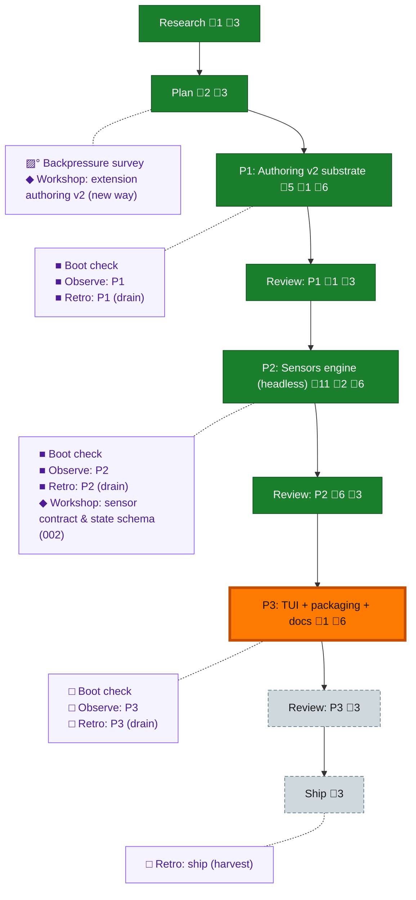

<!-- GENERATED by `harness flow render` — do not hand-edit; regenerate from the flow JSON. -->
# Flow · typed-extensions-sensors

**Kind**: flight-plan · **Now**: phase-3 · **Next**: review-3 · **Intent**: Typed harness extensions via a standardised factory (verbs/subverbs/sensors/records, backwards compatible) + a harness sensors built-in: deterministic repo-triggered runs, stats, Ink TUI, agent-friendly --json · **Nodes**: 22 · **Events**: 78

**Rail**: ◆─◆─[ ◆─◆─◆─◆─◇─◇─◇ ]  ◆ Research · ◆ Plan · [ ◆ P1: Authoring v2 substrate · ◆ Review: P1 · ◆ P2: Sensors engine (headless) · ◆ Review: P2 · ◇ P3: TUI + packaging + docs · ◇ Review: P3 · ◇ Ship ]

**Legend** — colour = type/status: 🟩 done · 🟢 in-progress · 🟥 blocked · 🟦 known · ⬜ assumed · 🔶 decision · 🗣 user input · 🟪 harness chore (faded = not yet done) · 🤖 companion · 🛠 worker · 🟧 current (you are here). Badges: 💬 comments · 📄 artifacts · 📝 instructions · 🧰 chore (° optional / recommended / ‼ strongly-recommended; ✓ done · ✕ skipped).

## Node log

### research · Research
- 📄 artifacts: docs/plans/059-typed-extensions-sensors/research-dossier.md

### plan · Plan
- 📄 artifacts: docs/plans/059-typed-extensions-sensors/typed-extensions-sensors-plan.md, docs/plans/059-typed-extensions-sensors/validations/typed-extensions-sensors-plan-validation.md

### phase-1 · P1: Authoring v2 substrate
- 📄 artifacts: docs/plans/059-typed-extensions-sensors/tasks/phase-1-authoring-v2-substrate/tasks.md
- `2026-07-14T06:58:47.310Z` · — · note — Dispatched dlg-0001 (whole phase T001-T010) to coder the coder seat (pi, gpt-5.6-sol:max) via flow-pair run 2026-07-14T06-55-22Z; reviewer sol:high deferred to first REVIEW via the transport seat transport per INC-002 mitigation
- `2026-07-14T07:48:25.114Z` · — · validation — Coder dlg-0001 COMPLETE (T001-T010). Orchestrator independent verification: tests+biome+typecheck GREEN (ran locally); arch-check/markdown-lint degradations confirmed baseline (arch = 2 pre-existing telemetry violations, new v2/ code adds none; new docs lint 0 errors); fences held (worktree=harness/cli+plan folder, root=M .gitignore only, private-consumer untouched). Load proofs: worktree 10/0/0 v1, private-consumer 9/0/0 v1. 2404 tests pass. Awaiting cross-model reviewer (Dim-0 gate) before APPROVE.
- `2026-07-14T07:52:00.032Z` · — · note — Cross-model review dispatched: the reviewer seat (gpt-5.6-sol:high, canary PASS — distinct pid 34463, spawnedBy the transport seat per INC-002) reviewing diff-0001 with mandatory Dim-0 mutation gate on api-gate/classify/normalize/corpus-guard; verdict pending
- `2026-07-14T08:08:11.025Z` · — · warning — Review verdict FIX_REQUIRED (reviewer the reviewer seat, Dim-0 evidence solid: 4/4 mutations RED-&gt;GREEN). 2 HIGH orchestrator-confirmed real: (1) api-gate.ts:27 conflates omitted-api with core level -&gt; breaks E3/E4 forward-compat on first core bump; (2) normalize.ts:86 record spread order lets declaration overwrite kind/type. + 2 MEDIUM (subverb parent-arg edge, folder-from-filename warning). Fix packet dlg-0002 dispatched to coder.
- `2026-07-14T08:18:01.379Z` · — · note — Fix dlg-0002 COMPLETE (2412 tests). Orchestrator verified both HIGH fixes at source: api-gate now declaredApi(??2, permanent) vs injectable coreApi + minimumKnownApi for E4 advisory; records reconstruct from known fields only (no spread overwrite). Scoped re-review dispatched to same reviewer with empirical Dim-0 re-run on HIGH-1.

### review-1 · Review: P1
- `2026-07-14T08:23:12.326Z` · — · validation — APPROVE (reviewer the reviewer seat, re-review dlg-0002). All 4 findings RESOLVED with empirical Dim-0 (HIGH-1 mutant RED on future-core assertion -&gt; restored GREEN, proving non-vacuous). Orchestrator sanity pass: verified both HIGH fixes at source (declaredApi??2 vs injectable coreApi + minimumKnownApi; records known-fields-only); ran v2-api-gate+v2-normalize suites locally 14/14; future-core tests (coreApi:3) confirmed present. Final harness checks green + 2 baseline degradations. v1 verb.ts diff-empty, corpus bytes unchanged.

### backpressure · Backpressure survey
- `2026-07-14T06:08:22.819Z` · — · note — Declined by Jordan (went straight to Phase 1 tasks); plan already self-designs its primary sensors (conformance corpus + guard)

### boot-1 · Boot check
- `2026-07-14T06:58:46.901Z` · — · validation — pre-flight fired (real router call): boot DEGRADED — healthy boot 12.7s after fresh-worktree npm ci + build (pre-flight caught the missing install); checks: all ok except pre-existing warn-level arch-check x2 + markdown-lint

### workshop-1 · Workshop: extension authoring v2 (new way)
- 📄 artifacts: docs/plans/059-typed-extensions-sensors/workshops/001-extension-authoring-v2.md
- `2026-07-14T04:45:55.394Z` · — · decision — Addendum: type model D6 (core types verb/sensor/record reserved; user types under custom.&lt;type&gt; — data+discovery only, behavior via querying verbs) + D7 (per-subverb scoped options/args, parent options shared, variadics unlocked in v2)

### phase-2 · P2: Sensors engine (headless)
- 📄 artifacts: docs/plans/059-typed-extensions-sensors/tasks/phase-2-sensors-engine-headless/tasks.md, docs/plans/059-typed-extensions-sensors/validations/phase-2-tasks-validation.md
- `2026-07-14T12:03:09.695Z` · — · — — Phase 2 prepared: tasks dossier tasks/phase-2-sensors-engine-headless/tasks.md (11 tasks T001-T011, workshop-first — T001 gates; TDD red lane T002 incl. scheduler). Opus validation: VALIDATED WITH FIXES (2 MEDIUM: T002 red-lane scope + DAG edges; both fixed, sidecar validations/phase-2-tasks-validation.md). Awaiting Jordan's implement go + fleet config.
- `2026-07-14T19:48:22.041Z` · — · — — T001 done: workshop 002 folded into plan (AC-09/deps/2.1/2.5 rows) + tasks dossier + spine annotations. Opus plan validation: VALIDATED WITH FIXES — 1 CRITICAL (unconfigured exits 2, would break AC-13 on fresh repos; fixed as S13 degraded-only), 1 HIGH (worked example runStatus timeout), 1 MED (skip propagation), 1 LOW (picomatch landing step). Sidecar overwritten per revalidation rules. Phase 2 now fully contract-ready; awaiting implement go + fleet config.
- `2026-07-14T20:15:15.491Z` · — · — — Dispatched dlg-0002 (whole phase T002-T011) to coder the coder seat (gpt-5.6-sol:max) under lease-ec73fa2e; canary nonce p059-p2-coder-2012 round-trip gated the grant. Reviewer the reviewer (sol:high) deferred to first review with re-canary. Fences: harness/cli src+test, package±lock (picomatch), harness-sensors.md doc, phase tasks dir; no P3, E210-E217 only, corpus append-only.
- `2026-07-14T21:08:31.225Z` · — · — — Coder dlg-0002 COMPLETE (T002-T011; report arrived via quarantined the duplicate alias alias, correlated to canonical the coder transcript per INC-003 — no alias reply; coder compacted-early). Orchestrator independent verification GREEN: 2461/2461 tests run locally; picomatch-only package delta (json+lock); frozen 9 corpus hashes intact; verb.ts diff-empty; load-proofs 10/10 + 9/9; S13 empirically proven (fresh-repo sensors --json = degraded exit 0); compat wrapper adjudicated ACCEPT-in-principle (narrow legacyCommandSensor gate, loud info line, E216 preserved, doc silent on legacy shape). Orchestrator finding for review: appended fixtures manual-sensor.ts/invalid-sensor.js not added to FROZEN_API_2 manifest. the reviewer re-canary via the transport seat in flight (nonce p059-p2-reviewer-2107); review request staged at .flow-pair/.../reviews/review-request-dlg-0002-p2.md with mandatory Dim-0 targets.
- `2026-07-14T21:11:39.104Z` · agent · note — the reviewer canary verified (nonce p059-p2-reviewer-2107; pwd/branch/HEAD 5c9b53e6/model gpt-5.6-sol/effort high all correct). Review packet dispatched to the reviewer seat: review-request-dlg-0002-p2.md (Dim-0 mandatory, &gt;=3 targets). Awaiting verdict.
- `2026-07-14T21:22:41.319Z` · agent · validation — the reviewer verdict r1: FIX_REQUIRED (1 HIGH runner hard-timeout not enforced on pending run(); 2 MEDIUM scheduler latest-burst queue loss + unfrozen appended fixtures). All three orchestrator-confirmed at source; fixture hashes independently matched. Dim-0 gate satisfied: 4 mutations RED-&gt;GREEN, byte-identical restores. the reviewer compacted post-verdict. Verdict persisted (reviews/verdict-dlg-0002-p2-r1.md); fix packet dlg-0002-p2-fix1.md dispatched to the coder.
- `2026-07-14T21:37:09.957Z` · agent · note — Fix dlg-0002-p2-fix1 COMPLETE (report via the duplicate alias alias, correlated to canonical the coder transcript pij_send 21:33:36, no reply to alias; the coder compacted). Orchestrator verification green: F1 runner deadline race + F2 latest-burst queue + F3 frozen hashes all read at source; Clock.sleep AbortSignal widening adjudicated ACCEPT; full suite 2465/2465 self-run; nothing staged; fences clean. Round-2 review packet (review-request-dlg-0002-p2-r2.md, fix-diff-only scope, Dim-0 &gt;=2) dispatched to the reviewer. Awaiting r2 verdict.
- `2026-07-14T21:48:51.220Z` · agent · validation — the reviewer r2 verdict: FIX_REQUIRED — 2 regressions from fix1. F1 HIGH runner race wrong under FakeClock (orchestrator reproduced independently: instant-async false wallclockMs 10; one-extra-await false E212); F2 MEDIUM running-state dedup bypass reruns same-content no-op touches (self-feeding lane) — root cause partly orchestrator fix1 over-spec, owned + superseded. F3 + original A-&gt;B-&gt;A + Clock widening ACCEPTED by the reviewer. Dim-0 r2: 3 targets RED-&gt;GREEN, byte restores proven. Verdict persisted (verdict-dlg-0002-p2-r2.md); fix packet dlg-0002-p2-fix2.md dispatched to the coder. the reviewer compacted.
- `2026-07-14T21:57:30.847Z` · agent · note — Fix dlg-0002-p2-fix2 COMPLETE (duplicate-alias report correlated to canonical the coder 21:55:31; compacted). Orchestrator verification green: FakeClock waiter-based signal sleeps + scheduler conditional table read at source; own F1 repro now ok/wallclock 0 both shapes; full suite 2469/2469 self-run; nothing staged. Round-3 packet (review-request-dlg-0002-p2-r3.md) dispatched to the reviewer. Awaiting r3 verdict.
- `2026-07-14T22:06:00.701Z` · agent · validation — the reviewer r3 verdict: FIX_REQUIRED — 1 HIGH remains (FakeClock plain/signal sleep temporal composability: poll sleep advances time synchronously ahead of runnable microtasks -&gt; false E212/wallclock 1000; orchestrator reproduced independently). F2 scheduler ACCEPTED fully (the reviewer probed A-&gt;B-&gt;B, A-&gt;B-&gt;A-&gt;B beyond packet). Dim-0 r3: 3 targets RED-&gt;GREEN + byte restores. Convergence: 3 findings -&gt; 2 -&gt; 1 across rounds. Verdict persisted (verdict-dlg-0002-p2-r3.md); fix packet dlg-0002-p2-fix3.md dispatched. the reviewer compacted.
- `2026-07-14T22:15:33.184Z` · agent · note — Fix dlg-0002-p2-fix3 COMPLETE (duplicate-alias report correlated to canonical 22:13:49; compacted). Orchestrator verification: plain FakeClock.sleep setImmediate-deferred advancement read at source; own repro proves both directions (composed quick shapes ok/0; composed never-settling E212/1000); full suite 2470/2470 self-run; fences clean. Round-4 packet (review-request-dlg-0002-p2-r4.md) to the reviewer. Awaiting r4 verdict.

### review-2 · Review: P2
- `2026-07-14T22:24:49.533Z` · agent · validation — Cross-model review executed via flow-pair: the reviewer (gpt-5.6-sol:high), 4 rounds, Dim-0 mutation gate every round (12 mutations RED-&gt;GREEN, byte restores). r1-r3 FIX_REQUIRED (3 -&gt; 2 -&gt; 1 findings, strictly narrowing) -&gt; r4 APPROVE_WITH_NOTES. Orchestrator sanity pass passed (restore-hash re-verified, no rubber-stamp). Durable record: .flow-pair/runs/2026-07-14T06-55-22Z-github.com-AI-Substr/reviews/review-record-phase-2.md. Final: 2470/2470 tests, all hard gates ok. Nonblocking carry-forward: fake-clock.test.ts:40 prose says 'resolves immediately' — reword on next touch.
- `2026-07-14T22:29:52.467Z` · agent · warning — Prime verification HELD acceptance post-r4: (1) package-lock.json diff not picomatch-minimal (14 unrelated libc diff lines + URL churn from npm-version regeneration; orchestrator's r0 'picomatch-only' adjudication was wrong, confirmed at source 18+/60-); (2) fake-clock.test.ts:40 stale prose lands in-phase, not next-touch. Narrow closure lease lease-48092260 granted; correction packet dlg-0002-p2-fix4-closure.md dispatched to the coder (surgical lock restore from base, no regeneration; prose fix; no behavioral changes expected -&gt; no the reviewer rereview unless triggered).
- `2026-07-14T22:35:29.913Z` · agent · note — Expanded closure lease lease-f5c22177 granted. Interim race edits (lock 4-hunk minimal, clock-test truthful prose) verified + folded into authorized scope. Packet dlg-0002-p2-fix5-archport.md dispatched to the coder: prime-found HIGH arch breach (scheduler.ts node:crypto in services layer) -&gt; generic HashPort/NodeHash/FakeHash adapters + type-only scheduler injection + composition wiring + tests. Renewed the reviewer canary/review with Dim-0 to follow (behavioral change). Retro closure remains Jordan-owned.
- `2026-07-14T22:49:17.533Z` · agent · note — Fix5 archport COMPLETE (duplicate-alias report correlated to canonical 22:47:29; compacted). Orchestrator verification green: HashPort/NodeHash/FakeHash read at source (port generic + minimal; type-only scheduler import; canonical S10 layout unchanged; app.ts:305 sole NodeHash construction); services/sensors grep clean; lock byte-identical to prime-verified 4-hunk state (SHA e65aac85); full suite 2472/2472 self-run. Round-5 packet staged (review-request-dlg-0002-p2-r5.md); renewed the reviewer canary issued (nonce p059-p2-reviewer-r5-2248). observe-service follow-up recorded as SUGG-001 per prime ruling.
- `2026-07-14T22:59:02.154Z` · agent · validation — the reviewer r5 verdict: FIX_REQUIRED — 1 MEDIUM (Dim-0 surviving mutant: pinned canonical test emits pre-sorted paths, drop-sort survives suite; S10 order-independence unguarded). Orchestrator confirmed at source. Everything else ACCEPTED incl. independent pre/post digest-compat proof (old createHash vs NodeHash identical e5fbfa34; seeded old digest + reverse events = 0 reruns), FakeHash distinctness 7/7, lock exact, prose truthful. Micro packet dlg-0002-p2-fix6-sortguard.md (test-only + mutant proof) dispatched. the reviewer compacted.
- `2026-07-14T23:04:40.336Z` · agent · validation — FINAL: the reviewer r6 scoped verdict APPROVE (drop-sort mutant now RED 1F/7P with exact reverse-arrival string; byte-restore cmp=0; scheduler SHA = r5 accepted 1d448241). Phase 2 review cycle closed: 6 rounds + prime hold cascade, final 2472/2472, all hard gates ok. Review record amended in full (review-record-phase-2.md): prime-hold cascade section, final verdict APPROVE, r4 nonblocking note CLOSED in-phase. Retro-2 remains Jordan-owned (5-entry drain pending disposition).

### phase-3 · P3: TUI + packaging + docs
- `2026-07-15T00:29:35.551Z` · agent · note — WAITING_FOR_PHASE_3_BUILD_CONFIG — no Phase 3 authority

### boot-2 · Boot check
- `2026-07-14T20:13:59.075Z` · — · — — pre-flight fired: boot healthy 12.4s, degraded only on the 2 handed-down warn gates (arch-check x2 services-ports-type-only, markdown-lint) — same baseline P1 inherited. Fleet re-verified: the coder sol:max + the reviewer sol:high alive; prime-run canary nonce p059-p2-coder-2012 round-trip gated the lease grant (lease-ec73fa2e).

### retro-2 · Retro: P2 (drain)
- `2026-07-15T00:27:29.410Z` · agent · note — Drain complete per Jordan's disposition (save all, question UI): 5 entries written disposition:kept to .harness/records/retro/2026-07-15/001-059-phase-2-sensors.md (DL-001 flow flag shapes [highest-value], CONF-001 global-vs-dist, DL-002 E-code registry gap, CONF-002 package.json trap, SUGG-001 observe-service HashPort follow-up per prime ruling). Buffer cleared. Executed under narrow lease-df40c0d5.

### workshop-2 · Workshop: sensor contract & state schema (002)
- 📄 artifacts: docs/plans/059-typed-extensions-sensors/workshops/002-sensor-contract-state-schema.md
- `2026-07-14T19:48:36.271Z` · — · — — Approved (Contract Ready), decisions S1-S13: SensorDecl/SensorReading (incl. skip state, private-consumer evidence) + narrow SensorRunContext; runStatus ok\|error\|timeout separation; state/&lt;name&gt;.json record+stats one-atomic-file; daemon.json 5s/15s heartbeat; snapshot.json GITIGNORED (closes spine E5); picomatch selected (closes E3 matcher half); E210-E217 block; scheduler constants (1s quiescence, dedup hash, stale-queue-of-one, 30s default timeout); S13 reader paths degraded-never-unconfigured (exit-2 trap, private-consumer dlg-0003-fix1)
