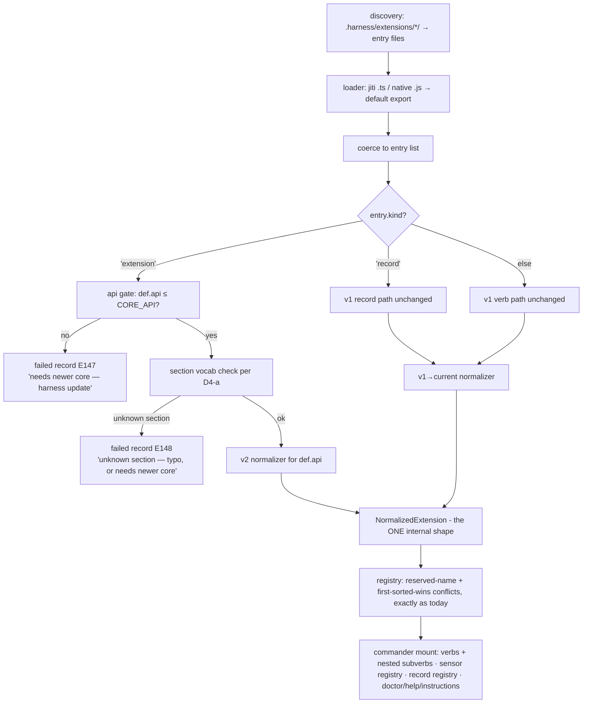

# Workshop: Extension Authoring v2 — the New Way (factory, detection, forward evolution)

**Type**: Data Model / API Contract
**Plan**: 059-typed-extensions-sensors
**Spec**: ../spine.md (requirements spine — section A)
**Created**: 2026-07-14
**Status**: Draft

**Value Thesis**: One authoring contract that the loader can *deterministically* classify (old way vs new way), that normalizes to a single internal shape (so the kernel never carries compat branches), and whose own future growth is governed by explicit rules — so a new-way extension written today keeps working under every future core, and an extension needing a newer core fails honestly instead of silently degrading.
**Target Proof Level**: Contract Ready
**Current Proof Level**: Contract Ready

**Selected Value Axes**:
- **Safety to Change**: the whole point — the new way must be extendable (new item kinds, new fields, new semantics) without breaking older new-way extensions.
- **Migration Safety**: v1 extensions load forever unchanged; porting is mechanical; detection is by shape, never by guess.
- **Implementation Readiness**: types, loader algorithm, error codes, and scaffold commands specified to buildable precision.
- **Agent Readiness**: agents author most extensions; the factory + scaffolder must make the right shape the only easy shape.

**Related Documents**:
- `../spine.md` §A (factory refactor requirements), §B (sensor kind — consumes this contract)
- `harness/cli/src/services/extensions/contract.ts` (v1 contract), `registry.ts` (kind routing), `discovery.ts` (folder resolution), `adapters/loader/` (jiti/native split)

---

## Purpose

Define the **new way** to author a harness extension: the `defineExtension()` factory shape, how the loader tells new way from old way, how `harness new` scaffolds it, and — the nuance this workshop exists for — how the new way itself evolves without breaking older new-way extensions. This is the substrate the sensor kind (spine §B) lands on.

## Fresh Entrant Outcome

A fresh human or agent should be able to use this workshop to reach **Contract Ready** with no additional context. They should be able to:

- Author a v2 extension (TS or plain JS) that loads, including subverbs.
- Say exactly how the loader classifies any default export (v1 verb / v1 record / v2 definition) and what error each malformed case produces.
- Add a future capability to the v2 contract (e.g. a `monitors:` section) following the evolution rules, and state why no existing extension breaks.

## Key Questions Addressed

- How do we tell "new way" from "old way"? (deterministically, per file)
- What is the new-way authoring shape, and how are subverbs declared?
- How does the new way evolve further without breaking older new-way extensions?
- How do we scaffold it, and how does a v1 extension port?

---

## Value Frame

| Field | Selection | Why It Matters |
|-------|-----------|----------------|
| Target Proof Level | Contract Ready | The plan stage phases the build from these types + rules; implementation detail (Ink TUI, watcher) is out of scope here |
| Primary Value Axis | Safety to Change | The compat promise is the product; everything else is renderable from the types |
| Supporting Value Axes | Migration Safety, Implementation Readiness, Agent Readiness | v1 must never break; agents must fall into the pit of success |
| Downstream Loop Improved | Implementation + every future contract evolution | "Can I add X to the contract?" becomes a rules lookup, not a debate |

## Decision Space

| Option | Description | Pros | Cons | Decision |
|--------|-------------|------|------|----------|
| D1-a: discriminate by `kind: 'extension'` | v2 definition is one more arm of the existing kind-routing | Mechanical; reuses the proven `'record'` seam; visible in plain JSON | `kind` doubles as container-marker | **Selected** |
| D1-b: brand symbol / `__harness` field | Hidden brand added by the factory | Typo-proof | Invisible in plain-JS literals; a second discrimination mechanism beside `kind` | Rejected |
| D1-c: flag in `package.json` manifest | Folder-level format marker | No object shape change | Splits truth between manifest and export; breaks single-file classification | Rejected |
| D2-a: per-definition `api` level (int) | One integer on the definition names its contract vocabulary + semantics level | Pins authoring-time semantics; honest fail when extension > core | Authors can forget to bump (mitigated: doctor advisory) | **Selected** |
| D2-b: semver string | `contract: "2.1.0"` | Familiar | Overkill — nothing consumes minor/patch; ranges invite drift | Rejected |
| D2-c: no version, pure feature detection | Tolerant reader everywhere | Zero ceremony | Silent capability loss on old cores; semantic changes impossible ever | Rejected |
| D3-a: subverbs one level deep | `verbs.<name>.sub.<name>`, no deeper nesting | Covers every observed case (private-consumer `db reset`, `shopify probe`); keeps help/dispatch simple | A future 3-level CLI would need api bump | **Selected** |
| D4-a: strict section vocabulary + tolerant fields | Unknown **top-level section** → honest failure; unknown extra *fields* inside known structures → ignored (doctor info) | No silent capability loss; typos in sections caught; minor additions don't break old cores | Two-tier rule to document | **Selected** |
| D5-a: factory optional (brand is the shape) | `defineExtension()` = identity + brand + types; a bare literal with `kind:'extension'` is equally valid | Plain-JS works with zero runtime dependency; factory is DX, not load-bearing | Two documented authoring forms | **Selected** |
| D6-a: user-defined types under one reserved `custom:` section | `custom.<type>.<name>` items — core gives data + discovery (validate `summary`, register, query via `ctx.registry.items(type)` + doctor), zero semantics; behavior comes from a plain verb querying the registry | E148 stays strict; core vocabulary can grow forever without colliding with user types (namespaces never overlap); the `checks`-style fold-over-a-type pattern is free for user types | User types can't hook core runtimes (by design — that's an api bump) | **Selected** |
| D6-b: user-invented top-level sections (`x-` prefix) | Vendor-style escape hatch | Familiar convention | Weakens E148; prefix discipline unenforceable; future-core collision story is messy | Rejected |
| D7-a: params identical to v1, scoped per subverb, variadics unlocked | `options`/`args` keep v1 field shapes; subverbs declare their own (scoped help + parsing); parent options shared via `ctx.options`; declared variadic args type as `string[]` in v2 | Porting stays mechanical; deletes the "flag prose conventions" wart; lifts the v1 no-variadics limit with no v1 impact | — | **Selected** |

---

## The contract (v2, api 2)

### Discrimination — old way vs new way

The loader classifies each entry of the (array-coerced) default export **by shape, per entry, no guessing**:

```
entry.kind === 'extension'  → NEW WAY  (ExtensionDefinition → v2 normalizer, api-gated)
entry.kind === 'record'     → old way  (HarnessRecordType — existing path, unchanged)
otherwise                   → old way  (HarnessVerb — existing path, unchanged; kind absent/'verb')
```

- v1 is retroactively **api 1**. It has no marker — absence of `kind:'extension'` *is* the v1 signal. v1 loads forever, byte-for-byte unchanged behaviour.
- `harness doctor` reports per extension: `format: v1` or `format: v2 (api N)`.
- Mixed arrays (a v2 definition beside stray v1 verbs in one file) route each entry independently — legal, doctor notes it as untidy, nothing fails.

### Types

```typescript
/** What the factory returns / a plain-JS author writes literally. */
interface ExtensionDefinition {
  kind: 'extension';                    // the old/new discriminator (D1-a)
  api?: number;                         // contract level; ABSENT ⇒ 2. Pins vocabulary + semantics (D2-a)
  name: string;                         // package identity; doctor warns (never fails) if ≠ folder name
  summary: string;
  description?: string;
  verbs?: Record<string, VerbDecl>;     // key = top-level verb name
  sensors?: Record<string, SensorDecl>; // api 2 vocabulary reserves the key; shape owned by spine §B / its own workshop
  records?: Record<string, RecordDecl>; // v1 HarnessRecordType minus `kind`/`type` (key = type name)
  custom?: Record<string, Record<string, CustomItem>>; // user-defined types: custom.<type>.<name> (D6-a)
}

/** A user-defined-type item. Core validates only `summary`; the rest is the defining repo's contract. */
interface CustomItem {
  summary: string;
  [key: string]: unknown;               // free-form — consumed by verbs via ctx.registry.items('<type>')
}

/** A verb. Same field names as v1 HarnessVerb (minus name/kind) — that identity is what makes porting mechanical. */
interface VerbDecl {
  summary: string;
  description?: string;
  options?: VerbOption[];               // v1 shape, unchanged
  args?: VerbArg[];                     // v1 shape, unchanged
  run?(ctx: VerbContext): VerbResult | Promise<VerbResult>;  // optional iff `sub` present
  sub?: Record<string, SubverbDecl>;    // ONE level deep (D3-a). SubverbDecl = VerbDecl without `sub`
}
```

Rules the validator enforces (extending today's `verbShapeIssues`):

1. `sub` and `run` may coexist: `run` becomes the bare-`harness <verb>` handler; absent `run` with `sub` → kernel emits the "pick a subverb" `unconfigured` envelope (deletes every hand-rolled `case "":` in the wild).
2. A `SubverbDecl` carrying `sub` → shape error (one level, api 2).
3. Subverb options are scoped to their subverb — commander nested commands, so `harness db reset --help` and reset-scoped `--force` exist structurally. Parent-verb options are shared: visible to every subverb via `ctx.options` (commander parent semantics) for cross-cutting flags.
4. Unknown **fields** inside VerbDecl/SubverbDecl: ignored at runtime, surfaced as doctor info (D4-a tolerant tier).
5. Variadic positional args (`<files...>`) are legal in v2 (D7-a): declared variadics arrive as `string[]` in `ctx.args`. (v1's rejection stands unchanged on the v1 path.)

### The type model (D6-a)

Items are typed; extension *packages* are not — one package may contribute a verb, two sensors, and a custom item. Two tiers:

| Tier | Types | Semantics owner | Evolution |
|---|---|---|---|
| **Core-defined** | `verb`, `sensor`, `record` (api 2) | the core: CLI mount, sensors runtime, record registry | new core types = new vocabulary section = api bump (E1); names reserved forever |
| **User-defined** | anything under `custom.<type>` | the defining repo: a plain verb queries `ctx.registry.items('<type>')` and acts | collision-proof — core sections and `custom.*` namespaces never overlap, so core growth can never break a user type |

Worked pattern: a repo declares `custom.migration` items across several extensions + one `migrate` verb that folds over `ctx.registry.items('migration')` — the same aggregation shape as `checks` folding over sensors, with zero core involvement.

### The factory (identity + brand + types — never load-bearing)

```typescript
// runtime export from '@ai-substrate/engineering-harness/contract' (its first runtime export)
export function defineExtension(def: ExtensionInput): ExtensionDefinition {
  return { kind: 'extension', ...def };   // does NOT stamp `api` — absence means 2 by contract, not by injection
}
```

- **Why it never stamps `api`**: the function resolves from the *loader's* core at load time; stamping would mark every extension with the running core's level instead of its authoring-time level. Absence-defaults-to-2 keeps the declaration honest.
- **Resolution**: `.ts`/`.tsx` load via jiti → add a jiti `alias` mapping `@ai-substrate/engineering-harness/contract` → the core's own contract module, so the import resolves with **no consumer install**. `.js`/`.mjs`/`.cjs` load via native `import()` (no alias hook) → plain-JS authors write the **bare literal** (`{ kind: 'extension', name, ... }`) — sanctioned form per D5-a, documented in the scaffold's `--js` template.

### Worked example — private-consumer `db`, ported

```typescript
import { defineExtension } from '@ai-substrate/engineering-harness/contract';

export default defineExtension({
  name: 'db',
  summary: 'Local database dev-loop. SQLite only.',
  verbs: {
    db: {
      summary: 'Local database dev-loop.',
      sub: {
        reset: {
          summary: 'Drop → migrate → starter seed. Idempotent.',
          options: [{ flags: '--force', description: 'bypass the live-dev-server guard' }],
          async run(ctx) { /* body unchanged from v1 — same ctx, same VerbResult */ },
        },
      },
    },
  },
});
```

Port delta from v1: delete the dispatch `switch`, the `""`→unconfigured case, the `E_UNKNOWN_VERB` case, and the `description` string-array listing subverbs (now structural). The `run` bodies move verbatim.

---

## The load pipeline (normalize once, kernel sees one shape)



**`NormalizedExtension`** (internal, versionless — always the *current* shape): `{ name, source: 'v1' | 'v2', api, entryPath, verbs: NormalizedVerb[], sensors: [], recordTypes: [] }`. Every kernel consumer (help, doctor, dispatch, instructions, the future `harness sensors`) reads only this. **All compat lives in the normalizers** — v1→current is one function; each future api level adds one more. Kernel consumers never branch on format again.

---

## The evolution rules — extending the new way without breaking older new-way

The nuance this workshop exists for. Five rules, in force from api 2 onward:

| # | Rule | What it buys |
|---|------|--------------|
| E1 | **`api` is a monotonic vocabulary level.** Each level's top-level sections + item fields are enumerated in the contract module (`API_VOCABULARY: Record<level, sections>`). New sections/kinds ⇒ new level. A level-N core loads every level ≤ N via normalizers. | Older new-way extensions run unchanged on every future core |
| E2 | **Extension newer than core fails honestly.** `def.api > CORE_API` → per-extension `failed` record `E147` with `next_action: "harness update"`. Never partial loading, never silent section-dropping. | No silent capability loss — the failure mode is a message, not a mystery |
| E3 | **Declared api pins semantics.** A semantic change (a default, an interpretation) ships as: new field preferred; if unavoidable, an api bump whose normalizer preserves the *old* behaviour for extensions declaring the old level. An author's extension behaves forever as it did the day it was written. | Semantic evolution without retro-breaking |
| E4 | **Two-tier unknown handling (D4-a).** Unknown **top-level section**: `E148` failure (typo or future vocab — either way, not silently ignorable). Unknown **field inside a known structure**: tolerated at runtime, doctor info line. Corollary: a core that *does* know a section an extension uses above its declared api accepts it and doctor-advises "bump `api`". | Strict where silence would lose capability; tolerant where strictness would churn |
| E5 | **`ctx` capabilities stay presence-detected** (`ctx.fsWrite?`, `ctx.steps?` …) — additive injection, never api-gated. The existing v1 precedent, unchanged. | Runtime surface grows freely without touching the vocabulary |

**Worked future case — adding `monitors:` at api 3.** Core ships `API_VOCABULARY[3] = [...vocab2, 'monitors']` + a level-3 normalizer. (a) Existing api-2 extensions: vocabulary untouched, normalizers unchanged for level 2 → zero effect. (b) New extension `{ api: 3, monitors: {...} }` on a level-3 core → loads. (c) Same extension on an old level-2 core → `E147`, "needs newer core". (d) Author writes `monitors:` but forgets `api: 3`, on a level-2 core → `E148` (unknown section — honest, not silent). On a level-3 core → loads + doctor advisory "uses api-3 section, declares 2 — bump it".

**Enforcement is deterministic, not doctrinal**: a frozen conformance corpus `test/conformance/extensions/api-2/*.{ts,js}` (one fixture per authoring form: factory, bare literal, subverbs, mixed array, each error case) loads on every core change; green = no shipped new-way shape broke. Future levels append `api-3/` fixtures; **existing fixture files are never edited** — that immutability *is* the compat promise, encoded as back-pressure on this repo itself.

---

## Scaffolding (`harness new`, v2-only)

| Command | Emits |
|---|---|
| `harness new db` | `.harness/extensions/db/extension.ts` — factory, one verb stub returning `ctx.unconfigured(...)` + `instructions.md` |
| `harness new db --sub reset,seed` | same, verb with two subverb stubs (no hand dispatch anywhere) |
| `harness new build --wrap "npm run build"` | verb whose `run` wraps the command via `ctx.exec`, envelope mapped from exit code |
| `harness new lint-count --sensor` | sensor-item stub (wrap-a-command, exit-code reading) — shape per spine §B workshop |
| `harness new seed --js` | `extension.js` with the **bare branded literal** + JSDoc `@type` annotations (no factory import) |

- No `--legacy`/v1 scaffold. v1 keeps loading; it just stops being mintable — the paved path is the incentive (Rule 9), never a wail.
- Every template includes `instructions.md` (the existing E144 convention, unchanged).

## Error codes (additive)

| Code | Meaning | next_action |
|---|---|---|
| E147 | `api` > core's supported level | `Run harness update — this extension needs a newer harness core (api N > supported M).` |
| E148 | unknown top-level section for the declared api | `Fix the section name, or if it's from a newer contract: declare the api level and run harness update.` |
| E140/E142/E143/E144 | unchanged (load-fail / conflict / flat layout / missing instructions) | as today |

## Attention Reduction

| Future Loop | Before Workshop | After Workshop |
|-------------|-----------------|----------------|
| Implementation | "factory + compat" was a paragraph of intent | Types, routing algorithm, error codes, normalizer seam — buildable directly |
| Contract evolution | every addition would re-open "will this break existing extensions?" | E1–E5 lookup + append-only conformance corpus answers it deterministically |
| Porting v1 | unclear scope | mechanical checklist: wrap in factory, delete dispatch boilerplate, bodies move verbatim |
| Agent authoring | agent could mint any of three shapes | `harness new` emits the one right shape; bare-literal escape hatch documented for JS |

## Open Questions

### Q1: Does `SensorDecl`'s exact shape belong here?
**RESOLVED**: No — api 2 *reserves* the `sensors:` section key (so it's in-vocabulary from day one); the reading/threshold/watch contract is spine §B's own workshop/plan phase.

### Q2: One definition per file, or several?
**RESOLVED**: The array coercion already permits several; each routes independently. Convention (scaffold + docs): one. Doctor stays silent on multiples — no rule without a demonstrated need (D5 anti-sprawl).

### Q3: Must `name` match the folder name?
**RESOLVED**: Warn-never-fail in doctor. Folder is the discovery identity; `name` is display/provenance. Failing on mismatch would break folder renames pointlessly.

## Validation / Acceptance

This workshop reaches Contract Ready when:

- The plan's factory phase can be written from the Types + pipeline sections without re-opening design.
- Every classification case (v1 verb, v1 record, v2 ok, E147, E148, mixed array) has a stated outcome here.
- The future-case walkthrough (api 3 `monitors:`) resolves all four sub-cases from rules E1–E5 alone.
