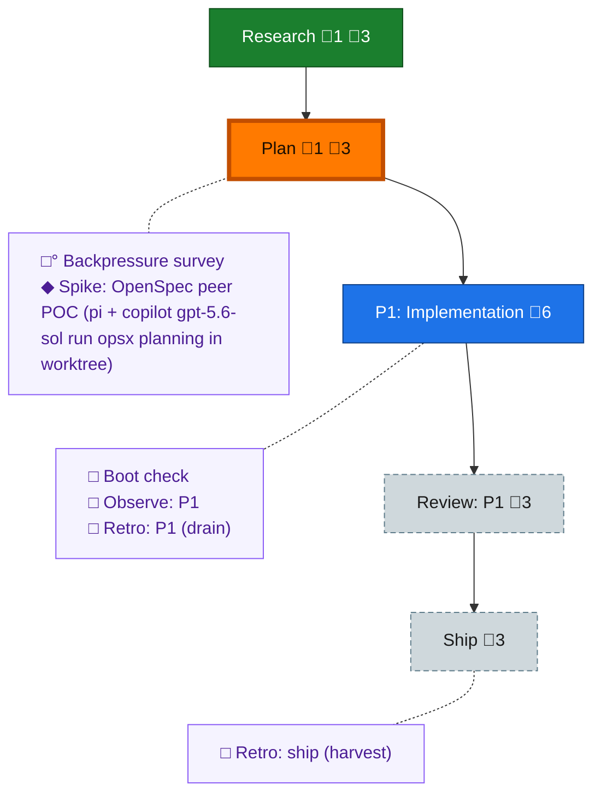

<!-- GENERATED by `harness flow render` — do not hand-edit; regenerate from the flow JSON. -->
# Flow · openspec-sdd-substrate

**Kind**: flight-plan · **Now**: plan · **Intent**: OpenSpec-based version of the builder flow: bring it in line with the community base while keeping the spine and harness seams; OpenSpec as an SDD option in harness (alongside flow or plugging into it) · **Nodes**: 11 · **Events**: 11

**Rail**: ◆─◐─[ ◇─◇─◇ ]  ◆ Research · ◐ Plan · [ ◇ P1: Implementation · ◇ Review: P1 · ◇ Ship ]

**Legend** — colour = type/status: 🟩 done · 🟢 in-progress · 🟥 blocked · 🟦 known · ⬜ assumed · 🔶 decision · 🗣 user input · 🟪 harness chore (faded = not yet done) · 🤖 companion · 🛠 worker · 🟧 current (you are here). Badges: 💬 comments · 📄 artifacts · 📝 instructions · 🧰 chore (° optional / recommended / ‼ strongly-recommended; ✓ done · ✕ skipped).

## Node log

### research · Research
- 📄 artifacts: docs/plans/062-openspec-sdd-substrate/research-dossier.md

### plan · Plan
- `2026-07-17T23:04:54.755Z` · user · decision — Round 1 locked: Mode=Simple, Testing=Hybrid, Mocks=Targeted, Docs=docs/how/. Round 2 (composition/state-owner/artifact-home/seam-carrier) DEFERRED verbatim: 'I dont know wnough about open spec to know, i will need to run some myself first… you will have to run me through what is open spec's sctick and what it brings over the flow and why its so popular… defer the rest until i know what open spec is.' Plan pass paused pending Jordan's hands-on OpenSpec familiarization.

### spike-openspec-poc · Spike: OpenSpec peer POC (pi + copilot gpt-5.6-sol run opsx planning in worktree)
- 📄 artifacts: docs/plans/062-openspec-sdd-substrate/spike-openspec-poc.md
