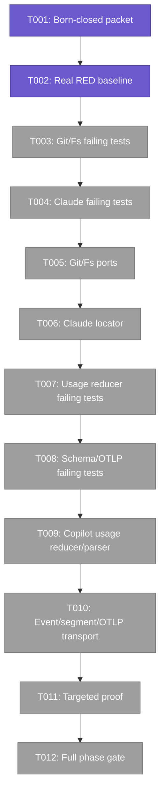
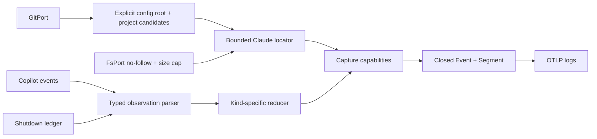
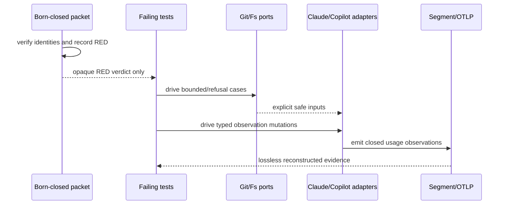

# Phase 1 Tasks — Safe Capture and Typed Usage

**Plan**: [`systemic-telemetry-repair-plan.md`](../../systemic-telemetry-repair-plan.md)
**Phase**: Phase 1 — Safe Capture and Typed Usage
**Status**: Proposed — implementation requires explicit human GO
**Backpressure basis**: `d8a6dcde37ad956466fee3dc8ffec2aa88015dc2ac194f6d406d686f361742bb`
**Backpressure**: [`backpressure-coverage.md`](../../backpressure-coverage.md) — Certainty Partial

> Path convention: `/repo` is the privacy-safe logical absolute root of the isolated P063 worktree. Resolve it once at implementation intake; never write a machine-local home path into tracked artifacts.

## Executive Briefing

### Purpose

Phase 1 establishes trustworthy token capture inputs before any durable-reader or public-report work. It first proves the existing failure against the authorized real-session oracle under a separately approved born-closed packet, then uses TDD to add bounded standard-Claude transcript location and current Copilot typed usage observations without double-counting unlike evidence.

### What We're Building

- A selected-standard-root Claude locator that accepts only explicit current/main/common-repository known-worktree candidates and exactly one confined transcript.
- Read-only Git and filesystem port capabilities for bounded candidate discovery, symlink refusal, and a byte ceiling enforced before allocation.
- A closed typed usage observation model for Copilot message output, cumulative checkpoint, partial compaction, and final shutdown evidence.
- Lossless segment/schema/OTLP transport for typed observations.
- Mutation-defended tests proving precedence, non-addition of unlike kinds, privacy, and compatibility.

### Goals

- ✅ Establish the immutable real-session RED baseline before product edits.
- ✅ Make unsafe or ambiguous Claude lookup degrade with a closed evidence reason.
- ✅ Parse current Copilot event shapes instead of relying on obsolete process-log-only usage.
- ✅ Preserve counts-only privacy and ports/adapters boundaries.
- ✅ Leave Phase 1 with exact targeted and repository-wide proof commands.

### Non-Goals

- ❌ No Phase 2 durable ref/session/fleet merge or public degraded-envelope work.
- ❌ No Phase 3 real GREEN replay, sanitized fixture promotion, or publication review.
- ❌ No turn-duration, full model provenance, plan attribution, broad lifecycle-cause, adopted-seat producer, or PIJ notice work.
- ❌ No global Claude project-directory scan or product special case for an excluded local configuration.
- ❌ No raw corpus access until the born-closed execution packet is separately approved.

## Prior Phase Context

Phase 1 has no prior implementation phase.

Planning inputs already established:

- Plan v1.0.1 is READY and converged on merge `c3ec0cef2dbd42b8c5058df8db176f143e2187bd`.
- The private oracle is available but remains access-controlled; tracked work uses opaque evidence IDs only.
- The real backpressure survey selected existing Vitest, schema, architecture, privacy, and composite gates; only the private replay sensor needs a separately approved execution packet.

## Pre-Implementation Check

| File | Exists? | Domain Check | Notes |
|---|---|---|---|
| `/repo/harness/cli/src/adapters/git/git-port.ts` | yes | harness-cli contract | Modify additively; candidate enumeration is read-only. |
| `/repo/harness/cli/src/adapters/git/exec-git.ts` | yes | harness-cli internal | Parse bounded worktree porcelain; no service shell-out. |
| `/repo/harness/cli/src/adapters/git/fake-git.ts` | yes | repo-engineering-substrate test fake | Record calls and deterministic malformed/bounded candidates. |
| `/repo/harness/cli/src/adapters/fs/fs-port.ts` | yes | harness-cli contract | Add bounded no-follow metadata/read capability; preserve existing methods. |
| `/repo/harness/cli/src/adapters/fs/node-fs.ts` | yes | harness-cli internal | Enforce regular-file/symlink/size check before allocation. |
| `/repo/harness/cli/src/adapters/fs/fake-fs.ts` | yes | repo-engineering-substrate test fake | Model symlink/non-file/oversize without behavioral mocks. |
| `/repo/harness/cli/src/services/telemetry/adapters/harness-adapter.ts` | yes | harness-cli contract | Thread selected config root + explicit candidate roots; no global state. |
| `/repo/harness/cli/src/services/telemetry/capture-service.ts` | yes | harness-cli internal | Resolve session/config/candidate inputs once per capture. |
| `/repo/harness/cli/src/services/telemetry/adapters/claude-adapter.ts` | yes | harness-cli internal | Current locator is cwd-only and default-root-only; replace defensively. |
| `/repo/harness/cli/src/services/telemetry/adapters/copilot-adapter.ts` | yes | harness-cli internal | Current tokens are process-log `assistant_usage`; current events are not parsed for usage. |
| `/repo/harness/cli/src/services/telemetry/copilot-ledger.ts` | yes | harness-cli internal | Current parser reads only the last final shutdown record. |
| `/repo/harness/cli/src/services/telemetry/usage-observation.ts` | no — create | harness-cli internal | Single shared kind/coverage/reduction contract; confirm no duplicate concept exists. |
| `/repo/harness/cli/src/services/telemetry/events.ts` | yes | harness-cli contract | Closed event union; additive typed usage event only. |
| `/repo/harness/cli/src/services/telemetry/segment.ts` | yes | harness-cli contract | Serializer is allowlist-by-construction; never spread vendor input. |
| `/repo/harness/cli/src/services/telemetry/segment.schema.json` | yes | harness-cli contract | `additionalProperties:false`; add closed observation enum and nullable buckets. |
| `/repo/harness/cli/src/services/telemetry/otlp/semconv.ts` | yes | harness-cli contract | Add closed semantic-convention keys only. |
| `/repo/harness/cli/src/services/telemetry/otlp/logs.ts` | yes | harness-cli internal | Encode/decode equality required. |
| `/repo/harness/cli/src/services/telemetry/otlp/harness-otlp.schema.json` | yes | harness-cli contract | Stored shape stays closed. |
| `/repo/harness/cli/test/adapters/git/fake-git.test.ts` | yes | repo-engineering-substrate | Extend before Git implementation. |
| `/repo/harness/cli/test/adapters/git/exec-git.test.ts` | no — create | repo-engineering-substrate | Direct bounded/malformed porcelain behavior. |
| `/repo/harness/cli/test/adapters/fs/fake-fs.test.ts` | yes | repo-engineering-substrate | Extend before FsPort implementation. |
| `/repo/harness/cli/test/adapters/fs/node-fs.test.ts` | no — create | repo-engineering-substrate | Real symlink refusal and pre-allocation byte guard. |
| `/repo/harness/cli/test/services/telemetry/claude-adapter.test.ts` | yes | repo-engineering-substrate | Add selected-root and candidate outcome matrix. |
| `/repo/harness/cli/test/services/telemetry/capture-service.test.ts` | yes | repo-engineering-substrate | Pin once-resolved explicit inputs. |
| `/repo/harness/cli/test/services/telemetry/copilot-adapter.test.ts` | yes | repo-engineering-substrate | Add current usage record extraction and privacy mutations. |
| `/repo/harness/cli/test/services/telemetry/copilot-events.test.ts` | yes | repo-engineering-substrate | Add typed event order/precedence/non-double-count cases. |
| `/repo/harness/cli/test/services/telemetry/copilot-ledger.test.ts` | yes | repo-engineering-substrate | Add message/checkpoint/compaction/final reducer fixtures. |
| `/repo/harness/cli/test/services/telemetry/segment-schema.test.ts` | yes | repo-engineering-substrate | Add closed typed usage schema cases. |
| `/repo/harness/cli/test/services/telemetry/otlp/reconstruction.test.ts` | yes | repo-engineering-substrate | Add lossless typed usage reconstruction. |
| `/repo/harness/cli/test/services/telemetry/events-rollup.test.ts` | yes | repo-engineering-substrate | Assert unlike observations never become additive rollup totals. |
| `/repo/harness/cli/test/services/telemetry/publication-boundary.test.ts` | yes | repo-engineering-substrate | Preserve counts-only publication under new event shape. |
| `/repo/harness/cli/test/architecture/no-direct-node-io.test.ts` | yes | repo-engineering-substrate | Existing architecture sensor. |
| `/repo/harness/cli/test/architecture/no-direct-exit.test.ts` | yes | repo-engineering-substrate | Existing act/service boundary sensor. |

Contract changes are additive but high-risk: `GitPort`, `FsPort`, `HarnessSource`, the event union, segment schema, and OTLP semantic keys have multiple consumers. Tests must land before each implementation task, and all implementations/fakes must move together.

## Architecture Map



## Tasks

| Status | ID | Task | Domain | Path(s) | Done When | Notes |
|---|---|---|---|---|---|---|
| [ ] | T001 | Obtain a separately approved born-closed private replay execution packet | repo-engineering-substrate | private packet outside tracked tree; tracked reference only in execution log | Jordan/prime approve an exact read-only command, frozen source identity table, report fence, allowlisted parser fields, private output location/schema, stop conditions, and reviewer; packet forbids raw logging, copying, mutation, workers, network, and tracked private values | Gate for AC-06; no corpus tool call before approval |
| [ ] | T002 | Execute identity verification and capture the current implementation's private RED baseline | repo-engineering-substrate | packet-authorized read-only sources and private ignored output only | Every source matches the packet identity; expected opaque fields are independently derived at the historical fence; current code is RED for every applicable Phase 1 token seam; mismatch/missing/ambiguity stops; tracked execution log records only opaque verdicts and private artifact hash | Depends T001; Plan 1.1; AC-06, AC-08; no product edits before this passes |
| [ ] | T003 | Write failing Git/filesystem port tests for bounded candidates and pre-allocation refusal | repo-engineering-substrate | `/repo/harness/cli/test/adapters/git/fake-git.test.ts`; `/repo/harness/cli/test/adapters/git/exec-git.test.ts`; `/repo/harness/cli/test/adapters/fs/fake-fs.test.ts`; `/repo/harness/cli/test/adapters/fs/node-fs.test.ts` | Tests fail on missing port behavior and cover bounded candidate count, malformed porcelain, stable dedupe/order, regular-file-only no-follow reads, symlink/non-file refusal, and byte ceiling before content allocation | Plan 1.2; AC-01; full fakes, no mocks |
| [ ] | T004 | Write failing Claude locator and capture-input tests | repo-engineering-substrate | `/repo/harness/cli/test/services/telemetry/claude-adapter.test.ts`; `/repo/harness/cli/test/services/telemetry/capture-service.test.ts` | Tests fail against current cwd-only behavior and cover default/selected standard root, current/main/common-repo known-worktree encodings, exactly-one match, zero/multiple/unresolved/traversal/symlink/oversize/malformed reasons, metadata-before-content, and no global scan | Plan 1.2; AC-01; official JSONL remains defensive |
| [ ] | T005 | Implement additive Git and filesystem port capabilities with production/fake parity | harness-cli | `/repo/harness/cli/src/adapters/git/git-port.ts`; `/repo/harness/cli/src/adapters/git/exec-git.ts`; `/repo/harness/cli/src/adapters/git/fake-git.ts`; `/repo/harness/cli/src/adapters/fs/fs-port.ts`; `/repo/harness/cli/src/adapters/fs/node-fs.ts`; `/repo/harness/cli/src/adapters/fs/fake-fs.ts` | T003 passes; worktree discovery is bounded/read-only; no-follow size metadata is checked before allocation; all existing port consumers compile; no service imports Node I/O | Plan 1.3; Finding 01; AC-01 |
| [ ] | T006 | Thread explicit locator inputs once and replace cwd-only Claude transcript resolution | harness-cli | `/repo/harness/cli/src/services/telemetry/adapters/harness-adapter.ts`; `/repo/harness/cli/src/services/telemetry/capture-service.ts`; `/repo/harness/cli/src/services/telemetry/adapters/claude-adapter.ts` | T004 passes; `currentPosition` and extraction share one safe resolved transcript; all failure modes return the closed evidence reason/null capability without arbitrary fallback; excluded local configuration is neither read nor special-cased | Plan 1.3; Finding 01; AC-01, AC-08 |
| [ ] | T007 | Write failing typed Copilot observation and precedence tests | repo-engineering-substrate | `/repo/harness/cli/test/services/telemetry/copilot-adapter.test.ts`; `/repo/harness/cli/test/services/telemetry/copilot-events.test.ts`; `/repo/harness/cli/test/services/telemetry/copilot-ledger.test.ts` | Tests fail against obsolete-log-only behavior and prove distinct message-output, cumulative-checkpoint, partial-compaction, and final-shutdown kinds; same-kind aggregation follows its rule; unlike kinds never add; final wins; malformed/unknown fields degrade; free text never survives | Plan 1.2; Finding 02; AC-02, AC-08 |
| [ ] | T008 | Write failing closed schema, OTLP round-trip, and rollup tests for typed usage | repo-engineering-substrate | `/repo/harness/cli/test/services/telemetry/segment-schema.test.ts`; `/repo/harness/cli/test/services/telemetry/otlp/reconstruction.test.ts`; `/repo/harness/cli/test/services/telemetry/events-rollup.test.ts`; `/repo/harness/cli/test/services/telemetry/publication-boundary.test.ts` | Tests fail before implementation and pin closed observation enum, optional numeric buckets, encode/decode equality, no unlike-kind sum, and counts-only publication with negative leak mutations | Plan 1.2/1.4; AC-02, AC-08 |
| [ ] | T009 | Implement the shared usage observation model and current Copilot parsers/reducer | harness-cli | `/repo/harness/cli/src/services/telemetry/usage-observation.ts`; `/repo/harness/cli/src/services/telemetry/adapters/copilot-adapter.ts`; `/repo/harness/cli/src/services/telemetry/copilot-ledger.ts` | T007 passes; parser reads only allowlisted structural/numeric fields; reducer is deterministic and kind-specific; checkpoints/compactions/finals are not treated as independent deltas; process-log compatibility remains only where evidence is valid | Plan 1.4; Finding 02; AC-02, AC-08 |
| [ ] | T010 | Add typed usage to the closed event/segment/OTLP transport | harness-cli | `/repo/harness/cli/src/services/telemetry/events.ts`; `/repo/harness/cli/src/services/telemetry/segment.ts`; `/repo/harness/cli/src/services/telemetry/segment.schema.json`; `/repo/harness/cli/src/services/telemetry/otlp/semconv.ts`; `/repo/harness/cli/src/services/telemetry/otlp/logs.ts`; `/repo/harness/cli/src/services/telemetry/otlp/harness-otlp.schema.json` | T008 passes; typed observations survive segment serialization and OTLP reconstruction byte-semantically; unknown/free-text fields cannot serialize; existing event kinds remain compatible | Plan 1.4; AC-02, AC-08 |
| [ ] | T011 | Run the selected targeted Phase 1 proof plan | repo-engineering-substrate | all Phase 1 test paths above | Git/Fs, Claude, Copilot, schema/OTLP/rollup, publication, and architecture commands from `backpressure-coverage.md` pass with fresh output; mutation cases fail when their protected rule is broken | Plan 1.5; AC-01, AC-02, AC-08 |
| [ ] | T012 | Run full phase regression and record proof without crossing into real GREEN replay | repo-engineering-substrate | `/repo/docs/plans/063-systemic-telemetry-repair/tasks/phase-1-safe-capture-and-typed-usage/execution.log.md` | `just test` and `just checks` pass; execution log records commands/verdicts, private RED artifact hash only, no raw evidence; Phase 3 GREEN remains unrun | Plan 1.5; AC-01, AC-02, AC-08; STOP before Phase 2 |

## Proof Plan

Run in this order; do not collapse commands into a pipe that masks exit codes.

1. **Before product edits**: run only the separately approved packet command and record the private RED verdict/hash (T001–T002).
2. **Ports and locator**:
   ```text
   npm test -- test/adapters/git/fake-git.test.ts test/adapters/git/exec-git.test.ts test/adapters/fs/fake-fs.test.ts test/adapters/fs/node-fs.test.ts test/services/telemetry/claude-adapter.test.ts test/services/telemetry/capture-service.test.ts
   ```
3. **Typed Copilot observations**:
   ```text
   npm test -- test/services/telemetry/copilot-adapter.test.ts test/services/telemetry/copilot-events.test.ts test/services/telemetry/copilot-ledger.test.ts
   ```
4. **Closed transport and privacy**:
   ```text
   npm test -- test/services/telemetry/segment-schema.test.ts test/services/telemetry/otlp/reconstruction.test.ts test/services/telemetry/events-rollup.test.ts test/services/telemetry/publication-boundary.test.ts
   ```
5. **Architecture**:
   ```text
   npm test -- test/architecture/no-direct-node-io.test.ts test/architecture/no-direct-exit.test.ts
   ```
6. **Phase gate**:
   ```text
   just test
   just checks
   ```

No Phase 1 command may run the private GREEN replay; that proof belongs to Phase 3 after durable readers land.

## Born-Closed Private Replay Packet Contract

T001 is a hard execution precondition, not permission embedded in this dossier. The separately approved packet must contain:

| Packet field | Required contract |
|---|---|
| Authority | Explicit Jordan/prime approval naming Phase 1 RED only; later GREEN requires renewed approval. |
| Source identity | Opaque case IDs plus exact file size/hash/type/no-symlink checks; any mismatch stops without updating expected identity. |
| Scope | Only the authorized telemetry-bearing files and durable refs; no recursive workspace/source/tool/prompt reads. |
| Historical fence | Original report cutoff applied before expected-value comparison; later events reported separately and never rewrite history. |
| Parser allowlist | Event type/time/correlation/model identifiers and numeric usage/cost/lifecycle/schema fields only; free text skipped, never logged. |
| Execution command | One exact local read-only command and working directory, supplied by the packet; no guessed runner or ambient global tool. |
| Output schema | Private ignored artifact containing only opaque IDs, field names/types, numeric expected values, evidence grades, RED/GREEN comparisons, and source inventory hashes. |
| Tracked output | Only verdict, opaque case counts, packet/output hash, and stop reason; no raw IDs, paths, totals, prose, payloads, footers, or person data. |
| Isolation | Read-only or copied fixture boundary; no source normalization, close, cleanup, GC, sync, capture, ref write, or corpus mutation. |
| Process boundary | No network, worker/subagent, external prompt, debugger memory dump, or telemetry publication. |
| Stop conditions | Missing/mismatched/symlinked/malformed source, unresolved fence, ambiguity, unexpected output field, or attempted raw logging. |
| Review | Prime verifies packet identity, command, output schema, and tracked-summary privacy before execution. |

## Context Brief

Environment friction is work, not an apology—fix small/reversible things, otherwise `harness observe` it (execution-log Discoveries row as the fallback when harness-less), and pay every hard wall or proof-gap forward.

### Key Findings from the Plan

- **Finding 01**: `claudeTranscriptPath()` derives one default-root path from capture cwd; both position and extraction share the defect. Thread explicit selected-root candidates through ports and require exactly one safe match.
- **Finding 02**: current Copilot extraction treats obsolete process-log `assistant_usage` as the token source while current event usage is ignored; centralize typed parsing and precedence.
- **Finding 07**: fixture/publication privacy controls exist, but private real replay stays orchestrator-owned and precedes sanitized fixtures.

### Domain Dependencies

- `harness-cli/adapters`: `GitPort` and `FsPort` contracts—read-only external-resource access with production/fake parity.
- `harness-cli/telemetry`: `HarnessSource`, `Event`, `Segment`, and OTLP logs—closed counts-only capture and transport contracts.
- `repo-engineering-substrate`: Vitest, schema, architecture, privacy, `just test`, and `just checks` sensors.

### Domain Constraints

- Services import no `node:*`, process, Git executable, network, or clock directly.
- Acts/capture compose ports; they do not own locator or observation business rules.
- Every new serialized field is explicitly picked and schema-closed; never spread vendor objects.
- Existing event kinds, measured standard-Claude controls, and P060 remote telemetry behavior remain compatible.
- Missing/ambiguous evidence is unavailable, never guessed or zero-filled.

### Reusable from Prior Work

- `FakeGit`/`ExecGit`, `FakeFs`/`NodeFs`, and existing call-history conventions.
- Current Claude/Copilot adapter fixtures and mutation-style privacy tests.
- `segment.schema.json` and OTLP reconstruction equality tests.
- Architecture guards and repository composite gate.





## Discoveries & Learnings

_Populated during implementation by the implement verb._

| Date | Task | Type | Discovery | Resolution | References |
|---|---|---|---|---|---|

**Types**: `gotcha` | `research-needed` | `unexpected-behavior` | `workaround` | `decision` | `debt` | `insight`

## Directory Layout

```text
docs/plans/063-systemic-telemetry-repair/
├── systemic-telemetry-repair-plan.md
├── backpressure-coverage.md
└── tasks/
    └── phase-1-safe-capture-and-typed-usage/
        ├── tasks.md
        └── execution.log.md   # created by the implement verb
```
