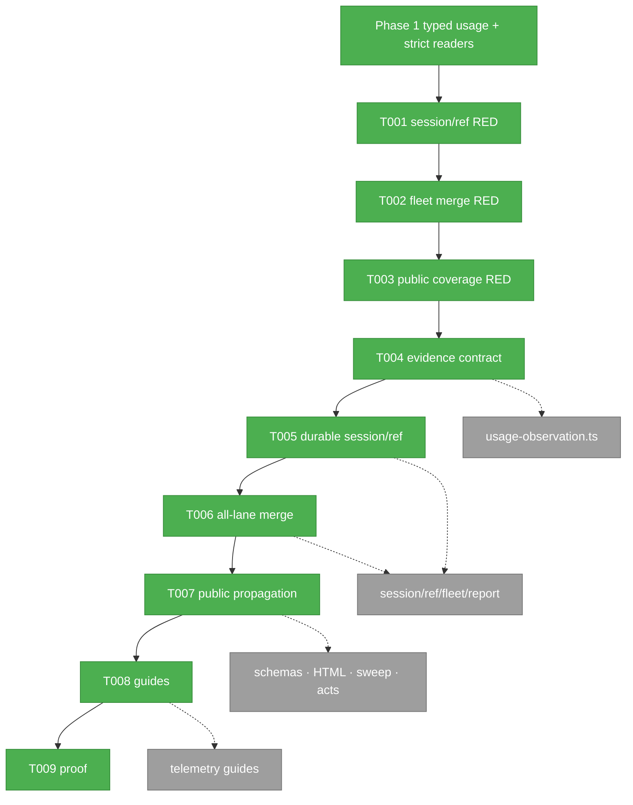
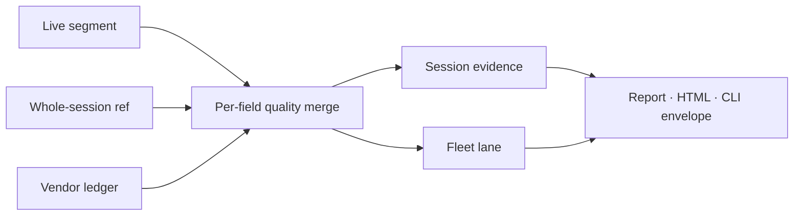
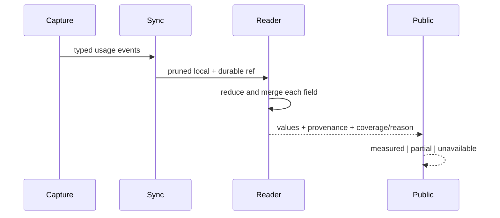

# Phase 2 Tasks — Durable Evidence and Truthful Readers

**Plan**: [`systemic-telemetry-repair-plan.md`](../../systemic-telemetry-repair-plan.md)
**Phase**: Phase 2 — Durable Evidence and Truthful Readers
**Status**: Complete — focused/full/composite evidence recorded

## Executive Briefing

### Purpose

Carry Phase 1's closed typed observations through teardown, sync/prune, fleet merging, and public reports without losing measured evidence or turning missing fields into zero.

### What We're Building

One additive per-field token-evidence contract shared by session, ref, fleet, report, HTML, sweep, and CLI envelopes. Each field records value, source, observation kind, coverage, and closed reason; existing scalar totals/source remain deterministic compatibility projections.

### Goals

- ✅ Preserve measured typed fields after sync/prune.
- ✅ Merge complementary live/ref/ledger evidence independently per field.
- ✅ Publish `measured | partial | unavailable` with closed reasons and unknown cause unless authoritative.
- ✅ Degrade partial/unavailable commands with actionable `next_action`.
- ✅ Preserve predecessor wire, P060 remote grammar/envelopes, and counts-only privacy.

### Non-Goals

- ❌ No Phase 3 real GREEN replay or sanitized fixture promotion.
- ❌ No turn-duration, full model provenance, plan attribution, lifecycle-cause, adopted-seat, or PIJ notice work.
- ❌ No behavioral mocks or private replay-body access.

## Prior Phase Context

### A. Deliverables

- Bounded selected-root Claude capture through Git/Fs ports, exact-one resolution, and confined no-follow pre-allocation reads.
- Closed Copilot `UsageEvent`/`UsageObservation` kinds with chronological session-wide reduction.
- Segment/OTLP 2.6 typed usage plus immutable 2.4/2.5 identities and strict loose/published reconstruction.
- Session/ref/fleet/report compatibility readers already reduce complete typed observations once before legacy fallback.
- Phase 1 final review: APPROVE; focused 20 files / 597 tests; all non-PTY files pass in the definitive composite.

### B. Dependencies Exported

- `GitPort.knownWorktreeRoots(maxCandidates)` and root-aware `FsPort` no-follow operations.
- `UsageObservationKind`, `USAGE_BUCKET_KEYS`, `UsageEvent`, `normalizeUsageObservation`, `reduceUsageEvents`, and `completeUsageTokens`.
- `decodeSegment` and strict OTLP/published decoders with supported-version identity closure.
- Reusable tests/fakes for sync/prune refs, fleet lanes, reports, envelopes, and privacy mutation.

### C. Gotchas & Debt

- Typed evidence blocks legacy fallback even when incomplete; Phase 2 must represent partiality instead of erasing it.
- Current reader surfaces remain coarse: `SessionEvidence` lacks token evidence, `RefLane` has scalar measured totals, `FleetLane` has one source, and report coverage is binary.
- Fleet enrichment remains orphan/location-first; all rostered lanes must be evaluated.
- Missing PIJ↔Harness identity stays unavailable with unknown cause; never infer it.
- Six unchanged real-PTY failures are accepted baseline, not Phase 2 scope.

### D. Incomplete Items

- Nullable per-field evidence and aggregate coverage/reason contract.
- All-lane live/ref/ledger quality merge and deterministic scalar source projection.
- Public degraded schemas/envelopes/HTML/sweep behavior and updated guides.
- Phase 3 replay/fixture work remains separately gated.

### E. Patterns to Follow

- RED first; exact execution receipts in `execution.log.md`.
- Parse once, reduce once, then derive compatibility projections.
- Additive contracts; strict allowlists; explicit unavailable/partial states.
- Port-driven services, production/fake parity, sanitized repo-relative paths.

## Pre-Implementation Check

| File | Exists? | Domain Check | Notes |
|---|---:|---|---|
| `harness/cli/src/services/telemetry/usage-observation.ts` | yes | harness-cli internal | Extend with evidence/coverage vocabulary; reducer remains single arithmetic owner. |
| `harness/cli/src/services/telemetry/session-evidence.ts` | yes | harness-cli contract | Add field evidence and closed reasons. |
| `harness/cli/src/services/telemetry/session-export.ts` | yes | harness-cli contract | Additive schema-compatible evidence projection. |
| `harness/cli/src/services/telemetry/ref-source.ts` | yes | harness-cli internal | Recover per-field typed observations after prune. |
| `harness/cli/src/services/telemetry/fleet-evidence.ts` | yes | harness-cli contract | Replace orphan/location-first selection with per-field merge. |
| `harness/cli/src/services/telemetry/report.ts` | yes | harness-cli contract | Aggregate coverage and contributors without false zeros. |
| `harness/cli/src/services/telemetry/render/report-html.ts` | yes | harness-cli internal | Render partial/unavailable state and reasons. |
| `harness/cli/src/services/telemetry/sweep.ts` | yes | harness-cli internal | Preserve degraded state across discovery. |
| `harness/cli/src/acts/telemetry.ts` | yes | harness-cli cross-domain | Degraded envelopes and `next_action`; preserve P060 commands. |
| session/fleet/report schemas | yes | harness-cli contract | Additive fields only; compatibility frozen. |
| telemetry guides | yes | repo-engineering-substrate | Existing guide locations; generated projection follows source docs. |

## Architecture Map



## Tasks

| Status | ID | Task | Domain | Path(s) | Done When | Notes |
|---|---|---|---|---|---|---|
| [x] | T001 | Write failing teardown/sync-prune session and ref evidence tests | repo-engineering-substrate | `/repo/harness/cli/test/services/telemetry/{session-evidence,session-export,ref-source}.test.ts` | Tests reproduce measured-field loss, partial typed fallback, absent identity, and closed reasons after local segments disappear | Plan 2.1; findings 03/05/06 |
| [x] | T002 | Write failing all-lane per-field merge and scalar compatibility tests | repo-engineering-substrate | `/repo/harness/cli/test/services/telemetry/{fleet-evidence,fleet-golden-051,fleet-semantics}.test.ts` | Empty ref cannot mask measured ledger; complementary fields merge; unlike kinds never add; scalar source remains deterministic | Plan 2.1/2.3; finding 04 |
| [x] | T003 | Write failing public coverage/status/schema/HTML/sweep/act tests | repo-engineering-substrate | `/repo/harness/cli/test/services/telemetry/{report,central-layout,session-export,publication-boundary,remote-telemetry-service}.test.ts`, `/repo/harness/cli/test/acts/telemetry.test.ts` | Complete→measured, partial→partial, zero→unavailable; partial/unavailable envelopes degrade with reason/next action; no false zero/ok | Plan 2.1/2.4; AC-05 |
| [x] | T004 | Define additive per-field token evidence and closed coverage/reason contract | harness-cli | `/repo/harness/cli/src/services/telemetry/{usage-observation,session-evidence}.ts` | Each bucket can carry value/source/kind/coverage/reason; aggregate state is derived; cause defaults unknown; old scalar fields remain | Findings 03/05/06 |
| [x] | T005 | Implement durable session/export/ref field evidence | harness-cli | `/repo/harness/cli/src/services/telemetry/{session-evidence,session-export,ref-source}.ts`, `session-export.schema.json` | Live and whole-session refs share reduction; measured fields survive prune; missing fields/joins return closed reasons without zero fill | Plan 2.2 |
| [x] | T006 | Implement quality-ranked all-lane live/ref/ledger merge | harness-cli | `/repo/harness/cli/src/services/telemetry/fleet-evidence.ts`, `fleet-export.schema.json` | Every rostered lane evaluates all tiers; complementary evidence merges per field; measured outranks empty; scalar source projects deterministically | Plan 2.3 |
| [x] | T007 | Propagate honest coverage through report, HTML, sweep, schemas, and acts | harness-cli | `/repo/harness/cli/src/services/telemetry/{report,report.schema.json,sweep.ts,render/report-html.ts}`, `/repo/harness/cli/src/acts/telemetry.ts` | Public values/states/reasons agree end-to-end; degraded envelopes include `next_action`; P060 `ls`/`pull` grammar/envelopes unchanged | Plan 2.4; AC-05/08 |
| [x] | T008 | Update telemetry guides and regenerate CLI docs projection | repo-engineering-substrate | `/repo/docs/how/{telemetry,telemetry-reports,telemetry-fixtures}.md`, `/repo/harness/cli/src/services/docs/docs-content.ts` | Guides explain typed precedence, post-sync reads, per-field provenance, compatibility projection, coverage reasons, and real-before-sanitized order | Plan 2.5 |
| [x] | T009 | Run focused compatibility/privacy/build/composite proof and record exact receipts | repo-engineering-substrate | `/repo/docs/plans/063-systemic-telemetry-repair/tasks/phase-2-durable-evidence-and-truthful-readers/execution.log.md` | Phase 2 focused tests, golden controls, P060 remote grammar/integrity, schemas, publication privacy, build/Biome, non-PTY and composite gates are evidenced | Plan 2.6; AC-03–05/08 |

## Context Brief

Environment friction is work, not an apology—fix small/reversible issues, otherwise `harness observe` it and pay the proof gap forward.

### Key Findings from the Plan

- **03**: token reads are live-only and disappear after sync/prune.
- **04**: orphan/location-first fleet selection masks complementary evidence.
- **05**: partial/absent fields collapse to zero and binary measured state.
- **06**: durable captured identity exists; absent identity remains unavailable.

### Domain Dependencies

- `harness-cli/telemetry`: Phase 1 event/reducer/strict decoder contracts.
- `harness-cli/adapters`: injected Fs/Git/Env/Process ports; no service I/O.
- `repo-engineering-substrate`: literal fixtures, fakes, schemas, guides, and privacy checks.

### Domain Constraints

- Services import ports type-only and never `node:*`, process, Git executable, network, or clock.
- Per-field evidence is authoritative; scalar totals/source are compatibility projections only.
- Unknown/missing/partial evidence never becomes measured zero.
- No private corpus body, path, identity, prompt, payload, or total enters tracked artifacts.

### Reusable from Prior Phases

- `reduceUsageEvents`, `completeUsageTokens`, strict `decodeSegment`, OTLP reconstruction, and publication validators.
- Existing session/ref/fleet/report fakes and real scrubbed goldens.
- Exact RED→GREEN/composite receipt structure from Phase 1.





## Discoveries & Learnings

| Date | Task | Type | Discovery | Resolution | References |
|---|---|---|---|---|---|

## Directory Layout

```text
docs/plans/063-systemic-telemetry-repair/
  └── tasks/phase-2-durable-evidence-and-truthful-readers/
      ├── tasks.md
      └── execution.log.md
```
