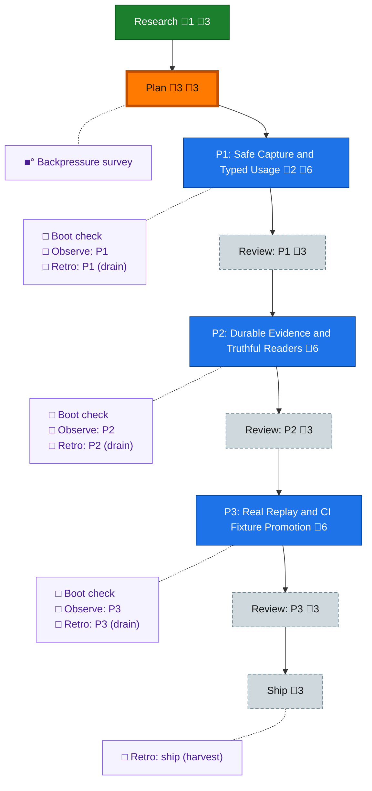

<!-- GENERATED by `harness flow render` — do not hand-edit; regenerate from the flow JSON. -->
# Flow · systemic-telemetry-repair

**Kind**: flight-plan · **Now**: plan · **Next**: phase-1 · **Intent**: get the plan started. assume you ahve a worktree already? if not work with prime. then get the builder flow spine in and commense explore stage. make sure you are able to reference real sessions, which i have providd to prime in the past. fi you do not have real sessiosns then say so so we can work get use real data for our testing not messing about with fake stuff · **Nodes**: 20 · **Events**: 24

**Rail**: ◆─◆─[ ◇─◇─◇─◇─◇─◇─◇ ]  ◆ Research · ◆ Plan · [ ◇ P1: Safe Capture and Typed Usage · ◇ Review: P1 · ◇ P2: Durable Evidence and Truthful Readers · ◇ Review: P2 · ◇ P3: Real Replay and CI Fixture Promotion · ◇ Review: P3 · ◇ Ship ]

**Legend** — colour = type/status: 🟩 done · 🟢 in-progress · 🟥 blocked · 🟦 known · ⬜ assumed · 🔶 decision · 🗣 user input · 🟪 harness chore (faded = not yet done) · 🤖 companion · 🛠 worker · 🟧 current (you are here). Badges: 💬 comments · 📄 artifacts · 📝 instructions · 🧰 chore (° optional / recommended / ‼ strongly-recommended; ✓ done · ✕ skipped).

## Node log

### research · Research
- 📄 artifacts: docs/plans/063-systemic-telemetry-repair/research-dossier.md

### plan · Plan
- 📄 artifacts: docs/plans/063-systemic-telemetry-repair/systemic-telemetry-repair-plan.md, docs/plans/063-systemic-telemetry-repair/validations/systemic-telemetry-repair-plan-validation.md, docs/plans/063-systemic-telemetry-repair/research/official-claude-session-storage.md

### phase-1 · P1: Safe Capture and Typed Usage
- 📄 artifacts: docs/plans/063-systemic-telemetry-repair/tasks/phase-1-safe-capture-and-typed-usage/tasks.md, docs/plans/063-systemic-telemetry-repair/validations/phase-1-safe-capture-and-typed-usage-tasks-validation.md

### backpressure · Backpressure survey
- 📄 artifacts: docs/plans/063-systemic-telemetry-repair/backpressure-coverage.md
- `2026-07-21T08:31:10.495Z` · agent · validation — decision:route verdict:Partial time:2026-07-21T08:30:49Z basis_sha256:d8a6dcde37ad956466fee3dc8ffec2aa88015dc2ac194f6d406d686f361742bb artifact_sha256:ffb3796342f889409f3d9d0bae900b1f8e7b96ea8f46b64ef69595cb088361c0 modes:2-RUN,8-EXTEND,1-BUILD,0-ABSENT
- `2026-07-21T08:37:08.591Z` · agent · validation — decision:receipt-amendment verdict:Partial time:2026-07-21T08:37:00Z basis_sha256:d8a6dcde37ad956466fee3dc8ffec2aa88015dc2ac194f6d406d686f361742bb artifact_sha256:d1995091ec6285512d73505934985dc2828c19842ac6e98d319549898163da6f supersedes_artifact_sha256:ffb3796342f889409f3d9d0bae900b1f8e7b96ea8f46b64ef69595cb088361c0 reason:removed-unpaved-private-replay-command
