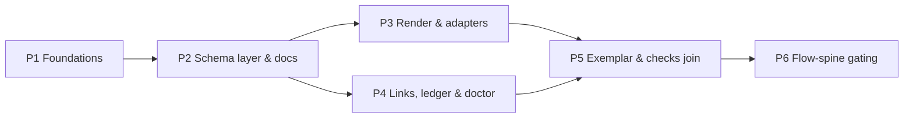

# Deterministic Documents (dd)
**Mode**: Full
**Plan Version**: 1.1.0 (v1.0.0 + Opus validation findings F1–F17 folded — see `research/validation-opus-plan-v1.md`)
**Created**: 2026-08-03
**Status**: READY
**Spec source**: unified (this file)

## Business Specification

### Research Context

📚 Incorporates findings from `research-dossier.md` (14 current + 5 historical findings) and the three approved workshops (`workshops/001-w9-addressing.md`, `002-w2-w10-completion-and-gating.md`, `003-w1-w3-adapters-and-log.md`). The rulings ledger `workshop-notes.md` (R-elegance, D1–D16, all W-items resolved/closed) is **authoritative**; this plan implements it and never re-litigates it. An independent Opus validation pass (NEEDS ATTENTION, 17 findings) was folded into this version — phase graph corrected, W8 semantics restored, coverage holes closed.

### Summary

Deterministic Documents (dd) makes documents **data with a contract**: a `.dd.json` file names its schema (a shared package under `.dd/schemas/`), is validated mechanically, renders deterministically to a sibling `.dd.md`, and addresses any part of itself or another doc through one locked grammar — so links, evidence, and completion state become facts a machine can check instead of prose a human re-reads. Plans are the exemplar doc type; the flow spine becomes the first consumer, gating navigation on document state (refuse + `--force`). Built as `dd-core`, a cleanly separated library inside the harness repo (D7), surfaced as a new core `harness dd` verb family.

### Goals

- One address grammar (`file.dd.json#section/id/part`) every link, tool, and consumer shares — with CLI generate/validate so agents never hand-munge addresses.
- Documents that validate against named schema packages resolved by convention (D14), with loud clash/shadowing diagnostics.
- Deterministic human rendering: every `.dd.json` edit regenerates its `.dd.md`; custom types render via tiny pure adapters with honest fallbacks, loudly at build.
- Evidence-grade completion: per-assertion states (5-state default enum, schema-declarable custom enums with their own gate-terminal sets) with per-assertion `proven_by`/`pressure` links; task state **derived**, never self-reported.
- The flow spine computes nav gates from dd state and **refuses** departure with `--force` as the only (auditable) override.
- dd validation runs in **this repo's** `harness checks` gate, and ships to every consumer repo via the core doctor layer (honest split — see AC-07).
- Portability preserved: dd-core has no harness imports (dep-cruiser-enforced); depth-1 = plain JSON + jq works anywhere.

### Non-Goals

- Standalone dd CLI or extraction to its own repo (D7 depth-2: out of scope; architecture merely keeps it possible).
- Rename machinery or alias tombstones (D8 superseded — doctor shows breakage, scripts fix it).
- Append-only *enforcement* on execution logs (convention only, workshop 003).
- Typed log-entry kinds, per-link basis pins (`@` reserved unbuilt), HTML anchors, reverse-index persistence (D11), versioned schema refs.
- `dd build` deep composition semantics beyond single-doc render + drift check (W7 deferred); watcher **revalidate-on-save at depth 1** explicitly deferred with it (regen-on-save ships; revalidation waits for W7's iteration).
- **Bulk migration of existing markdown survey files** to dd (the `builder/plan` schema DOES carry D2's AC-row `pressure`/`proven_by` link columns and a `builder/backpressure` schema ships — what's deferred is converting the 11 historical survey docs, not the capability).

### Target Domains

| Domain | Status | Relationship | Role in This Feature |
|--------|--------|-------------|---------------------|
| harness-cli (core: acts/services/adapters) | existing | **modify** | New `dd` + `plan` act families, `services/dd/**` (dd-core lib); flow-spine gate integration (last phase) |
| harness-repo-substrate (`.dd/`, `.harness/extensions`, root scripts) | existing | **modify** | Exemplar schema packages, checks gate lines, sensor declaration, docs generators |
| flow spine (services/flow within harness-cli) | existing | **modify** | `dd_link` node field, refusal gate, orient/rail/render surfacing — isolated to the terminal phase |
| the-flow / builder skill surface | existing | **consume** | Reads gates through the CLI; doc note only, no skill rewrites in this plan |

*(No formal `docs/domains/` registry exists in this repo — constitution notes the domain system is not yet initialized; the table above is the canonical spec-domain set for this plan's gates.)*

### Testing Strategy

- **Approach**: Hybrid — TDD for dd-core logic (parser, address grammar, validate engine, derived state, resolver, ledger); lightweight validation tasks for CLI wiring, docs generation, and render cosmetics.
- **Rationale**: the correctness heart is consumed by gates other systems trust; wiring follows existing exercised patterns.
- **Focus Areas**: address parse/format round-trip; validate issue classes (severity table from workshop 001); schema resolution precedence + clashes; derived state + cross-file rollup; ledger fresh/stale; gate refusal semantics; **fixture-exclusion contract** (checks stays green with known-bad fixtures present).
- **Excluded**: pixel/golden-file testing of markdown cosmetics beyond structural golden files; watcher timing behaviour (hint-based by contract).
- **Mock Usage**: fake ports only (house rule: injected `fake-fs`/`fake-clock`/`fake-watcher`, no `vi.mock`); real `.dd.json` fixture corpora, including known-bad fixtures for every validator class.

### Documentation Strategy

- **Location**: `docs/how/harness-dd.md` (house pattern) + the D15 **baked-in `dd docs`** content — `dd docs list/get` with the how-to-add-a-schema-and-adapter doc (worked adapter sample included). The baked docs are a *feature deliverable*, not an afterthought.
- **Rationale**: agents discover dd through the CLI itself (`dd docs`, `--help`, doctor next_actions); humans get the deep reference in docs/how/.

### Complexity

- **Score**: CS-5 (epic)
- **Breakdown**: S=2, I=2, D=2, N=2, F=1, T=2 (sum 11)
- **Confidence**: 0.85 (raised post-validation: graph corrected, coverage holes closed)
- **Assumptions**: hand-rolled validation stays sufficient (no JSON-Schema dep — F-03); worktree-local CLI verification via `vitest` + `node harness/cli/bin/harness.js` without touching the machine-global dist symlink.
- **Dependencies**: none external; all internal precedents evidenced in the dossier (F-01…F-14) and confirmed by the validation pass.
- **Risks**: see § Risks.
- **Phases**: 6 — graph: P1 → P2 → (P3 ∥ P4) → P5 → P6.

### Acceptance Criteria

1. **AC-01 Validate**: `harness dd validate <file>` passes every valid fixture and fails every invalid fixture with the exact issue class + severity from workshop 001's table; per-state note rules enforced (`blocked`/`na` require a note; `human-skipped` requires a receipt field with verbatim words — authorship human-only by convention, recorded); unresolvable schema ref is a hard ERROR (D14; needs the P2 resolver — see Coverage Map). `--depth` is configurable: 0 = this doc; **default 3** = outbound links resolve + basis freshness + neighbours' depth-0 health (W8 as ruled).
2. **AC-02 Schema resolution**: a schema named `builder/plan` resolves doc-folder → `<gitroot>/.dd` → `.harness/.dd` → `~/.dd` with deep scan; `dd schema list`/`show` print the resolved file path and every shadowed duplicate; in-root duplicate qualified names are a hard error; schemas may declare **custom enums per field with their own `gate_terminal` sets**.
3. **AC-03 Render**: any dd-CLI mutation regenerates the sibling `.dd.md` (generated banner, heading-only anchors) — **and the hand-edit path is covered**: a hand-edited `.dd.json` is caught by `dd build --check` (byte-drift, dedicated E42x) and regenerated by `dd build` / the watcher; task rows render derived-state summaries (`◐ 3/5`).
4. **AC-04 Adapters**: a custom type renders through a `(value, ctx) => string` adapter discovered at `.dd/schemas/<pkg>/<schema>/adapters/<type>.ts`; a missing/throwing adapter renders the honest fallback AND emits an explicit warning in the build envelope; doctor repeats it as WARN.
5. **AC-05 Address tooling**: `dd address generate` → `dd address validate` → `dd link resolve` round-trips every address form in workshop 001 (incl. bare-`#` same-doc and explicit id overrides).
6. **AC-06 Ledger**: `live` entries auto-refresh at render (P3); `pinned` entries move only via explicit re-verify (P4); `verify-basis(address, sha)` returns `fresh|stale` correctly when the target doc changes.
7. **AC-07 Checks/doctor**: **in this repo**, `harness checks` runs the dd sweep + the `check:dd-docs` drift gate; **for consumer repos**, the shipped core doctor layer (`checkDd`) surfaces dd health; `dd doctor` is the validate engine at **radius ∞** with loop breakers (cycle-safe on a crafted cyclic fixture) and emits `degraded`/exit 0 for WARN-class findings, `error` only for ERROR class (that envelope status IS the gate severity — `runVerbGate` has no severity parameter).
8. **AC-08 Docs**: `dd docs list` enumerates baked docs with descriptions; `dd docs get how-to-add-a-schema` returns the worked schema+adapter guide; `check:dd-docs` drift runs inside `harness checks` and `gen:dd-docs` inside `build`.
9. **AC-09 Exemplar**: a real plan authored as `plan.dd.json` (+ per-phase task file with evidence section, workshop 002 shapes, AC rows carrying `pressure`/`proven_by` columns per D2) validates, renders, and is queryable with stock `jq`.
10. **AC-10 Gate refusal**: `harness flow nav set --now` off a node whose `dd_link` gate is unsatisfied fails with the dd gate E-code, names the incomplete items, writes nothing; `--force` overrides and is visible in the flow event log; gate-terminal membership is read from the schema's declaration (default: `checked ∪ human-skipped ∪ na`).
11. **AC-11 Gate surfacing**: `flow orient` shows the dd gate block (all items with per-item state); the rail carries a gate callout; a stale basis surfaces as an explicit drift warning at orient.
12. **AC-12 Isolation**: dep-cruiser rules + an architecture test prove `services/dd/core/**` imports no `output/`, no acts, no `node-*` adapters; structured failure objects only.
13. **AC-13 Derived state**: `deriveState(section)` computes a task's state from its evidence list (all entries gate-terminal ⇒ completable) and composes **cross-file** (task ⇐ its list, phase ⇐ its tasks, plan rollup ⇐ file links); render and the P6 gate both consume it — nothing self-reported.
14. **AC-14 Graph family**: `dd links <target>` reports inbound/outbound edges by local scan (D11 — nothing stored); `dd graph` emits a valid mermaid view of the exemplar corpus.
15. **AC-15 Fixture exclusion**: with the full known-bad + cyclic fixture corpus committed, `harness checks` is **green** — doctor's sweep honours the exclusion contract (skips `**/test/fixtures/**` + an explicit opt-out key), while `dd validate` pointed directly at a bad fixture still fails.

### Risks & Assumptions

See § Risks (implementation half). Standing assumption: R-elegance governs every design choice — when a mechanism can be a convention, it is (log append-only; adapter registration by presence; `human-skipped` authorship).

### Open Questions

None blocking. Leaf decisions delegated: id-prefix registry + ledger field name (P1, task 1.7); re-verify verb name (P4, task 4.3 — explicit leaf decision, mirroring 1.7).

### Workshop Opportunities

| Topic | Type | Why Workshop | Key Questions | Status |
|-------|------|--------------|---------------|--------|
| W9 Addressing grammar | Data Model | load-bearing for everything | syntax, ids, basis, paths | ✅ Complete — `workshops/001` |
| W2+W10 Completion & gating | State Machine | gate semantics + evidence granularity | enum, refuse-vs-warn, done-when | ✅ Complete — `workshops/002` |
| W1+W3 Adapters & log | API Contract | render + log shapes | adapter contract, entry shape | ✅ Complete — `workshops/003` |

*(No unworkshopped opportunities remain; W7 `dd build` composition + watcher depth-1 revalidation deliberately deferred by ruling.)*

### Clarifications

#### Session 2026-08-03

- Q: Workflow Mode → **A: Full** (multi-phase fan-out/fan-in; multi-coder PM per Jordan's directive).
- Q: Testing Strategy → **A: Hybrid** (TDD for dd-core logic; lightweight for wiring/docs).
- Q: Mock Usage → **A: Fake ports only** (house discipline; real fixture corpora incl. known-bad).
- Q: Documentation Strategy → **A: docs/how/ + baked `dd docs`** (D15 docs are a feature deliverable).
- Standing directives folded from the session: builder-flow/nav integration is the **last** phase; phases designed for parallel `/pij` coder fan-out with per-phase file fences; plans-as-exemplar must use dd primitives cleverly and render well for humans; AC↔coverage linkage observed as inference-heavy (harness observation DL-001) — tightened at tasks-expansion time by folding proof lines into Done-Whens.

## Planning Seam
_Refinement opportunities still open — recorded as evidence; the flow surfaces and offers these, none gate:_
- Open Workshop Opportunities: none — all resolved (W7 + watcher-depth-1 deferred by explicit ruling, not open).

| Artifact | Present? | Effect on the plan |
|----------|----------|--------------------|
| research-dossier.md | y | informs Key Findings + all landing sites |
| workshops/*.md | y (3, Approved) | authoritative design decisions |
| backpressure-coverage.md | y | per-fence proof lines folded into phase tasks |
| research/validation-opus-plan-v1.md | y | 17 findings folded into this version |

## Implementation Plan

### Gate Matrix

| Gate | Check | Status | Notes |
|------|-------|--------|-------|
| G1 | Clarify | PASS | Round 1 answered; no `[NEEDS CLARIFICATION]` markers remain |
| G2 | Constitution | PASS | **Two** deviations recorded in the ledger below (P10 vs core `dd` act; P10 vs core `plan` act) |
| G3 | Architecture | PASS | acts → services → ports respected; dd-core strictly ports-free; dep-light preserved (hand-rolled validation, F-03) |
| G4 | ADR Compliance | N/A | no `docs/adr/` directory in repo |
| G5 | Structure | PASS | all required sections present; cross-refs resolve |
| G6 | Testing Alignment | PASS | Hybrid: dd-core phases lead with fixture/test tasks; wiring phases carry validation tasks |
| G7 | Domain Completeness | PASS | manifest re-verified post-validation (F15): root package.json, sensor declaration, app.ts P5 edit, fixture corpus all rowed |

#### Deviation Ledger

| Principle Violated | Why Needed | Simpler Alternative Rejected | Risk Mitigation |
|-------------------|------------|------------------------------|-----------------|
| P10 "verbs are dynamic + extension-owned; the core hardcodes no verb list" | `dd` lands as a **core act** | Extension verb: rejected — v2 extensions allow exactly ONE subverb level (contract.ts:202-219); dd needs two (`dd schema list`) | Follows the `flow` precedent; `dd` added to RESERVED_NAMES; dd-core stays extractable (D7) |
| P10 (same principle) | `plan` lands as a **core act** (5.1) | Extension: rejected — plan composes dd-core directly and is the exemplar surface | `plan` added to RESERVED_NAMES; thin act over dd-core + templates; same extractability posture |

### Summary

Build dd-core as a pure library under `harness/cli/src/services/dd/` (structured failures, injected ports, zero harness imports), surface it as the `harness dd` core act family, ship the schema-package convention with exemplar `builder/*` schemas, make plans the proving-ground doc type, and integrate the flow-spine refusal gate as the deliberately final phase. Six phases: foundations → schema layer (the true second foundation — validation, rendering, and doctor all consume it) → two genuinely parallel build phases (render+adapters ∥ links+doctor) → exemplar/integration join → flow gating terminal.

*(v1.0.0 drew P2∥P3∥P4; the validation pass proved P3's adapter/shape loading and P4's clash/schema diagnostics both consume P2's resolver, so P2 is sequential. `dd graph` was decoupled from P3's renderer — it emits mermaid standalone — keeping P3 ∥ P4 true.)*

### Domain Manifest

| File | Domain | Classification | Rationale |
|------|--------|---------------|-----------|
| `harness/cli/src/services/dd/core/**` (model, parse, address, validate, derive) | harness-cli | internal | dd-core library — ports-free, structured failures |
| `harness/cli/test/services/dd/fixtures/**` (valid + known-bad + cyclic corpora) | harness-cli | internal | the TDD floor + exclusion-contract subject (P1) |
| `harness/cli/src/services/dd/schema/**` | harness-cli | internal | package resolution, deep scan, clash detection, enum/gate_terminal declarations (P2) |
| `harness/cli/src/services/dd/render/**` | harness-cli | internal | pure renderer + adapter loading + live-ledger refresh (P3) |
| `harness/cli/src/services/dd/links/**` | harness-cli | internal | resolver engine, pinned ledger/verify-basis, links/graph (P4) |
| `harness/cli/src/services/dd/doctor/**` | harness-cli | internal | radius-∞ sweep, loop breakers, severity→envelope mapping, exclusion contract (P4) |
| `harness/cli/src/services/dd/docs/**` + `scripts/gen-dd-docs.mjs` + manifest | harness-cli | internal | D15 baked docs + drift check (P2) |
| `harness/cli/src/acts/dd/*.ts` — ALL family stubs pre-created in P1 (index, validate, schema, docs, build, address, link, links, graph, doctor) | harness-cli | contract | P1 creates every stub + its index registration + all E4xx entries with final names; P2–P4 **fill bodies only** (fence seam, F5) |
| `harness/cli/src/acts/plan.ts` | harness-cli | contract | `plan` verb MVP (P5) |
| `harness/cli/src/app.ts` | harness-cli | contract | `registerDdAct` line (P1) + `registerPlanAct` line (P5) |
| `harness/cli/src/output/error-codes.ts` | harness-cli | contract | full E400–E449 block written once in P1, final names (F5) |
| `harness/cli/src/services/extensions/registry.ts` | harness-cli | internal | `dd` (P1) + `plan` (P5) into RESERVED_NAMES |
| root `package.json` (scripts: `check:dd-docs`, `gen:dd-docs` into `build`) | harness-repo-substrate | cross-domain | P2 creates scripts; P5 wires into build (single-writer note) |
| `.dependency-cruiser.cjs` + `harness/cli/test/architecture/dd-core-isolation.test.ts` | harness-cli | contract | machine-enforced dd-core boundary (P1) |
| `.dd/schemas/builder/{plan,backpressure,execution-log}/**` | harness-repo-substrate | contract | exemplar schema packages + adapters (P2) |
| `.harness/extensions/checks/extension.ts` | harness-repo-substrate | cross-domain | dd doctor gate line + `check:dd-docs` cmd gate (P5 — single owner) |
| `.harness/extensions/repo-sensors/extension.ts` | harness-repo-substrate | cross-domain | `.dd` watch-glob sensor declaration (P5 — single owner; F11) |
| `harness/cli/src/services/doctor/doctor-service.ts` | harness-cli | cross-domain | shipped `checkDd` layer (P5 — the consumer-repo OOTB path, F2) |
| `docs/plans/065-deterministic-documents/exemplar/**` | harness-repo-substrate | contract | the living exemplar corpus (P5) |
| `docs/how/harness-dd.md` | harness-repo-substrate | contract | deep reference (P5) |
| `harness/cli/src/services/flow/{flow-events,flow-mutations,flow-schema}.ts` + `schemas/flow.schema.json` (+ gen) | flow spine | cross-domain | `dd_link` field + gate check (P6 only) |
| `harness/cli/src/acts/flow.ts` + `services/flow/flow-renderer.ts` | flow spine | cross-domain | refusal wiring, orient/rail/render surfacing (P6 only) |
| `docs/how/harness-flow.md` | harness-repo-substrate | contract | gate semantics documented (P6) |

### Key Findings

| # | Impact | Finding | Action |
|---|--------|---------|--------|
| 01 | Critical | Extensions cap at one subverb level; core verbs are reserved names (F-01) | `dd` + `plan` are core acts; two deviation-ledger rows; RESERVED_NAMES in P1/P5 |
| 02 | Critical | No JSON-Schema library, deliberately — hand-rolled `string[]`-issue validators are the house style (F-03) | dd validation hand-rolled in `flow-schema.ts` style; no new dependency |
| 03 | Critical | No mechanical nav gate exists; `d5Refuse` is the idiomatic refusal shape (F-10, F-11) | Gate = ruled first mechanical refusal (workshop 002); copy d5Refuse; land in P6 only |
| 04 | Critical | Schema resolution is consumed by validation (AC-01), adapter discovery (P3), and clash diagnostics (P4) — it is the second foundation, not a parallel branch (Opus F1) | P2 sequential after P1; P3 ∥ P4 only |
| 05 | High | `checks` is a repo-local unpublished extension; consumer-repo OOTB rides the **shipped** doctor layer (Opus F2); `runVerbGate` has no severity param — gate severity IS the sub-verb's envelope status (Opus F3) | AC-07 split honestly; `dd doctor` emits degraded for WARN-class (4.5) |
| 06 | High | W8 as ruled: depth belongs on `dd validate` (default 3–4); doctor is the same engine at radius ∞ (Opus F4) | 1.4 + 4.5 restored to the ruling |
| 07 | High | Shared-file freeze must be real: act stubs + index registrations + full E-code block all land in P1 with final names (Opus F5) | P2–P4 fill bodies only; textual conflicts impossible |
| 08 | High | Known-bad + cyclic fixtures would redden the repo's own checks without an exclusion contract (Opus F7) | Exclusion contract in 1.4/4.5; AC-15 proves checks green with corpus present |
| 09 | High | Derived state + cross-file rollup had no owning task (Opus F6) | Task 1.8 + AC-13; render (3.1) and gate (6.2) consume it |
| 10 | Medium | `dd_link` round-trips on flow nodes today; schema entry documentary; gate check must avoid `validateMutatedDoc`'s silent-skip hole (F-09, F-14) | P6 unchanged from v1.0.0 |
| 11 | Medium | Render precedent complete (pure fn, sibling regen, drift E-code); renderer cannot read files — derived/gate state precomputed (F-05, F-12) | P3/P6 as specified |
| 12 | Medium | Watch globs are snapshotted at scheduler construction from repo-sensors declarations (Opus F11) | Sensor declaration owned by P5; watcher regen ships, depth-1 revalidate deferred with W7 |

### Phases

#### Phase Index

| Phase | Title | Primary Domain | Objective (1 line) | Depends On | Parallel? | File fence |
|-------|-------|---------------|-------------------|------------|-----------|------------|
| 1 | dd-core foundations | harness-cli | Types, parse, address grammar, validate engine (+depth), derived state, E4xx, ALL act stubs, isolation rules | None | solo (join root) | `services/dd/core`, `acts/dd/**` (all stubs), `error-codes`, `registry`, depcruise, `test/services/dd/fixtures/**` |
| 2 | Schema layer & baked docs | harness-cli + substrate | D14 resolution (the second foundation) + custom enums/gate_terminal + `schema list/show` + exemplar `builder/*` packages + D15 `dd docs` | Phase 1 | solo (foundation) | `services/dd/schema`, `services/dd/docs`, bodies of `acts/dd/{schema,docs}.ts`, `.dd/schemas/**`, `scripts/gen-dd-docs.mjs`, root package.json scripts |
| 3 | Render, adapters & freshness | harness-cli | `.dd.json→.dd.md` pipeline (derived-state summaries), adapters (loud), live-ledger refresh at render | Phase 2 | ∥ with 4 | `services/dd/render`, body of `acts/dd/build.ts` |
| 4 | Links, ledger & doctor | harness-cli | Resolver engine + address/link tooling, pinned-ledger + verify-basis, `links`/standalone `graph`, radius-∞ doctor with exclusions | Phase 2 | ∥ with 3 | `services/dd/{links,doctor}`, bodies of `acts/dd/{address,link,links,graph,doctor}.ts` |
| 5 | Exemplar, plan verb & checks join | substrate + harness-cli | Plans-as-dd end-to-end, `plan` core act, checks/doctor/sensor integration, docs/how | Phases 3+4 | solo (fan-in) | exemplar corpus, `acts/plan.ts`, app.ts+registry (plan), checks extension, repo-sensors extension, doctor-service, root package.json build script, `docs/how/harness-dd.md` |
| 6 | Flow-spine gating (terminal) | flow spine | `dd_link` + refusal gate (`--force`) + orient/rail/render surfacing + basis drift warning | Phase 5 | solo (last, per ruling) | `services/flow/**`, `acts/flow.ts`, `flow-renderer.ts`, flow schema + gen, `docs/how/harness-flow.md` |

*(Fan-out contract for the PM: P3 and P4 run as parallel `/pij` coder+reviewer pairs, each confined to its fence, coding against the interfaces P1+P2 froze (act stubs with final signatures, E-codes with final names, schema resolver API). Each fence's slice suite must go green with the sibling phase absent — the per-fence proof lines live in `backpressure-coverage.md`. Phases 1, 2, 5, 6 are single-writer.)*

#### Phase 1: dd-core foundations

**Objective**: The load-bearing core — document model, address grammar, validate engine with depth, derived state, error space, every act stub, and the machine-enforced isolation boundary.
**Domain**: harness-cli
**Delivers**: parse/validate/address/derive as pure functions with structured failures; fixture corpus (valid + known-bad + cyclic); `dd validate` wired end-to-end; E400–E449 complete with final names; all `acts/dd/*` stubs registered; dep-cruiser + arch-test isolation; exclusion contract defined.
**Depends on**: None
**Key risks**: grammar edge cases (explicit id overrides colliding with minted ids) — settled by the workshop severity table; the act-stub freeze must carry final signatures or P3/P4 renegotiate mid-flight.

| # | Task | Domain | Success Criteria | Notes |
|---|------|--------|-----------------|-------|
| 1.1 | Fixture corpus under `test/services/dd/fixtures/`: valid + invalid `.dd.json` for every validator class (duplicate ids, bad addresses, unresolvable schema, per-state note violations, cyclic link graph) + exclusion-contract layout (`fixtures/**` is the skip subject) | harness-cli | Every issue class has ≥1 bad fixture failing + a good twin passing; cyclic fixture present | TDD floor |
| 1.2 | dd-core document model + parser (`services/dd/core/{model,parse}.ts`): sections/shapes/instances, structured `DdFailure` objects, no `output/` imports | harness-cli | Parses exemplar fixtures; failure objects carry class + location; zero harness imports | mirrors `FlowFailure` |
| 1.3 | Address grammar (`address.ts`): parse + format + normalize — `#` boundary, alternating name/id descent, bare-`#` same-doc, explicit id overrides | harness-cli | Round-trips every workshop-001 address form; property tests `parse(format(x))≡x` | TDD |
| 1.4 | Validate engine (`validate.ts`): schema-shape conformance (via injected resolver interface — real impl lands P2), id uniqueness, link-cell syntax vs column type-path, enum/state values, **per-state note rules** (`blocked`/`na` need notes; `human-skipped` needs a verbatim-words receipt field — authorship human-only by convention, recorded in the how-to), severity table (WARN vs ERROR), **`--depth` 0/1..N (default 3)** per W8, **exclusion contract** (`**/test/fixtures/**` + opt-out key skipped by sweep-mode calls, never by direct invocation) | harness-cli | AC-01 green over 1.1 corpus incl. depth + note-rule + exclusion cases | W8 restored (Opus F4); F7/F8 folded |
| 1.5 | Error space + full act surface: **complete E400–E449 block written once, final names** (core 400s · schema 410s · render 420s · links/doctor 430s · flow-gate 440s); **every** `acts/dd/<family>.ts` stub created with final command signatures + registered in `acts/dd/index.ts`; `registerDdAct` in app.ts; `dd` into RESERVED_NAMES; **every** stub — incl. `validate` — emits honest `unconfigured` naming its owning phase (OD-2: live validate held until P2 wires the real resolver); freeze manifest `dd-surface.md` enumerates the whole surface, grep-tested against code | harness-cli | `harness dd --help` shows the full family; all stubs exit 2; dd-surface.md matches code | the real freeze (Opus F5 + Terra H1); OD-2 ruled |
| 1.6 | Isolation enforcement: dep-cruiser rules + `test/architecture/dd-core-isolation.test.ts` | harness-cli | AC-12 green; violation fixture fails the arch test | D7 boundary |
| 1.7 | Leaf rulings recorded: id-prefix registry (`ph-/tk-/ac-/bp-/lg-/dw-` + minting rule) and references-ledger field name — constants in core + decision note in execution log | harness-cli | Constants exported; workshop-002 handoff closed | lightweight |
| 1.8 | **Derived state** (`derive.ts`): `deriveState(section)` (all evidence entries gate-terminal ⇒ completable) + cross-file rollup composition (task ⇐ list, phase ⇐ tasks, plan ⇐ file links) with tests first | harness-cli | AC-13 core green incl. cross-file fixture | Opus F6; consumed by 3.1 + 6.2 |

#### Phase 2: Schema layer & baked docs

**Objective**: The second foundation — schemas as named, discoverable packages with declarable enums, plus the D15 docs surface. Everything downstream (adapter discovery, clash diagnostics, gate-terminal reads) consumes this layer.
**Domain**: harness-cli + harness-repo-substrate
**Delivers**: deep-scan resolution with precedence + loud clashes; custom enum/`gate_terminal` declarations; `dd schema list/show`; exemplar `builder/plan` (with D2's AC-row link columns), `builder/backpressure`, `builder/execution-log`; `dd docs list/get` + drift script.
**Depends on**: Phase 1
**Key risks**: same-folder override shadowing must be visible or local schema files silently fork validation.

| # | Task | Domain | Success Criteria | Notes |
|---|------|--------|-----------------|-------|
| 2.1 | Schema package model + resolution (`services/dd/schema/`): qualified names, deep scan doc-folder → `<gitroot>/.dd/schemas` → `.harness/.dd/schemas` → `~/.dd/schemas`, first-hit-wins, clash + shadow detection; **field-level custom enum declarations with `gate_terminal[]` sets** (default completion enum ships built-in); implements the resolver interface 1.4 validates through; **flips the `dd validate` act body LIVE** (real resolver wired — the OD-2 handoff; sweep opt-out key `sweep_exclude` honoured per OD-1) | harness-cli | AC-02 fixtures green incl. duplicate-in-root hard error + custom-enum declaration; `dd validate <file> --json` live end-to-end | D14 + Opus F9 + OD-1/OD-2 |
| 2.2 | `dd schema list` / `dd schema show <pkg>/<schema>`: name, description (in-file), resolved file path, shadowed duplicates | harness-cli | AC-02 output contract; shadowing visible in both verbs | paths always shown |
| 2.3 | Exemplar schema packages under `<gitroot>/.dd/schemas/builder/`: `plan` — workshop-002 shapes (phases with brief+tasks, evidence section) **plus the D2 AC-table link columns (`pressure` → backpressure row, `proven_by` → log entry)**; `backpressure`; `execution-log` (workshop-003 entry shape) | substrate | Packages validate the Phase-5 exemplar corpus; descriptions in-file; D2 columns present | Opus F14 |
| 2.4 | D15 baked docs: manifest + `scripts/gen-dd-docs.mjs` + `dd docs list/get` bodies; how-to-add-a-schema+adapter doc (worked sample, incl. the `human-skipped` receipt convention) | harness-cli | AC-08 list/get green | docs are a deliverable |
| 2.5 | Validation task: `check:dd-docs` + `gen:dd-docs` npm scripts created (composed into build/checks by P5); vitest suite for resolution/list/show | harness-cli | Scripts exist + suite green | wiring lands P5 (single-writer) |

#### Phase 3: Render, adapters & freshness

**Objective**: Deterministic human rendering with the adapter escape hatch — loudly honest, fresh under upstream edits, and showing derived state where humans look.
**Domain**: harness-cli
**Delivers**: pure renderer with derived-state summaries; `dd build` (+ `--check` drift E42x); adapter loading + fallback + envelope warnings; live-ledger refresh at render.
**Depends on**: Phase 2 (adapter discovery + section shapes ride the schema resolver)
**Key risks**: none new — all patterns precedented (F-05); watcher *daemon* wiring deliberately excluded from this fence (P5 owns the sensor declaration).

| # | Task | Domain | Success Criteria | Notes |
|---|------|--------|-----------------|-------|
| 3.1 | Pure renderer (`services/dd/render/renderer.ts`): `renderDd(doc, resolved) => string` — banner, sections/shapes/tables, heading-only anchors, ids visible, **derived-state row summaries (`◐ 3/5`) via 1.8** | harness-cli | Structural golden files green; purity enforced by arch test | consumes derive, precomputed inputs only |
| 3.2 | `dd build` body: render one doc, write sibling, `--check` byte-drift E42x; auto-regen sibling after every mutating dd verb (best-effort, warn-on-fail) — this + the watcher is the **hand-edit path** AC-03 covers | harness-cli | AC-03 green incl. hand-edit fixture | F-05 pattern |
| 3.3 | Adapter pipeline: jiti-load `(value, ctx) => string` from schema package `adapters/`; honest fallback; **every adapter issue in the build envelope**; doctor WARN aggregation hook (consumed by P4's doctor via interface) | harness-cli | AC-04 green incl. throwing-adapter fixture | workshop 003 |
| 3.4 | Live references-ledger refresh at render (mode `live` recompute + dependents' md regen, CLI path); watcher **library** support (subscribe via injected WatcherPort, content-hash contract) — daemon/sensor-declaration wiring is P5's; depth-1 revalidate-on-save deferred with W7 | harness-cli | Editing a transcluded source regenerates consumer md via CLI path + via a fake-watcher test | D9; Opus F11 respected |
| 3.5 | Validation task: render suite over corpus + adapter fixtures | harness-cli | `npx vitest run test/services/dd/render` green with P4 absent | fence proof |

#### Phase 4: Links, ledger & doctor

**Objective**: The graph made mechanical — one resolver engine with three CLI faces, pinned-basis staleness, inbound scans, standalone graph view, and the radius-∞ doctor with exclusions and honest severity mapping.
**Domain**: harness-cli
**Delivers**: `dd address generate/validate`, `dd link resolve`, `dd links`, standalone `dd graph`, `verify-basis` SDK primitive, `dd doctor`.
**Depends on**: Phase 2 (clash/shadow diagnostics + schema-aware target checks)
**Key risks**: unbounded walks — loop breakers (visited-set) are the hard requirement, tested on the cyclic fixture.

| # | Task | Domain | Success Criteria | Notes |
|---|------|--------|-----------------|-------|
| 4.1 | Resolver engine (`services/dd/links/resolver.ts`): address → target over parsed docs; **finding-ownership rule: a finding is owned by the file that must change to fix it** (broken neighbour surfaces on my run, fails only its own doc); tests first per severity class | harness-cli | Workshop-001 severity table + ownership fixtures green | Opus F17 |
| 4.2 | Three faces: `dd address generate` / `dd address validate` / `dd link resolve` — thin bodies over the one engine | harness-cli | AC-05 round-trip green | D16 |
| 4.3 | Pinned ledger + `verify-basis(address, sha) → fresh\|stale` SDK export; explicit re-verify verb (name = P4 leaf decision, recorded like 1.7) | harness-cli | AC-06 pinned half green; verb name recorded | consumer-facing |
| 4.4 | `dd links <target>` (inbound/outbound local scan, D11) + **standalone `dd graph`** (direct mermaid string emission — no renderer dependency, keeps P3 ∥ P4 true) | harness-cli | AC-14 green on fixture corpus | decoupled per Opus F1b |
| 4.5 | `dd doctor`: **the validate engine at radius ∞** (same engine, W8 as ruled) — all severity classes, loop breakers on the cyclic fixture, **exclusion contract honoured** (fixtures skipped in sweep mode), **envelope mapping: WARN-class ⇒ `degraded`/exit 0, ERROR-class ⇒ `error`** (this IS the checks gate severity), adapter-gap aggregation via P3's interface consumed at P5 | harness-cli | AC-07 doctor half + AC-15 sweep half green | Opus F3/F4/F7 |

#### Phase 5: Exemplar, plan verb & checks join

**Objective**: Fan-in — prove the whole system on the real exemplar, land the `plan` core act, and wire every shared integration file (single-writer).
**Domain**: harness-repo-substrate + harness-cli
**Delivers**: `harness plan` verb MVP; living exemplar corpus; checks gates (dd doctor + dd-docs drift); shipped doctor layer; sensor declaration; build-script wiring; `docs/how/harness-dd.md`.
**Depends on**: Phases 3 + 4
**Key risks**: exemplar must use primitives *cleverly* (Jordan's standing constraint) — human review against workshop-002 shapes before commit.

| # | Task | Domain | Success Criteria | Notes |
|---|------|--------|-----------------|-------|
| 5.1 | `harness plan` core act MVP: `plan new <slug>` scaffolds `plan.dd.json` from `builder/plan` + per-phase task file wiring; `plan render/validate` delegate to dd; **`plan` into RESERVED_NAMES + `registerPlanAct` in app.ts + deviation-ledger row** (already recorded above) | harness-cli | Scaffolded plan validates + renders OOTB | Opus F10 |
| 5.2 | Living exemplar corpus at `docs/plans/065-deterministic-documents/exemplar/`: real plan.dd.json + `tasks/phase-2/tasks.dd.json` (evidence section keyed by task ids, AC rows with `pressure`/`proven_by`) + rendered md, mirroring workshop-002 shapes | substrate | AC-09 green: validates, renders, jq-queryable | human review for the *clever* bar |
| 5.3 | Integration (single owner): checks extension — `runVerbGate` dd-doctor line (severity via doctor's own envelope) **+ `runCmdGate('check:dd-docs', warn)`**; `gen:dd-docs` into root build script; shipped `checkDd` doctor-service layer (the consumer-repo path); `.dd` watch-glob sensor declaration in repo-sensors | substrate + harness-cli | AC-07 checks half + AC-08 drift half + AC-15 green (`harness checks` green with bad fixtures present) | Opus F2/F3/F11/F12 |
| 5.4 | `docs/how/harness-dd.md`: grammar, schema convention, states/gating (incl. receipt convention), adapter guide pointer, jq recipes | substrate | Doc exists, lint-clean, linked from dd docs | plain-first rule |
| 5.5 | End-to-end validation: full `just test` + `harness checks` + recorded exemplar run (`dd validate --depth 3 && dd build --check && dd doctor` + jq demo) in the execution log | harness-cli | All green in one recorded run | evidence for review |

#### Phase 6: Flow-spine gating (terminal)

**Objective**: The flow spine becomes dd's first gating consumer — refusal with `--force`, computed from document state through the schema's gate-terminal declaration, surfaced everywhere position is read. Deliberately last.
**Domain**: flow spine
**Delivers**: `dd_link` node field; gate check in the mutation pipeline; refusal E44x + `--force`; orient/rail/render surfacing; basis-drift warning.
**Depends on**: Phase 5
**Key risks**: behavioral change to existing flows — mitigated: gate applies **only** to nodes carrying `dd_link` (fully opt-in); gate check lives in `runMutation`/`setNow`, never in schema validation (silent-skip hole).

| # | Task | Domain | Success Criteria | Notes |
|---|------|--------|-----------------|-------|
| 6.1 | `dd_link` field: type in `flow-events.ts` `{ address, gate, basis_sha }`; documentary entry in `flow.schema.json` optional[] + `gen:flows`; writable via `apply --ops` | flow spine | Field round-trips; schema check green | F-09 |
| 6.2 | Gate evaluation in `setNow`/`runMutation`: resolve via dd SDK, compute over **the schema-declared `gate_terminal` set** (default `checked ∪ human-skipped ∪ na`) using 1.8's derive, refuse with E44x naming incomplete items (`d5Refuse` shape), `--force` recorded in event log + agent-etiquette next_action | flow spine | AC-10 full matrix green | Opus F9 consumed |
| 6.3 | Basis recording + drift: store target-doc sha at gate evaluation; orient warns via `verify-basis` on drift | flow spine | AC-11 drift half green | workshop 001 |
| 6.4 | Surfacing: orient dd-gate block (all items, per-item pips); rail `⚑` gate callout; renderer node badge (state stored on node — renderer stays pure) | flow spine | AC-11 surfacing green | F-12 |
| 6.5 | `docs/how/harness-flow.md` gate section + full gate-matrix suite | flow spine | Docs updated; `npx vitest run test/services/flow test/acts/flow` then full `just test` green | fence proof |

### Acceptance Coverage Map

| AC | Covered by | Verified in |
|----|-----------|-------------|
| AC-01 | 1.1, 1.2, 1.4, **2.1** (resolver for the hard-ERROR clause) | 1.4 suite + 2.1 resolution cases |
| AC-02 | 2.1, 2.2 | 2.5 suite |
| AC-03 | 3.1, 3.2, **3.4** (watcher hand-edit path) | 3.5 suite incl. hand-edit + drift fixtures |
| AC-04 | 3.3 | 3.5 adapter fixtures |
| AC-05 | 1.3, 4.1, 4.2 | 4.2 round-trip tests |
| AC-06 | **3.4** (live half), 4.3 (pinned half) | 3.5 + 4.3 suites |
| AC-07 | 1.4 (depth), 4.5 (doctor ∞ + severity mapping), 5.3 (checks + shipped layer) | 4.5 cyclic fixture + 5.5 recorded checks run |
| AC-08 | 2.4, 2.5, **5.3** (build/checks wiring) | 5.5 (`harness checks` incl. drift gate) |
| AC-09 | 5.1, 5.2 | 5.5 recorded end-to-end run |
| AC-10 | 6.1, 6.2 | 6.5 gate-matrix suite |
| AC-11 | 6.3, 6.4 | 6.5 suite |
| AC-12 | 1.6 | arch test in CI |
| AC-13 | 1.8 | 1.8 cross-file fixtures; consumed by 3.1 + 6.2 |
| AC-14 | 4.4 | 4.4 fixture-corpus tests |
| AC-15 | 1.1 (layout), 1.4 (contract), 4.5 (sweep honours it), 5.3 (checks proof) | 5.5 (`harness checks` green with corpus present) |

### Risks

| Risk | Likelihood | Impact | Mitigation |
|------|------------|--------|------------|
| Worktree verification constraint: machine-global `harness` symlinks the ROOT checkout's dist — this seat may not rebuild it | High | Medium | All in-worktree proof via `vitest` + `node harness/cli/bin/harness.js` after local tsc; never `npm link`/root rebuild; final global verification at convergence (prime's PR flow) |
| Parallel-phase collisions on shared files | Low (was Medium) | High | P1 lands ALL act stubs with final signatures + the complete E4xx map; P2 lands the resolver interface both parallel phases consume; P3/P4 fill bodies in disjoint dirs; every shared file has a named single-owner phase in the manifest |
| Hidden P3↔P4 coupling re-emerges | Low | Medium | `dd graph` is standalone (no renderer); doctor's adapter-gap class consumed via interface at P5; fence proof = each slice green with sibling absent |
| Gate refusal surprises existing flows | Low | High | Opt-in by `dd_link` presence only; terminal phase; refusal carries next_action + `--force`; event log records overrides |
| Repo's own checks redden on dd's known-bad fixtures | Low (was unmitigated) | High | Exclusion contract (1.4/4.5) + AC-15 proves `harness checks` green with the corpus present |
| Hand-rolled validator grows gnarly | Medium | Medium | Mirror `flow-schema.ts` conventions; severity table is the closed spec; known-bad fixtures per class |
| Exemplar drifts from workshop shapes | Low | Medium | 5.2 pins to workshop-002 shapes; human review (the "clever" bar is explicitly a judgement row in backpressure-coverage.md) |

## Execution guardrails (for every implementing coder)

- Fence per phase (Phase Index column) — commits by explicit pathspec inside your fence only; `just fix` before handoff (CI gates biome); standing baselines: arch-check 2, markdown-lint 199.
- Your fence's slice suite must go green **with sibling phases absent** — the per-fence proof lines live in `backpressure-coverage.md`.
- Never hand-write `the-flow.json`/`the-flow.md`/`.the-flow-state.json`; never touch the root checkout, never `npm link`, never rebuild root dist.
- Harness/pij output >64KiB → redirect to file.
- R-elegance is the tiebreaker on every design choice; the workshops and D1–D16 are authoritative — never re-litigate them inline.
