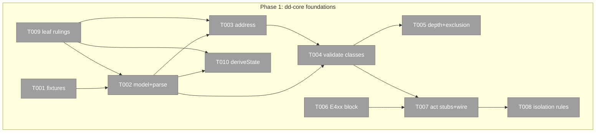
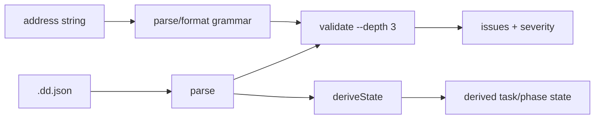

# Phase 1: dd-core foundations — Tasks & Context Brief

**Plan**: [deterministic-documents-plan.md](../../deterministic-documents-plan.md) (v1.1.0, READY)
**Phase**: 1 of 6 (join root — everything depends on this)
**Created**: 2026-08-03
**Paths**: repo-root-relative (worktree: `harness-engineering-worktrees/s065-deterministic-documents`)

### Executive Briefing

- **Purpose**: Build dd-core's load-bearing heart — document model, address grammar, validate engine (with depth + exclusion contract), derived state, the complete error space, and every act stub — so P2 can layer schema resolution on top and P3∥P4 can fan out against frozen surfaces.
- **What We're Building**: a pure, ports-free library under `harness/cli/src/services/dd/core/` (structured failures, zero harness imports, machine-enforced), plus the full `harness dd` act surface (only `validate` live; the rest honest `unconfigured` stubs), plus the fixture corpus that TDDs it all.
- **Goals**: ✅ every validator class has a failing bad-fixture + passing good twin · ✅ address grammar round-trips all workshop-001 forms · ✅ `dd validate --depth` per W8 · ✅ `deriveState` + cross-file rollup · ✅ E400–E449 complete with final names · ✅ all act stubs registered · ✅ dep-cruiser isolation green.
- **Non-Goals**: ❌ real schema resolution (P2 — validate consumes an injected resolver interface with a fixture-backed fake) · ❌ rendering, adapters, doctor, links CLI bodies (P3/P4) · ❌ any flow-spine change (P6).

### Pre-Implementation Check

| File | Exists? | Domain Check | Notes |
|------|---------|-------------|-------|
| `harness/cli/src/services/dd/**` | NO — create | harness-cli internal | new dirs: `core/` |
| `harness/cli/src/acts/dd/*.ts` | NO — create | harness-cli contract | index + 9 family stubs |
| `harness/cli/src/output/error-codes.ts` | YES — modify | harness-cli contract | append E4xx block; E300–E310 full (dossier F-13) |
| `harness/cli/src/services/extensions/registry.ts` | YES — modify | harness-cli internal | `dd` into RESERVED_NAMES (line ~78-90) |
| `harness/cli/src/app.ts` | YES — modify | harness-cli contract | one `registerDdAct` line (~311-349 block) |
| `.dependency-cruiser.cjs` | YES — modify | contract | new dd-core rules beside existing services rules (:38-56) |
| `harness/cli/test/services/dd/**` + `test/architecture/dd-core-isolation.test.ts` | NO — create | harness-cli | mirrors src layout (house rule) |

### Architecture Map



### Open Decisions (block T005/T007 details only — everything else buildable)

| # | Decision | Ruling | Status |
|---|----------|--------|--------|
| OD-1 | **Sweep opt-out key** | `"sweep_exclude": true` inside the doc's `dd` header block; per-doc only, no extra glob config; direct invocation always validates | ✅ RULED (Jordan, 2026-08-03) |
| OD-2 | **`dd validate` posture before P2's resolver** | **Hold the live verb until P2** ("hold it until it can be done properly") — P1 builds + fully lib-tests the engine (fixture-backed fake resolver in vitest only); the `dd validate` act stub emits `unconfigured` like every other stub; P2 wires the real resolver and flips the body live | ✅ RULED (Jordan, 2026-08-03) |

### Tasks

| Status | ID | Task | Domain | Path(s) | Done When | Notes |
|--------|-----|------|--------|---------|-----------|-------|
| [ ] | T001 | Fixture corpus: valid + known-bad `.dd.json` per validator class (duplicate minted/explicit ids · malformed addresses · unresolvable schema ref · per-state note violations: `blocked`/`na` missing note, `human-skipped` missing receipt · bad enum value · link-cell vs column type-path mismatch · cyclic link graph) + **one fixture per workshop-001 WARN path class** (absolute path · non-POSIX separators · resolution escaping repo / untracked target · missing target file) + good twins, laid out under `fixtures/` as the exclusion-contract subject | harness-cli | `harness/cli/test/services/dd/fixtures/**` | Corpus enumerable by suite; every ERROR class has ≥1 bad + 1 good; every WARN path class has a fixture asserted as WARN (not failure); cyclic fixture present; layout documented in a fixtures README | TDD floor; AC-01/AC-15 subject; WARN-vs-ERROR split proven before P4 maps WARN→degraded (Terra M1) |
| [ ] | T002 | dd-core model + parser: section/shape/instance types, references-ledger field (name per T009), `parse(json) → DdDoc \| DdFailure[]` — structured failures with class + location, mirroring `FlowFailure` (`flow-service.ts:54-63`); zero `output/`/act/node-adapter imports | harness-cli | `harness/cli/src/services/dd/core/{model,parse}.ts` | `npx vitest run harness/cli/test/services/dd/core` green: parses all good fixtures, structured failures on bad; no throw paths | dossier F-06 pattern |
| [ ] | T003 | Address grammar: `parseAddress`/`formatAddress`/normalize — `#` file/interior boundary, alternating schema-name/instance-id descent, bare-`#` same-doc, explicit id overrides, nothing positional | harness-cli | `harness/cli/src/services/dd/core/address.ts` | Property test `parse(format(x))≡x` + every workshop-001 § Grammar worked example round-trips (incl. addenda forms) | workshops/001 is the closed spec |
| [ ] | T004 | Validate engine (classes): schema-shape conformance via injected `SchemaResolver` interface (fixture-backed fake now; P2 lands real impl), id uniqueness (minted + explicit share one namespace per file), link-cell syntax vs column type-path, enum/state values incl. custom-enum passthrough, per-state note rules (blocked/na note; human-skipped verbatim-words receipt field), severity per workshop-001 table (WARN vs ERROR), returns `issues[]` never throws | harness-cli | `harness/cli/src/services/dd/core/validate.ts` | Every T001 bad fixture fails with its exact class+severity; good twins pass; hand-rolled (no schema lib — house rule); **lib-tested only in P1 — the CLI body ships in P2 (OD-2)** | AC-01 engine half; Opus F8 folded; resolver-interface seam is the P2 contract |
| [ ] | T005 | Validate depth + exclusion. **Depth walk (fully specified)**: BFS over outbound links through an injected `DocLoader` seam (fake-fs in P1; P4's doctor reuses the SAME walk at radius ∞); depth 0 = this doc only; depth d≥1 = visit each outbound target with remaining depth d−1, at every visited doc checking (a) link resolves, (b) basis freshness vs the source doc's references ledger, (c) the visited doc's depth-0 health; visited-set dedupe (a doc is checked once per walk); **finding ownership**: every finding is owned by the file that must change to fix it — a broken neighbour surfaces on my run but fails only its own doc. **Exclusion**: sweep-mode callers skip `**/test/fixtures/**` + docs carrying the opt-out key (⚠ key name/semantics = OPEN DECISION, Jordan); direct invocation never skips | harness-cli | `harness/cli/src/services/dd/core/validate.ts` (+ `walk.ts` if cleaner) | Fixtures prove: depth 2 vs 3 produce different finding sets on a 3-hop chain; stale-basis at hop 2 detected; broken-neighbour finding owned by the neighbour; cyclic fixture terminates; direct-vs-sweep exclusion both ways | W8 as ruled; Terra H2/H3 folded; ownership = W8's rule (Opus F17) |
| [ ] | T006 | Complete E400–E449 block in one commit, final names, JSDoc per code, sub-ranges: E400-409 core/validate · E410-419 schema · E420-429 render/adapter · E430-439 links/doctor · E440-449 flow-gate | harness-cli | `harness/cli/src/output/error-codes.ts` | Block present; names match act stubs' usage; no later phase edits this file (the freeze) | Opus F5; single-writer forever after |
| [ ] | T007 | Full act surface + **the freeze manifest**: `acts/dd/index.ts` + stubs `{validate,schema,docs,build,address,link,links,graph,doctor}.ts` with final command signatures (two-level: `dd schema list` etc.); unfilled stubs emit honest `unconfigured` envelopes; `registerDdAct` in app.ts; `dd` into RESERVED_NAMES; `dd validate` body live via `exitWithEnvelope` (pre-P2 resolver posture = OPEN DECISION, Jordan — see Open Decisions below); **write `dd-surface.md` beside the tasks dossier enumerating, verbatim: every command's positionals/options, its placeholder status+exit until its owning phase fills it (incl. `validate`: unconfigured until P2 per OD-2), and the full named E400–E449 allocation** — P2–P4 diff their work against this manifest; changing it after P1 is a renegotiation, not a drift | harness-cli | `harness/cli/src/acts/dd/*.ts` · `app.ts` · `services/extensions/registry.ts` · `docs/plans/065-deterministic-documents/tasks/phase-1-dd-core-foundations/dd-surface.md` | `dd --help` shows the full family; **every** stub (incl. validate) exits 2 `unconfigured` naming its owning phase in next_action; **dd-surface.md exists and matches the code (a test greps signatures against it)** | the fan-out freeze made enumerable (Terra H1); OD-2 ruled; local tsc build, never root dist |
| [ ] | T008 | Isolation enforcement: dep-cruiser rules (`dd-core-never-imports-output/acts/node-adapters`) + arch test walking `services/dd/core` imports | harness-cli | `.dependency-cruiser.cjs` · `harness/cli/test/architecture/dd-core-isolation.test.ts` | `harness arch-check` stays at baseline 2; arch test fails on a deliberate violation fixture then passes clean | AC-12; D7 boundary |
| [ ] | T009 | Leaf rulings: id-prefix registry constants (`ph- tk- ac- bp- lg- dw-` + minting rule: 4-hex, born-once, per-file namespace) + references-ledger field name — decision note in execution log | harness-cli | `harness/cli/src/services/dd/core/constants.ts` | Constants exported + consumed by T002-T004; execution.log.md records both decisions with one-line rationale | closes workshop-002 handoff |
| [ ] | T010 | Derived state: `deriveState(section)` (all evidence entries gate-terminal ⇒ completable; gate-terminal set injected — default from constants, custom via schema declaration) + cross-file rollup (task ⇐ its list, phase ⇐ its tasks, plan ⇐ file links) | harness-cli | `harness/cli/src/services/dd/core/derive.ts` | AC-13 fixtures green incl. a two-file rollup fixture; consumed later by P3 render + P6 gate | Opus F6 |

### Context Brief

**Environment-first posture**: environment friction is work, not an apology — fix small/reversible things, otherwise `harness observe` it; pay every hard wall or proof-gap forward.

**Key findings from plan** (full table in plan § Key Findings):
- 02: no JSON-Schema lib, deliberately — hand-roll in `flow-schema.ts` style (`validateFlowDoc` returns `string[]`, never throws).
- 04: schema resolution is P2's — T004 codes against an **injected resolver interface** with a fixture-backed fake; the interface IS the P2 contract, design it consciously.
- 06: W8 restored — depth on `validate` (default 3), doctor (P4) reuses the same engine at radius ∞.
- 07: T006+T007 are **the freeze** — final names/signatures, because P3∥P4 fill bodies without touching shared files.
- 08: the exclusion contract exists so the repo's own checks never redden on T001's bad fixtures (AC-15).

**Domain constraints**: acts → services → ports only; `services/dd/core/**` additionally imports NO `output/`, no acts, no `node-*` adapters (T008 enforces); every terminal path in acts through `exitWithEnvelope` (43-call-site rule, arch-tested); fakes-only testing (no `vi.mock`).

**Reusable now**: `FlowFailure` shape (`services/flow/flow-service.ts:54-63`); hand-rolled validator style (`flow-schema.ts:220`); fake ports (`adapters/*/fake-*.ts`); envelope constructors (`output/envelope.ts:72-129`).

**Fence & proof (backpressure-coverage.md)**: fence = `services/dd/core` + `acts/dd/**` + `error-codes` + `registry` + depcruise + fixtures. Slice proof: `npx vitest run harness/cli/test/services/dd && harness arch-check` — green with P2-P6 absent. Commit by explicit pathspec inside the fence; `just fix` before handoff; baselines arch-check 2, md-lint 199.

**Flow diagram**:


### Discoveries & Learnings

_Populated during implementation by the implement verb._

| Date | Task | Type | Discovery | Resolution | References |
|------|------|------|-----------|------------|------------|

```
docs/plans/065-deterministic-documents/
  ├── deterministic-documents-plan.md
  └── tasks/phase-1-dd-core-foundations/
      ├── tasks.md
      └── execution.log.md   # created by the implement verb
```
